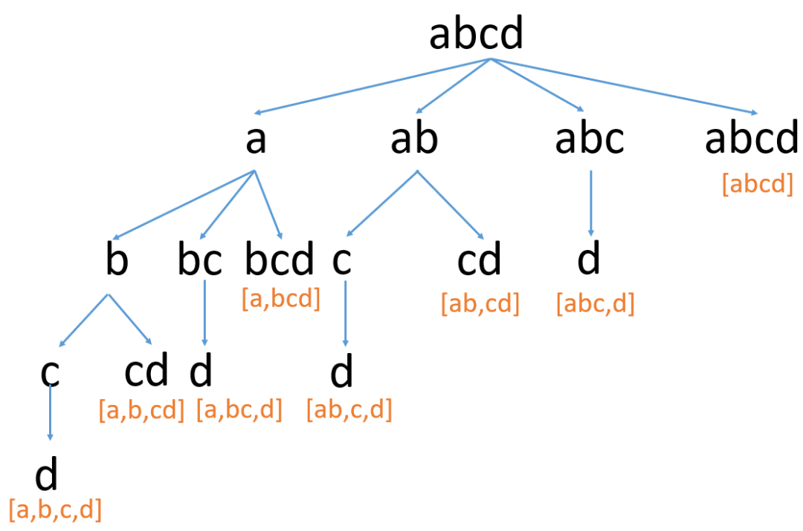
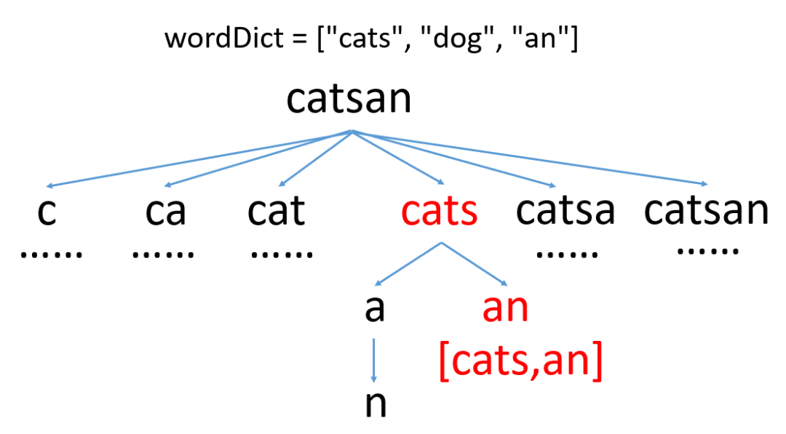
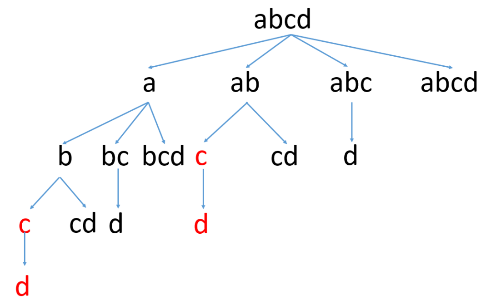
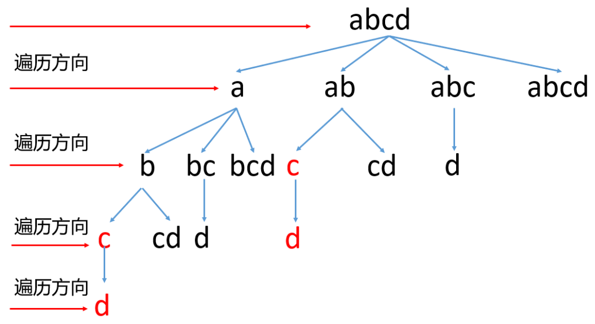

## 单词拆分

> **【题目描述】**
> 
> 给你一个字符串 s 和一个字符串列表 wordDict 作为字典。请你判断是否可以利用字典中出现的单词拼接出 s 。
>
> 注意：不要求字典中出现的单词全部都使用，并且字典中的单词可以重复使用。
>
> **示例 1：**
> 
> 输入: s = "leetcode", wordDict = ["leet","code"]
> 
> 输出: true
> 
> 解释: 返回 true 因为 "leetcode" 可以由 "leet" 和 "code" 拼接成。
> 
> 
> **示例 2：**
> 
> 输入: s = "applepenapple", wordDict = ["apple","pen"]
> 
> 输出: true
> 
> 解释: 返回 true 因为 "applepenapple" 可以由 "apple" "pen" "apple" 拼接成。
> 
>    注意，你可以重复使用字典中的单词。
>
> **示例 3：**
> 
> 输入: s = "catsandog", wordDict = ["cats","dog","sand","and","cat"]
> 
> 输出: false

> 提示：
> 
> 1 <= s.length <= 300
> 
> 1 <= wordDict.length <= 1000
> 
> 1 <= wordDict[i].length <= 20
> 
> s 和 wordDict[i] 仅有小写英文字母组成
> 
> wordDict 中的所有字符串 互不相同

来源：力扣（LeetCode）

单词拆分1：https://leetcode.cn/problems/word-break/

解决方案: https://leetcode.cn/problems/word-break/solution/shu-ju-jie-gou-he-suan-fa-dong-tai-gui-h-3xkv/

多种解决方案：
https://leetcode.cn/problems/word-break/solution/shou-hui-tu-jie-san-chong-fang-fa-dfs-bfs-dong-tai/

### 动态规划方案
```text
我们定义 dp[i] 表示字符串 s 前 i 个字符组成的字符串 s[0..i−1] 是否能被空格拆分成若干个字典中出现的单词。
从前往后计算考虑转移方程，每次转移的时候我们需要枚举包含位置 i−1 的最后一个单词，
看它是否出现在字典中以及除去这部分的字符串是否合法即可。
公式化来说，我们需要枚举 s[0..i−1] 中的分割点 j ，
看 s[0..j−1] 组成的字符串 s1（默认 j=0 时 s1为空串）和 s[j..i−1] 组成的字符串 s2 是否都合法，
如果两个字符串均合法，那么按照定义 s1 和 s2 拼接成的字符串也同样合法。
由于计算到 dp[i] 时我们已经计算出了 dp[0..i−1] 的值，
因此字符串 s1 是否合法可以直接由 dp[j] 得知，剩下的我们只需要看 s2 是否合法即可，因此我们可以得出如下转移方程：

dp[i]=dp[j]&&check(s[j..i−1])

其中 check(s[j..i−1]) 表示子串 s[j..i−1] 是否出现在字典中。

对于检查一个字符串是否出现在给定的字符串列表里一般可以考虑哈希表来快速判断，
同时也可以做一些简单的剪枝，枚举分割点的时候倒着枚举，如果分割点 j 到 i 的长度已经大于字典列表里最长的单词的长度，
那么就结束枚举，但是需要注意的是下面的代码给出的是不带剪枝的写法。

对于边界条件，我们定义 dp[0]=true 表示空串且合法。
```

代码:
```java
import java.util.List;

public class Problem16 {
    public static void main(String[] args) {
        Scanner sc = new Scanner(System.in);
        String s = sc.nextLine();
        String wordDictString = sc.nextLine();
        wordDictString = wordDictString.substring(1, wordDictString.lastIndexOf(']'));
        String[] wordDict = wordDictString.replaceAll("\"", "").split(",");
        System.out.println(wordBreak(s, Arrays.asList(wordDict)));
        sc.close();
    }

    public static boolean wordBreak(String s, List<String> wordDict) {
        // 动态规划 状态数组dp
        boolean[] dp = new boolean[s.length() + 1];
        dp[0] = true; // 边界条件: dp[0] = true 表示空串且合法
        for (int i = 1; i <= s.length(); i++) {
            for (int k = 0; k < i; k++) {
                // s[0~(i - 1)]子串合法 = s[0~(k-1)]合法 && 存在s[k~(i-1)]包括在wordDict中合法
                String substring = s.substring(k, i);  // 表示[k,i)子串
                boolean isInWordDictPreviousK = dp[k]; // 表示[0,k)子串是否在wordDict字典中
                dp[i] = isInWordDictPreviousK && wordDict.contains(substring);
                if (dp[i]) {
                    break;
                }
            }
        }
        return dp[s.length()];
    }
}
```

### DFS方案
这题要求的是把字符串拆分，并且判断拆分的子串是否都存在于字典中，那么字符串怎么拆分呢，我们举个例子来看下，比如字符串[abcd]，我们可以拆分为：
```text
[a,b,c,d]
[a,b,cd]
[a,bc,d]
[a,bcd]
[ab,c,d]
[ab,cd]
[abc,d]
[abcd]
```
具体来看下图



每次截取一个子串，判断他是否存在于字典中，如果不存在于字典中，继续截取更长的子串……
如果存在于字典中，然后递归拆分剩下的子串，这是一个递归的过程。上面的执行过程我们可以把它看做是一棵n叉树的DFS遍历，所以大致代码我们可以列出来:
```text
public boolean wordBreak(String s, List<String> wordDict) {
    return dfs(s, wordDict);
}

public boolean dfs(String s, List<String> wordDict) {
    if (最终条件，都截取完了，直接返回true)
    return true;
    // 开始拆分字符串s
    for (int i = 开始截取的位置; i <= s.length(); i++) {
        // 如果截取的子串不在字典中，继续截取更大的子串
        if (!wordDict.contains(截取子串))
            continue;
        // 如果截取的子串在字典中，继续剩下的拆分，如果剩下的可以拆分成
        // 在字典中出现的单词，直接返回true，如果不能则继续
        // 截取更大的子串判断
        if (dfs(s, wordDict))
            return true;
    }
    // 如果都不能正确拆分，直接返回false
    return false;
}
```
上面代码中因为递归必须要有终止条件，通过上面的图我们可以发现，终止条件就是把字符串s中的所有字符都遍历完了，
这个时候说明字符串s可以拆分成一些子串，并且这些子串都存在于字典中。我们来看个图:



因为是拆分，所以字符串截取的时候不能有重叠，那么[开始截取的位置]实际上就是上次截取位置的下一个，来看下代码。
```java
class Solution {
    public boolean wordBreak(String s, List<String> wordDict) {
        return dfs(s, wordDict, 0);
    }

    //start表示的是从字符串s的哪个位置开始
    public boolean dfs(String s, List<String> wordDict, int start) {
        // 字符串中的所有字符都遍历完了，也就是到叶子节点了，说明字符串s可以拆分成
        // 在字典中出现的单词，直接返回true
        if (start == s.length()) {
            return true;
        }
        // 开始拆分字符串s，
        for (int i = start + 1; i <= s.length(); i++) {
            // 如果截取的子串不在字典中，继续截取更大的子串
            if (!wordDict.contains(s.substring(start, i))) {
                continue;
            }
            // 如果截取的子串在字典中，继续剩下的拆分，如果剩下的可以拆分成
            // 在字典中出现的单词，直接返回true，如果不能则继续
            // 截取更大的子串判断
            if (dfs(s, wordDict, i)) {
                return true;
            }
        }
        return false;
    }
}
```
实际上上面代码运行效率很差，这是因为如果字符串s比较长的话，这里会包含大量的重复计算，我们还用上面的图来看下:



我们看到红色的就是重复计算，这里因为字符串比较短，不是很明显，当字符串比较长的时候，这里的重复计算非常多。
我们可以使用一个变量，来记录计算过的位置，如果之前判断过，就不在重复判断，直接跳过即可，代码如下:
```java
class Solution {
    public boolean wordBreak(String s, List<String> wordDict) {
        return dfs(s, wordDict, new HashSet<>(), 0);
    }

    // start表示的是从字符串s的哪个位置开始
    public boolean dfs(String s, List<String> wordDict, Set<Integer> indexSet, int start) {
        // 字符串都拆分完了，返回true
        if (start == s.length()) {
            return true;
        }
        for (int i = start + 1; i <= s.length(); i++) {
            // 如果已经判断过了，就直接跳过，防止重复判断
            if (indexSet.contains(i)) {
                continue;
            }
            // 截取子串，判断是否是在字典中
            if (!wordDict.contains(s.substring(start, i))) {
                continue;
            }
            if (dfs(s, wordDict, indexSet, i)) {
                return true;
            }
            // 标记为已判断过
            indexSet.add(i);
        }
        return false;
    }
}
```
### BFS方案
这题除了DFS以外，还可以使用BFS，BFS就是一层一层的遍历，如下图所示



BFS一般不需要递归，只需要使用一个队列记录每一层需要记录的值即可。
BFS中在截取的时候，如果截取的子串存在于字典中，我们就要记录截取的位置，到下一层的时候就从这个位置的下一个继续截取，来看下代码。（这种会超时）
```java
class Solution {
    public boolean wordBreak(String s, List<String> wordDict) {
        // 这里为了提高效率，把list转化为set，因为set的查找效率要比list高
        Set<String> setDict = new HashSet<>(wordDict);
        // 记录当前层开始遍历字符串s的位置
        Queue<Integer> queue = new LinkedList<>();
        queue.add(0);
        int length = s.length();
        while (!queue.isEmpty()) {
            int index = queue.poll();
            // 如果字符串到遍历完了，自己返回true
            if (index == length)
                return true;
            for (int i = index + 1; i <= length; i++) {
                if (setDict.contains(s.substring(index, i))) {
                    queue.add(i);
                }
            }
        }
        return false;
    }
}
```
这种也会出现重复计算的情况，所以这里我们也可以使用一个变量来记录下。
```java
class Solution {
    public boolean wordBreak(String s, List<String> wordDict) {
        // 这里为了提高效率，把list转化为set，因为set的查找效率要比list高
        Set<String> setDict = new HashSet<>(wordDict);
        // 记录当前层开始遍历字符串s的位置
        Queue<Integer> queue = new LinkedList<>();
        queue.add(0);
        int length = s.length();
        // 记录访问过的位置，减少重复判断
        boolean[] visited = new boolean[length];
        while (!queue.isEmpty()) {
            int index = queue.poll();
            // 如果字符串都遍历完了，直接返回true
            if (index == length)
                return true;
            // 如果被访问过，则跳过
            if (visited[index])
                continue;
            // 标记为访问过
            visited[index] = true;
            for (int i = index + 1; i <= length; i++) {
                if (setDict.contains(s.substring(index, i))) {
                    queue.add(i);
                }
            }
        }
        return false;
    }
}
```

## 单词拆分 II

> **【题目描述】**
> 
> 给定 一个字符串 s 和 一个字符串字典wordDict，在字符串s中增加空格来构建一个句子，使得句子中所有的单词都在词典中。
> 
> 以任意顺序 返回所有这些可能的句子。
>
> 注意：词典中的同一个单词可能在分段中被重复使用多次。
> 
> **示例 1：**
> 
> 输入:s = "catsanddog", wordDict = ["cat","cats","and","sand","dog"]
> 
> 输出:["cats and dog","cat sand dog"]
> 
> **示例 2：**
> 
> 输入:s = "pineapplepenapple", wordDict = ["apple","pen","applepen","pine","pineapple"]
> 
> 输出:["pine apple pen apple","pineapple pen apple","pine applepen apple"]
> 
> 解释: 注意你可以重复使用字典中的单词。
> 
> **示例3：**
> 
> 输入:s = "catsandog", wordDict = ["cats","dog","sand","and","cat"]
> 
> 输出:[]

> 提示：
> 
> 1 <= s.length <= 20
> 
> 1 <= wordDict.length <= 1000
> 
> 1 <= wordDict[i].length <= 10
> 
> s和wordDict[i]仅有小写英文字母组成
> 
> wordDict中所有字符串都 不同

> 来源：力扣（LeetCode）
> 
> 链接：https://leetcode.cn/problems/word-break-ii

> 解题思路： 
> 
> 1) 判断字符串s 是否可以拆分成wordDict字典中的单词
> 
> 2) 利用回溯算法 + 深度优先 遍历

代码:
```
import java.util.*;

public class Problem16 {
    public static void main(String[] args) {
        Scanner sc = new Scanner(System.in);
        String s = sc.nextLine();
        String wordDictString = sc.nextLine();
        wordDictString = wordDictString.substring(1, wordDictString.lastIndexOf(']'));
        String[] wordDict = wordDictString.replaceAll("\"", "").split(",");
        System.out.println(wordBreak2(s, Arrays.asList(wordDict)));
        sc.close();
    }
    
    public static List<String> wordBreak2(String s, List<String> wordDict) {
        // 为了快速判断一个单词是否在单词集合中，需要将它们加入哈希表
        Set<String> wordSet = new HashSet<>(wordDict);
        int len = s.length();
        // 第 1 步：动态规划计算是否有解
        // dp[i] 表示「长度」为 i 的 s 前缀子串可以拆分成 wordDict 中的单词
        // 长度包括 0 ，因此状态数组的长度为 len + 1
        boolean[] dp = new boolean[len + 1];
        // 0 这个值需要被后面的状态值参考，如果一个单词正好在 wordDict 中，dp[0] 设置成 true 是合理的
        dp[0] = true;
        for (int right = 1; right <= len; right++) {
            // 如果单词集合中的单词长度都不长，从后向前遍历是更快的
            for (int left = right - 1; left >= 0; left--) {
                // substring 不截取 s[right]，dp[left] 的结果不包含 s[left]
                if (wordSet.contains(s.substring(left, right)) && dp[left]) {
                    dp[right] = true;
                    // 这个 break 很重要，一旦得到 dp[right] = True ，不必再计算下去
                    break;
                }
            }
        }
        // 第 2 步：回溯算法搜索所有符合条件的解
        List<String> res = new ArrayList<>();
        if (dp[len]) {
            Deque<String> path = new ArrayDeque<>();
            dfs(s, len, wordSet, dp, path, res);
            return res;
        }
        return res;
    }

    /**
     * s[0:len) 如果可以拆分成 wordSet 中的单词，把递归求解的结果加入 res 中
     *
     * @param s       字符串
     * @param len     长度为 len 的 s 的前缀子串
     * @param wordSet 单词集合，已经加入哈希表
     * @param dp      预处理得到的 dp 数组
     * @param path    从叶子结点到根结点的路径
     * @param res     保存所有结果的变量
     */
    private static void dfs(String s, int len, Set<String> wordSet,
                            boolean[] dp, Deque<String> path, List<String> res) {
        if (len == 0) {
            res.add(String.join(" ", path));
            return;
        }
        // 可以拆分的左边界从 len - 1 依次枚举到 0
        for (int i = len - 1; i >= 0; i--) {
            String suffix = s.substring(i, len);
            if (wordSet.contains(suffix) && dp[i]) {
                path.addFirst(suffix); // 添加 回溯的关键步骤
                dfs(s, i, wordSet, dp, path, res);
                path.removeFirst();    // 删除 回溯的关键步骤
            }
        }
    }
}
```