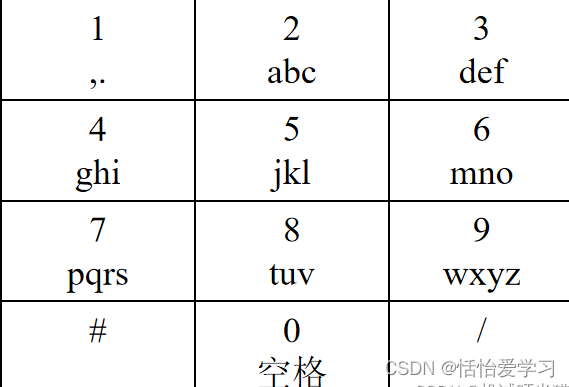

## 九宫格按键输入法

九宫格按键输入，输出显示内容，有英文和数字两个模式，默认是数字模式，数字模式直接输出数字，

英文模式连续按同一个按键会依次出现这个按键上的字母，如果输入 ‘/’ 或者其他字符，则循环中断。

字符对应关系如图所示。


要求输入一串按键，输出屏幕显示内容。

【输入描述】
输入范围为数字 0~9 和字符 ‘#’、’/’，输出屏幕显示，例如：
在数字模式下，输入 1234，显示 1234
在英文模式下，输入 1234，显示 ,adg

【输出描述】
#用于切换模式，默认是数字模式，执行 # 后切换为英文模式；
/ 表示延迟，例如在英文模式下，输入 22/222，显示为 bc；
英文模式下，多次按同一键，例如输入 22222，显示为 b；

【示例 1】
输入
123
输出
123

【示例 2】
输入
#22/23044444411
输出
bad i.

JAVA参考代码:
```
import java.util.HashMap;
import java.util.Map;
import java.util.Scanner;


public class JiuGongGe {
    public static void main(String[] args) {
        Scanner scanner = new Scanner(System.in);
        String input = scanner.nextLine();
        scanner.close();
        String result = getDisplayResult(input);
        System.out.println(result);
    }

    private static String getDisplayResult(String input) {
        Map<Character, String> characterStringMap = buildMap();
        boolean isNumber = true;
        StringBuffer stringBuffer = new StringBuffer();
        int inputLength = input.length();
        for (int i = 0; i < inputLength; i++) {
            char ch = input.charAt(i);
            // # 切换输入法
            if (ch == '#') {
                isNumber = ！isNumber;
                continue;
            }
            // '/' 不拼接
            if (ch == '/') {
                continue;
            }
            // 数字直接拼接
            if (isNumber) {
                stringBuffer.append(ch);
                continue;
            }
            // 英文输入法拼接 空格
            if (ch == '0') {
                stringBuffer.append(" ");
                continue;
            }
            // 英文输入法时:统计重复字符数量
            int repeatCharNum = getRepeatCharNum(input, inputLength, ch, i);

            // 向右移动指针,将重复的字符剔除(连续重复字符最终只输入一个字符)
            i = i + repeatCharNum;
            // 1 对应 ",.", 2 对应 "abc" 等
            String ziMu = characterStringMap.get(ch);
            if (repeatCharNum > 0) {
                int i1 = repeatCharNum % ziMu.length();
                stringBuffer.append(ziMu.charAt(i1));
            } else {
                // 没有重复字母直接输出
                stringBuffer.append(ziMu.charAt(repeatCharNum));
            }
        }
        return stringBuffer.toString();
    }

    private static int getRepeatCharNum(String input, int inputLength, char ch, int i) {
        int repeatCharNum = 0;
        for (int j = i + 1; j < inputLength; j++) {
            char next = input.charAt(j);
            // '/'表示中断连续
            if (next == '/') {
                break;
            }
            // 当前字符不等于下一个字符
            if (ch != next) {
                break;
            }
            repeatCharNum++;
        }
        return repeatCharNum;
    }

    private static Map<Character, String> buildMap() {
        Map<Character, String> map = new HashMap<>();
        map.put('1', ",.");
        map.put('2', "abc");
        map.put('3', "def");
        map.put('4', "ghi");
        map.put('5', "jkl");
        map.put('6', "mno");
        map.put('7', "pqrs");
        map.put('8', "tuv");
        map.put('9', "wxyz");
        return map;
    }
}

```