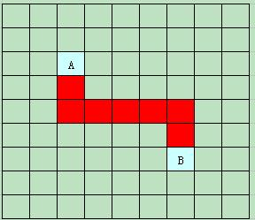
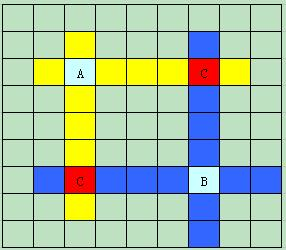
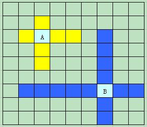
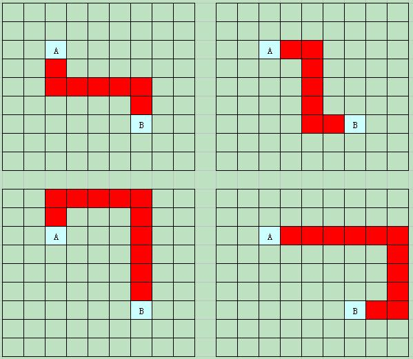
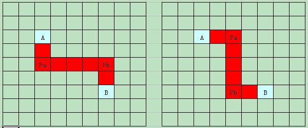

## 连连看检查

【题目描述】
给定一个连连看棋盘，棋盘上每个点都有各种图案（用非0数字表示图案，用0表示无图案、空白处、通路）。
输入棋盘上的任意两个坐标， 
判断这两个坐标对应的图案是否可以消除。
消除的条件：
1）两个坐标对应的图案相同；
2）两个坐标能够相互连通(有通路)；
3）图案间连线的转角数不得超过2；

例如
有下面一个棋盘：

1  3  3  4

0  6  0  0

4  0  2  1

6  0  4  2

在棋盘中，
（0,1）和（0,2）中的3图案没有转角可以消除，
（1,1）和（3,0）中的6图案有一个转角可以可以消除，
（2,0）和（3,2）中的4图案有两个转角可以消除，
而（0,0）和（2,3）中的1图案不能消去。

【输入描述】
输入数据为连续的整数，
第一个数为棋盘的行数m，第二个数为棋盘的列数n，
然后依次是m*n个棋盘数据，
最后是两个坐标对应的行号和列号，
共计输入m*n+6个数。

【输出描述】
如果图案不能消除，输出0， 
如果图案可以消除，输出图案消除路线上图案的个数（包含输入的两个图案，不考虑有多条可消除路径的情况）。

示例：（棋盘的数据就是上面例子中的数据）
输入
4,4,1,3,3，4,0,6,0,0,4,0,2,1,6,0,4,2,2,0,3,2

输出
4

说明
输入是一个4*4的棋盘，最后两个图案的坐标为（2,0）和（3,2），中间为棋盘中的数据。

代码：
```

```


## 连连看判断两张图片可连的思路
一、连连看简介：
两张图片之间存在一条通路，这条通路最多拐两个弯。
如下图所示，A,B两点之间的一条有两个拐点的通路。


二、下面开始来分析，如何判断2个点位可以通过小于等于2个的拐点来联通。
1、相邻,可连通。

2、不相邻：
如下图的A,B两个坐标点，
A周围连续空缺处（无图片、通路）的标记为黄色，用集合Ca来表示；
B周围连续空缺处标记为蓝色，用集合Cb来表示。
黄蓝相交处标记为红色。记为C点。


（1）如果这样的C点存在（可能会有很多个），则问题解决，即在A,B之间存在这样一条通路A-C-B，且最多只有1个拐弯点（有可能A,C,B共线，没有拐弯）。

（2）如果不存在这样的C点，也就是说集合Ca和集合Cb没有交集，显示的图片如下：

需要进一步的分析。

如果这时候，A,B之间还存在符合条件（拐点小于等于2个）的通路，则这条通路一定是有2个拐点的。这里可以用反证法来说明：
如果这条通路没有拐点或者只有1个拐点，那么这个拐点就是我们上面分析的C点。则与前面的前提条件：“不存在C点，集合Ca和集合Cb没有交集”相矛盾。
如果A,B之间的通路有两个拐点，则必然是以下几种情况：


其实，这几种情况是一样的，可以统一描述如下：
两个拐点，其中和A共线（水平或垂直）的记为Pa（Pa必属于集合Ca），和B共线的记为Pb（Pb必属于集合Cb）。
且Pa不可能属于集合Cb,Pb不可能属于集合Ca，否则Pa、Pb就变成前面提到的C点了。
另外，Pa如果和A垂直方向共线，则Pb也和B垂直方向共线，且Pa和Pb一定是水平方向共线。
反之，Pa如果和A水平方向共线，则Pb也和B水平方向共线，且Pa和Pb一定是垂直方向共线。
注意红色字体部分：这里说明了根据A,B,Pa的位置可以确定Pb的位置。
如下图：


三、有了以上分析后，我们的程序就好判断啦。下面说明一下程序思路。                  
假设给定的两个点位（两张图片的位置）记为A和B。
如果A,B相邻则A,B必然可以连通。判断结束。
如果A,B不相邻则分别对A,B的4个方向（上下左右）进行循环，得到A、B周围连续为空缺的区域，记为数组A和B[j]。                                
循环A,看A中是否有点位也在B[j]中，如果有这个点位就是我们上面分析的C点，判断A,B可连通，判断结束。
如果A中没有一个点位同时也在B[j]中，则只剩下一种情况，就是上面分析的两个拐点的情况。    此时，循环A，A就是上图中的点位Pa，根据A,B和Pa可以确定Pb的位置。Pb的位置确定后，只需要检查两点：
1.Pb是否在数组B[j]中；                              
2.Pb和Pa之间是否相通。                              
满足这两个条件，则A,B之间可以连通，否则A,B之间不能连通。判断结束。