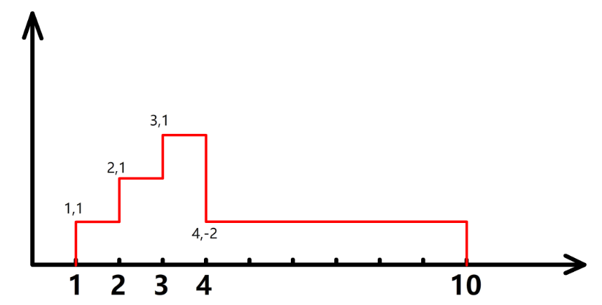

[计算面积]

绘图机器的绘图笔初始位i在原点(0.0)。 机器启动后其绘图笔按下面规则绘制直线:

1 )尝试沿着横向坐标轴正向绘制直线，直到给定的终点值E,

2 )期间可通过指令在纵坐标轴方向进行偏移。井同时恰制直线，偏移后按规则1绘制直线;指令的格式为X offsetY。表示在横坐标X沿纵坐标方向偏移, offsetY为正数表示正向偏移,为负数表示负向偏移。

给定了横坐标格点值E.以及若干条检制指令。请计算给制的直线和横坐标轴。以及X-E的直线组成图形的面积。

输入模述:

首行为两个整数NE。表示有N条指令。机器运行的横坐标終点值E.

接下来N行。每行两个整数表示-条给制指令x osorr。用例保证横坐标X以递增排序方式出现。且不会出现相同横坐标义。取值范围:0<N<= 10000, 0<X<= E<=20000, -10000<=offsetY<=10000.

输出描述:

一个整数，表示计算得到的面积。用例保证.结果范围在0-4294967295内

示例1:

输入

4 10

1 1

2 1

3 1

4 -2

输出

12


这个题主要理解题意，



```
import java.util.*;

public class Main {
    public static void main(String[] args) {
        Scanner sc = new Scanner(System.in);
        String[] a1 = sc.nextLine().split(" ");
        int count = Integer.parseInt(a1[0]);
        int total = Integer.parseInt(a1[1]);
        long result = 0;
        int last_x = 0, last_y = 0;
        for(int i = 0; i < count; i++) {
            String[] a2 = sc.nextLine().split(" ");
            int x = Integer.parseInt(a2[0]);
            int y = Integer.parseInt(a2[1]);
            result = result + (x- last_x) * Math.abs(last_y);
            last_x = x;
            last_y = y;
        }
        result = result + (total - last_x) * Math.abs(last_y);
        System.out.println(result);
    }
}
```


 