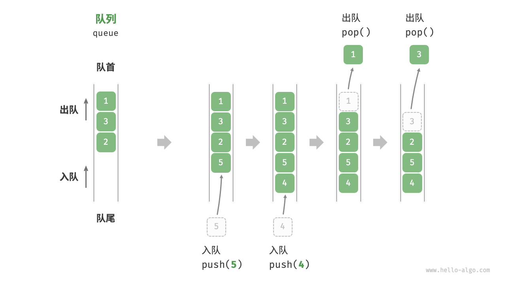
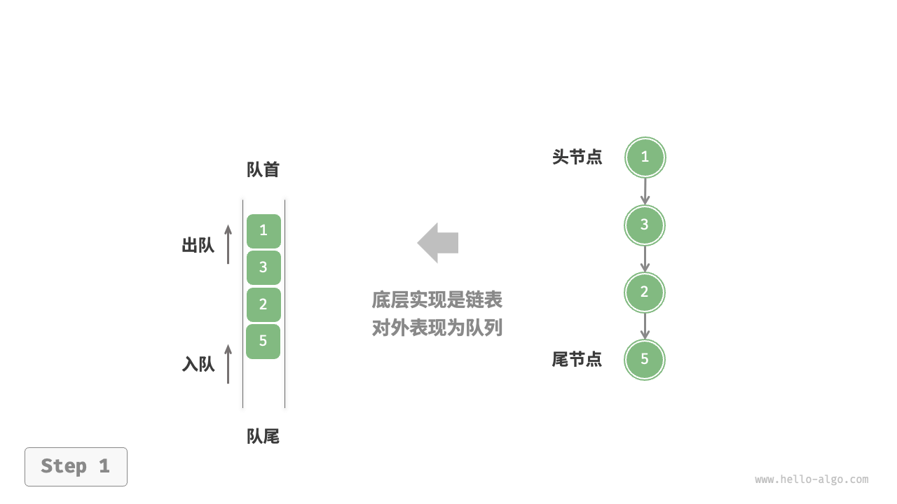
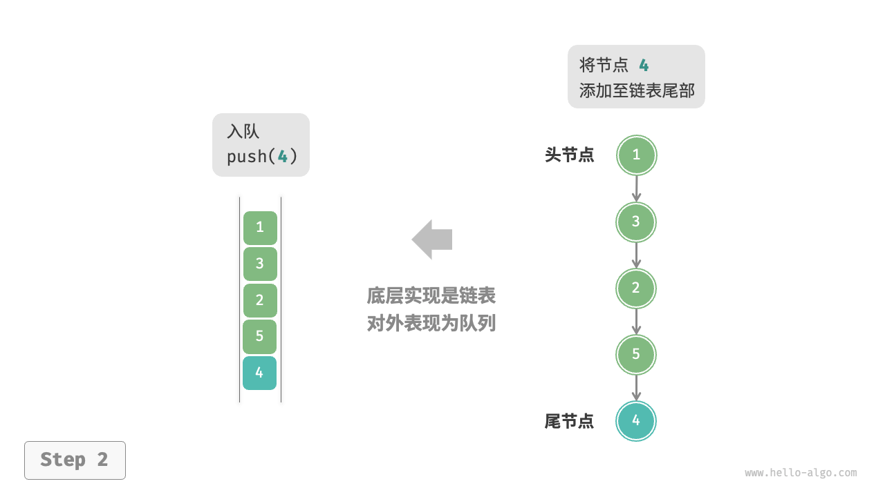
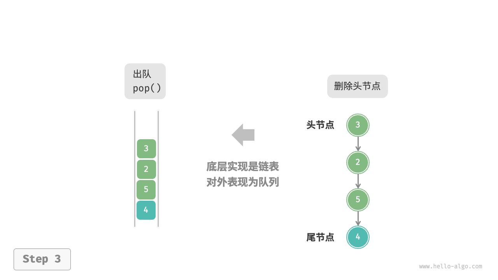
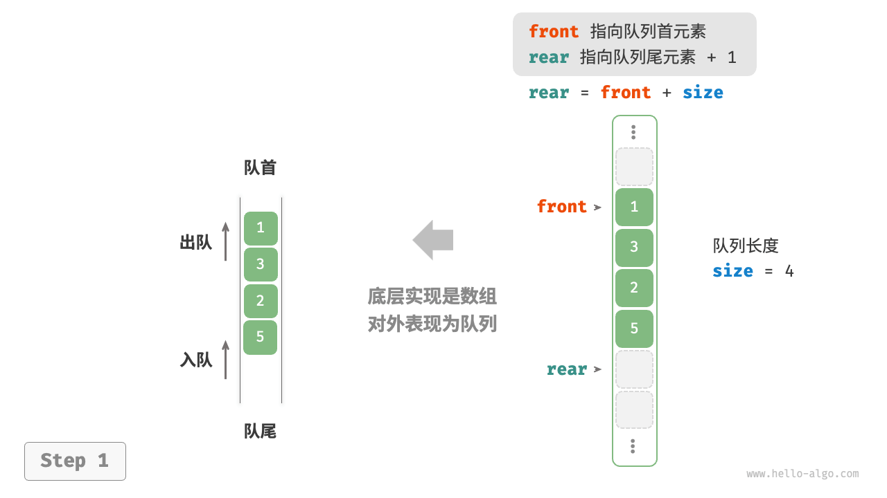
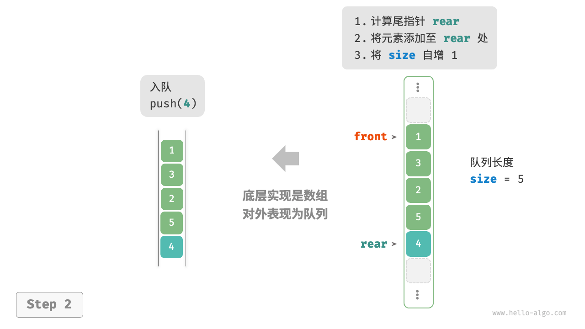
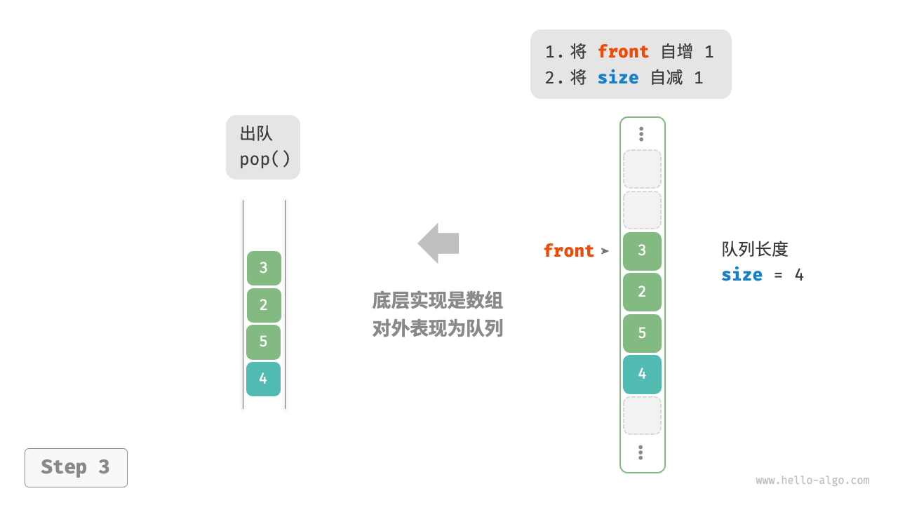

# 队列

<u>队列（queue）</u>是一种遵循【先入先出】规则的线性数据结构。
顾名思义，队列模拟了排队现象，即新来的人不断加入队列尾部，而位于队列头部的人逐个离开。

如下图所示，我们将队列头部称为“队首”，尾部称为“队尾”，将把元素加入队尾的操作称为“入队”，
删除队首元素的操作称为“出队”。



## 队列常用操作

队列的常见操作如下表所示。需要注意的是，不同编程语言的方法名称可能会有所不同。我们在此采用与栈相同的方法命名。

表 5-2 队列操作效率

| 方法名      | 描述             | 时间复杂度 |
|----------|----------------|-------|
| `push()` | 元素入队，即将元素添加至队尾 | O(1)  |
| `pop()`  | 队首元素出队         | O(1)  |
| `peek()` | 访问队首元素         | O(1)  |

我们可以直接使用编程语言中现成的队列类：

```text
/* 初始化队列 */
Queue<Integer> queue = new LinkedList<>();

/* 元素入队 */
queue.offer(1);
queue.offer(3);
queue.offer(2);
queue.offer(5);
queue.offer(4);

/* 访问队首元素 */
int peek = queue.peek();

/* 元素出队 */
int pop = queue.poll();

/* 获取队列的长度 */
int size = queue.size();

/* 判断队列是否为空 */
boolean isEmpty = queue.isEmpty();
```

## 队列实现

为了实现队列，我们需要一种数据结构，可以在一端添加元素，并在另一端删除元素，链表和数组都符合要求。

### 基于链表的实现

如下图所示，我们可以将链表的“头节点”和“尾节点”分别视为“队首”和“队尾”，规定队尾仅可添加节点，队首仅可删除节点。

LinkedListQueue：



push()：



pop()：



以下是用链表实现队列的代码：

```src
/* 基于链表实现的队列 */
class LinkedListQueue {
    private ListNode front, rear; // 头节点 front ，尾节点 rear
    private int queSize = 0;

    public LinkedListQueue() {
        front = null;
        rear = null;
    }

    /* 获取队列的长度 */
    public int size() {
        return queSize;
    }

    /* 判断队列是否为空 */
    public boolean isEmpty() {
        return size() == 0;
    }

    /* 入队 */
    public void push(int num) {
        // 在尾节点后添加 num
        ListNode node = new ListNode(num);
        // 如果队列为空，则令头、尾节点都指向该节点
        if (front == null) {
            front = node;
            rear = node;
        // 如果队列不为空，则将该节点添加到尾节点后
        } else {
            rear.next = node;
            rear = node;
        }
        queSize++;
    }

    /* 出队 */
    public int pop() {
        int num = peek();
        // 删除头节点
        front = front.next;
        queSize--;
        return num;
    }

    /* 访问队首元素 */
    public int peek() {
        if (isEmpty())
            throw new IndexOutOfBoundsException();
        return front.val;
    }

    /* 将链表转化为 Array 并返回 */
    public int[] toArray() {
        ListNode node = front;
        int[] res = new int[size()];
        for (int i = 0; i < res.length; i++) {
            res[i] = node.val;
            node = node.next;
        }
        return res;
    }
}
```

### 基于数组的实现

在数组中删除首元素的时间复杂度为 O(n)，这会导致出队操作效率较低。
然而，我们可以采用以下巧妙方法来避免这个问题。

我们可以使用一个变量 `front` 指向队首元素的索引，并维护一个变量 `size` 用于记录队列长度。
定义 `rear = front + size` ，这个公式计算出的 `rear` 指向队尾元素之后的下一个位置。

基于此设计，**数组中包含元素的有效区间为 `[front, rear - 1]`**，各种操作的实现方法如下图所示。

- 入队操作：将输入元素赋值给 `rear` 索引处，并将 `size` 增加 1 。
- 出队操作：只需将 `front` 增加 1 ，并将 `size` 减少 1 。

可以看到，入队和出队操作都只需进行一次操作，时间复杂度均为 $O(1)$ 。

ArrayQueue：



push()：



pop()：



你可能会发现一个问题：
在不断进行入队和出队的过程中，`front` 和 `rear` 都在向右移动，**当它们到达数组尾部时就无法继续移动了**。
为了解决此问题，我们可以将数组视为首尾相接的“环形数组”。

对于环形数组，我们需要让 `front` 或 `rear` 在越过数组尾部时，直接回到数组头部继续遍历。
这种周期性规律可以通过“取余操作”来实现，代码如下所示：

```src
/* 基于环形数组实现的队列 */
class ArrayQueue {
    private int[] nums; // 用于存储队列元素的数组
    private int front; // 队首指针，指向队首元素
    private int queSize; // 队列长度

    public ArrayQueue(int capacity) {
        nums = new int[capacity];
        front = queSize = 0;
    }

    /* 获取队列的容量 */
    public int capacity() {
        return nums.length;
    }

    /* 获取队列的长度 */
    public int size() {
        return queSize;
    }

    /* 判断队列是否为空 */
    public boolean isEmpty() {
        return queSize == 0;
    }

    /* 入队 */
    public void push(int num) {
        if (queSize == capacity()) {
            System.out.println("队列已满");
            return;
        }
        // 计算队尾指针，指向队尾索引 + 1
        // 通过取余操作实现 rear 越过数组尾部后回到头部
        int rear = (front + queSize) % capacity();
        // 将 num 添加至队尾
        nums[rear] = num;
        queSize++;
    }

    /* 出队 */
    public int pop() {
        int num = peek();
        // 队首指针向后移动一位，若越过尾部，则返回到数组头部
        front = (front + 1) % capacity();
        queSize--;
        return num;
    }

    /* 访问队首元素 */
    public int peek() {
        if (isEmpty())
            throw new IndexOutOfBoundsException();
        return nums[front];
    }

    /* 返回数组 */
    public int[] toArray() {
        // 仅转换有效长度范围内的列表元素
        int[] res = new int[queSize];
        for (int i = 0, j = front; i < queSize; i++, j++) {
            res[i] = nums[j % capacity()];
        }
        return res;
    }
}
```

以上实现的队列仍然具有局限性：其长度不可变。
然而，这个问题不难解决，我们可以将数组替换为动态数组，从而引入扩容机制。有兴趣的读者可以尝试自行实现。

两种实现的对比结论与栈一致，在此不再赘述。

## 队列典型应用

- **淘宝订单**。
  购物者下单后，订单将加入队列中，系统随后会根据顺序处理队列中的订单。
  在双十一期间，短时间内会产生海量订单，高并发成为工程师们需要重点攻克的问题。
- **各类待办事项**。
  任何需要实现“先来后到”功能的场景，
  例如打印机的任务队列、餐厅的出餐队列等，队列在这些场景中可以有效地维护处理顺序。

