# 双向队列

在队列中，我们仅能删除头部元素或在尾部添加元素。
如下图所示，<u>双向队列（double-ended queue）</u>提供了更高的灵活性，
允许在头部和尾部执行元素的添加或删除操作。

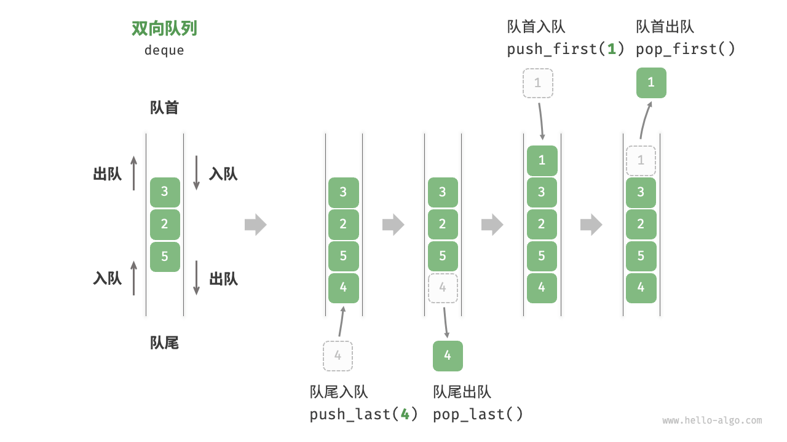

## 双向队列常用操作

双向队列的常用操作如下表所示，具体的方法名称需要根据所使用的编程语言来确定。

表 5-3 双向队列操作效率

| 方法名            | 描述       | 时间复杂度 |
|----------------|----------|-------|
| `push_first()` | 将元素添加至队首 | O(1)  |
| `push_last()`  | 将元素添加至队尾 | O(1)  |
| `pop_first()`  | 删除队首元素   | O(1)  |
| `pop_last()`   | 删除队尾元素   | O(1)  |
| `peek_first()` | 访问队首元素   | O(1)  |
| `peek_last()`  | 访问队尾元素   | O(1)  |

同样地，我们可以直接使用编程语言中已实现的双向队列类：

```text
/* 初始化双向队列 */
Deque<Integer> deque = new LinkedList<>();

/* 元素入队 */
deque.offerLast(2);   // 添加至队尾
deque.offerLast(5);
deque.offerLast(4);
deque.offerFirst(3);  // 添加至队首
deque.offerFirst(1);

/* 访问元素 */
int peekFirst = deque.peekFirst();  // 队首元素
int peekLast = deque.peekLast();    // 队尾元素

/* 元素出队 */
int popFirst = deque.pollFirst();  // 队首元素出队
int popLast = deque.pollLast();    // 队尾元素出队

/* 获取双向队列的长度 */
int size = deque.size();

/* 判断双向队列是否为空 */
boolean isEmpty = deque.isEmpty();
```

## 双向队列实现 *

双向队列的实现与队列类似，可以选择链表或数组作为底层数据结构。

### 基于双向链表的实现

回顾上一节内容，我们使用普通单向链表来实现队列，
因为它可以方便地删除头节点（对应出队操作）和在尾节点后添加新节点（对应入队操作）。

对于双向队列而言，头部和尾部都可以执行入队和出队操作。
换句话说，双向队列需要实现另一个对称方向的操作。
为此，我们采用“双向链表”作为双向队列的底层数据结构。

如下图所示，我们将双向链表的头节点和尾节点视为双向队列的队首和队尾，同时实现在两端添加和删除节点的功能。

LinkedListDeque：

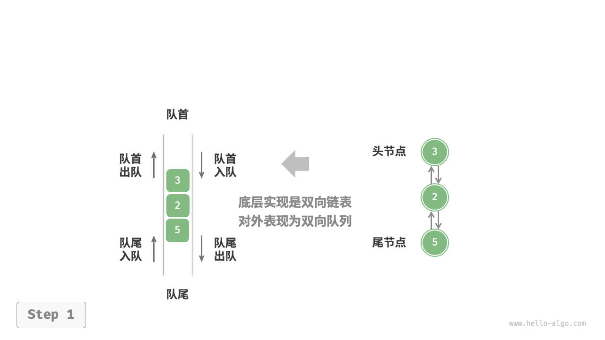

push_last()：

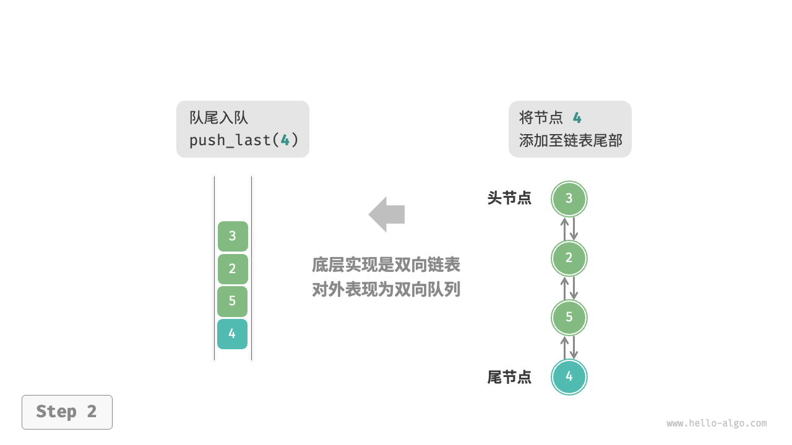

push_first()：

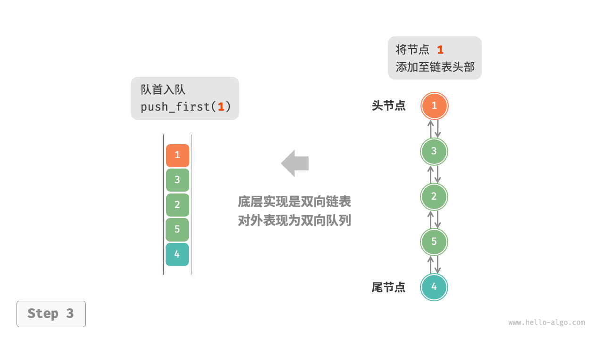

pop_last()：

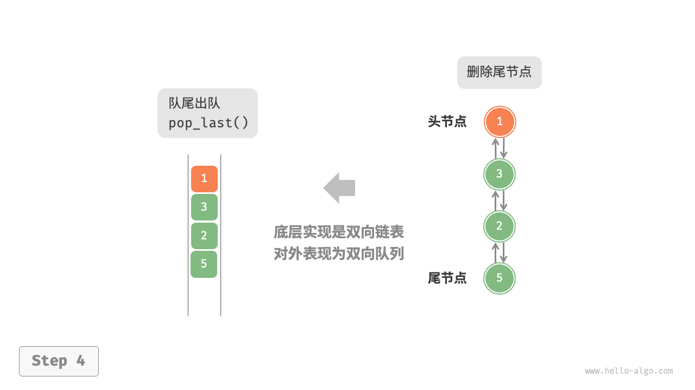

pop_first()：

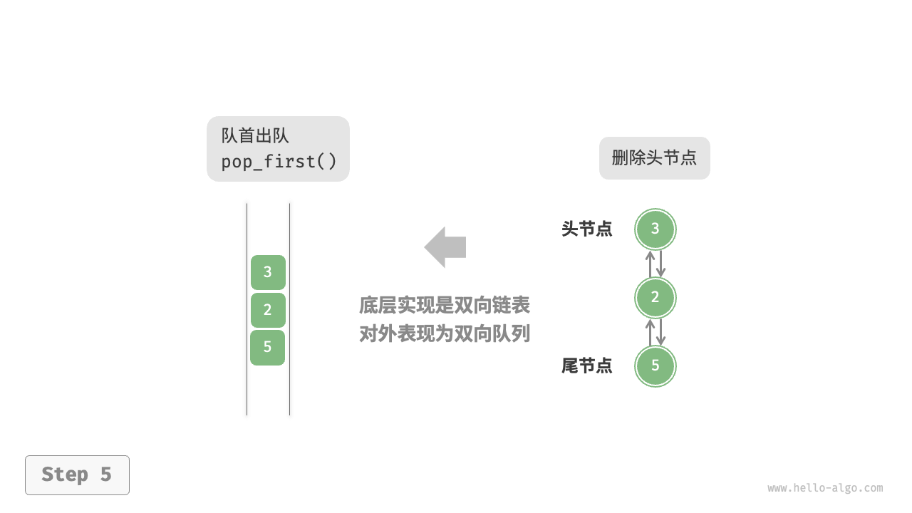

实现代码如下所示：

```src
/* 双向链表节点 */
class ListNode {
    int val; // 节点值
    ListNode next; // 后继节点引用
    ListNode prev; // 前驱节点引用

    ListNode(int val) {
        this.val = val;
        prev = next = null;
    }
}

/* 基于双向链表实现的双向队列 */
class LinkedListDeque {
    private ListNode front, rear; // 头节点 front ，尾节点 rear
    private int queSize = 0; // 双向队列的长度

    public LinkedListDeque() {
        front = rear = null;
    }

    /* 获取双向队列的长度 */
    public int size() {
        return queSize;
    }

    /* 判断双向队列是否为空 */
    public boolean isEmpty() {
        return size() == 0;
    }

    /* 入队操作 */
    private void push(int num, boolean isFront) {
        ListNode node = new ListNode(num);
        // 若链表为空，则令 front 和 rear 都指向 node
        if (isEmpty())
            front = rear = node;
        // 队首入队操作
        else if (isFront) {
            // 将 node 添加至链表头部
            front.prev = node;
            node.next = front;
            front = node; // 更新头节点
        // 队尾入队操作
        } else {
            // 将 node 添加至链表尾部
            rear.next = node;
            node.prev = rear;
            rear = node; // 更新尾节点
        }
        queSize++; // 更新队列长度
    }

    /* 队首入队 */
    public void pushFirst(int num) {
        push(num, true);
    }

    /* 队尾入队 */
    public void pushLast(int num) {
        push(num, false);
    }

    /* 出队操作 */
    private int pop(boolean isFront) {
        if (isEmpty())
            throw new IndexOutOfBoundsException();
        int val;
        // 队首出队操作
        if (isFront) {
            val = front.val; // 暂存头节点值
            // 删除头节点
            ListNode fNext = front.next;
            if (fNext != null) {
                fNext.prev = null;
                front.next = null;
            }
            front = fNext; // 更新头节点
        // 队尾出队操作
        } else {
            val = rear.val; // 暂存尾节点值
            // 删除尾节点
            ListNode rPrev = rear.prev;
            if (rPrev != null) {
                rPrev.next = null;
                rear.prev = null;
            }
            rear = rPrev; // 更新尾节点
        }
        queSize--; // 更新队列长度
        return val;
    }

    /* 队首出队 */
    public int popFirst() {
        return pop(true);
    }

    /* 队尾出队 */
    public int popLast() {
        return pop(false);
    }

    /* 访问队首元素 */
    public int peekFirst() {
        if (isEmpty())
            throw new IndexOutOfBoundsException();
        return front.val;
    }

    /* 访问队尾元素 */
    public int peekLast() {
        if (isEmpty())
            throw new IndexOutOfBoundsException();
        return rear.val;
    }

    /* 返回数组用于打印 */
    public int[] toArray() {
        ListNode node = front;
        int[] res = new int[size()];
        for (int i = 0; i < res.length; i++) {
            res[i] = node.val;
            node = node.next;
        }
        return res;
    }
}
```

### 基于数组的实现

如下图所示，与基于数组实现队列类似，我们也可以使用环形数组来实现双向队列。

ArrayDeque：

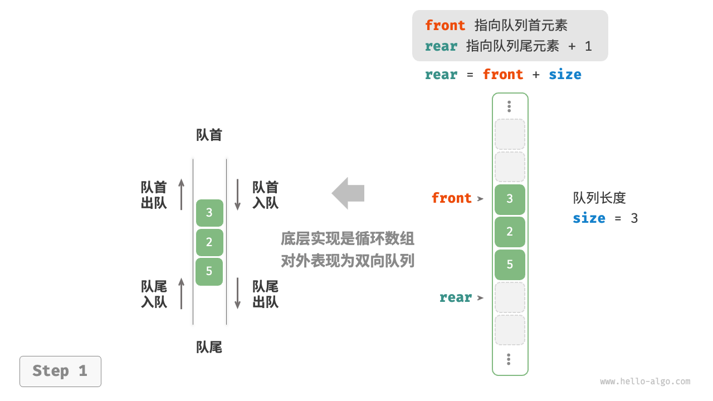

push_last()：

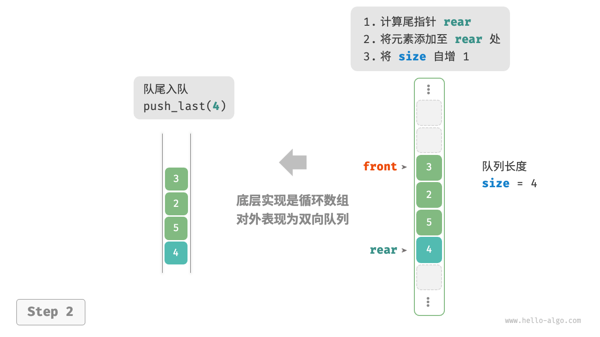

push_first()：

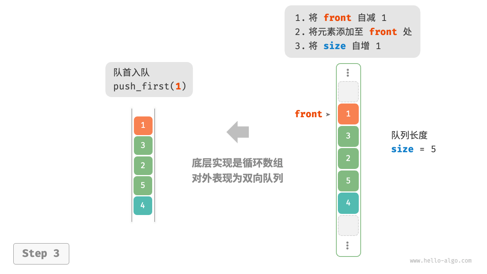

pop_last()：

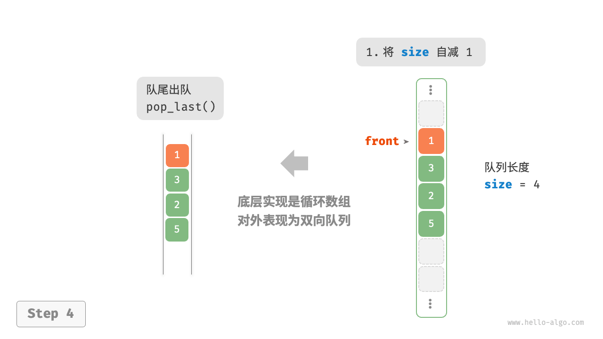

pop_first()：

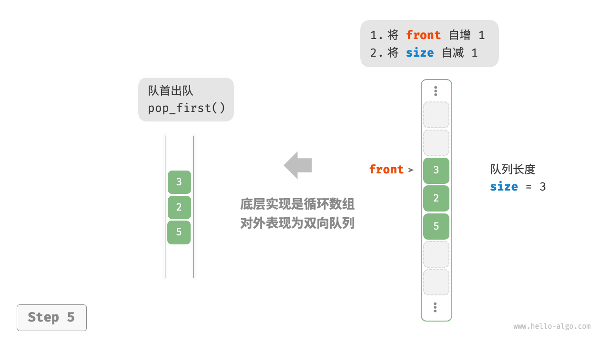

在队列的实现基础上，仅需增加“队首入队”和“队尾出队”的方法：

```src
/* 基于环形数组实现的双向队列 */
class ArrayDeque {
    private int[] nums; // 用于存储双向队列元素的数组
    private int front; // 队首指针，指向队首元素
    private int queSize; // 双向队列长度

    /* 构造方法 */
    public ArrayDeque(int capacity) {
        this.nums = new int[capacity];
        front = queSize = 0;
    }

    /* 获取双向队列的容量 */
    public int capacity() {
        return nums.length;
    }

    /* 获取双向队列的长度 */
    public int size() {
        return queSize;
    }

    /* 判断双向队列是否为空 */
    public boolean isEmpty() {
        return queSize == 0;
    }

    /* 计算环形数组索引 */
    private int index(int i) {
        // 通过取余操作实现数组首尾相连
        // 当 i 越过数组尾部后，回到头部
        // 当 i 越过数组头部后，回到尾部
        return (i + capacity()) % capacity();
    }

    /* 队首入队 */
    public void pushFirst(int num) {
        if (queSize == capacity()) {
            System.out.println("双向队列已满");
            return;
        }
        // 队首指针向左移动一位
        // 通过取余操作实现 front 越过数组头部后回到尾部
        front = index(front - 1);
        // 将 num 添加至队首
        nums[front] = num;
        queSize++;
    }

    /* 队尾入队 */
    public void pushLast(int num) {
        if (queSize == capacity()) {
            System.out.println("双向队列已满");
            return;
        }
        // 计算队尾指针，指向队尾索引 + 1
        int rear = index(front + queSize);
        // 将 num 添加至队尾
        nums[rear] = num;
        queSize++;
    }

    /* 队首出队 */
    public int popFirst() {
        int num = peekFirst();
        // 队首指针向后移动一位
        front = index(front + 1);
        queSize--;
        return num;
    }

    /* 队尾出队 */
    public int popLast() {
        int num = peekLast();
        queSize--;
        return num;
    }

    /* 访问队首元素 */
    public int peekFirst() {
        if (isEmpty())
            throw new IndexOutOfBoundsException();
        return nums[front];
    }

    /* 访问队尾元素 */
    public int peekLast() {
        if (isEmpty())
            throw new IndexOutOfBoundsException();
        // 计算尾元素索引
        int last = index(front + queSize - 1);
        return nums[last];
    }

    /* 返回数组用于打印 */
    public int[] toArray() {
        // 仅转换有效长度范围内的列表元素
        int[] res = new int[queSize];
        for (int i = 0, j = front; i < queSize; i++, j++) {
            res[i] = nums[index(j)];
        }
        return res;
    }
}
```

## 双向队列应用

双向队列兼具栈与队列的逻辑，**因此它可以实现这两者的所有应用场景，同时提供更高的自由度**。

我们知道，软件的“撤销”功能通常使用栈来实现：
系统将每次更改操作 `push` 到栈中，然后通过 `pop` 实现撤销。
然而，考虑到系统资源的限制，软件通常会限制撤销的步数（例如仅允许保存 50 步）。
当栈的长度超过 $50$ 时，软件需要在栈底（队首）执行删除操作。
**但栈无法实现该功能，此时就需要使用双向队列来替代栈**。
请注意，“撤销”的核心逻辑仍然遵循栈的先入后出原则，只是双向队列能够更加灵活地实现一些额外逻辑。