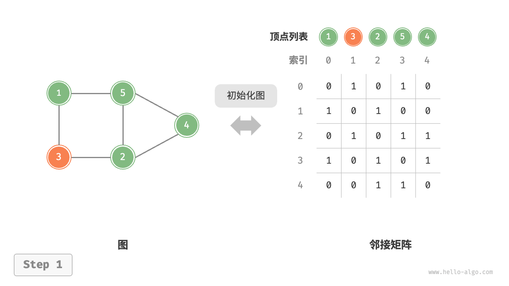
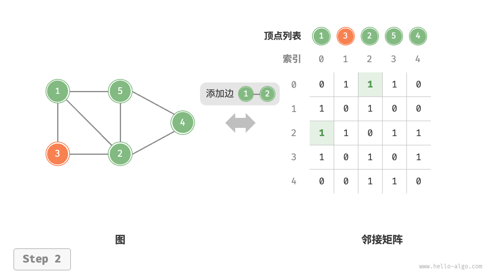
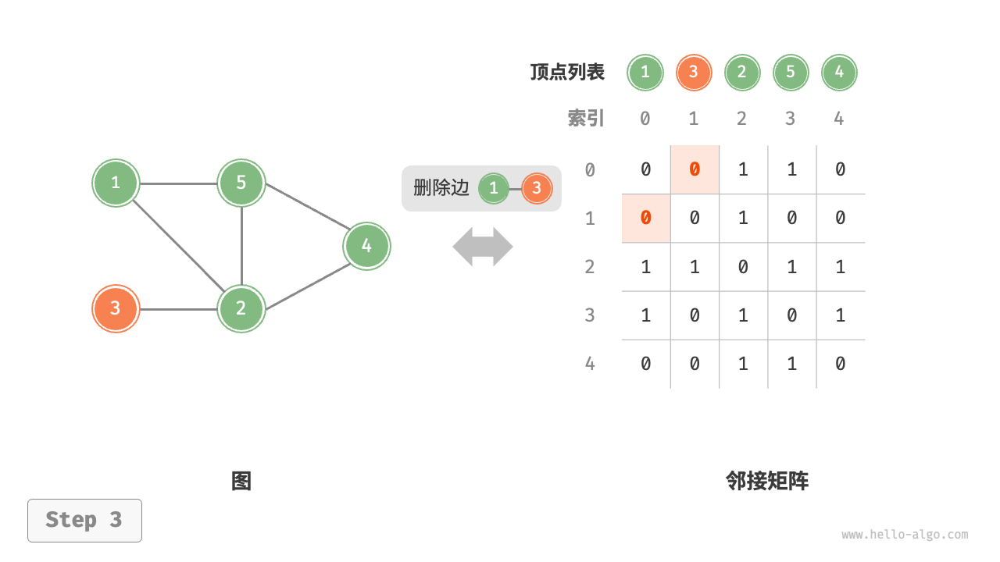
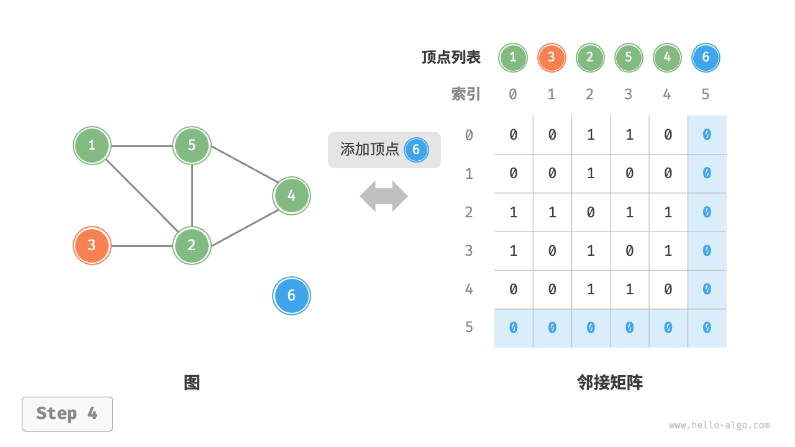
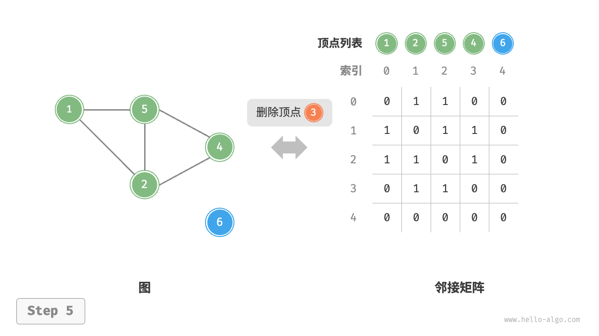
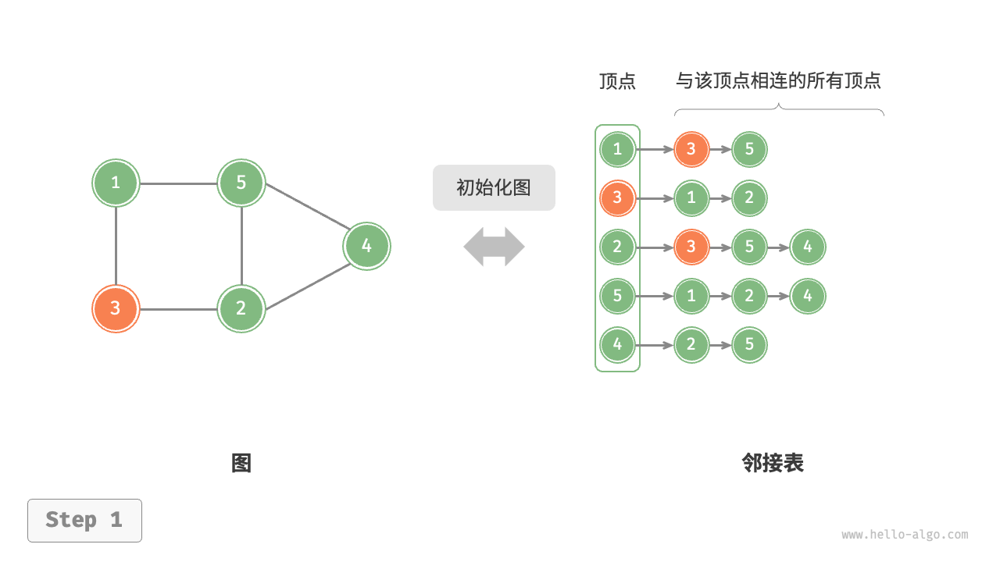
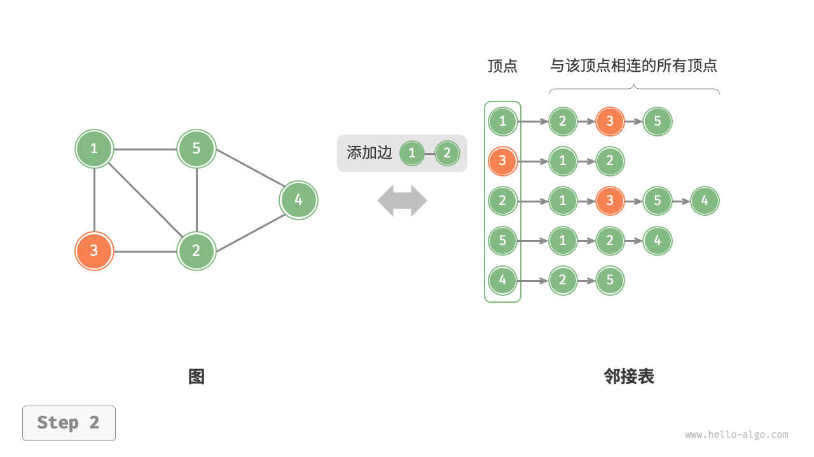
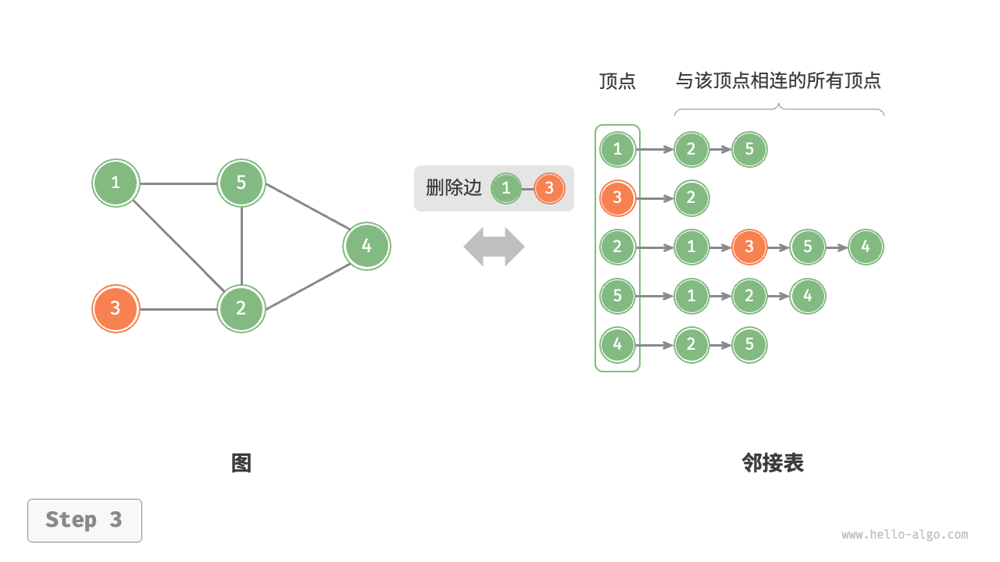
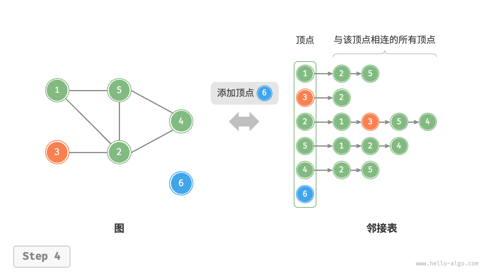
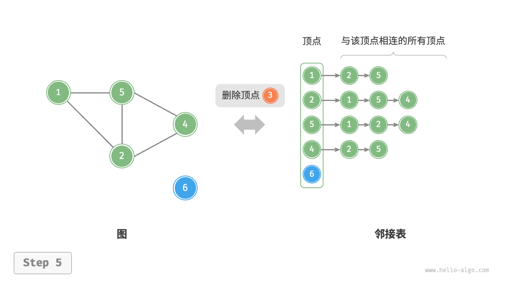

# 图的基础操作

图的基础操作可分为对“边”的操作和对“顶点”的操作。在“邻接矩阵”和“邻接表”两种表示方法下，实现方式有所不同。

## 基于邻接矩阵的实现

给定一个顶点数量为 n 的无向图，则各种操作的实现方式如下图所示。

- **添加或删除边**：
    直接在邻接矩阵中修改指定的边即可，使用O(1)时间。而由于是无向图，因此需要同时更新两个方向的边。
- **添加顶点**：
    在邻接矩阵的尾部添加一行一列，并全部填0即可，使用O(n)时间。
- **删除顶点**：
    在邻接矩阵中删除一行一列。当删除首行首列时达到最差情况，需要将(n-1)^2个元素“向左上移动”，从而使用O(n^2)时间。
- **初始化**：
    传入n个顶点，初始化长度为n的顶点列表`vertices`，使用O(n)时间；
    初始化n * n大小的邻接矩阵`adjMat`，使用O(n^2)时间。

=== "初始化邻接矩阵"


=== "添加边"


=== "删除边"


=== "添加顶点"


=== "删除顶点"


以下是基于邻接矩阵表示图的实现代码：

```text
/* 基于邻接矩阵实现的无向图类 */
class GraphAdjMat {
    List<Integer> vertices; // 顶点列表，元素代表“顶点值”，索引代表“顶点索引”
    List<List<Integer>> adjMat; // 邻接矩阵，行列索引对应“顶点索引”

    /* 构造方法 */
    public GraphAdjMat(int[] vertices, int[][] edges) {
        this.vertices = new ArrayList<>();
        this.adjMat = new ArrayList<>();
        // 添加顶点
        for (int val : vertices) {
            addVertex(val);
        }
        // 添加边
        // 请注意，edges 元素代表顶点索引，即对应 vertices 元素索引
        for (int[] e : edges) {
            addEdge(e[0], e[1]);
        }
    }

    /* 获取顶点数量 */
    public int size() {
        return vertices.size();
    }

    /* 添加顶点 */
    public void addVertex(int val) {
        int n = size();
        // 向顶点列表中添加新顶点的值
        vertices.add(val);
        // 在邻接矩阵中添加一行
        List<Integer> newRow = new ArrayList<>(n);
        for (int j = 0; j < n; j++) {
            newRow.add(0);
        }
        adjMat.add(newRow);
        // 在邻接矩阵中添加一列
        for (List<Integer> row : adjMat) {
            row.add(0);
        }
    }

    /* 删除顶点 */
    public void removeVertex(int index) {
        if (index >= size())
            throw new IndexOutOfBoundsException();
        // 在顶点列表中移除索引 index 的顶点
        vertices.remove(index);
        // 在邻接矩阵中删除索引 index 的行
        adjMat.remove(index);
        // 在邻接矩阵中删除索引 index 的列
        for (List<Integer> row : adjMat) {
            row.remove(index);
        }
    }

    /* 添加边 */
    // 参数 i, j 对应 vertices 元素索引
    public void addEdge(int i, int j) {
        // 索引越界与相等处理
        if (i < 0 || j < 0 || i >= size() || j >= size() || i == j)
            throw new IndexOutOfBoundsException();
        // 在无向图中，邻接矩阵关于主对角线对称，即满足 (i, j) == (j, i)
        adjMat.get(i).set(j, 1);
        adjMat.get(j).set(i, 1);
    }

    /* 删除边 */
    // 参数 i, j 对应 vertices 元素索引
    public void removeEdge(int i, int j) {
        // 索引越界与相等处理
        if (i < 0 || j < 0 || i >= size() || j >= size() || i == j)
            throw new IndexOutOfBoundsException();
        adjMat.get(i).set(j, 0);
        adjMat.get(j).set(i, 0);
    }

    /* 打印邻接矩阵 */
    public void print() {
        System.out.print("顶点列表 = ");
        System.out.println(vertices);
        System.out.println("邻接矩阵 =");
        PrintUtil.printMatrix(adjMat);
    }
}
```

## 基于邻接表的实现

设无向图的顶点总数为n、边总数m，则可根据下图所示的方法实现各种操作。

- **添加边**：在顶点对应链表的末尾添加边即可，使用O(1)时间。因为是无向图，所以需要同时添加两个方向的边。
- **删除边**：在顶点对应链表中查找并删除指定边，使用O(m)时间。在无向图中，需要同时删除两个方向的边。
- **添加顶点**：在邻接表中添加一个链表，并将新增顶点作为链表头节点，使用O(1)时间。
- **删除顶点**：需遍历整个邻接表，删除包含指定顶点的所有边，使用O(n + m)时间。
- **初始化**：在邻接表中创建n个顶点和2m条边，使用O(n + m)时间。

=== "初始化邻接表"


=== "添加边"


=== "删除边"


=== "添加顶点"


=== "删除顶点"


以下是邻接表的代码实现。对比上图，实际代码有以下不同。

- 为了方便添加与删除顶点，以及简化代码，我们使用列表（动态数组）来代替链表。
- 使用哈希表来存储邻接表，`key`为顶点实例，`value`为该顶点的邻接顶点列表（链表）。

另外，我们在邻接表中使用`Vertex`类来表示顶点，
这样做的原因是：如果与邻接矩阵一样，用列表索引来区分不同顶点，那么假设要删除索引为i的顶点，则需遍历整个邻接表，
将所有大于i的索引全部减1，效率很低。而如果每个顶点都是唯一的`Vertex`实例，删除某一顶点之后就无须改动其他顶点了。

```text
/* 基于邻接表实现的无向图类 */
class GraphAdjList {
    // 邻接表，key：顶点，value：该顶点的所有邻接顶点
    Map<Vertex, List<Vertex>> adjList;

    /* 构造方法 */
    public GraphAdjList(Vertex[][] edges) {
        this.adjList = new HashMap<>();
        // 添加所有顶点和边
        for (Vertex[] edge : edges) {
            addVertex(edge[0]);
            addVertex(edge[1]);
            addEdge(edge[0], edge[1]);
        }
    }

    /* 获取顶点数量 */
    public int size() {
        return adjList.size();
    }

    /* 添加边 */
    public void addEdge(Vertex vet1, Vertex vet2) {
        if (!adjList.containsKey(vet1) || !adjList.containsKey(vet2) || vet1 == vet2)
            throw new IllegalArgumentException();
        // 添加边 vet1 - vet2
        adjList.get(vet1).add(vet2);
        adjList.get(vet2).add(vet1);
    }

    /* 删除边 */
    public void removeEdge(Vertex vet1, Vertex vet2) {
        if (!adjList.containsKey(vet1) || !adjList.containsKey(vet2) || vet1 == vet2)
            throw new IllegalArgumentException();
        // 删除边 vet1 - vet2
        adjList.get(vet1).remove(vet2);
        adjList.get(vet2).remove(vet1);
    }

    /* 添加顶点 */
    public void addVertex(Vertex vet) {
        if (adjList.containsKey(vet))
            return;
        // 在邻接表中添加一个新链表
        adjList.put(vet, new ArrayList<>());
    }

    /* 删除顶点 */
    public void removeVertex(Vertex vet) {
        if (!adjList.containsKey(vet))
            throw new IllegalArgumentException();
        // 在邻接表中删除顶点 vet 对应的链表
        adjList.remove(vet);
        // 遍历其他顶点的链表，删除所有包含 vet 的边
        for (List<Vertex> list : adjList.values()) {
            list.remove(vet);
        }
    }

    /* 打印邻接表 */
    public void print() {
        System.out.println("邻接表 =");
        for (Map.Entry<Vertex, List<Vertex>> pair : adjList.entrySet()) {
            List<Integer> tmp = new ArrayList<>();
            for (Vertex vertex : pair.getValue())
                tmp.add(vertex.val);
            System.out.println(pair.getKey().val + ": " + tmp + ",");
        }
    }
}
```

## 效率对比

设图中共有n个顶点和m条边，下表对比了邻接矩阵和邻接表的时间效率和空间效率。

表 9-2-1 邻接矩阵与邻接表对比 

|        | 邻接矩阵   | 邻接表（链表）  | 邻接表（哈希表） |
|--------|--------|----------|----------|
| 判断是否邻接 | O(1)   | O(m)     | O(1)     |
| 添加边    | O(1)   | O(1)     | O(1)     |
| 删除边    | O(1)   | O(m)     | O(1)     |
| 添加顶点   | O(n)   | O(1)     | O(1)     |
| 删除顶点   | O(n^2) | O(n + m) | O(n)     |
| 内存空间占用 | O(n^2) | O(n + m) | O(n + m) |

观察上表，似乎邻接表（哈希表）的时间效率与空间效率最优。
但实际上，在邻接矩阵中操作边的效率更高，只需一次数组访问或赋值操作即可。
综合来看，邻接矩阵体现了“以空间换时间”的原则，而邻接表体现了“以时间换空间”的原则。