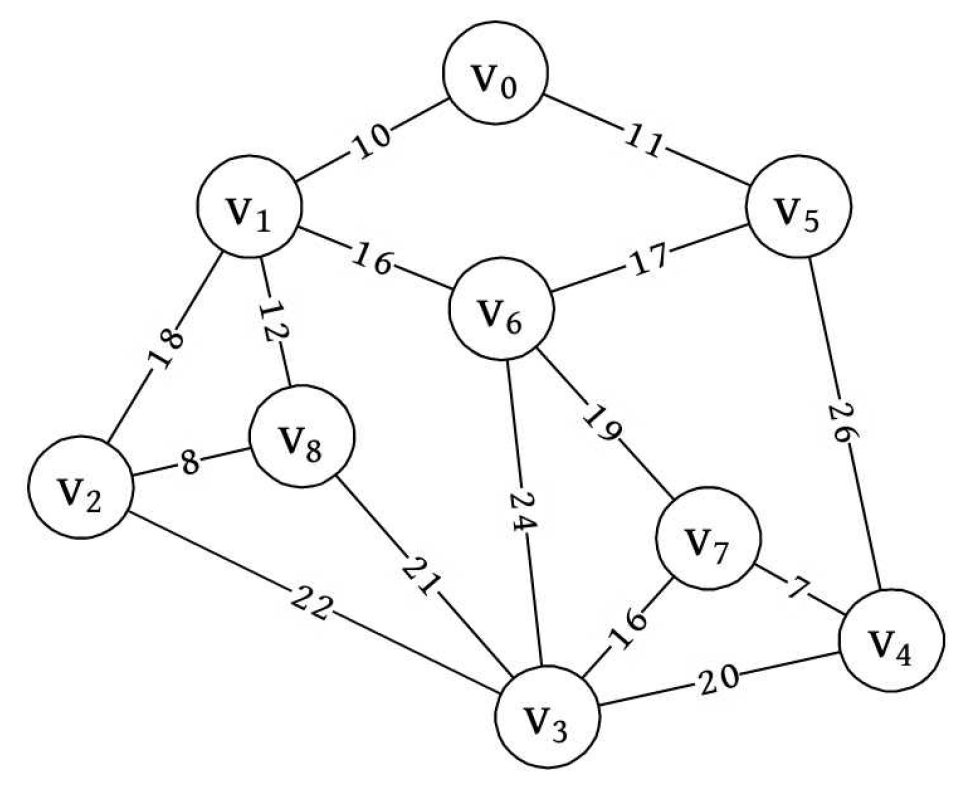
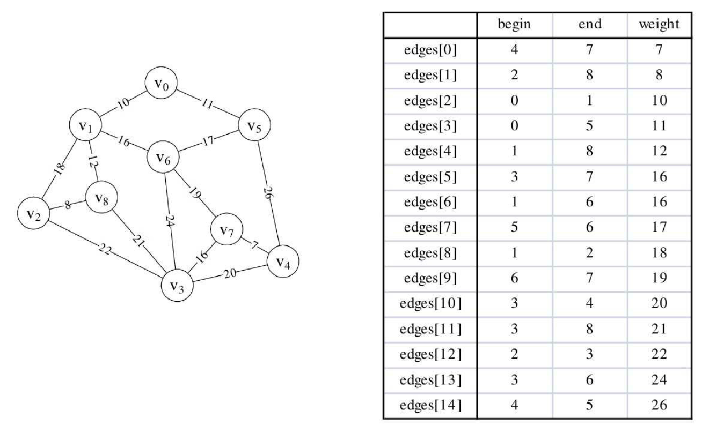

假设你是电信的实施工程师，需要为一个镇的九个村庄架设通信网络做设计，村庄位置大致如图7-6-1，
其中v0～v8是村庄，之间连线的数字表示村与村间的可通达的直线距离，
比如v0至v1就是10公里（个别如v0与v6，v6与v8，v5与v7未测算距离是因为有高山或湖泊，不予考虑）。
你们领导要求你必须用最小的成本完成这次任务。你说怎么办？



显然这是一个带权值的图，即网结构。所谓的最小成本，就是n个顶点，用n-1条边把一个连通图连接起来，并且使得权值的和最小。
在这个例子里，每多一公里就多一份成本，所以只要让线路连线的公里数最少，就是最少成本了。

在讲图的定义和术语时，曾经提到过，一个连通图的生成树是一个极小的连通子图，
它含有图中全部的顶点，但只有足以构成一棵树的n-1条边。
我们把构造连通网的最小代价生成树称为最小生成树（Minimum Cost SpanningTree）。
找连通网的最小生成树，经典的有两种算法，普里姆算法和克鲁斯卡尔算法。
我们就分别来介绍一下。

# 普里姆（Prim）算法
普里姆（Prim）算法的实现定义：
```text
假设N=(V,{E})是连通网，TE是N上最小生成树中边的集合。
算法从U={u0}(u0∈V)，TE={}开始。
重复执行下述操作：
    在所有u∈U,v∈V-U的边(u,v)∈E中找一条代价最小的边(u0,v0)并入集合TE，同时v0并入U，直至U=V为止。
    此时TE中必有n-1条边，则T=(V,{TE})为N的最小生成树。
    
由算法代码中的循环嵌套可得知此算法的时间复杂度为O(n2)。
```
代码实现：
```java
class MGraph {
    int[][] arc;

    /**
     * Prim算法生成最小生成树
     */
    public void minSpanTree4Prim() {
        int[] adjVertices = new int[arc.length]; // 保存生成树相关顶点
        // 保存生成树内各个顶点与还未加入生成树的各个顶点的最小权值
        int[] lowCost = new int[arc.length];
        // 初始化生成树与外面各个顶点的最小权值，即v0选为第一个加入生成树的顶点，此时v0与其他顶点之间的权值就是生成树与外面各个顶点的最小权值。
        System.arraycopy(arc[0], 0, lowCost, 0, arc.length - 1);
        // 初始化第一个权值为0，即v0加入生成树，lowCost[i] = 0 表示 i 顶点已经加入生成树
        lowCost[0] = 0; 
        // 初始化第一个顶点的下标为0
        adjVertices[0] = 0;
        // 遍历其他顶点，依次将lowCost中边权重最小的顶点加入生成树
        for (int i = 1; i < arc.length; i++) {
            // 初始化最小权值为无穷大，通常设置为 Integer.MAX_VALUE
            int minWeight = Integer.MAX_VALUE;
            // 最新加入生成树的顶点下标
            int k = 0;
            // 找出下一个与生成树之间边权重最小的顶点
            for (int j = 1; j < arc.length; j++) {
                if (lowCost[j] != 0 && lowCost[j] < minWeight) {
                    minWeight = lowCost[j]; // 当前边最小权值
                    k = j; // 当前与生成树最近的顶点下标
                }
            }
            System.out.println("(" + adjVertices[k] + ", " + k + ")");
            // 将当前顶点的权值设置为0，表示此顶点加入生成树
            lowCost[k] = 0;
            // 根据 最新加入生成树的顶点k 更新生成树与剩余顶点之间的边最小权值
            for (int j = 1; j < arc.length; j++) {
                if (lowCost[j] != 0 && arc[k][j] < lowCost[j]) {
                    lowCost[j] = arc[k][j]; // 将目前更小权值更新入lowCost中
                    adjVertices[j] = k; // 将下标为k的顶点存入adjVertices
                }
            }
        }
    }
}
```

# 克鲁斯卡尔（Kruskal）算法
普里姆（Prim）算法是以某顶点为起点，逐步找各顶点上最小权值的边来构建最小生成树的。

我们也可以直接就以边为目标去构建，因为权值是在边上，直接去找最小权值的边来构建生成树也是很自然的想法，只不过构建时要考虑是否会形成环路而已。
此时我们就用到了图的存储结构中的边集数组结构。

以下是edge边集数组结构的 定义代码：
```java
class Edge {
    int begin;
    int end;
    int weight;
}
```

克鲁斯卡尔（Kruskal）算法的实现定义：
```text
假设N=(V,{E})是连通网，则令最小生成树的初始状态为只有n个顶点而无边的非连通图T={V,{}}，图中每个顶点自成一个连通分量。
在E中选择代价最小的边，若该边依附的顶点落在T中不同的连通分量上，则将此边加入到T中，否则舍去此边而选择下一条代价最小的边。
依次类推，直至T中所有顶点都在同一连通分量上为止。
```

我们将邻接矩阵通过程序转化为边集数组，并且对它们按权值从小到大排序。



于是克鲁斯卡尔（Kruskal）算法代码如下，左侧数字为行号。
其中MAXEDGE为边数量的极大值，此处大于等于15即可，MAXVEX为顶点个数最大值，此处大于等于9即可。
现在假设我们自己就是计算机，在调用minSpanTree4Kruskal函数，输入图的邻接矩阵后，
看看它是如何运行并打印出最小生成树的。
```java
import java.util.Arrays;

class MGraph {
    int[] vertices; // 顶点
    int[][] arc; // 邻接矩阵
    Edge[] edges; // 边集合，有小到大排好序

    /**
     * Kruskal算法生成最小生成树
     */
    public void minSpanTree4Kruskal(Edge[] edges) {
        int[] parent = new int[vertices.length]; // 定义来判断边与边是否形成环路，arc.length为顶点个数
        for (Edge edge : edges) {
            int start = find(parent, edge.begin);
            int end = find(parent, edge.end);
            System.out.println("(" + edge.begin + ", " + edge.end + ") " + start + ":" + end);
            System.out.println("parent: " + Arrays.toString(Arrays.stream(parent).toArray()));
            // 假如start与end不等，说明此边没有与现有生成树形成环路
            if (start != end) {
                // 将此边的结尾顶点放入下标为起点的parent中,表示此顶点已经在生成树集合中
                parent[start] = end;
                System.out.println("====================================");
                System.out.println("取边：(" + edge.begin + ", " + edge.end + ") " + edge.weight);
                System.out.println("====================================");
            }
        }
    }

    public int find(int[] parent, int begin) {
        while (parent[begin] > 0) {
            begin = parent[begin];
        }
        return begin;
    }

    public static void main(String[] args) {
        MGraph mGraph = new MGraph();
        mGraph.vertices = new int[] {0, 1, 2, 3, 4, 5, 6, 7, 8};

        Edge[] edges = new Edge[15];
        edges[0] = new Edge(4, 7, 7);
        edges[1] = new Edge(2, 8, 8);
        edges[2] = new Edge(0, 1, 10);
        edges[3] = new Edge(0, 5, 11);
        edges[4] = new Edge(1, 8, 12);
        edges[5] = new Edge(3, 7, 16);
        edges[6] = new Edge(1, 6, 16);
        edges[7] = new Edge(5, 6, 17);
        edges[8] = new Edge(1, 2, 18);
        edges[9] = new Edge(6, 7, 19);
        edges[10] = new Edge(3, 4, 20);
        edges[11] = new Edge(3, 8, 21);
        edges[12] = new Edge(2, 3, 22);
        edges[13] = new Edge(3, 6, 24);
        edges[14] = new Edge(4, 5, 26);
        mGraph.edges = edges;
        mGraph.minSpanTree4Kruskal(edges);
    }
}

class Edge {
    int begin;
    int end;
    int weight;

    Edge(int begin, int end, int weight) {
        this.begin = begin;
        this.end = end;
        this.weight = weight;
    }
}
```
此算法的find函数由边数e决定，时间复杂度为O(log e)，而外面有一个for循环e次。
所以克鲁斯卡尔算法的时间复杂度为O(e log e)。

# 对比
对比两个算法，
克鲁斯卡尔算法主要是针对边来展开，边数少时效率会非常高，所以对于稀疏图有很大的优势；
而普里姆算法对于稠密图，即边数非常多的情况会更好一些。


