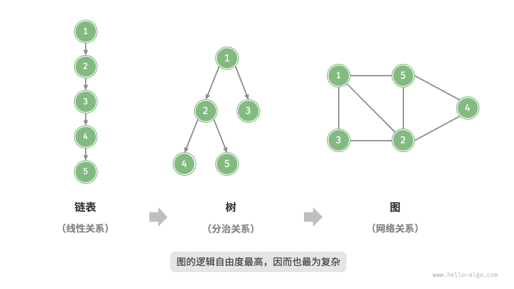
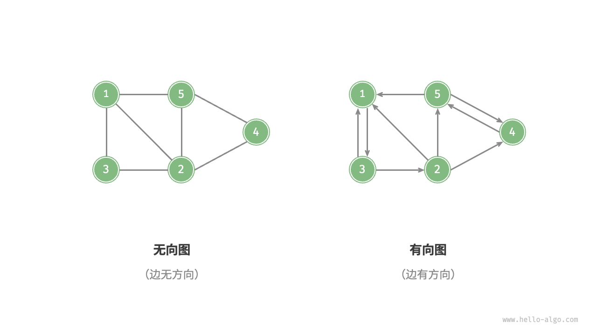
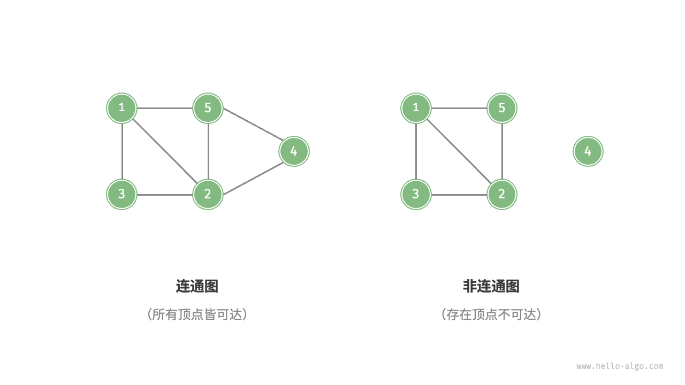
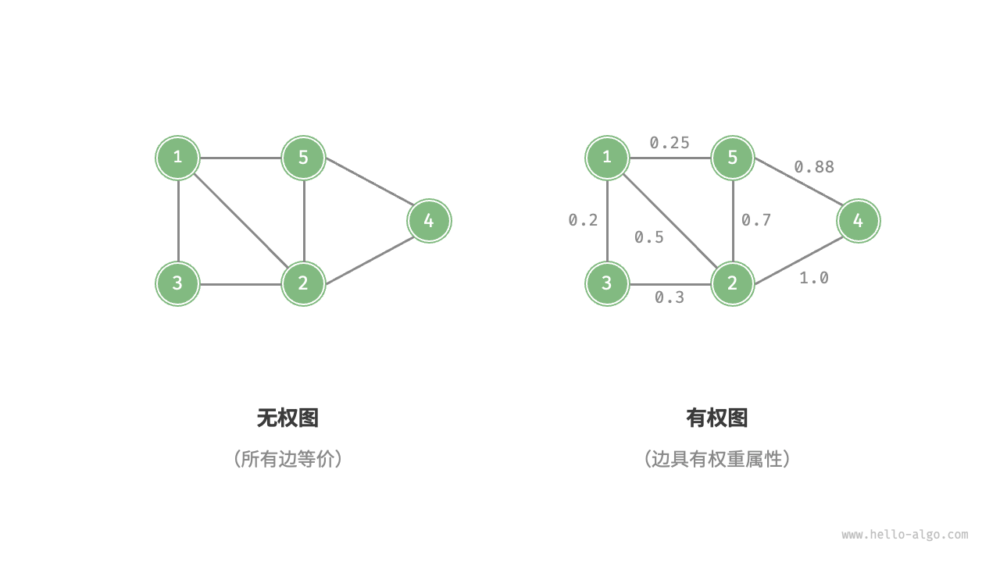
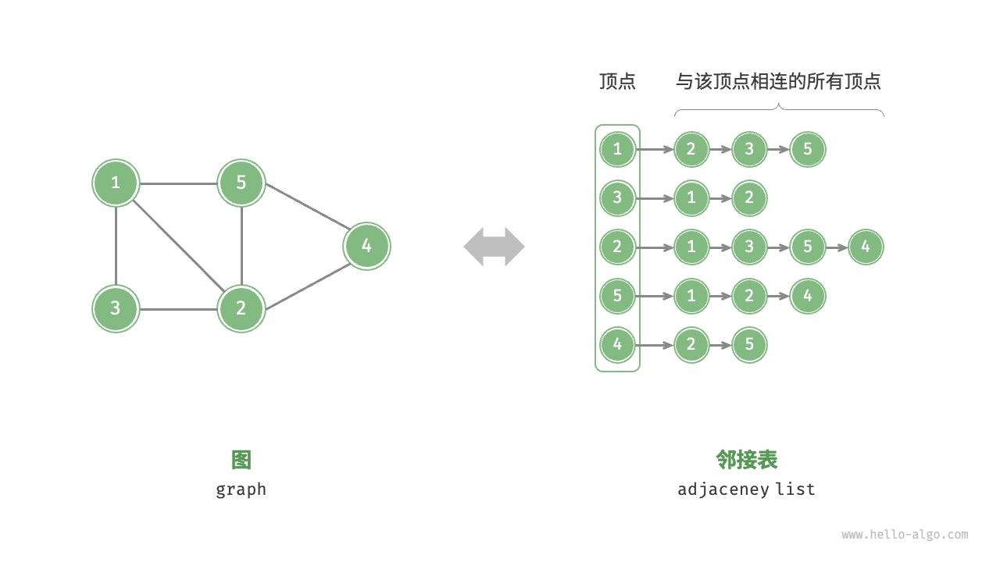

# 图

<u>图（graph）</u>是一种非线性数据结构，由<u>顶点（vertex）</u>和<u>边（edge）</u>组成。
我们可以将图G抽象地表示为一组顶点V和一组边E的集合。
以下示例展示了一个包含 5 个顶点和 7 条边的图。

```text
V = { 1, 2, 3, 4, 5 } 
E = { (1,2), (1,3), (1,5), (2,3), (2,4), (2,5), (4,5) } 

G = { V, E } 
```


如果将顶点看作节点，将边看作连接各个节点的引用（指针），我们就可以将图看作一种从链表拓展而来的数据结构。
如下图所示，**相较于线性关系（链表）和分治关系（树），网络关系（图）的自由度更高**，因而更为复杂。



## 图的常见类型与术语

根据边是否具有方向，可分为<u>无向图（undirected graph）</u>和<u>有向图（directed graph）</u>，如下图所示。

- 在无向图中，边表示两顶点之间的“双向”连接关系，例如微信或QQ中的“好友关系”。
- 在有向图中，边具有方向性，即 A -> B 和 A <- B 两个方向的边是相互独立的，例如微博或抖音上的“关注”与“被关注”关系。



根据所有顶点是否连通，可分为<u>连通图（connected graph）</u>和<u>非连通图（disconnected graph）</u>，如下图所示。

- 对于连通图，从某个顶点出发，可以到达其余任意顶点。
- 对于非连通图，从某个顶点出发，至少有一个顶点无法到达。



我们还可以为边添加“权重”变量，从而得到如下图所示的<u>有权图（weighted graph）</u>。
例如在《王者荣耀》等手游中，系统会根据共同游戏时间来计算玩家之间的“亲密度”，这种亲密度网络就可以用有权图来表示。



图数据结构包含以下常用术语。

- <u>邻接（adjacency）</u>：
    当两顶点之间存在边相连时，称这两顶点“邻接”。在上图中，顶点1的邻接顶点为顶点2、3、5。
- <u>路径（path）</u>：
    从顶点A到顶点B经过的边构成的序列被称为从A到B的“路径”。在上图中，边序列1-5-2-4是顶点1到顶点4的一条路径。
- <u>度（degree）</u>：
    一个顶点拥有的边数。
    对于有向图，<u>入度（in-degree）</u>表示有多少条边指向该顶点，<u>出度（out-degree）</u>表示有多少条边从该顶点指出。

## 图的表示

图的常用表示方式包括“邻接矩阵”和“邻接表”。以下使用无向图进行举例。

### 邻接矩阵

设图的顶点数量为n，<u>邻接矩阵（adjacency matrix）</u>使用一个n * n大小的矩阵来表示图，
每一行（列）代表一个顶点，矩阵元素代表边，用1或0表示两个顶点之间是否存在边。

如下图所示，设邻接矩阵为M、顶点列表为V，那么矩阵元素M[i, j] = 1表示顶点V[i]到顶点V[j]之间存在边，
反之M[i, j] = 0表示两顶点之间无边。


邻接矩阵具有以下特性。

- 顶点不能与自身相连，因此邻接矩阵主对角线元素没有意义。
- 对于无向图，两个方向的边等价，此时邻接矩阵关于主对角线对称。
- 将邻接矩阵的元素从1和0替换为权重，则可表示有权图。

使用邻接矩阵表示图时，我们可以直接访问矩阵元素以获取边，因此增删查改操作的效率很高，时间复杂度均为O(1)。
然而，矩阵的空间复杂度为O(n^2)，内存占用较多。

### 邻接表

<u>邻接表（adjacency list）</u>使用n个链表来表示图，链表节点表示顶点。
第i个链表对应顶点i，其中存储了该顶点的所有邻接顶点（与该顶点相连的顶点）。下图展示了一个使用邻接表存储的图的示例。



邻接表仅存储实际存在的边，而边的总数通常远小于n^2，因此它更加节省空间。
然而，在邻接表中需要通过遍历链表来查找边，因此其时间效率不如邻接矩阵。

观察上图，**邻接表结构与哈希表中的“链式地址”非常相似，因此我们也可以采用类似的方法来优化效率**。
比如当链表较长时，可以将链表转化为AVL树或红黑树，从而将时间效率从O(n)优化至O(log n)；
还可以把链表转换为哈希表，从而将时间复杂度降至O(1)。

## 图的常见应用

如下表所示，许多现实系统可以用图来建模，相应的问题也可以约化为图计算问题。

表 9-1-1 现实生活中常见的图 

|      | 顶点 | 边          | 图计算问题  |
|------|----|------------|--------|
| 社交网络 | 用户 | 好友关系       | 潜在好友推荐 |
| 地铁线路 | 站点 | 站点间的连通性    | 最短路线推荐 |
| 太阳系  | 星体 | 星体间的万有引力作用 | 行星轨道计算 |

