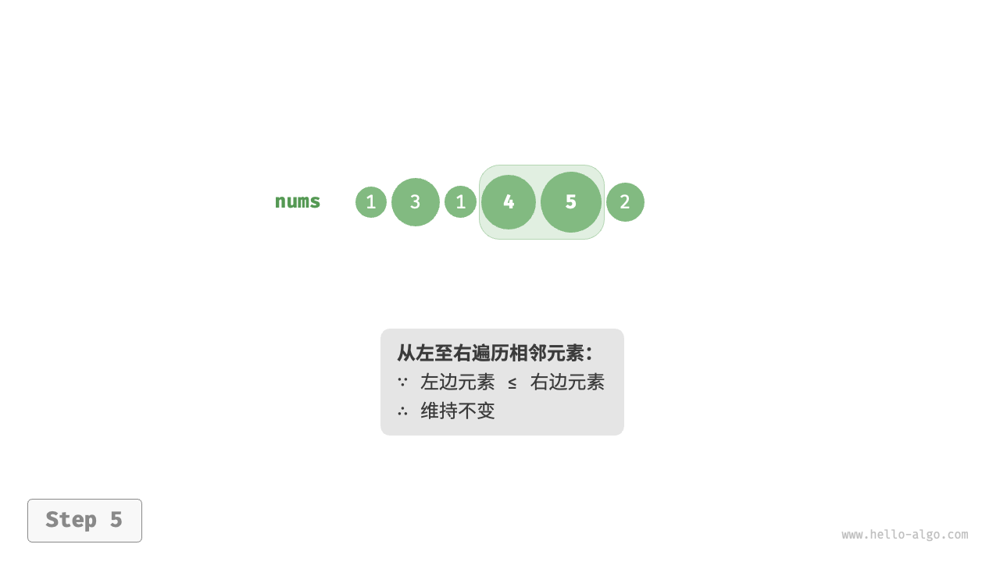

# 冒泡排序

<u>冒泡排序（bubble sort）</u>通过连续地比较与交换相邻元素实现排序。
这个过程就像气泡从底部升到顶部一样，因此得名冒泡排序。

如下图所示，冒泡过程可以利用元素交换操作来模拟：
从数组最左端开始向右遍历，依次比较相邻元素大小，如果“左元素 > 右元素”就交换二者。
遍历完成后，最大的元素会被移动到数组的最右端。





## 算法流程

设数组的长度为 n，冒泡排序的步骤如下图所示。

1. 首先，对n个元素执行“冒泡”，**将数组的最大元素交换至正确位置**。
2. 接下来，对剩余n - 1个元素执行“冒泡”，**将第二大元素交换至正确位置**。
3. 以此类推，经过n - 1轮“冒泡”后，**前n - 1大的元素都被交换至正确位置**。
4. 仅剩的一个元素必定是最小元素，无须排序，因此数组排序完成。


示例代码如下：

```text
/* 冒泡排序 */
void bubbleSort(int[] nums) {
    // 外循环：未排序区间为 [0, i]
    for (int i = nums.length - 1; i > 0; i--) {
        // 内循环：将未排序区间 [0, i] 中的最大元素交换至该区间的最右端
        for (int j = 0; j < i; j++) {
            if (nums[j] > nums[j + 1]) {
                // 交换 nums[j] 与 nums[j + 1]
                int tmp = nums[j];
                nums[j] = nums[j + 1];
                nums[j + 1] = tmp;
            }
        }
    }
}
```

## 效率优化

我们发现，如果某轮“冒泡”中没有执行任何交换操作，说明数组已经完成排序，可直接返回结果。
因此，可以增加一个标志位 `flag` 来监测这种情况，一旦出现就立即返回。

经过优化，冒泡排序的最差时间复杂度和平均时间复杂度仍为O(n^2)；
但当输入数组完全有序时，可达到最佳时间复杂度O(n)。

```text
/* 冒泡排序（标志优化） */
void bubbleSortWithFlag(int[] nums) {
    // 外循环：未排序区间为 [0, i]
    for (int i = nums.length - 1; i > 0; i--) {
        boolean flag = false; // 初始化标志位
        // 内循环：将未排序区间 [0, i] 中的最大元素交换至该区间的最右端
        for (int j = 0; j < i; j++) {
            if (nums[j] > nums[j + 1]) {
                // 交换 nums[j] 与 nums[j + 1]
                int tmp = nums[j];
                nums[j] = nums[j + 1];
                nums[j + 1] = tmp;
                flag = true; // 记录交换元素
            }
        }
        if (!flag)
            break; // 此轮“冒泡”未交换任何元素，直接跳出
    }
}
```

## 算法特性

- **时间复杂度为O(n^2)、自适应排序**：
  各轮“冒泡”遍历的数组长度依次为n - 1、n - 2、...、2、1，总和为 (n - 1) n / 2$。
  在引入`flag`优化后，最佳时间复杂度可达到O(n)。
- **空间复杂度为O(1)、原地排序**：指针i和j使用常数大小的额外空间。
- **稳定排序**：由于在“冒泡”中遇到相等元素不交换。