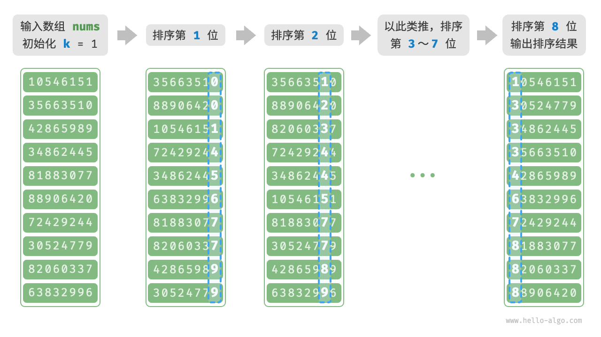

# 基数排序

上一节介绍了计数排序，它适用于数据量 n 较大但数据范围 m 较小的情况。
假设我们需要对 n = 10^6 个学号进行排序，而学号是一个 8$位数字，这意味着数据范围 $m = 10^8$ 非常大，
使用计数排序需要分配大量内存空间，而基数排序可以避免这种情况。

<u>基数排序（radix sort）</u>的核心思想与计数排序一致，也通过统计个数来实现排序。
在此基础上，基数排序利用数字各位之间的递进关系，依次对每一位进行排序，从而得到最终的排序结果。

## 算法流程

以学号数据为例，假设数字的最低位是第 1 位，最高位是第 8 位，基数排序的流程如下图所示。

1. 初始化位数 k = 1 。
2. 对学号的第 k 位执行“计数排序”。完成后，数据会根据第 k 位从小到大排序。
3. 将 k 增加 1 ，然后返回步骤 `2.` 继续迭代，直到所有位都排序完成后结束。



下面剖析代码实现。对于一个 d 进制的数字 x ，要获取其第 k 位 x_k ，可以使用以下计算公式：

```text
x(k) = floor(x/d^(k-1)) mod d
```

其中 floor(a) 表示对浮点数 a 向下取整，而 mod d 表示对 d 取模（取余）。
对于学号数据，d = 10 且 k in [1, 8]。

此外，我们需要小幅改动计数排序代码，使之可以根据数字的第 k 位进行排序：

```src
/* 获取元素 num 的第 k 位，其中 exp = 10^(k-1) */
int digit(int num, int exp) {
    // 传入 exp 而非 k 可以避免在此重复执行昂贵的次方计算
    return (num / exp) % 10;
}

/* 计数排序（根据 nums 第 k 位排序） */
void countingSortDigit(int[] nums, int exp) {
    // 十进制的位范围为 0~9 ，因此需要长度为 10 的桶数组
    int[] counter = new int[10];
    int n = nums.length;
    // 统计 0~9 各数字的出现次数
    for (int i = 0; i < n; i++) {
        int d = digit(nums[i], exp); // 获取 nums[i] 第 k 位，记为 d
        counter[d]++;                // 统计数字 d 的出现次数
    }
    // 求前缀和，将“出现个数”转换为“数组索引”
    for (int i = 1; i < 10; i++) {
        counter[i] += counter[i - 1];
    }
    // 倒序遍历，根据桶内统计结果，将各元素填入 res
    int[] res = new int[n];
    for (int i = n - 1; i >= 0; i--) {
        int d = digit(nums[i], exp);
        int j = counter[d] - 1; // 获取 d 在数组中的索引 j
        res[j] = nums[i];       // 将当前元素填入索引 j
        counter[d]--;           // 将 d 的数量减 1
    }
    // 使用结果覆盖原数组 nums
    for (int i = 0; i < n; i++)
        nums[i] = res[i];
}

/* 基数排序 */
void radixSort(int[] nums) {
    // 获取数组的最大元素，用于判断最大位数
    int m = Integer.MIN_VALUE;
    for (int num : nums)
        if (num > m)
            m = num;
    // 按照从低位到高位的顺序遍历
    for (int exp = 1; exp <= m; exp *= 10) {
        // 对数组元素的第 k 位执行计数排序
        // k = 1 -> exp = 1
        // k = 2 -> exp = 10
        // 即 exp = 10^(k-1)
        countingSortDigit(nums, exp);
    }
}
```

```text
question "为什么从最低位开始排序？"

在连续的排序轮次中，后一轮排序会覆盖前一轮排序的结果。举例来说，如果第一轮排序结果 a < b ，
而第二轮排序结果 a > b ，那么第二轮的结果将取代第一轮的结果。
由于数字的高位优先级高于低位，因此应该先排序低位再排序高位。
```

## 算法特性

相较于计数排序，基数排序适用于数值范围较大的情况，**但前提是数据必须可以表示为固定位数的格式，且位数不能过大**。
例如，浮点数不适合使用基数排序，因为其位数 k 过大，可能导致时间复杂度 O(nk) 远远大于 O(n^2) 。

- **时间复杂度为 O(nk)、非自适应排序**：
  设数据量为 n、数据为 d 进制、最大位数为 k ，则对某一位执行计数排序使用 O(n + d) 时间，
  排序所有 k 位使用 O((n + d)k) 时间。通常情况下，d 和 k 都相对较小，时间复杂度趋向 O(n) 。
- **空间复杂度为 $O(n + d)$、非原地排序**：
  与计数排序相同，基数排序需要借助长度为 $n$ 和 $d$ 的数组 `res` 和 `counter` 。
- **稳定排序**：
  当计数排序稳定时，基数排序也稳定；当计数排序不稳定时，基数排序无法保证得到正确的排序结果。

