# 汉诺塔问题

在归并排序和构建二叉树中，我们都是将原问题分解为两个规模为原问题一半的子问题。然而对于汉诺塔问题，我们采用不同的分解策略。

```text
给定三根柱子，记为`A`、`B`和`C`。
起始状态下，柱子`A`上套着n个圆盘，它们从上到下按照从小到大的顺序排列。
我们的任务是要把这n个圆盘移到柱子`C`上，并保持它们的原有顺序不变（如下图所示）。在移动圆盘的过程中，需要遵守以下规则。

1. 圆盘只能从一根柱子顶部拿出，从另一根柱子顶部放入。
2. 每次只能移动一个圆盘。
3. 小圆盘必须时刻位于大圆盘之上。
```

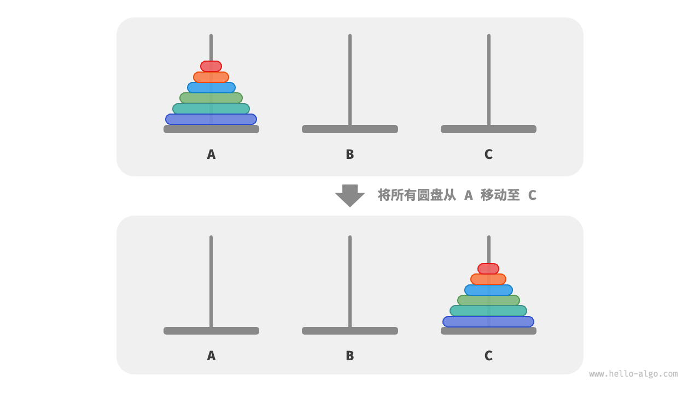

**我们将规模为i的汉诺塔问题记作f(i)** 。例如f(3)代表将3个圆盘从`A`移动至`C`的汉诺塔问题。

### 考虑基本情况

如下图所示，对于问题f(1)，即当只有一个圆盘时，我们将它直接从`A`移动至`C`即可。

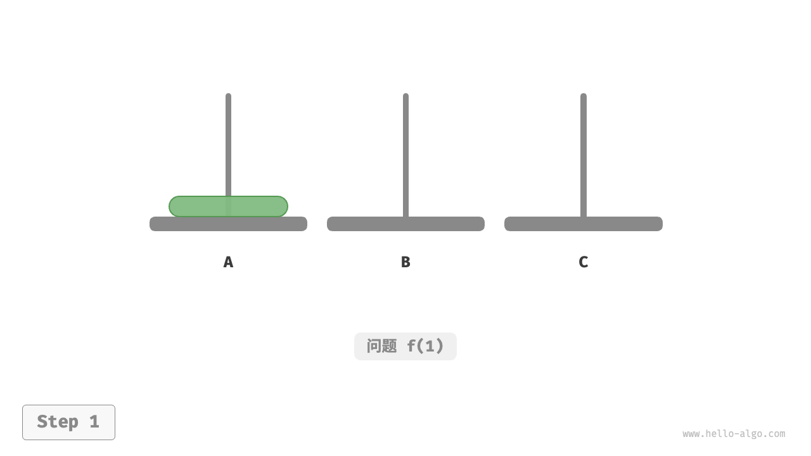

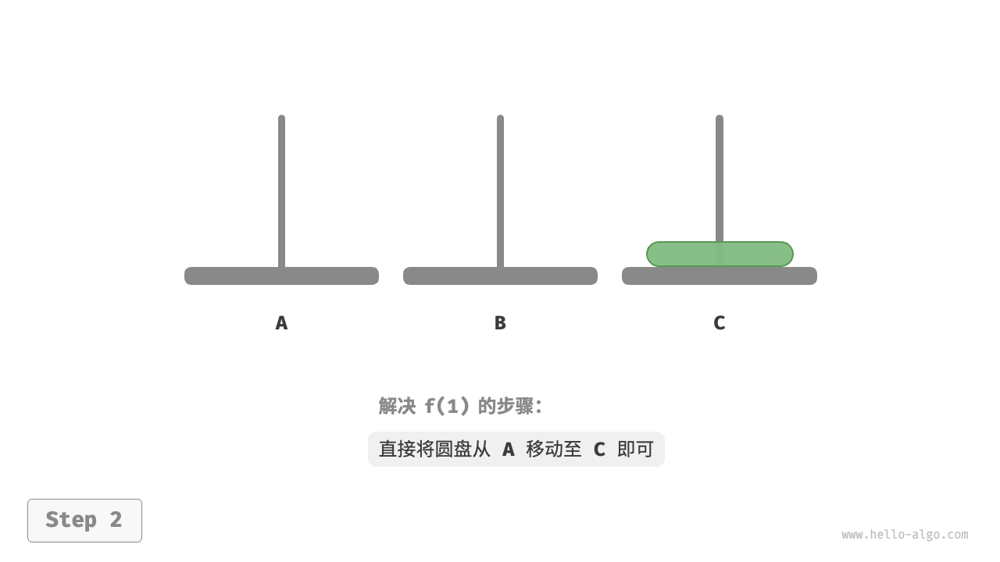

如下图所示，对于问题f(2)，即当有两个圆盘时，**由于要时刻满足小圆盘在大圆盘之上，因此需要借助`B`来完成移动**。

1. 先将上面的小圆盘从`A`移至`B`。
2. 再将大圆盘从`A`移至`C`。
3. 最后将小圆盘从`B`移至`C`。

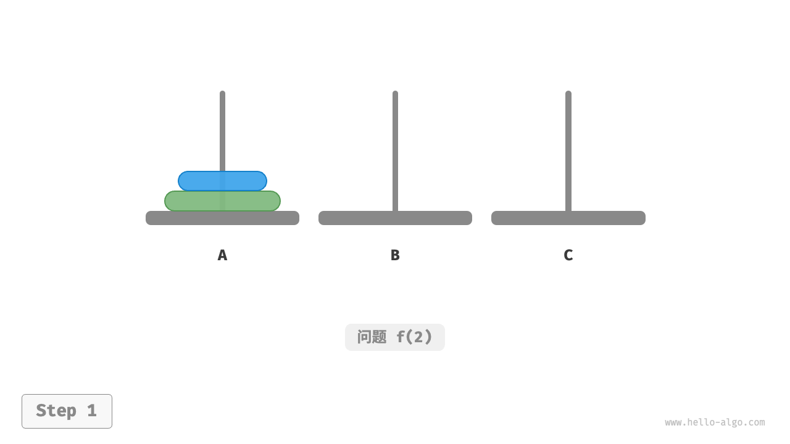

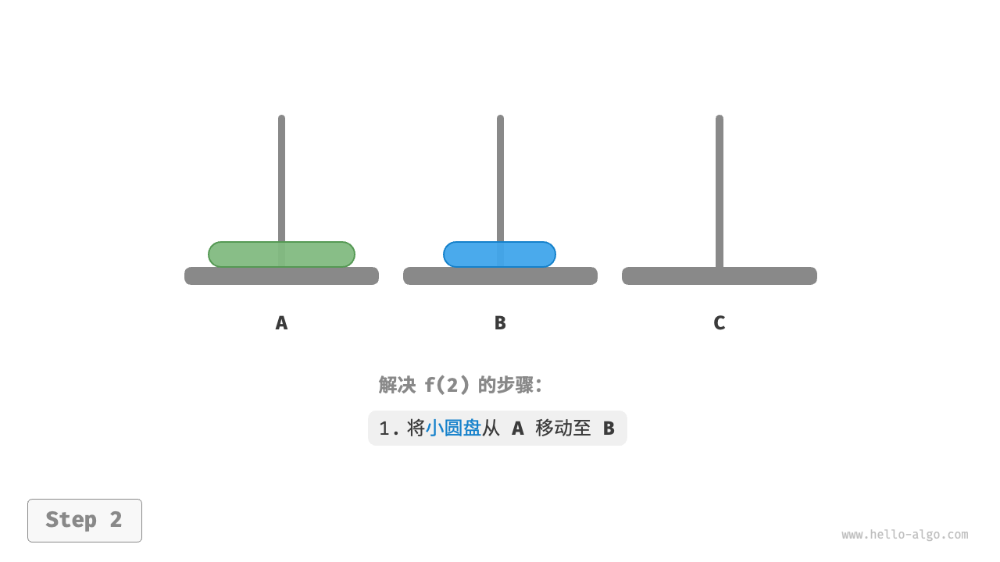

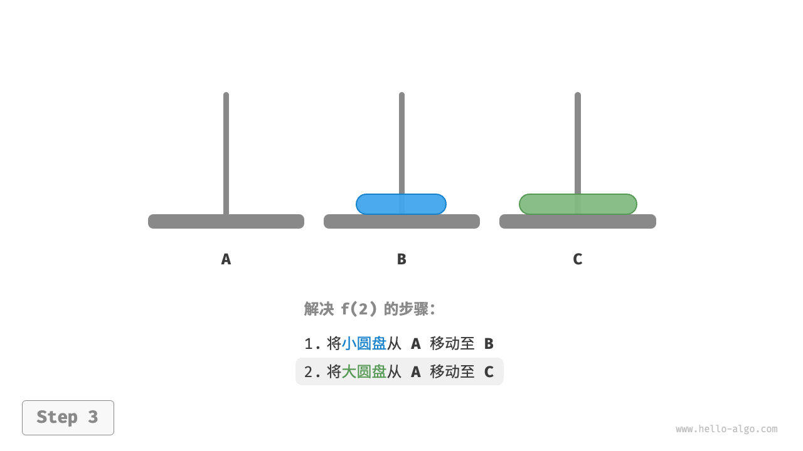

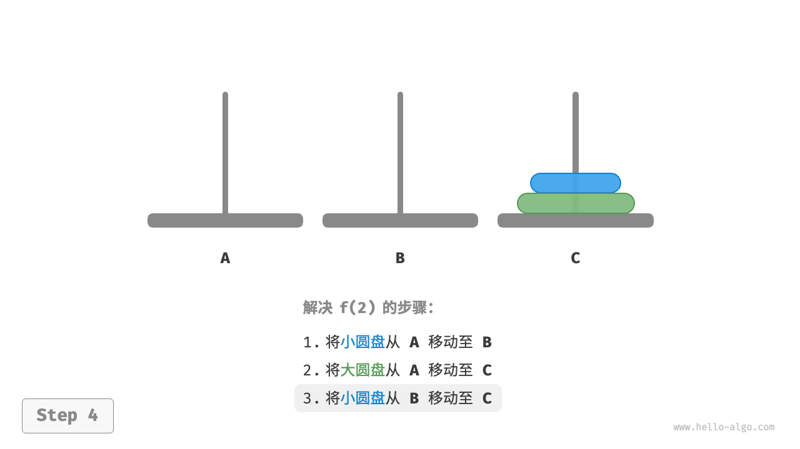

解决问题f(2)的过程可总结为：**将两个圆盘借助`B`从`A`移至`C`** 。其中，`C`称为目标柱、`B`称为缓冲柱。

### 子问题分解

对于问题 f(3)，即当有三个圆盘时，情况变得稍微复杂了一些。

因为已知f(1)和f(2)的解，所以我们可从分治角度思考，**将`A`顶部的两个圆盘看作一个整体**，执行下图所示的步骤。
这样三个圆盘就被顺利地从`A`移至 `C`了。

1. 令`B`为目标柱、`C`为缓冲柱，将两个圆盘从`A`移至`B`。
2. 将`A`中剩余的一个圆盘从`A`直接移动至`C`。
3. 令`C`为目标柱、`A`为缓冲柱，将两个圆盘从`B`移至`C`。

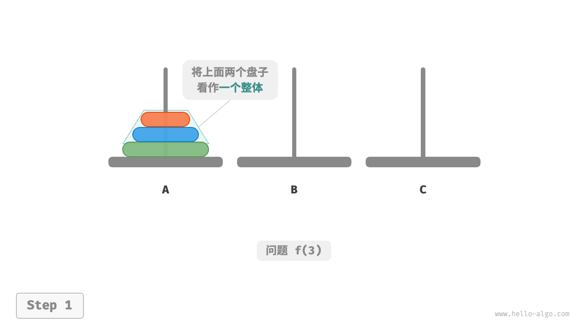

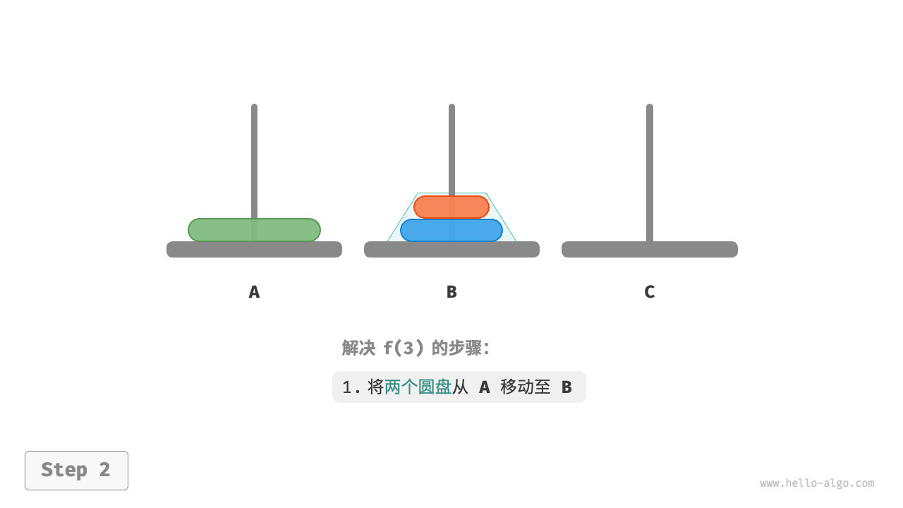

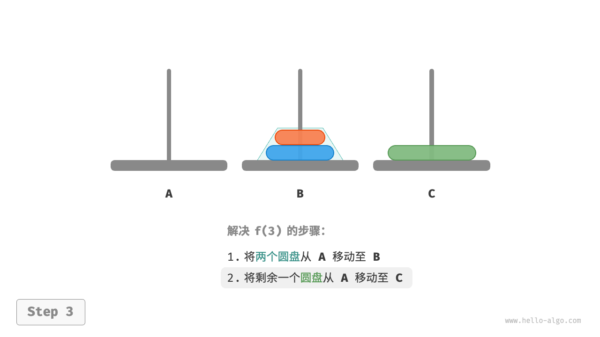

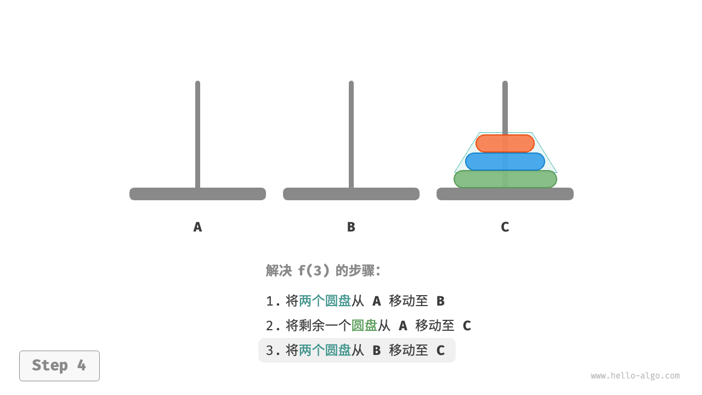

从本质上看，**我们将问题f(3)划分为两个子问题f(2)和一个子问题f(1)** 。
按顺序解决这三个子问题之后，原问题随之得到解决。这说明子问题是独立的，而且解可以合并。

至此，我们可总结出下图所示的解决汉诺塔问题的分治策略：
将原问题f(n)划分为两个子问题f(n-1)和一个子问题f(1)，并按照以下顺序解决这三个子问题。

1. 将n-1个圆盘借助`C`从`A`移至`B`。
2. 将剩余1个圆盘从`A`直接移至`C`。
3. 将n-1个圆盘借助`A`从`B`移至`C`。

对于这两个子问题f(n-1)，**可以通过相同的方式进行递归划分**，直至达到最小子问题f(1)。
而f(1)的解是已知的，只需一次移动操作即可。

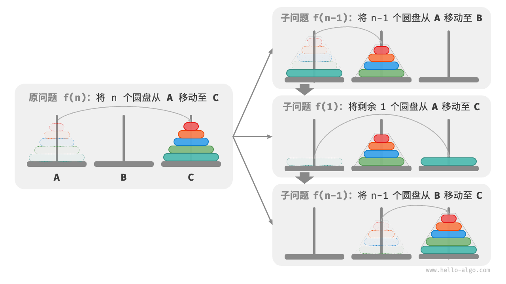

### 代码实现

在代码中，我们声明一个递归函数`dfs(i, src, buf, tar)`，
它的作用是将柱`src`顶部的i个圆盘借助缓冲柱`buf`移动至目标柱`tar`：

```src
/* 移动一个圆盘 */
void move(List<Integer> src, List<Integer> tar) {
    // 从 src 顶部拿出一个圆盘
    Integer pan = src.remove(src.size() - 1);
    // 将圆盘放入 tar 顶部
    tar.add(pan);
}

/* 求解汉诺塔问题 f(i) */
void dfs(int i, List<Integer> src, List<Integer> buf, List<Integer> tar) {
    // 若 src 只剩下一个圆盘，则直接将其移到 tar
    if (i == 1) {
        move(src, tar);
        return;
    }
    // 子问题 f(i-1) ：将 src 顶部 i-1 个圆盘借助 tar 移到 buf
    dfs(i - 1, src, tar, buf);
    // 子问题 f(1) ：将 src 剩余一个圆盘移到 tar
    move(src, tar);
    // 子问题 f(i-1) ：将 buf 顶部 i-1 个圆盘借助 src 移到 tar
    dfs(i - 1, buf, src, tar);
}

/* 求解汉诺塔问题 */
void solveHanota(List<Integer> A, List<Integer> B, List<Integer> C) {
    int n = A.size();
    // 将 A 顶部 n 个圆盘借助 B 移到 C
    dfs(n, A, B, C);
}
```

如下图所示，汉诺塔问题形成一棵高度为n的递归树，每个节点代表一个子问题，对应一个开启的`dfs()`函数，
**因此时间复杂度为O(2^n)，空间复杂度为O(n)**。

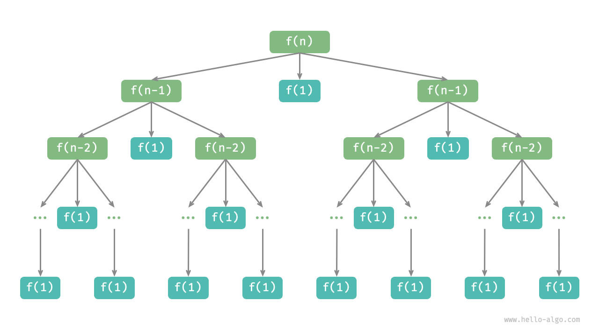

```text
汉诺塔问题源自一个古老的传说。
在古印度的一个寺庙里，僧侣们有三根高大的钻石柱子，以及64个大小不一的金圆盘。
僧侣们不断地移动圆盘，他们相信在最后一个圆盘被正确放置的那一刻，这个世界就会结束。

然而，即使僧侣们每秒钟移动一次，总共需要大约 2^64 &asymp; 1.84×10^19 秒，合约 5850 亿年，远远超过了现在对宇宙年龄的估计。
所以，倘若这个传说是真的，我们应该不需要担心世界末日的到来。
```