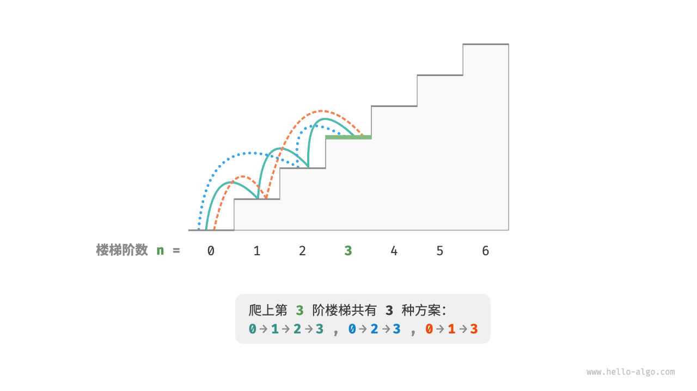
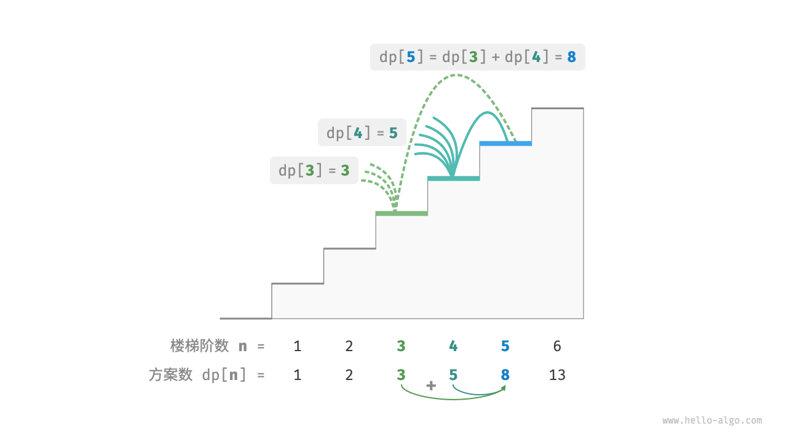
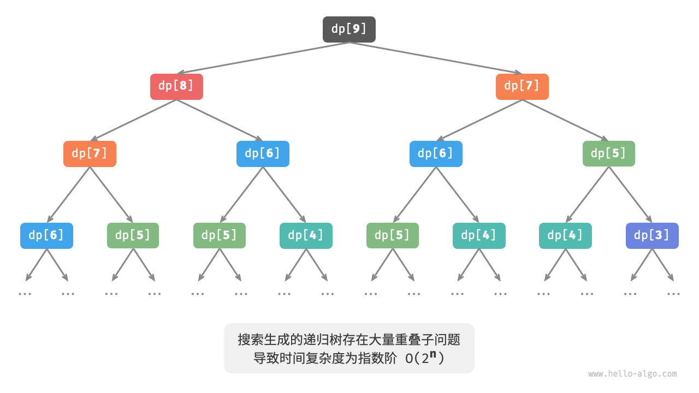
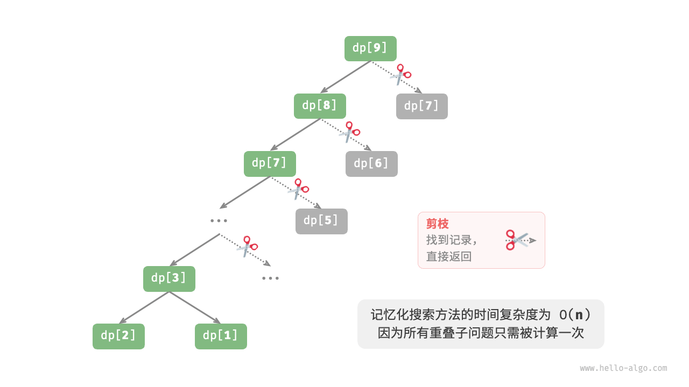
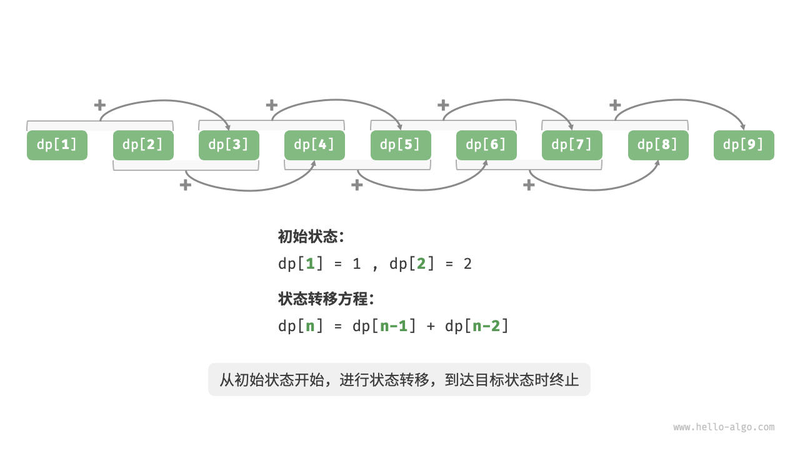

# 初探动态规划

<u>动态规划（dynamic programming）</u>是一个重要的算法范式，
它将一个【问题】分解为一系列【更小的子问题】，并通过存储【子问题的解】来避免重复计算，从而大幅提升时间效率。

在本节中，我们从一个经典例题入手，先给出它的暴力回溯解法，观察其中包含的重叠子问题，再逐步导出更高效的动态规划解法。

```text
问题："爬楼梯"
给定一个共有n阶的楼梯，你每步可以上1阶或者2阶，请问有多少种方案可以爬到楼顶？
```

如下图所示，对于一个3阶楼梯，共有3种方案可以爬到楼顶。



本题的目标是求解方案数量，**我们可以考虑通过回溯来穷举所有可能性**。
具体来说，将爬楼梯想象为一个多轮选择的过程：
从地面出发，每轮选择上1阶或2阶，每当到达楼梯顶部时就将方案数量加1，当越过楼梯顶部时就将其剪枝。
代码如下所示：

```text
/* 回溯 */
void backtrack(List<Integer> choices, int state, int n, List<Integer> res) {
    // 当爬到第 n 阶时，方案数量加 1
    if (state == n)
        res.set(0, res.get(0) + 1);
    // 遍历所有选择
    for (Integer choice : choices) {
        // 剪枝：不允许越过第 n 阶
        if (state + choice > n)
            continue;
        // 尝试：做出选择，更新状态
        backtrack(choices, state + choice, n, res);
        // 回退
    }
}

/* 爬楼梯：回溯 */
int climbingStairsBacktrack(int n) {
    List<Integer> choices = Arrays.asList(1, 2); // 可选择向上爬 1 阶或 2 阶
    int state = 0; // 从第 0 阶开始爬
    List<Integer> res = new ArrayList<>();
    res.add(0); // 使用 res[0] 记录方案数量
    backtrack(choices, state, n, res);
    return res.get(0);
}
```

## 方法一：暴力搜索

回溯算法通常并不显式地对问题进行拆解，而是将求解问题看作一系列决策步骤，通过试探和剪枝，搜索所有可能的解。

我们可以尝试从问题分解的角度分析这道题。
设爬到第i阶共有dp[i]种方案，那么dp[i]就是原问题，其子问题包括：

```text
dp[i-1], dp[i-2], ..., dp[2], dp[1]
```

由于每轮只能上1阶或2阶，因此当我们站在第i阶楼梯上时，上一轮只可能站在第i - 1阶或第i - 2阶上。
换句话说，我们只能从第i -1阶或第i - 2阶迈向第i阶。

由此便可得出一个重要推论：
**爬到第i - 1阶的方案数加上爬到第i - 2阶的方案数就等于爬到第i阶的方案数**。公式如下：

```text
dp[i] = dp[i-1] + dp[i-2]
```

这意味着在爬楼梯问题中，各个子问题之间存在递推关系，**原问题的解可以由子问题的解构建得来**。下图展示了该递推关系。



我们可以根据递推公式得到暴力搜索解法。
以dp[n]为起始点，**递归地将一个较大问题拆解为两个较小问题的和**，直至到达最小子问题dp[1]和dp[2]时返回。
其中，最小子问题的解是已知的，即dp[1] = 1、dp[2] = 2，表示爬到第1、2阶分别有1、2种方案。

观察以下代码，它和标准回溯代码都属于深度优先搜索，但更加简洁：

```text
/* 搜索 */
int dfs(int i) {
    // 已知 dp[1] 和 dp[2] ，返回之
    if (i == 1 || i == 2)
        return i;
    // dp[i] = dp[i-1] + dp[i-2]
    int count = dfs(i - 1) + dfs(i - 2);
    return count;
}

/* 爬楼梯：搜索 */
int climbingStairsDFS(int n) {
    return dfs(n);
}
```

下图展示了暴力搜索形成的递归树。
对于问题dp[n]，其递归树的深度为n，时间复杂度为O(2^n)。
指数阶属于爆炸式增长，如果我们输入一个比较大的n，则会陷入漫长的等待之中。



观察上图，**指数阶的时间复杂度是“重叠子问题”导致的**。
例如dp[9]被分解为dp[8]和dp[7]，dp[8]被分解为dp[7]和dp[6]，两者都包含子问题dp[7]。

以此类推，子问题中包含更小的【重叠子问题】，子子孙孙无穷尽也。绝大部分计算资源都浪费在这些重叠的子问题上。

## 方法二：记忆化搜索

为了提升算法效率，**我们希望所有的重叠子问题都只被计算一次**。
为此，我们声明一个数组`mem`来记录每个子问题的解，并在搜索过程中将【重叠子问题】剪枝。

1. 当首次计算dp[i]时，我们将其记录至`mem[i]`，以便之后使用。
2. 当再次需要计算dp[i]时，我们便可直接从`mem[i]`中获取结果，从而避免重复计算该子问题。

代码如下所示：

```src
/* 记忆化搜索 */
int dfs(int i, int[] mem) {
    // 已知 dp[1] 和 dp[2] ，返回之
    if (i == 1 || i == 2)
        return i;
    // 若存在记录 dp[i] ，则直接返回之
    if (mem[i] != -1)
        return mem[i];
    // dp[i] = dp[i-1] + dp[i-2]
    int count = dfs(i - 1, mem) + dfs(i - 2, mem);
    // 记录 dp[i]
    mem[i] = count;
    return count;
}

/* 爬楼梯：记忆化搜索 */
int climbingStairsDFSMem(int n) {
    // mem[i] 记录爬到第 i 阶的方案总数，-1 代表无记录
    int[] mem = new int[n + 1];
    Arrays.fill(mem, -1);
    return dfs(n, mem);
}
```

观察下图，**经过记忆化处理后，所有重叠子问题都只需计算一次，时间复杂度优化至O(n)** ，这是一个巨大的飞跃。



## 方法三：动态规划

**记忆化搜索是一种“从顶至底”的方法**：
我们从【原问题（根节点）】开始，递归地将较大子问题分解为【较小子问题】，直至解【已知的最小子问题（叶节点）】。
之后，通过【回溯】逐层【收集】【子问题的解】，【构建】出【原问题的解】。

与之相反，**动态规划是一种“从底至顶”的方法**：
从最小子问题的解开始，迭代地构建更大子问题的解，直至得到原问题的解。

由于【动态规划不包含回溯过程】，因此只需使用【循环迭代实现】，无须使用递归。
在以下代码中，我们初始化一个数组`dp`来存储子问题的解，它起到了与记忆化搜索中数组`mem`相同的记录作用：

```text
/* 爬楼梯：动态规划 */
int climbingStairsDP(int n) {
    if (n == 1 || n == 2)
        return n;
    // 初始化 dp 表，用于存储子问题的解
    int[] dp = new int[n + 1];
    // 初始状态：预设最小子问题的解
    dp[1] = 1;
    dp[2] = 2;
    // 状态转移：从较小子问题逐步求解较大子问题
    for (int i = 3; i <= n; i++) {
        dp[i] = dp[i - 1] + dp[i - 2];
    }
    return dp[n];
}
```

下图模拟了以上代码的执行过程。



与回溯算法一样，动态规划也使用“状态”概念来表示问题求解的特定阶段，每个状态都对应一个子问题以及相应的局部最优解。
例如，爬楼梯问题的状态定义为当前所在楼梯阶数i。

根据以上内容，我们可以总结出动态规划的常用术语。

- 将数组`dp`称为 <u>dp表</u>，dp[i]表示状态i对应子问题的解。
- 将最小子问题对应的状态（第1阶和第2阶楼梯）称为<u>初始状态</u>。
- 将递推公式dp[i] = dp[i-1] + dp[i-2]称为<u>状态转移方程</u>。

## 空间优化

细心的读者可能发现了，**由于dp[i]只与dp[i-1]和dp[i-2]有关，因此我们无须使用一个数组`dp`来存储所有子问题的解**，
而只需两个变量滚动前进即可。代码如下所示：

```text
/* 爬楼梯：空间优化后的动态规划 */
int climbingStairsDPComp(int n) {
    if (n == 1 || n == 2)
        return n;
    int a = 1, b = 2;
    for (int i = 3; i <= n; i++) {
        int tmp = b;
        b = a + b;
        a = tmp;
    }
    return b;
}
```

观察以上代码，由于省去了数组`dp`占用的空间，因此空间复杂度从O(n)降至O(1)。

在动态规划问题中，当前状态往往仅与前面有限个状态有关，这时我们可以只保留必要的状态，通过“降维”来节省内存空间。
**这种空间优化技巧被称为“滚动变量”或“滚动数组”**。