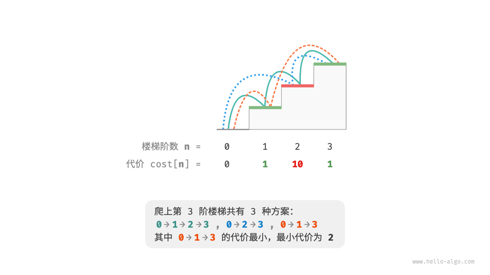
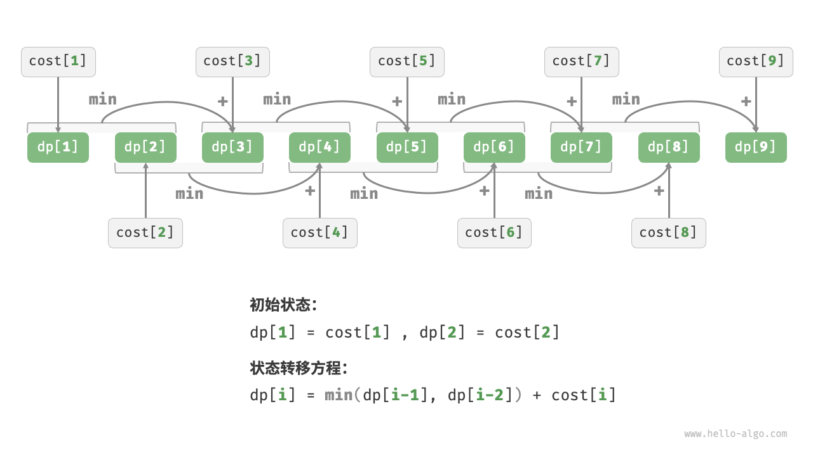
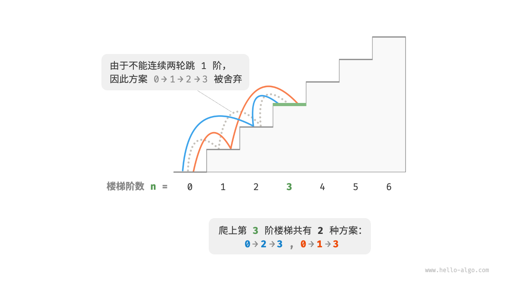
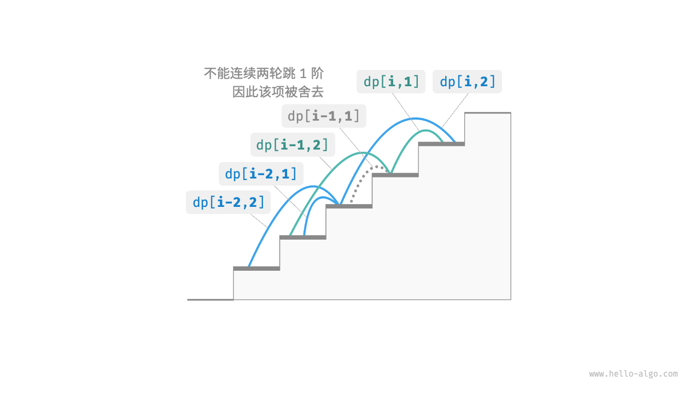

# 动态规划问题特性

在上一节中，我们学习了动态规划是如何通过子问题分解来求解原问题的。
实际上，子问题分解是一种通用的算法思路，在分治、动态规划、回溯中的侧重点不同。

- 分治算法递归地将原问题划分为多个相互独立的子问题，直至最小子问题，并在回溯中合并子问题的解，最终得到原问题的解。
- 动态规划也对问题进行递归分解，
  但与分治算法的主要区别是，动态规划中的子问题是相互依赖的，在分解过程中会出现许多重叠子问题。
- 回溯算法在尝试和回退中穷举所有可能的解，并通过剪枝避免不必要的搜索分支。
  原问题的解由一系列决策步骤构成，我们可以将每个决策步骤之前的子序列看作一个子问题。

实际上，动态规划常用来求解最优化问题，它们不仅包含重叠子问题，还具有另外两大特性：最优子结构、无后效性。

## 最优子结构

我们对爬楼梯问题稍作改动，使之更加适合展示最优子结构概念。

```text
问题："爬楼梯最小代价"
给定一个楼梯，你每步可以上1阶或者2阶，每一阶楼梯上都贴有一个非负整数，表示你在该台阶所需要付出的代价。
给定一个非负整数数组cost，其中cost[i]表示在第i个台阶需要付出的代价，cost[0]为地面（起始点）。
请计算最少需要付出多少代价才能到达顶部？
```

如下图所示，若第1、2、3阶的代价分别为1、10、1，则从地面爬到第3阶的最小代价为2。



设dp[i]为爬到第i阶累计付出的代价，由于第i阶只可能从i - 1阶或i - 2阶走来，
因此dp[i]只可能等于dp[i - 1] + cost[i]或dp[i - 2] + cost[i]。
为了尽可能减少代价，我们应该选择两者中较小的那一个：

```text
dp[i] = min(dp[i-1], dp[i-2]) + cost[i]
```

这便可以引出最优子结构的含义：**原问题的最优解是从子问题的最优解构建得来的**。

本题显然具有最优子结构：
我们从两个子问题最优解dp[i-1]和dp[i-2]中挑选出较优的那一个，并用它构建出原问题dp[i]的最优解。

那么，上一节的爬楼梯题目有没有最优子结构呢？
它的目标是求解方案数量，看似是一个计数问题，但如果换一种问法：“求解最大方案数量”。
我们意外地发现，**虽然题目修改前后是等价的，但最优子结构浮现出来了**：
第n阶最大方案数量等于第n-1阶和第n-2阶最大方案数量之和。
所以说，最优子结构的解释方式比较灵活，在不同问题中会有不同的含义。

根据状态转移方程，以及初始状态dp[1] = cost[1]和dp[2] = cost[2]，我们就可以得到动态规划代码：

```text
/* 爬楼梯最小代价：动态规划 */
int minCostClimbingStairsDP(int[] cost) {
    int n = cost.length - 1;
    if (n == 1 || n == 2)
        return cost[n];
    // 初始化 dp 表，用于存储子问题的解
    int[] dp = new int[n + 1];
    // 初始状态：预设最小子问题的解
    dp[1] = cost[1];
    dp[2] = cost[2];
    // 状态转移：从较小子问题逐步求解较大子问题
    for (int i = 3; i <= n; i++) {
        dp[i] = Math.min(dp[i - 1], dp[i - 2]) + cost[i];
    }
    return dp[n];
}
```

下图展示了以上代码的动态规划过程。



本题也可以进行空间优化，将一维压缩至零维，使得空间复杂度从O(n)降至O(1)：

```src
/* 爬楼梯最小代价：空间优化后的动态规划 */
int minCostClimbingStairsDPComp(int[] cost) {
    int n = cost.length - 1;
    if (n == 1 || n == 2)
        return cost[n];
    int a = cost[1], b = cost[2];
    for (int i = 3; i <= n; i++) {
        int tmp = b;
        b = Math.min(a, tmp) + cost[i];
        a = tmp;
    }
    return b;
}
```

## 无后效性

无后效性是动态规划能够有效解决问题的重要特性之一，其定义为：
**给定一个确定的状态，它的未来发展只与当前状态有关，而与过去经历的所有状态无关**。

以爬楼梯问题为例，给定状态i，它会发展出状态i+1和状态i+2，分别对应跳1步和跳2步。
在做出这两种选择时，我们无须考虑状态i之前的状态，它们对状态i的未来没有影响。

然而，如果我们给爬楼梯问题添加一个约束，情况就不一样了。

```text
问题："带约束爬楼梯"
给定一个共有n阶的楼梯，你每步可以上1阶或者2阶，**但不能连续两轮跳1阶**，
请问有多少种方案可以爬到楼顶？
```

如下图所示，爬上第3阶仅剩2种可行方案，其中连续三次跳1阶的方案不满足约束条件，因此被舍弃。



在该问题中，如果上一轮是跳1阶上来的，那么下一轮就必须跳2阶。
这意味着，**下一步选择不能由当前状态（当前所在楼梯阶数）独立决定，还和前一个状态（上一轮所在楼梯阶数）有关**。

不难发现，此问题已不满足无后效性，状态转移方程dp[i] = dp[i-1] + dp[i-2]也失效了，
因为dp[i-1]代表本轮跳1阶，但其中包含了许多“上一轮是跳1阶上来的”方案，
而为了满足约束，我们就不能将dp[i-1]直接计入dp[i]中。

为此，我们需要扩展状态定义：**状态[i, j]表示处在第i阶并且上一轮跳了j阶**，其中j in {1, 2}。
此状态定义有效地区分了上一轮跳了1阶还是2阶，我们可以据此判断当前状态是从何而来的。

- 当上一轮跳了1阶时，上上一轮只能选择跳2阶，即dp[i, 1]只能从dp[i-1, 2]转移过来。
- 当上一轮跳了2阶时，上上一轮可选择跳1阶或跳2阶，即dp[i, 2]可以从dp[i-2, 1]或dp[i-2, 2]转移过来。

如下图所示，在该定义下，dp[i, j]表示状态[i, j]对应的方案数。此时状态转移方程为：

```text
dp[i, 1] = dp[i-1, 2] 
dp[i, 2] = dp[i-2, 1] + dp[i-2, 2]
```



最终，返回dp[n, 1] + dp[n, 2]即可，两者之和代表爬到第n阶的方案总数：

```src
/* 带约束爬楼梯：动态规划 */
int climbingStairsConstraintDP(int n) {
    if (n == 1 || n == 2) {
        return 1;
    }
    // 初始化 dp 表，用于存储子问题的解
    int[][] dp = new int[n + 1][3];
    // 初始状态：预设最小子问题的解
    dp[1][1] = 1;
    dp[1][2] = 0;
    dp[2][1] = 0;
    dp[2][2] = 1;
    // 状态转移：从较小子问题逐步求解较大子问题
    for (int i = 3; i <= n; i++) {
        dp[i][1] = dp[i - 1][2];
        dp[i][2] = dp[i - 2][1] + dp[i - 2][2];
    }
    return dp[n][1] + dp[n][2];
}
```

在上面的案例中，由于仅需多考虑前面一个状态，因此我们仍然可以通过扩展状态定义，使得问题重新满足无后效性。
然而，某些问题具有非常严重的“有后效性”。

```text
问题："爬楼梯与障碍生成"
给定一个共有n阶的楼梯，你每步可以上1阶或者2阶。
**规定当爬到第i阶时，系统自动会在第2i阶上放上障碍物，之后所有轮都不允许跳到第2i阶上**。
例如，前两轮分别跳到了第2、3阶上，则之后就不能跳到第4、6阶上。
请问有多少种方案可以爬到楼顶？
```

在这个问题中，下次跳跃依赖过去所有的状态，因为每一次跳跃都会在更高的阶梯上设置障碍，并影响未来的跳跃。
对于这类问题，动态规划往往难以解决。

实际上，许多复杂的组合优化问题（例如旅行商问题）不满足无后效性。
对于这类问题，我们通常会选择使用其他方法，例如启发式搜索、遗传算法、强化学习等，从而在有限时间内得到可用的局部最优解。