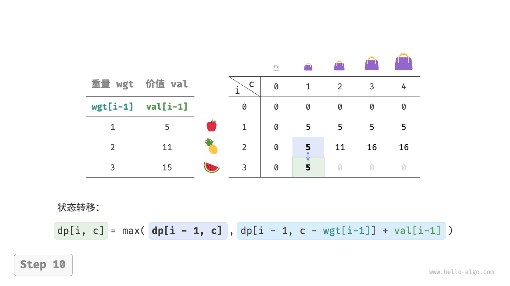
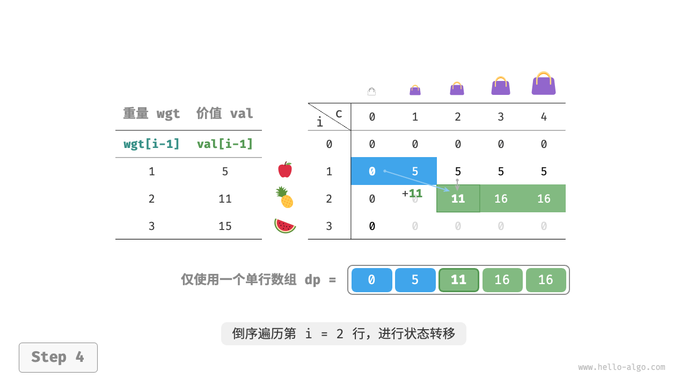

# 0-1 背包问题

背包问题是一个非常好的动态规划入门题目，是动态规划中最常见的问题形式。
其具有很多变种，例如 0-1 背包问题、完全背包问题、多重背包问题等。

在本节中，我们先来求解最常见的 0-1 背包问题。

```text
问题：
给定n个物品，第i个物品的重量为wgt[i-1]、价值为val[i-1]，和一个容量为cap的背包。
每个物品只能选择一次，问在限定背包容量下能放入物品的最大价值。
```

观察下图，由于物品编号i从1开始计数，数组索引从0开始计数，因此物品i对应重量wgt[i-1]和价值val[i-1]。


我们可以将 0-1 背包问题看作一个由n轮决策组成的过程，对于每个物体都有不放入和放入两种决策，因此该问题满足决策树模型。

该问题的目标是求解“在限定背包容量下能放入物品的最大价值”，因此较大概率是一个动态规划问题。

**第一步：思考每轮的决策，定义状态，从而得到dp表**

对于每个物品来说，不放入背包，背包容量不变；放入背包，背包容量减小。
由此可得状态定义：当前物品编号i和剩余背包容量c，记为[i, c]。

状态[i, c]对应的子问题为：**前i个物品在剩余容量为c的背包中的最大价值**，记为dp[i, c]。

待求解的是dp[n, cap]，因此需要一个尺寸为(n+1) * (cap+1)的二维dp表。

**第二步：找出最优子结构，进而推导出状态转移方程**

当我们做出物品i的决策后，剩余的是前i-1个物品的决策，可分为以下两种情况。

- **不放入物品i** ：背包容量不变，状态变化为[i-1, c]。
- **放入物品i** ：背包容量减少wgt[i-1]，价值增加val[i-1]，状态变化为[i-1, c-wgt[i-1]]。

上述分析向我们揭示了本题的最优子结构：
**最大价值dp[i, c]等于不放入物品i和放入物品i两种方案中价值更大的那一个**。
由此可推导出状态转移方程：

```text
dp[i, c] = max(dp[i-1, c], dp[i-1, c - wgt[i-1]] + val[i-1])
```

需要注意的是，若当前物品重量wgt[i - 1]超出剩余背包容量c，则只能选择不放入背包。

**第三步：确定边界条件和状态转移顺序**

当无物品或无剩余背包容量时最大价值为0，即首列dp[i, 0]和首行dp[0, c]都等于0。

当前状态[i, c]从上方的状态[i-1, c]和左上方的状态[i-1, c-wgt[i-1]]转移而来，
因此通过两层循环正序遍历整个dp表即可。

根据以上分析，我们接下来按顺序实现暴力搜索、记忆化搜索、动态规划解法。

### 方法一：暴力搜索

搜索代码包含以下要素。

- **递归参数**：状态[i, c]。
- **返回值**：子问题的解dp[i, c]。
- **终止条件**：当物品编号越界i = 0或背包剩余容量为0时，终止递归并返回价值0。
- **剪枝**：若当前物品重量超出背包剩余容量，则只能选择不放入背包。

```text
/* 0-1 背包：暴力搜索 */
int knapsackDFS(int[] wgt, int[] val, int i, int c) {
    // 若已选完所有物品或背包无剩余容量，则返回价值 0
    if (i == 0 || c == 0) {
        return 0;
    }
    // 若超过背包容量，则只能选择不放入背包
    if (c - wgt[i - 1] < 0) {
        return knapsackDFS(wgt, val, i - 1, c);
    }
    // 计算不放入和放入物品 i 的最大价值
    int no = knapsackDFS(wgt, val, i - 1, c);
    int yes = knapsackDFS(wgt, val, i - 1, c - wgt[i - 1]) + val[i - 1];
    // 返回两种方案中价值更大的那一个
    return Math.max(no, yes);
}
```

如下图所示，由于每个物品都会产生不选和选两条搜索分支，因此时间复杂度为O(2^n)。

观察递归树，容易发现其中存在重叠子问题，例如dp[1, 10]等。
而当物品较多、背包容量较大，尤其是相同重量的物品较多时，重叠子问题的数量将会大幅增多。


### 方法二：记忆化搜索

为了保证重叠子问题只被计算一次，我们借助记忆列表`mem`来记录子问题的解，其中`mem[i][c]`对应dp[i, c]。

引入记忆化之后，**时间复杂度取决于子问题数量**，也就是O(n * cap)。实现代码如下：

```text
/* 0-1 背包：记忆化搜索 */
int knapsackDFSMem(int[] wgt, int[] val, int[][] mem, int i, int c) {
    // 若已选完所有物品或背包无剩余容量，则返回价值 0
    if (i == 0 || c == 0) {
        return 0;
    }
    // 若已有记录，则直接返回
    if (mem[i][c] != -1) {
        return mem[i][c];
    }
    // 若超过背包容量，则只能选择不放入背包
    if (wgt[i - 1] > c) {
        return knapsackDFSMem(wgt, val, mem, i - 1, c);
    }
    // 计算不放入和放入物品 i 的最大价值
    int no = knapsackDFSMem(wgt, val, mem, i - 1, c);
    int yes = knapsackDFSMem(wgt, val, mem, i - 1, c - wgt[i - 1]) + val[i - 1];
    // 记录并返回两种方案中价值更大的那一个
    mem[i][c] = Math.max(no, yes);
    return mem[i][c];
}
```

下图展示了在记忆化搜索中被剪掉的搜索分支。


### 方法三：动态规划

动态规划实质上就是在【状态转移】中填充【dp表】的过程，代码如下所示：

```text
/* 0-1 背包：动态规划 */
int knapsackDP(int[] wgt, int[] val, int cap) {
    int n = wgt.length;
    // 初始化 dp 表
    int[][] dp = new int[n + 1][cap + 1];
    // 状态转移
    for (int i = 1; i <= n; i++) {
        for (int c = 1; c <= cap; c++) {
            if (wgt[i - 1] > c) {
                // 若超过背包容量，则不选物品 i
                dp[i][c] = dp[i - 1][c];
            } else {
                // 不选和选物品 i 这两种方案的较大值
                dp[i][c] = Math.max(dp[i - 1][c], dp[i - 1][c - wgt[i - 1]] + val[i - 1]);
            }
        }
    }
    return dp[n][cap];
}
```

如下图所示，时间复杂度和空间复杂度都由数组`dp`大小决定，即O(n * cap)。





### 空间优化

由于每个状态都只与其上一行的状态有关，因此我们可以使用两个数组滚动前进，将空间复杂度从O(n^2)降至O(n)。

进一步思考，我们能否仅用一个数组实现空间优化呢？
观察可知，每个状态都是由正上方或左上方的格子转移过来的。
假设只有一个数组，当开始遍历第i行时，该数组存储的仍然是第i-1行的状态。

- 如果采取正序遍历，那么遍历到dp[i, j]时，左上方dp[i-1, 1] ~ dp[i-1, j-1]值可能已经被覆盖，
  此时就无法得到正确的状态转移结果。
- 如果采取倒序遍历，则不会发生覆盖问题，状态转移可以正确进行。

下图展示了在单个数组下从第i = 1行转换至第i = 2行的过程。请思考正序遍历和倒序遍历的区别。





在代码实现中，我们仅需将数组`dp`的第一维i直接删除，并且把内循环更改为倒序遍历即可：

```text
/* 0-1 背包：空间优化后的动态规划 */
int knapsackDPComp(int[] wgt, int[] val, int cap) {
    int n = wgt.length;
    // 初始化 dp 表
    int[] dp = new int[cap + 1];
    // 状态转移
    for (int i = 1; i <= n; i++) {
        // 倒序遍历
        for (int c = cap; c >= 1; c--) {
            if (wgt[i - 1] <= c) {
                // 不选和选物品 i 这两种方案的较大值
                dp[c] = Math.max(dp[c], dp[c - wgt[i - 1]] + val[i - 1]);
            }
        }
    }
    return dp[cap];
}
```