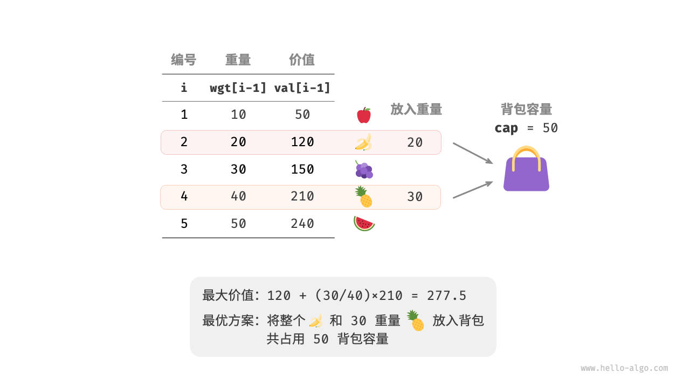
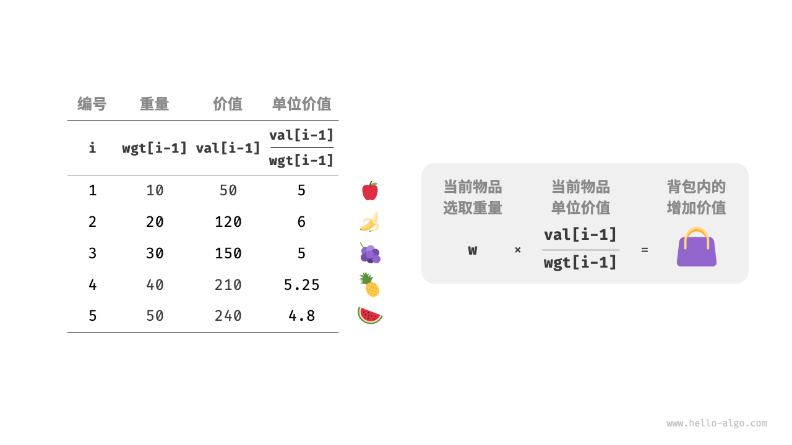
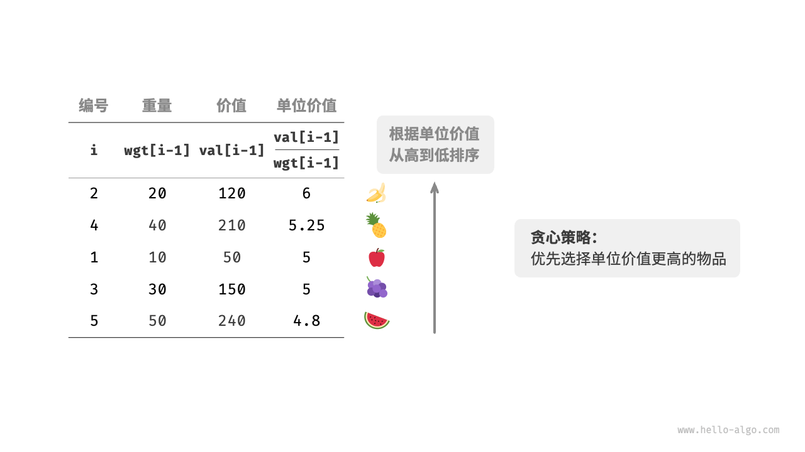
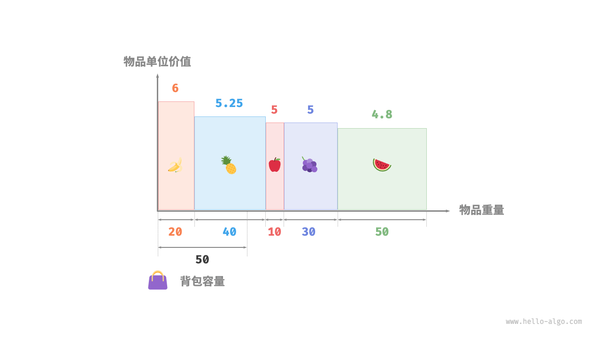

# 分数背包问题

```text
问题：
给定n个物品，第i个物品的重量为wgt[i-1]、价值为val[i-1]，和一个容量为cap的背包。
每个物品只能选择一次，**但可以选择物品的一部分，价值根据选择的重量比例计算**，问在限定背包容量下背包中物品的最大价值。
```

示例如下图所示。



分数背包问题和 0-1 背包问题整体上非常相似，状态包含当前物品i和容量c，目标是求限定背包容量下的最大价值。

不同点在于，本题允许只选择物品的一部分。如下图所示，**我们可以对物品任意地进行切分，并按照重量比例来计算相应价值**。

1. 对于物品i，它在单位重量下的价值为val[i-1] / wgt[i-1]，简称单位价值。
2. 假设放入一部分物品i，重量为w，则背包增加的价值为w * val[i-1] / wgt[i-1]。



### 贪心策略确定

最大化背包内物品总价值，**本质上是最大化单位重量下的物品价值**。由此便可推理出下图所示的贪心策略。

1. 将物品按照单位价值从高到低进行排序。
2. 遍历所有物品，**每轮贪心地选择单位价值最高的物品**。
3. 若剩余背包容量不足，则使用当前物品的一部分填满背包。



### 代码实现

我们建立了一个物品类`Item`，以便将物品按照单位价值进行排序。循环进行贪心选择，当背包已满时跳出并返回解：

```text
/* 物品 */
class Item {
    int w; // 物品重量
    int v; // 物品价值

    public Item(int w, int v) {
        this.w = w;
        this.v = v;
    }
}

/* 分数背包：贪心 */
double fractionalKnapsack(int[] wgt, int[] val, int cap) {
    // 创建物品列表，包含两个属性：重量、价值
    Item[] items = new Item[wgt.length];
    for (int i = 0; i < wgt.length; i++) {
        items[i] = new Item(wgt[i], val[i]);
    }
    // 按照单位价值 item.v / item.w 从高到低进行排序
    Arrays.sort(items, Comparator.comparingDouble(item -> -((double) item.v / item.w)));
    // 循环贪心选择
    double res = 0;
    for (Item item : items) {
        if (item.w <= cap) {
            // 若剩余容量充足，则将当前物品整个装进背包
            res += item.v;
            cap -= item.w;
        } else {
            // 若剩余容量不足，则将当前物品的一部分装进背包
            res += (double) item.v / item.w * cap;
            // 已无剩余容量，因此跳出循环
            break;
        }
    }
    return res;
}
```

除排序之外，在最差情况下，需要遍历整个物品列表，**因此时间复杂度为O(n)** ，其中n为物品数量。

由于初始化了一个`Item`对象列表，**因此空间复杂度为O(n)** 。

### 正确性证明

采用反证法。假设物品x是单位价值最高的物品，使用某算法求得最大价值为`res`，但该解中不包含物品x。

现在从背包中拿出单位重量的任意物品，并替换为单位重量的物品x。
由于物品x的单位价值最高，因此替换后的总价值一定大于`res`。
**这与`res`是最优解矛盾，说明最优解中必须包含物品x** 。

对于该解中的其他物品，我们也可以构建出上述矛盾。
总而言之，**单位价值更大的物品总是更优选择**，这说明贪心策略是有效的。

如下图所示，如果将物品重量和物品单位价值分别看作一张二维图表的横轴和纵轴，
则分数背包问题可转化为“求在有限横轴区间下围成的最大面积”。这个类比可以帮助我们从几何角度理解贪心策略的有效性。



