# 最大容量问题

```text
问题：
输入一个数组ht，其中的每个元素代表一个垂直隔板的高度。数组中的任意两个隔板，以及它们之间的空间可以组成一个容器。

容器的容量等于高度和宽度的乘积（面积），其中高度由较短的隔板决定，宽度是两个隔板的数组索引之差。

请在数组中选择两个隔板，使得组成的容器的容量最大，返回最大容量。
```

示例如下图所示。

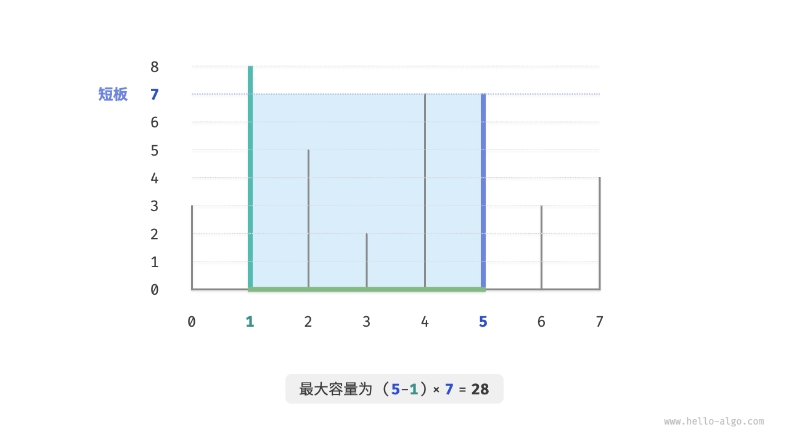

容器由任意两个隔板围成，**因此本题的状态为两个隔板的索引，记为[i, j]** 。

根据题意，容量等于高度乘以宽度，其中高度由短板决定，宽度是两隔板的数组索引之差。
设容量为cap[i, j]，则可得计算公式：

```text
cap[i, j] = min(ht[i], ht[j]) * (j - i)
```

设数组长度为n，两个隔板的组合数量（状态总数）为 C_n^2 = n(n - 1) / 2个。
最直接地，**我们可以穷举所有状态**，从而求得最大容量，时间复杂度为O(n^2)。

### 贪心策略确定

这道题还有更高效率的解法。
如下图所示，现选取一个状态[i, j]，其满足索引i < j且高度ht[i] < ht[j]，即i为短板、j为长板。

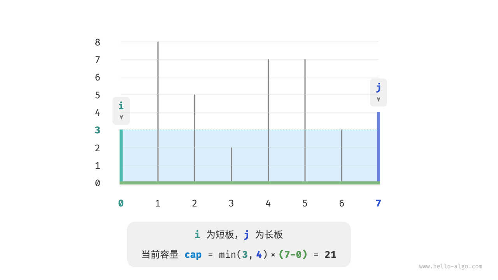

如下图所示，**若此时将长板j向短板i靠近，则容量一定变小**。

这是因为在移动长板j后，宽度j-i肯定变小；而高度由短板决定，
因此高度只可能不变（i仍为短板）或变小（移动后的j成为短板）。

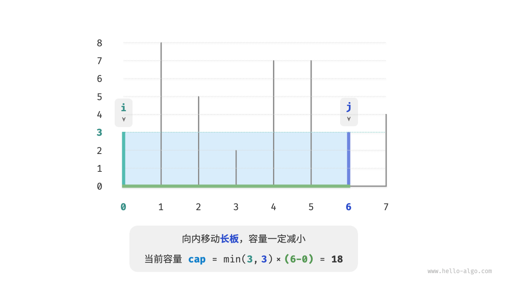

反向思考，**我们只有向内收缩短板i，才有可能使容量变大**。
因为虽然宽度一定变小，**但高度可能会变大**（移动后的短板 $i$ 可能会变长）。例如在下图中，移动短板后面积变大。

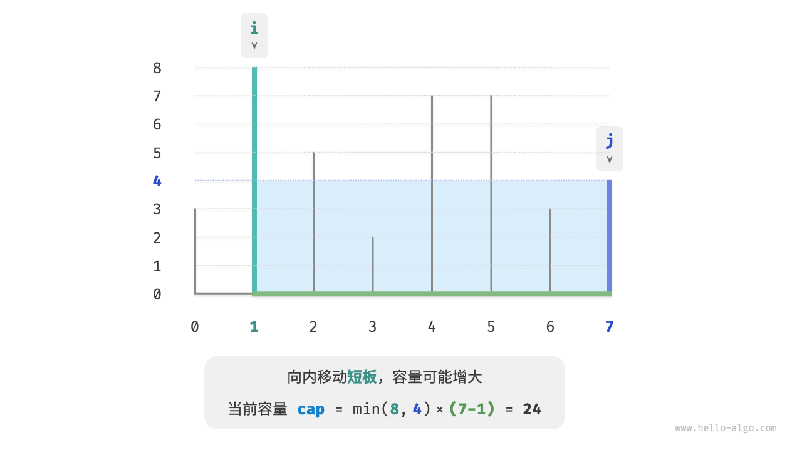

由此便可推出本题的贪心策略：初始化两指针，使其分列容器两端，每轮向内收缩短板对应的指针，直至两指针相遇。

下图展示了贪心策略的执行过程。

1. 初始状态下，指针i和j分列数组两端。
2. 计算当前状态的容量cap[i, j]，并更新最大容量。
3. 比较板i和板j的高度，并将短板向内移动一格。
4. 循环执行第`2.`步和第`3.`步，直至i和j相遇时结束。

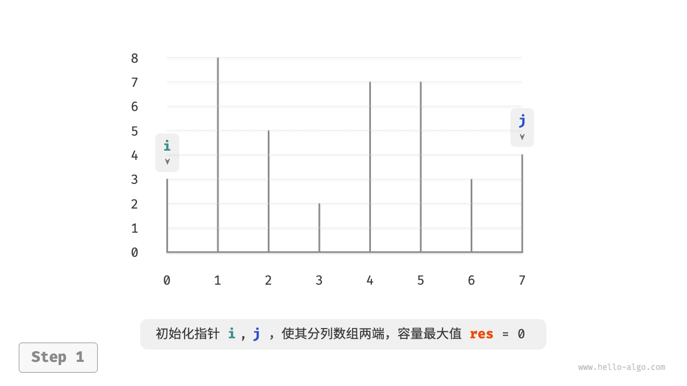

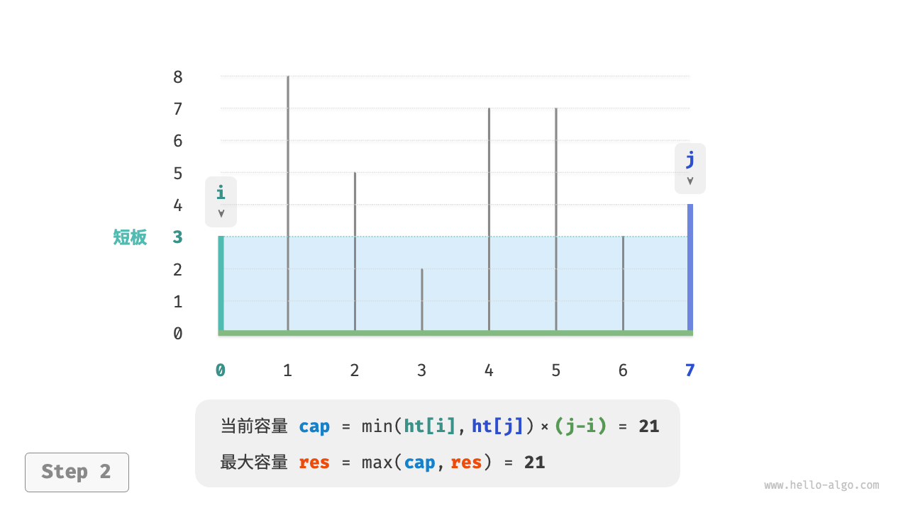

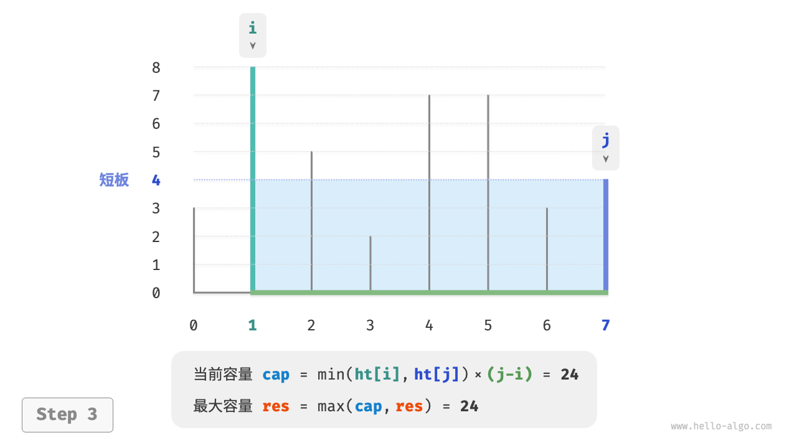

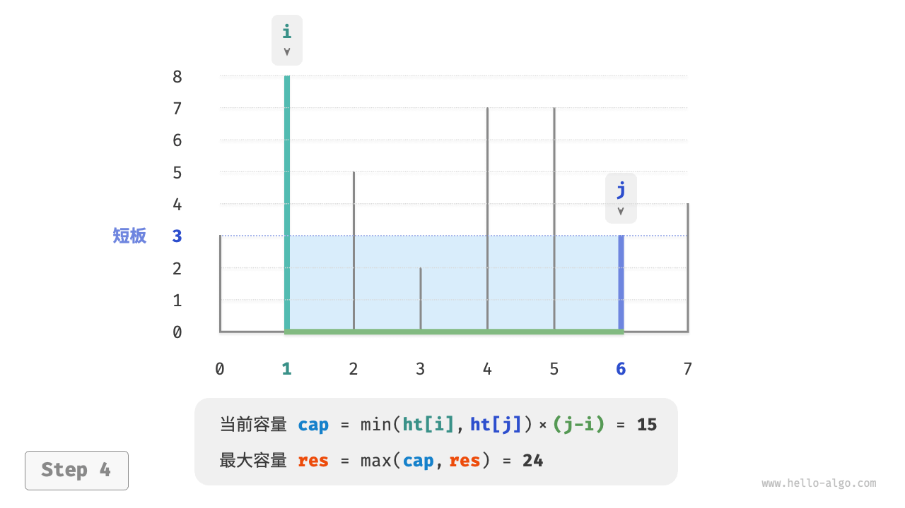

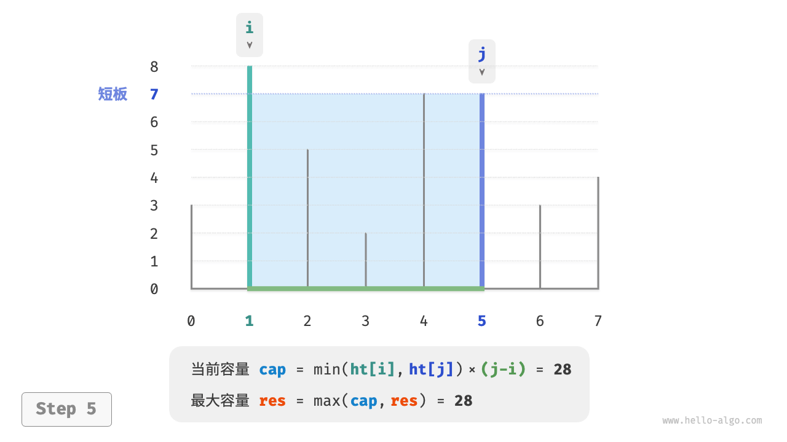

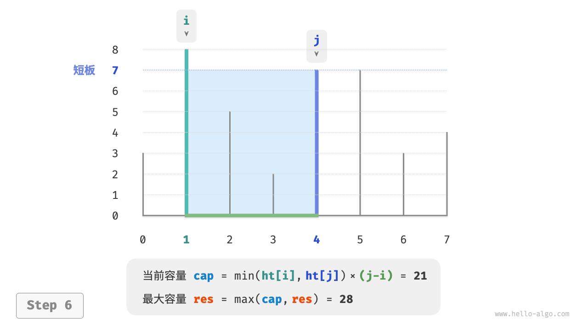

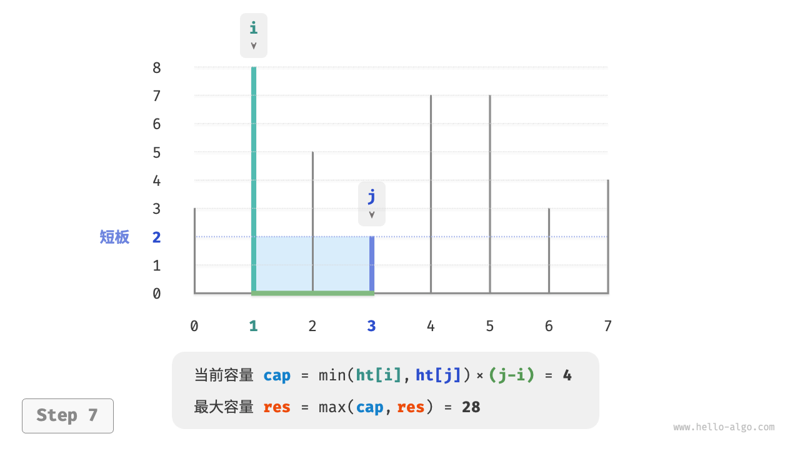

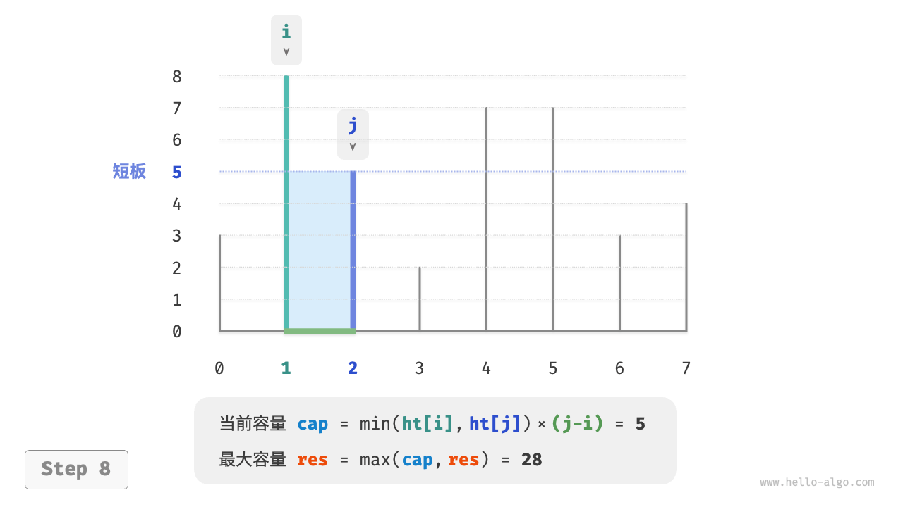

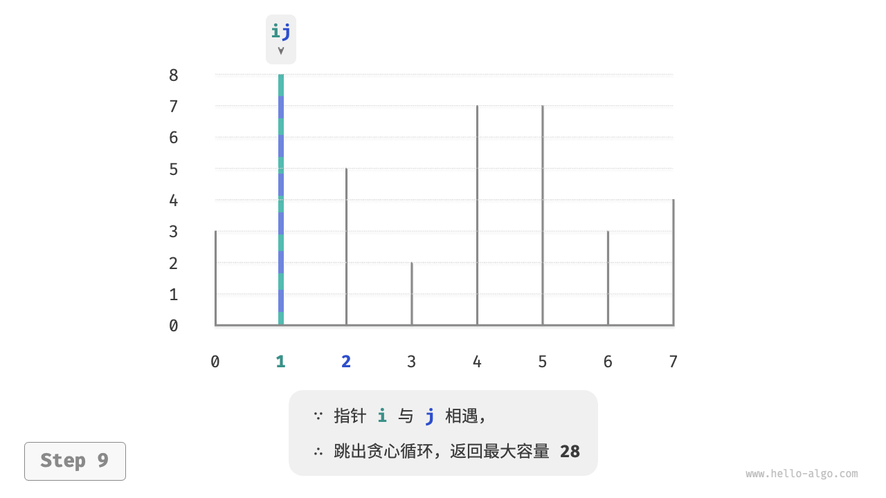

### 代码实现

代码循环最多n轮，**因此时间复杂度为O(n)** 。

变量i、j、res使用常数大小的额外空间，**因此空间复杂度为O(1)** 。

```text
/* 最大容量：贪心 */
int maxCapacity(int[] ht) {
    // 初始化 i, j，使其分列数组两端
    int i = 0, j = ht.length - 1;
    // 初始最大容量为 0
    int res = 0;
    // 循环贪心选择，直至两板相遇
    while (i < j) {
        // 更新最大容量
        int cap = Math.min(ht[i], ht[j]) * (j - i);
        res = Math.max(res, cap);
        // 向内移动短板
        if (ht[i] < ht[j]) {
            i++;
        } else {
            j--;
        }
    }
    return res;
}
```

### 正确性证明

之所以贪心比穷举更快，是因为每轮的贪心选择都会“跳过”一些状态。

比如在状态cap[i, j]下，i为短板、j为长板。若贪心地将短板i向内移动一格，会导致下图所示的状态被“跳过”。
**这意味着之后无法验证这些状态的容量大小**。

```text
cap[i, i+1], cap[i, i+2], ..., cap[i, j-2], cap[i, j-1]
```

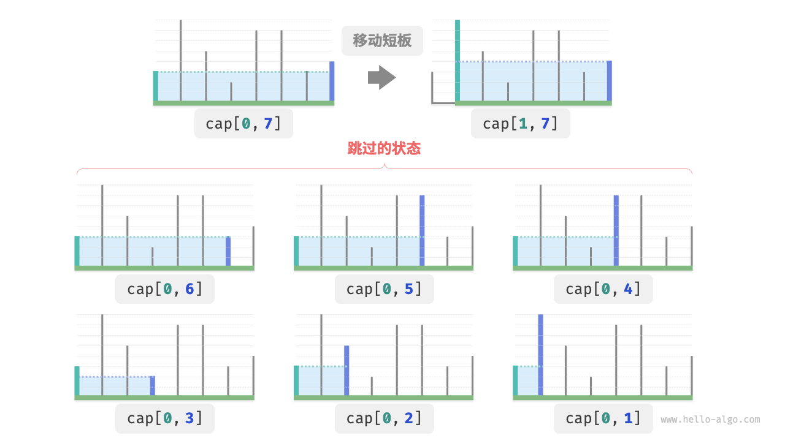

观察发现，**这些被跳过的状态实际上就是将长板j向内移动的所有状态**。
前面我们已经证明内移长板一定会导致容量变小。
也就是说，被跳过的状态都不可能是最优解，**跳过它们不会导致错过最优解**。

以上分析说明，移动短板的操作是“安全”的，贪心策略是有效的。