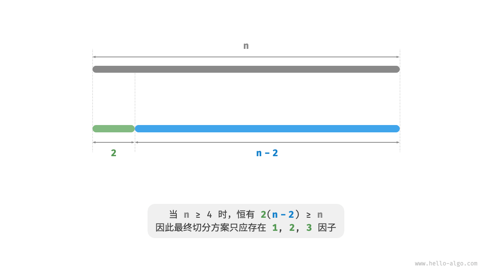

# 最大切分乘积问题

```text
问题：
给定一个正整数n，将其切分为至少两个正整数的和，求切分后所有整数的乘积最大是多少，如下图所示。
```


假设我们将n切分为m个整数因子，其中第i个因子记为 n_i ，即

```text
n = n_1 + n_2 + n_3 + ... + n_(m-1) + n_m
```

本题的目标是求得所有整数因子的最大乘积，即

```text
max(n_1 * n_2 * n_3 * ... * n_(m-1) * n_m)
```

我们需要思考的是：切分数量m应该多大，每个n_i应该是多少？

### 贪心策略确定

根据经验，两个整数的乘积往往比它们的加和更大。假设从n中分出一个因子2，则它们的乘积为2(n-2)。
我们将该乘积与n作比较：

```text
2(n-2) >= n 
2n - n - 4 >= 0 
n >= 4
```

如下图所示，当n >= 4时，切分出一个2后乘积会变大，**这说明大于等于4的整数都应该被切分**。

**贪心策略一**：
如果切分方案中包含 >= 4的因子，那么它就应该被继续切分。最终的切分方案只应出现1、2、3这三种因子。



接下来思考哪个因子是最优的。
在1、2、3这三个因子中，显然1是最差的，因为1 * (n-1) < n恒成立，即切分出1反而会导致乘积减小。

如下图所示，当n = 6时，有3 * 3 > 2 * 2 * 2。**这意味着切分出3比切分出2更优**。

**贪心策略二**：
在切分方案中，最多只应存在两个2。因为三个2总是可以替换为两个3，从而获得更大的乘积。


综上所述，可推理出以下贪心策略。

1. 输入整数n，从其不断地切分出因子3，直至余数为0、1、2。
2. 当余数为0时，代表n是3的倍数，因此不做任何处理。
3. 当余数为2时，不继续划分，保留。
4. 当余数为1时，由于2 * 2 > 1 * 3，因此应将最后一个3替换为2。

### 代码实现

如下图所示，我们无须通过循环来切分整数，而可以利用向下整除运算得到3的个数a，用取模运算得到余数b，此时有：

```text
n = 3a + b
```

请注意，对于n <= 3的边界情况，必须拆分出一个1，乘积为1 * (n - 1)。

```text
/* 最大切分乘积：贪心 */
int maxProductCutting(int n) {
    // 当 n <= 3 时，必须切分出一个 1
    if (n <= 3) {
        return 1 * (n - 1);
    }
    // 贪心地切分出 3 ，a 为 3 的个数，b 为余数
    int a = n / 3;
    int b = n % 3;
    if (b == 1) {
        // 当余数为 1 时，将一对 1 * 3 转化为 2 * 2
        return (int) Math.pow(3, a - 1) * 2 * 2;
    }
    if (b == 2) {
        // 当余数为 2 时，不做处理
        return (int) Math.pow(3, a) * 2;
    }
    // 当余数为 0 时，不做处理
    return (int) Math.pow(3, a);
}
```


**时间复杂度取决于编程语言的幂运算的实现方法**。以 Python 为例，常用的幂计算函数有三种。

- 运算符`**`和函数`pow()`的时间复杂度均为 O(log a)。
- 函数`math.pow()`内部调用C语言库的`pow()`函数，其执行浮点取幂，时间复杂度为O(1)。

变量a和b使用常数大小的额外空间，**因此空间复杂度为O(1)** 。

### 正确性证明

使用反证法，只分析n >= 3的情况。

1. **所有因子 <= 3** ：
  假设最优切分方案中存在 >= 4的因子x，那么一定可以将其继续划分为2(x-2)，从而获得更大的乘积。这与假设矛盾。
2. **切分方案不包含1** ：
  假设最优切分方案中存在一个因子1，那么它一定可以合并入另外一个因子中，以获得更大的乘积。这与假设矛盾。
3. **切分方案最多包含两个2** ：
  假设最优切分方案中包含三个2，那么一定可以替换为两个3，乘积更大。这与假设矛盾。
