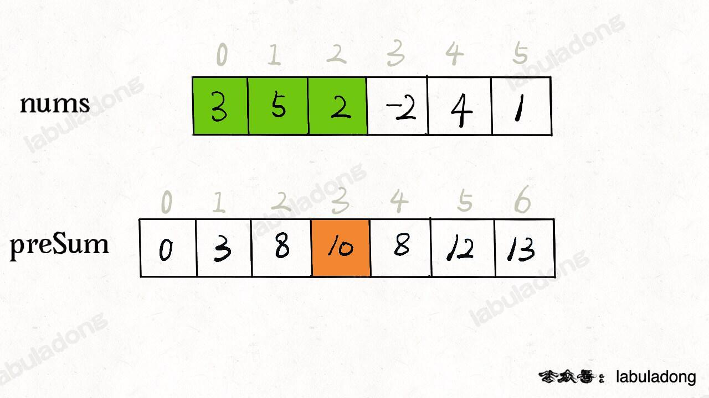
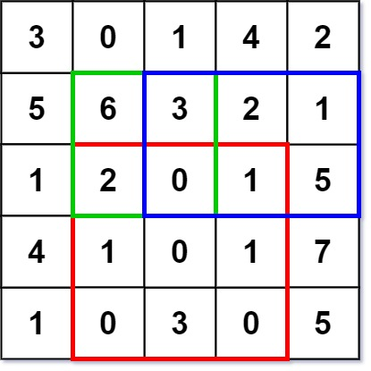
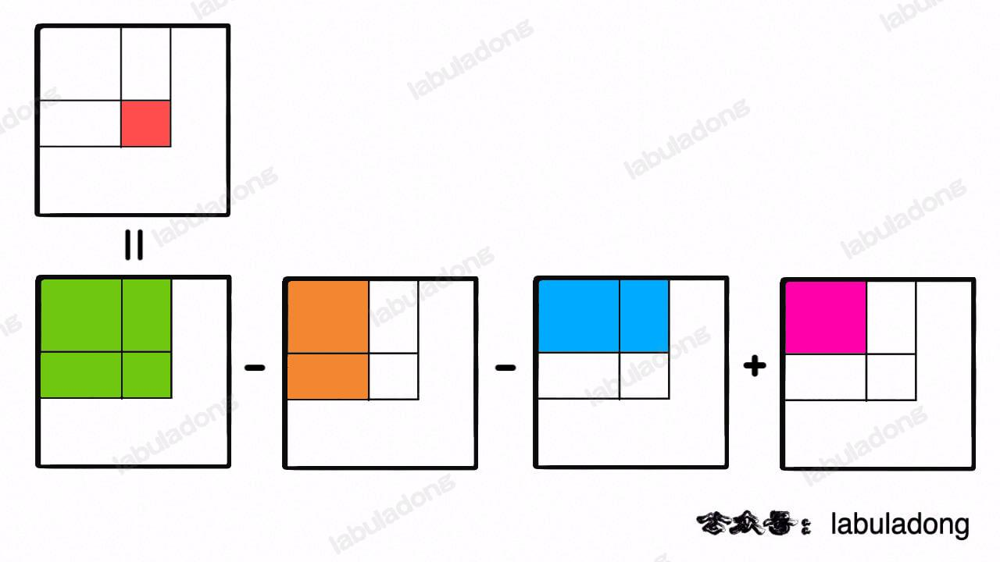

前缀和技巧适用于快速、频繁地计算一个索引区间内的元素之和。

# 简单：303. 区域和检索 - 数组不可变
```text
给定一个整数数组 nums，处理以下类型的多个查询:

计算索引 left 和 right （包含 left 和 right）之间的 nums 元素的 和 ，其中 left <= right 实现 NumArray 类：
    1) NumArray(int[] nums) 使用数组 nums 初始化对象
    2) int sumRange(int left, int right) 返回数组 nums 中索引 left 和 right 之间的元素的 总和 ，
       包含 left 和 right 两点（也就是 nums[left] + nums[left + 1] + ... + nums[right] )
 
示例 1：
输入：
    ["NumArray", "sumRange", "sumRange", "sumRange"]
    [[[-2, 0, 3, -5, 2, -1]], [0, 2], [2, 5], [0, 5]]
输出：
    [null, 1, -1, -3]
解释：
    NumArray numArray = new NumArray([-2, 0, 3, -5, 2, -1]);
    numArray.sumRange(0, 2); // return 1 ((-2) + 0 + 3)
    numArray.sumRange(2, 5); // return -1 (3 + (-5) + 2 + (-1)) 
    numArray.sumRange(0, 5); // return -3 ((-2) + 0 + 3 + (-5) + 2 + (-1))

提示：
    1 <= nums.length <= 10^4
    -10^5 <= nums[i] <= 10^5
    0 <= i <= j < nums.length
    最多调用 10^4 次 sumRange 方法
```
题目要求你实现这样一个类：
```java
class NumArray {

    public NumArray(int[] nums) {}
    
    /* 查询闭区间 [left, right] 的累加和 */
    public int sumRange(int left, int right) {}
}
```
sumRange 函数需要计算并返回一个索引区间之内的元素和，没学过前缀和的人可能写出如下代码：
```java
class NumArray {

    private int[] nums;

    public NumArray(int[] nums) {
        this.nums = nums;
    }
    
    public int sumRange(int left, int right) {
        int res = 0;
        for (int i = left; i <= right; i++) {
            res += nums[i];
        }
        return res;
    }
}
```
这样，可以达到效果，但是效率很差，因为 sumRange 方法会被频繁调用，而它的时间复杂度是 O(N)，其中 N 代表 nums 数组的长度。

这道题的最优解法是使用前缀和技巧，将 sumRange 函数的时间复杂度降为 O(1)，说白了就是不要在 sumRange 里面用 for 循环，咋整？

直接看代码实现：
```java
class NumArray {
    // 前缀和数组
    private int[] preSum;

    /* 输入一个数组，构造前缀和 */
    public NumArray(int[] nums) {
        // 构造前缀和数组 preSum，注意前缀和数组preSum的下标比原始数组nums的下标要大1
        // preSum[0] = 0，便于计算累加和
        preSum = new int[nums.length + 1];
        // 计算 nums 的累加和
        for (int i = 1; i < preSum.length; i++) {
            preSum[i] = preSum[i - 1] + nums[i - 1];
        }
    }
    
    /* 查询nums数组在闭区间 [left, right] 的累加和 */
    public int sumRange(int left, int right) {
        // preSum[right + 1]是 nums[right]的前缀和
        // preSum[left]是 nums[left - 1]的前缀和
        // nums[right]的前缀和 - nums[left - 1]的前缀和 = 闭区间[left, right]的累加和
        return preSum[right + 1] - preSum[left];
    }
}
```
核心思路是我们 new 一个新的数组 preSum 出来，preSum[i] 记录 nums[0..i-1] 的累加和，看图 10 = 3 + 5 + 2：



看这个 preSum 数组，如果我想求索引区间 [1, 4] 内的所有元素之和，
（nums[4]的前缀和 - nums[0]的前缀和）就可以通过 preSum[5] - preSum[1] 得出。

这样，sumRange 函数仅仅需要做一次减法运算，避免了每次进行 for 循环调用，最坏时间复杂度为常数 O(1)。

这个技巧在生活中运用也挺广泛的，
比方说，你们班上有若干同学，每个同学有一个期末考试的成绩（满分 100 分），
那么请你实现一个 API，输入任意一个分数段，返回有多少同学的成绩在这个分数段内。

那么，你可以先通过计数排序的方式计算每个分数具体有多少个同学，然后利用前缀和技巧来实现分数段查询的 API：
```text
int[] scores; // 存储着所有同学的分数
// 试卷满分 100 分
int[] count = new int[100 + 1]
// 记录每个分数有几个同学
for (int score : scores)
    count[score]++
// 构造前缀和
for (int i = 1; i < count.length; i++)
    count[i] = count[i] + count[i-1];

// 利用 count 这个前缀和数组进行分数段查询
```
接下来，我们看一看前缀和思路在二维数组中如何运用。

# 中等：304. 二维区域和检索 - 矩阵不可变
二维矩阵中的前缀和。
```text
给定一个二维矩阵 matrix，以下类型的多个请求：
计算其子矩形范围内元素的总和，该子矩阵的 左上角 为 (row1, col1) ，右下角 为 (row2, col2) 。
实现 NumMatrix 类：
    1) NumMatrix(int[][] matrix) 给定整数矩阵 matrix 进行初始化
    2) int sumRegion(int row1, int col1, int row2, int col2) 返回 左上角 (row1, col1) 、右下角 (row2, col2) 所描述的子矩阵的元素 总和 。
 
示例 1：
输入: 
    ["NumMatrix","sumRegion","sumRegion","sumRegion"]
    [[[[3,0,1,4,2],[5,6,3,2,1],[1,2,0,1,5],[4,1,0,1,7],[1,0,3,0,5]]],[2,1,4,3],[1,1,2,2],[1,2,2,4]]
输出: 
    [null, 8, 11, 12]
解释:
    NumMatrix numMatrix = new NumMatrix([[3,0,1,4,2],[5,6,3,2,1],[1,2,0,1,5],[4,1,0,1,7],[1,0,3,0,5]]);
    numMatrix.sumRegion(2, 1, 4, 3); // return 8 (红色矩形框的元素总和)
    numMatrix.sumRegion(1, 1, 2, 2); // return 11 (绿色矩形框的元素总和)
    numMatrix.sumRegion(1, 2, 2, 4); // return 12 (蓝色矩形框的元素总和)

提示：
    m == matrix.length
    n == matrix[i].length
    1 <= m, n <= 200
    -10^5 <= matrix[i][j] <= 10^5
    0 <= row1 <= row2 < m
    0 <= col1 <= col2 < n
    最多调用 10^4 次 sumRegion 方法
```
示例一图：



按照题目要求，矩阵左上角为坐标原点 (0, 0)，那么 sumRegion([2,1,4,3]) 就是图中红色的子矩阵，你需要返回该子矩阵的元素和 8。

当然，你可以用一个嵌套 for 循环去遍历这个矩阵，但这样的话 sumRegion 函数的时间复杂度就高了，你算法的格局就低了。

注意任意子矩阵的元素和可以转化成它周边几个大矩阵的元素和的运算：



而这四个大矩阵有一个共同的特点，就是左上角都是 (0, 0) 原点。

那么做这道题更好的思路和一维数组中的前缀和是非常类似的，
我们可以维护一个二维 preSum 数组，专门记录以原点为顶点的矩阵的元素之和，就可以用几次加减运算算出任何一个子矩阵的元素和：
```java
class NumMatrix {
    // 定义：preSum[i][j] 记录 matrix 中子矩阵 [0, 0, i-1, j-1] 的元素和
    private int[][] preSum;
    
    public NumMatrix(int[][] matrix) {
        if (matrix == null || matrix.length == 0 || matrix[0].length == 0) {
            return;
        }
        int m = matrix.length;
        int n = matrix[0].length;
        // 构造前缀和矩阵，注意前缀和矩阵的下标要比原始矩阵下标大1
        preSum = new int[m + 1][n + 1];
        for (int i = 1; i <= m; i++) {
            for (int j = 1; j <= n; j++) {
                // 计算每个矩阵 [0, 0, i, j] 的元素和
                preSum[i][j] = preSum[i-1][j] + preSum[i][j-1] + matrix[i - 1][j - 1] - preSum[i-1][j-1];
            }
        }
    }
    
    // 计算子矩阵 [x1, y1, x2, y2] 的元素和
    public int sumRegion(int x1, int y1, int x2, int y2) {
        // 目标矩阵之和由四个相邻矩阵运算获得
        return preSum[x2+1][y2+1] - preSum[x1][y2+1] - preSum[x2+1][y1] + preSum[x1][y1];
    }
}
```
这样，sumRegion 函数的时间复杂度也用前缀和技巧优化到了 O(1)，这是典型的「空间换时间」思路。

前缀和技巧就讲到这里，应该说这个算法技巧是会者不难难者不会，实际运用中还是要多培养自己的思维灵活性，做到一眼看出题目是一个前缀和问题。


