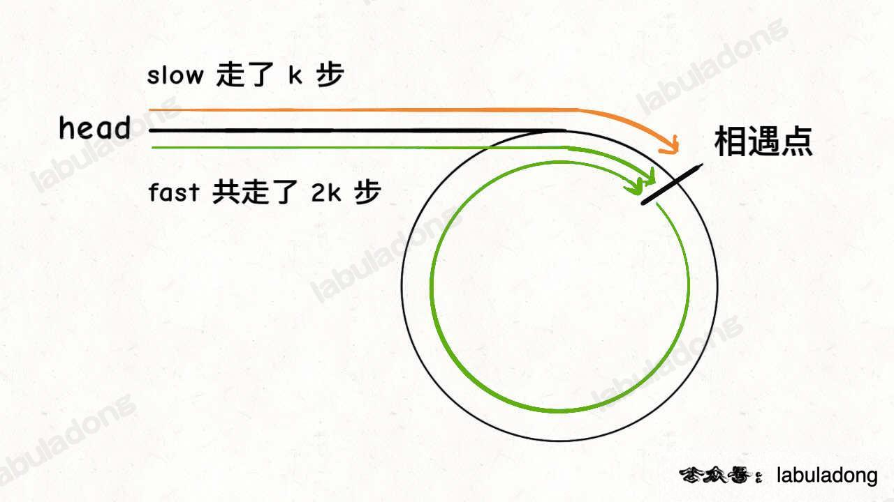
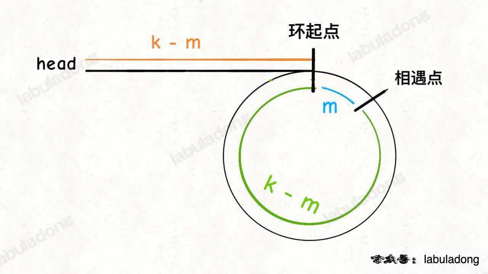
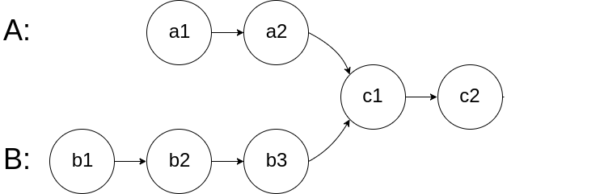
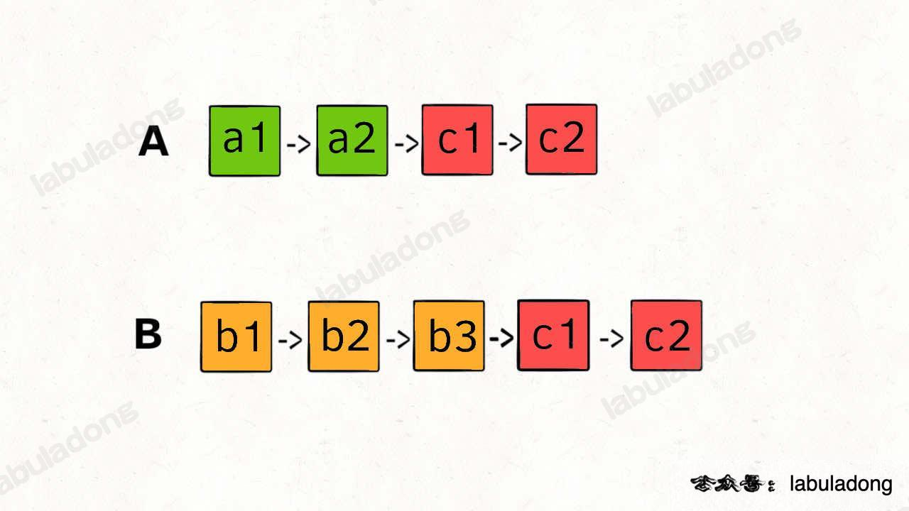

# 21. 合并两个有序链表
```text
将两个升序链表合并为一个新的 升序 链表并返回。新链表是通过拼接给定的两个链表的所有节点组成的。

示例 1：
输入：l1 = [1,2,4], l2 = [1,3,4]
输出：[1,1,2,3,4,4]
示例 2：

输入：l1 = [], l2 = []
输出：[]
示例 3：

输入：l1 = [], l2 = [0]
输出：[0]
提示：

两个链表的节点数目范围是 [0, 50]
-100 <= Node.val <= 100
l1 和 l2 均按 非递减顺序 排列

给你输入两个有序链表，请你把他俩合并成一个新的有序链表。
```
解题：双指针
```java
/**
 * Definition for singly-linked list.
 * public class ListNode {
 *     int val;
 *     ListNode next;
 *     ListNode() {}
 *     ListNode(int val) { this.val = val; }
 *     ListNode(int val, ListNode next) { this.val = val; this.next = next; }
 * }
 */
class Solution {
    ListNode mergeTwoLists(ListNode l1, ListNode l2) {
        // 虚拟头结点
        ListNode dummy = new ListNode(-1), p = dummy;
        ListNode p1 = l1, p2 = l2;
        
        while (p1 != null && p2 != null) {
            // 比较 p1 和 p2 两个指针
            // 将值较小的的节点接到 p 指针
            if (p1.val > p2.val) {
                p.next = p2;
                p2 = p2.next;
            } else {
                p.next = p1;
                p1 = p1.next;
            }
            // p 指针不断前进
            p = p.next;
        }
        if (p1 != null) {
            p.next = p1;
        }
        if (p2 != null) {
            p.next = p2;
        }
        return dummy.next;
    }
}
```

# 86. 分隔链表
```text
给你一个链表的头节点 head 和一个特定值 x ，请你对链表进行分隔，使得所有 小于 x 的节点都出现在 大于或等于 x 的节点之前。

你应当 保留 两个分区中每个节点的初始【相对位置】。

示例 1：
输入：head = [1,4,3,2,5,2], x = 3
输出：[1,2,2,4,3,5]

示例 2：
输入：head = [2,1], x = 2
输出：[1,2]

提示：
链表中节点的数目在范围 [0, 200] 内
-100 <= Node.val <= 100
-200 <= x <= 200
在合并两个有序链表时让你合二为一，而这里需要分解让你把原链表一分为二。具体来说，我们可以把原链表分成两个小链表，一个链表中的元素大小都小于 x，另一个链表中的元素都大于等于 x，最后再把这两条链表接到一起，就得到了题目想要的结果。

整体逻辑和合并有序链表非常相似，细节直接看代码吧，注意虚拟头结点的运用.
```
```text
/**
 * Definition for singly-linked list.
 * public class ListNode {
 *     int val;
 *     ListNode next;
 *     ListNode() {}
 *     ListNode(int val) { this.val = val; }
 *     ListNode(int val, ListNode next) { this.val = val; this.next = next; }
 * }
 */
class Solution {
    ListNode partition(ListNode head, int x) {
        // 存放小于 x 的链表的虚拟头结点
        ListNode dummy1 = new ListNode(-1);
        // 存放大于等于 x 的链表的虚拟头结点
        ListNode dummy2 = new ListNode(-1);
        // p1, p2 指针负责生成结果链表
        ListNode p1 = dummy1, p2 = dummy2;
        // p 负责遍历原链表，类似合并两个有序链表的逻辑
        // 这里是将一个链表分解成两个链表
        ListNode p = head;
        while (p != null) {
            if (p.val >= x) {
                p2.next = p;
                p2 = p2.next;
            } else {
                p1.next = p;
                p1 = p1.next;
            }
            // 不能直接让 p 指针前进，
            // p = p.next
            // 断开原链表中的每个节点的 next 指针
            ListNode temp = p.next;
            p.next = null;
            p = temp;
        }
        // 连接两个链表
        p1.next = dummy2.next;
    
        return dummy1.next;
    }
}
```

# 23. 合并K个升序链表   困难
```text
给你一个链表数组，每个链表都已经按升序排列。

请你将所有链表合并到一个升序链表中，返回合并后的链表。

示例 1：
输入：lists = [[1,4,5],[1,3,4],[2,6]]
输出：[1,1,2,3,4,4,5,6]
解释：链表数组如下：
[
1->4->5,
1->3->4,
2->6
]
将它们合并到一个有序链表中得到。
1->1->2->3->4->4->5->6

示例 2：
输入：lists = []
输出：[]

示例 3：
输入：lists = [[]]
输出：[]

提示：
k == lists.length
0 <= k <= 10^4
0 <= lists[i].length <= 500
-10^4 <= lists[i][j] <= 10^4
lists[i] 按 升序 排列
lists[i].length 的总和不超过 10^4
```
合并 k 个有序链表的逻辑类似合并两个有序链表，难点在于，如何快速得到 k 个节点中的最小节点，接到结果链表上？

这里我们就要用到 优先级队列（二叉堆） 这种数据结构，把链表节点放入一个最小堆，就可以每次获得 k 个节点中的最小节点：
```java
/**
 * Definition for singly-linked list.
 * public class ListNode {
 *     int val;
 *     ListNode next;
 *     ListNode() {}
 *     ListNode(int val) { this.val = val; }
 *     ListNode(int val, ListNode next) { this.val = val; this.next = next; }
 * }
 */
class Solution {
    ListNode mergeKLists(ListNode[] lists) {
        if (lists.length == 0) return null;
        // 虚拟头结点
        ListNode dummy = new ListNode(-1);
        ListNode p = dummy;
        // 优先级队列，最小堆
        PriorityQueue<ListNode> pq = new PriorityQueue<>(
            lists.length, (a, b)->(a.val - b.val));
        // 将 k 个链表的头结点加入最小堆
        for (ListNode head : lists) {
            if (head != null)
                pq.add(head);
        }
    
        while (!pq.isEmpty()) {
            // 获取最小节点，接到结果链表中
            ListNode node = pq.poll();
            p.next = node;
            if (node.next != null) {
                pq.add(node.next);
            }
            // p 指针不断前进
            p = p.next;
        }
        return dummy.next;
    }
}
```

# 单链表的倒数第 k 个节点
从前往后寻找单链表的第 k 个节点很简单，一个 for 循环遍历过去就找到了，但是如何寻找从后往前数的第 k 个节点呢？

那你可能说，假设链表有 n 个节点，倒数第 k 个节点就是正数第 n - k + 1 个节点，不也是一个 for 循环的事儿吗？

是的，但是算法题一般只给你一个 ListNode 头结点代表一条单链表，你不能直接得出这条链表的长度 n，
而需要先遍历一遍链表算出 n 的值，然后再遍历链表计算第 n - k + 1 个节点。

也就是说，这个解法需要遍历两次链表才能得到出倒数第 k 个节点。

那么，我们能不能只遍历一次链表，就算出倒数第 k 个节点？可以做到的，如果是面试问到这道题，面试官肯定也是希望你给出只需遍历一次链表的解法。

这个解法就比较巧妙了，假设 k = 2，思路如下：

首先，我们先让一个指针 p1 指向链表的头节点 head，然后走 k 步：

现在的 p1，只要再走 n - k 步，就能走到链表末尾的空指针了对吧？

趁这个时候，再用一个指针 p2 指向链表头节点 head：

接下来就很显然了，让 p1 和 p2 同时向前走，p1 走到链表末尾的空指针时前进了 n - k 步，
p2 也从 head 开始前进了 n - k 步，停留在第 n - k + 1 个节点上，即恰好停链表的倒数第 k 个节点上：

这样，只遍历了一次链表，就获得了倒数第 k 个节点 p2。

上述逻辑的代码如下：
```java
class Solution {
    // 返回链表的倒数第 k 个节点
    ListNode findFromEnd(ListNode head, int k) {
        ListNode p1 = head;
        // p1 先走 k 步
        for (int i = 0; i < k; i++) {
            p1 = p1.next;
        }
        ListNode p2 = head;
        // p1 和 p2 同时走 n - k 步
        while (p1 != null) {
            p2 = p2.next;
            p1 = p1.next;
        }
        // p2 现在指向第 n - k + 1 个节点，即倒数第 k 个节点
        return p2;
    }
}
```

# 中等: 19. 删除链表的倒数第 N 个结点
```text
给你一个链表，删除链表的倒数第 n 个结点，并且返回链表的头结点。


示例 1：
输入：head = [1,2,3,4,5], n = 2
输出：[1,2,3,5]

示例 2：
输入：head = [1], n = 1
输出：[]

示例 3：
输入：head = [1,2], n = 1
输出：[1]
 

提示：
链表中结点的数目为 sz
1 <= sz <= 30
0 <= Node.val <= 100
1 <= n <= sz
 
进阶：你能尝试使用一趟扫描实现吗？
```

```java
/**
 * Definition for singly-linked list.
 * public class ListNode {
 *     int val;
 *     ListNode next;
 *     ListNode() {}
 *     ListNode(int val) { this.val = val; }
 *     ListNode(int val, ListNode next) { this.val = val; this.next = next; }
 * }
 */
class Solution {
    public ListNode removeNthFromEnd(ListNode head, int n) {
        ListNode dummy = new ListNode(0, head);
        ListNode first = head;
        ListNode second = dummy;
        for (int i = 0; i < n; ++i) {
            first = first.next;
        }
        while (first != null) {
            first = first.next;
            second = second.next;
        }
        second.next = second.next.next;
        return dummy.next;
    }
}
```

# 简单：876. 链表的中间结点
```text
给你单链表的头结点 head ，请你找出并返回链表的中间结点。

如果有两个中间结点，则返回第二个中间结点。

示例 1：
输入：head = [1,2,3,4,5]
输出：[3,4,5]
解释：链表只有一个中间结点，值为 3 。

示例 2：
输入：head = [1,2,3,4,5,6]
输出：[4,5,6]
解释：该链表有两个中间结点，值分别为 3 和 4 ，返回第二个结点。
 

提示：
链表的结点数范围是 [1, 100]
1 <= Node.val <= 100
```
问题的关键也在于我们无法直接得到单链表的长度 n，常规方法也是先遍历链表计算 n，再遍历一次得到第 n / 2 个节点，也就是中间节点。

如果想一次遍历就得到中间节点，也需要耍点小聪明，使用「**快慢指针**」的技巧：

我们让两个指针 slow 和 fast 分别指向链表头结点 head。

每当慢指针 slow 前进一步，快指针 fast 就前进两步，这样，当 fast 走到链表末尾时，slow 就指向了链表中点。

上述思路的代码实现如下：
```java
/**
 * Definition for singly-linked list.
 * public class ListNode {
 *     int val;
 *     ListNode next;
 *     ListNode() {}
 *     ListNode(int val) { this.val = val; }
 *     ListNode(int val, ListNode next) { this.val = val; this.next = next; }
 * }
 */
class Solution {
    ListNode middleNode(ListNode head) {
        // 快慢指针初始化指向 head
        ListNode slow = head, fast = head;
        // 快指针走到末尾时停止
        while (fast != null && fast.next != null) {
            // 慢指针走一步，快指针走两步
            slow = slow.next;
            fast = fast.next.next;
        }
        // 慢指针指向中点
        return slow;
    }
}
```

需要注意的是，如果链表长度为偶数，也就是说中点有两个的时候，我们这个解法返回的节点是靠后的那个节点。

另外，这段代码稍加修改就可以直接用到判断链表成环的算法题上。

# 判断链表是否包含环
判断链表是否包含环属于经典问题了，解决方案也是用快慢指针：

每当慢指针 slow 前进一步，快指针 fast 就前进两步。

如果 fast 最终能正常走到链表末尾，说明链表中没有环；如果 fast 走着走着竟然和 slow 相遇了，那肯定是 fast 在链表中转圈了，说明链表中含有环。

只需要把寻找链表中点的代码稍加修改就行了：
```java
class Solution {
    boolean hasCycle(ListNode head) {
        // 快慢指针初始化指向 head
        ListNode slow = head, fast = head;
        // 快指针走到末尾时停止
        while (fast != null && fast.next != null) {
            // 慢指针走一步，快指针走两步
            slow = slow.next;
            fast = fast.next.next;
            // 快慢指针相遇，说明含有环
            if (slow == fast) {
                return true;
            }
        }
        // 不包含环
        return false;
    }
}
```


# 中等：142. 环形链表 II
```text
给定一个链表的头节点  head ，返回链表开始入环的第一个节点。 如果链表无环，则返回 null。

如果链表中有某个节点，可以通过连续跟踪 next 指针再次到达，则链表中存在环。 
为了表示给定链表中的环，评测系统内部使用整数 pos 来表示链表尾连接到链表中的位置（索引从 0 开始）。
如果 pos 是 -1，则在该链表中没有环。
注意：pos 不作为参数进行传递，仅仅是为了标识链表的实际情况。

不允许修改 链表。

示例 1：
输入：head = [3,2,0,-4], pos = 1
输出：返回索引为 1 的链表节点
解释：链表中有一个环，其尾部连接到第二个节点。

示例 2：
输入：head = [1,2], pos = 0
输出：返回索引为 0 的链表节点
解释：链表中有一个环，其尾部连接到第一个节点。

示例 3：
输入：head = [1], pos = -1
输出：返回 null
解释：链表中没有环。
 

提示：
链表中节点的数目范围在范围 [0, 104] 内
-105 <= Node.val <= 105
pos 的值为 -1 或者链表中的一个有效索引

进阶：你是否可以使用 O(1) 空间解决此题？
```

```java
/**
 * Definition for singly-linked list.
 * class ListNode {
 *     int val;
 *     ListNode next;
 *     ListNode(int x) {
 *         val = x;
 *         next = null;
 *     }
 * }
 */
public class Solution {
    public ListNode detectCycle(ListNode head) {
        ListNode fast, slow;
        fast = slow = head;
        while (fast != null && fast.next != null) {
            fast = fast.next.next;
            slow = slow.next;
            if (fast == slow) break;

        }
        // 上面的代码类似 hasCycle 函数
        if (fast == null || fast.next == null) {
            // fast 遇到空指针说明没有环
            return null;
        }

        // 重新指向头结点
        slow = head;

        // 快慢指针同步前进，相交点就是环起点
        while (slow != fast) {
            fast = fast.next;
            slow = slow.next;
        }
        return slow;
    }
}
```
可以看到，当快慢指针相遇时，让其中任一个指针指向头节点，然后让它俩以相同速度前进，再次相遇时所在的节点位置就是环开始的位置。

为什么要这样呢？这里简单说一下其中的原理。

我们假设快慢指针相遇时，慢指针 slow 走了 k 步，那么快指针 fast 一定走了 2k 步：



fast 一定比 slow 多走了 k 步，这多走的 k 步其实就是 fast 指针在环里转圈圈，所以 k 的值就是环长度的「整数倍」。

假设相遇点距环的起点的距离为 m，那么结合上图的 slow 指针，环的起点距头结点 head 的距离为 k - m，也就是说如果从 head 前进 k - m 步就能到达环起点。

巧的是，如果从相遇点继续前进 k - m 步，也恰好到达环起点。因为结合上图的 fast 指针，从相遇点开始走k步可以转回到相遇点，那走 k - m 步肯定就走到环起点了：



所以，只要我们把快慢指针中的任一个重新指向 head，然后两个指针同速前进，k - m 步后一定会相遇，相遇之处就是环的起点了。

# 简单：160. 相交链表

给你输入两个链表的头结点 headA 和 headB，这两个链表可能存在相交。

如果相交，你的算法应该返回相交的那个节点；如果没相交，则返回 null。

比如题目给我们举的例子，如果输入的两个链表如下图：



那么我们的算法应该返回 c1 这个节点。

这个题直接的想法可能是用 HashSet 记录一个链表的所有节点，然后和另一条链表对比，但这就需要额外的空间。

如果不用额外的空间，只使用两个指针，你如何做呢？

难点在于，由于两条链表的长度可能不同，两条链表之间的节点无法对应：



如果用两个指针 p1 和 p2 分别在两条链表上前进，并不能同时走到公共节点，也就无法得到相交节点 c1。

解决这个问题的关键是，通过某些方式，让 p1 和 p2 能够同时到达相交节点 c1。

所以，我们可以让 p1 遍历完链表 A 之后开始遍历链表 B，让 p2 遍历完链表 B 之后开始遍历链表 A，这样相当于「逻辑上」两条链表接在了一起。

如果这样进行拼接，就可以让 p1 和 p2 同时进入公共部分，也就是同时到达相交节点 c1：


那你可能会问，如果说两个链表没有相交点，是否能够正确的返回 null 呢？

这个逻辑可以覆盖这种情况的，相当于 c1 节点是 null 空指针嘛，可以正确返回 null。

按照这个思路，可以写出如下代码：
```java
/**
 * Definition for singly-linked list.
 * public class ListNode {
 *     int val;
 *     ListNode next;
 *     ListNode(int x) {
 *         val = x;
 *         next = null;
 *     }
 * }
 */
public class Solution {
    ListNode getIntersectionNode(ListNode headA, ListNode headB) {
        // p1 指向 A 链表头结点，p2 指向 B 链表头结点
        ListNode p1 = headA, p2 = headB;
        while (p1 != p2) {
            // p1 走一步，如果走到 A 链表末尾，转到 B 链表
            if (p1 == null) p1 = headB;
            else            p1 = p1.next;
            // p2 走一步，如果走到 B 链表末尾，转到 A 链表
            if (p2 == null) p2 = headA;
            else            p2 = p2.next;
        }
        return p1;
    }
}
```
这样，这道题就解决了，空间复杂度为 O(1)，时间复杂度为 O(N)。

以上就是单链表的所有技巧，希望对你有启发。