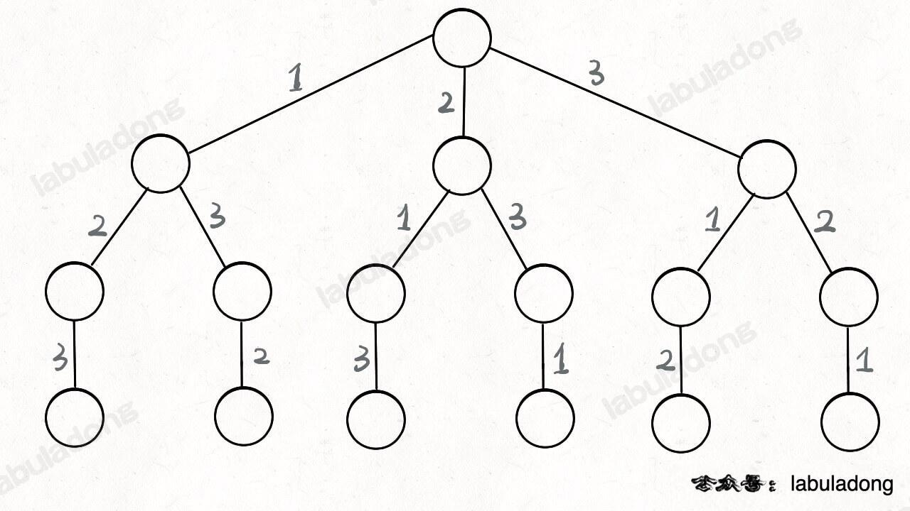
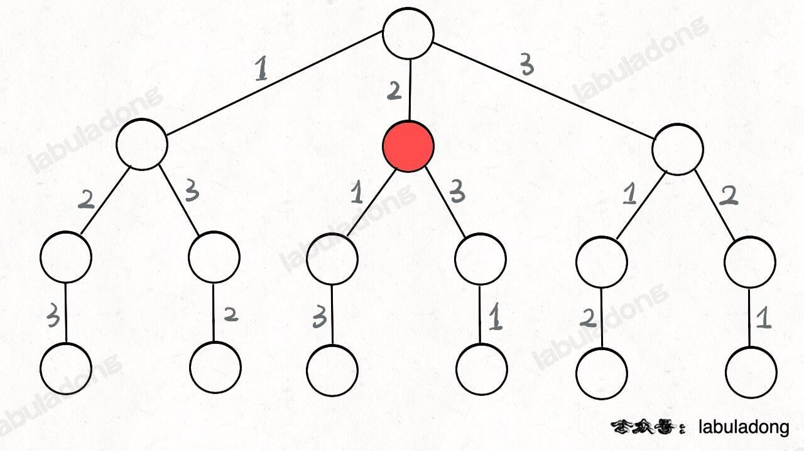
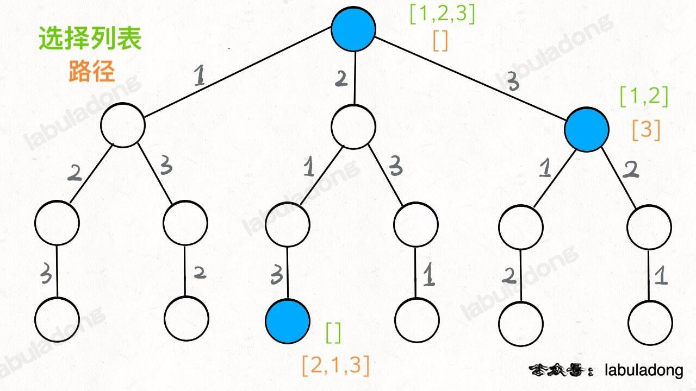
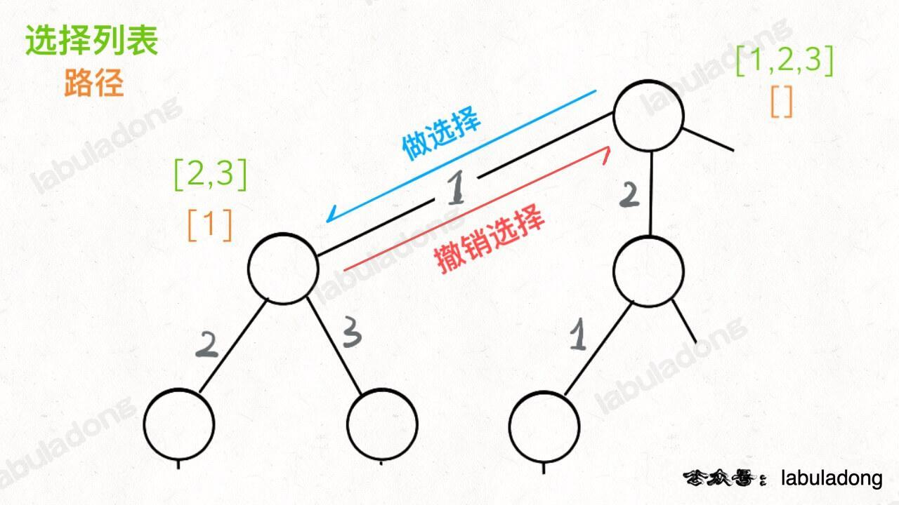
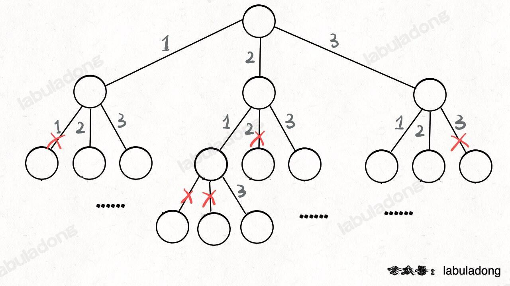
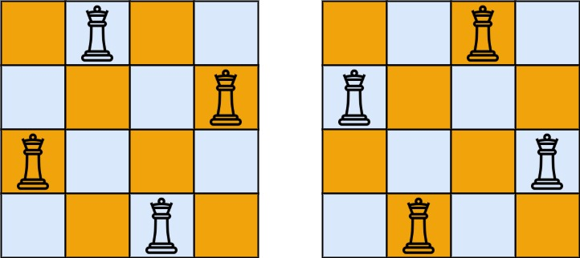
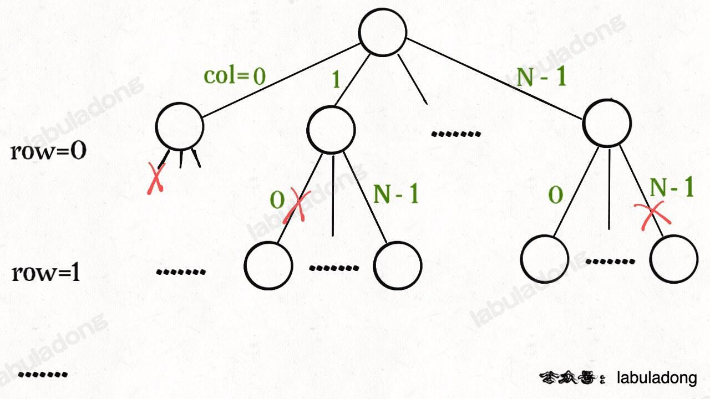

本文解决几个问题：
```text
回溯算法是什么？
解决回溯算法相关的问题有什么技巧？
如何学习回溯算法？
回溯算法代码是否有规律可循？
```

其实回溯算法和我们常说的 DFS 算法非常类似，本质上就是一种暴力穷举算法。
回溯算法和 DFS 算法的细微差别是：回溯算法是在遍历「树枝」，DFS 算法是在遍历「节点」，本文就是简单提一下，你有个印象就行了。
等你看了 手把手刷二叉树（纲领篇） 和 图论算法基础 之后就能深刻理解这句话的含义了。

抽象地说，解决一个回溯问题，实际上就是遍历一棵决策树的过程，树的每个叶子节点存放着一个合法答案。
你把整棵树遍历一遍，把叶子节点上的答案都收集起来，就能得到所有的合法答案。

站在回溯树的一个节点上，你只需要思考 3 个问题：
- 1、路径：也就是已经做出的选择。
- 2、选择列表：也就是你当前可以做的选择。
- 3、结束条件：也就是到达决策树底层，无法再做选择的条件。

如果你不理解这三个词语的解释，没关系，我们后面会用「全排列」和「N 皇后问题」这两个经典的回溯算法问题来帮你理解这些词语是什么意思，
现在你先留着印象。

代码方面，回溯算法的框架：
```text
result = []
def backtrack(路径, 选择列表):
    if 满足结束条件:
        result.add(路径)
        return
    
    for 选择 in 选择列表:
        做选择
        backtrack(路径, 选择列表)
        撤销选择
```
其核心就是 for 循环里面的递归，在递归调用之前「做选择」，在递归调用之后「撤销选择」，特别简单。

什么叫做选择和撤销选择呢，这个框架的底层原理是什么呢？下面我们就通过「全排列」这个问题来解开之前的疑惑，详细探究一下其中的奥妙！

# 一、全排列问题
力扣第 46 题「[全排列](https://leetcode.cn/problems/permutations/)」就是给你输入一个数组 nums，
让你返回这些数字的全排列。

我们在高中的时候就做过排列组合的数学题，我们也知道 n 个不重复的数，全排列共有 n! 个。那么我们当时是怎么穷举全排列的呢？

比方说给三个数 [1,2,3]，你肯定不会无规律地乱穷举，一般是这样：

先固定第一位为 1，然后第二位可以是 2，那么第三位只能是 3；然后可以把第二位变成 3，第三位就只能是 2 了；然后就只能变化第一位，变成 2，然后再穷举后两位……

其实这就是回溯算法，我们高中无师自通就会用，或者有的同学直接画出如下这棵回溯树：



只要从根遍历这棵树，记录路径上的数字，其实就是所有的全排列。我们不妨把这棵树称为回溯算法的「决策树」。

为啥说这是决策树呢，因为你在每个节点上其实都在做决策。比如说你站在下图的红色节点上：



你现在就在做决策，可以选择 1 那条树枝，也可以选择 3 那条树枝。
为啥只能在 1 和 3 之中选择呢？因为 2 这个树枝在你身后，这个选择你之前做过了，而全排列是不允许重复使用数字的。

现在可以解答开头的几个名词：
[2] 就是「路径」，记录你已经做过的选择；
[1,3] 就是「选择列表」，表示你当前可以做出的选择；
「结束条件」就是遍历到树的底层叶子节点，这里也就是选择列表为空的时候。

如果明白了这几个名词，可以把「路径」和「选择」列表作为决策树上每个节点的属性，比如下图列出了几个蓝色节点的属性：



我们定义的 backtrack 函数其实就像一个指针，在这棵树上游走，同时要正确维护每个节点的属性，
每当走到树的底层叶子节点，其「路径」就是一个全排列。

再进一步，如何遍历一棵树？这个应该不难吧。回忆一下之前 学习数据结构的框架思维 写过，
各种搜索问题其实都是树的遍历问题，而多叉树的遍历框架就是这样：
```text
void traverse(TreeNode root) {
    for (TreeNode child : root.childern) {
        // 前序位置需要的操作
        traverse(child);
        // 后序位置需要的操作
    }
}
```
而所谓的前序遍历和后序遍历，他们只是两个很有用的时间点：
前序遍历的代码在进入某一个节点之前的那个时间点执行，后序遍历代码在离开某个节点之后的那个时间点执行。

回想我们刚才说的，「路径」和「选择」是每个节点的属性，函数在树上游走要正确处理节点的属性，那么就要在这两个特殊时间点搞点动作：



现在，你是否理解了回溯算法的这段核心框架？
```text
for 选择 in 选择列表:
    # 做选择
    将该选择从选择列表移除
    路径.add(选择)
    backtrack(路径, 选择列表)
    # 撤销选择
    路径.remove(选择)
    将该选择再加入选择列表
```
我们只要在递归之前做出选择，在递归之后撤销刚才的选择，就能正确得到每个节点的选择列表和路径。

下面，直接看全排列代码：
```java
class Solution {
    List<List<Integer>> res = new LinkedList<>();

    /* 主函数，输入一组不重复的数字，返回它们的全排列 */
    List<List<Integer>> permute(int[] nums) {
        // 记录「路径」
        LinkedList<Integer> track = new LinkedList<>();
        // 「路径」中的元素会被标记为 true，避免重复使用
        boolean[] used = new boolean[nums.length];
        
        backtrack(nums, track, used);
        return res;
    }

    // 路径：记录在 track 中
    // 选择列表：nums 中不存在于 track 的那些元素（used[i] 为 false）
    // 结束条件：nums 中的元素全都在 track 中出现
    void backtrack(int[] nums, LinkedList<Integer> track, boolean[] used) {
        // 触发结束条件
        if (track.size() == nums.length) {
            res.add(new LinkedList(track));
            return;
        }
        
        for (int i = 0; i < nums.length; i++) {
            // 排除不合法的选择
            if (used[i]) {
                // nums[i] 已经在 track 中，跳过
                continue;
            }
            // 做选择
            track.add(nums[i]);
            used[i] = true;
            // 进入下一层决策树
            backtrack(nums, track, used);
            // 取消选择
            track.removeLast();
            used[i] = false;
        }
    }
}
```
我们这里稍微做了些变通，没有显式记录「选择列表」，而是通过 used 数组排除已经存在 track 中的元素，从而推导出当前的选择列表：



至此，我们就通过全排列问题详解了回溯算法的底层原理。
当然，这个算法解决全排列不是最高效的，你可能看到有的解法连 used 数组都不使用，通过交换元素达到目的。
但是那种解法稍微难理解一些，这里就不写了，有兴趣可以自行搜索一下。

但是必须说明的是，不管怎么优化，都符合回溯框架，而且时间复杂度都不可能低于 O(N!)，
因为穷举整棵决策树是无法避免的，你最后肯定要穷举出 N! 种全排列结果。
这也是回溯算法的一个特点，不像动态规划存在重叠子问题可以优化，回溯算法就是纯暴力穷举，复杂度一般都很高。

明白了全排列问题，就可以直接套回溯算法框架了，下面简单看看 N 皇后问题。

# 二、N 皇后问题
力扣第 51 题「[N 皇后](https://leetcode.cn/problems/n-queens/)」就是这个经典问题，
简单解释一下：给你一个 N×N 的棋盘，让你放置 N 个皇后，使得它们不能互相攻击，请你计算出所有可能的放法。

提示：皇后可以攻击同一行、同一列、左上左下右上右下四个方向的任意单位。

比如如果给你输入 N = 4，那么你就要在 4x4 的棋盘上放置 4 个皇后，返回以下结果（用 . 代表空棋盘，Q 代表皇后）：
```text
[
    [".Q..","...Q","Q...","..Q."],
    ["..Q.","Q...","...Q",".Q.."]
]
```



这个问题本质上跟全排列问题差不多，决策树的每一层表示棋盘上的每一行；每个节点可以做出的选择是，在该行的任意一列放置一个皇后。

直接套用回溯算法框架:
```java
class Solution {
    List<List<String>> res = new ArrayList<>();

    /* 输入棋盘边长 n，返回所有合法的放置 */
    public List<List<String>> solveNQueens(int n) {
        // '.' 表示空，'Q' 表示皇后，初始化空棋盘
        List<String> board = new ArrayList<>();
        for (int i = 0; i < n; i++) {
            StringBuilder sb = new StringBuilder();
            for (int j = 0; j < n; j++) {
                sb.append('.');
            }
            board.add(sb.toString());
        }
        backtrack(board, 0);
        return res;
    }

    // 路径：board 中小于 row 的那些行都已经成功放置了皇后
    // 选择列表：第 row 行的所有列都是放置皇后的选择
    // 结束条件：row 超过 board 的最后一行
    void backtrack(List<String> board, int row) {
        // 触发结束条件
        if (row == board.size()) {
            res.add(new ArrayList<>(board));
            return;
        }
        
        int n = board.get(row).length();
        for (int col = 0; col < n; col++) {
            // 排除不合法选择
            if (!isValid(board, row, col)) {
                continue;
            }
            // 做选择
            StringBuilder sb = new StringBuilder(board.get(row));
            sb.setCharAt(col, 'Q');
            board.set(row, sb.toString());
            // 进入下一行决策
            backtrack(board, row + 1);
            // 撤销选择
            sb.setCharAt(col, '.');
            board.set(row, sb.toString());
        }
    }

    /* 是否可以在 board[row][col] 放置皇后？ */
    boolean isValid(List<String> board, int row, int col) {
        int n = board.size();

        /* 检查列是否有皇后互相冲突 */
        for (int i = 0; i < n; i++) {
            if (board.get(i).charAt(col) == 'Q') {
                return false;
            }
        }

        /* 检查右上方是否有皇后互相冲突 */
        for (int i = row - 1, j = col + 1;
             i >= 0 && j < n; i--, j++) {
            if (board.get(i).charAt(j) == 'Q') {
                return false;
            }
        }

        /* 检查左上方是否有皇后互相冲突 */
        for (int i = row - 1, j = col - 1;
             i >= 0 && j >= 0; i--, j--) {
            if (board.get(i).charAt(j) == 'Q') {
                return false;
            }
        }

        return true;
    }
}
```
这部分主要代码，其实跟全排列问题差不多，isValid 函数的实现也很简单：
```text
/* 是否可以在 board[row][col] 放置皇后？ */
boolean isValid(List<String> board, int row, int col) {
    int n = board.size();
    // 检查列是否有皇后互相冲突
    for (int i = 0; i <= row; i++) {
        if (board.get(i).charAt(col) == 'Q')
            return false;
    }
    // 检查右上方是否有皇后互相冲突
    for (int i = row - 1, j = col + 1; 
            i >= 0 && j < n; i--, j++) {
        if (board.get(i).charAt(j) == 'Q')
            return false;
    }
    // 检查左上方是否有皇后互相冲突
    for (int i = row - 1, j = col - 1;
            i >= 0 && j >= 0; i--, j--) {
        if (board.get(i).charAt(j) == 'Q')
            return false;
    }
    return true;
}
```
注意：
```text
肯定有读者问，按照 N 皇后问题的描述，我们为什么不检查左下角，右下角和下方的格子，只检查了左上角，右上角和上方的格子呢？

因为【皇后是一行一行从上往下放的，所以左下方，右下方和正下方不用检查（还没放皇后）】；因为一行只会放一个皇后，所以每行不用检查。
也就是最后只用检查上面，左上，右上三个方向。
```
函数 backtrack 依然像个在决策树上游走的指针，
通过 row 和 col 就可以表示函数遍历到的位置，通过 isValid 函数可以将不符合条件的情况剪枝：



如果直接给你这么一大段解法代码，可能是懵逼的。但是现在明白了回溯算法的框架套路，还有啥难理解的呢？
无非是改改做选择的方式，排除不合法选择的方式而已，只要框架存于心，你面对的只剩下小问题了。

当 N = 8 时，就是八皇后问题，数学大佬高斯穷尽一生都没有数清楚八皇后问题到底有几种可能的放置方法，
但是我们的算法只需要一秒就可以算出来所有可能的结果。

不过真的不怪高斯，这个问题的复杂度确实非常高，粗略估算一下：
```text
N 行棋盘中，第一行有 N 个位置可能可以放皇后，第二行有 N - 1 个位置，第三行有 N - 2 个位置，
以此类推，再叠加每次放皇后之前 isValid 函数所需的 O(N) 复杂度，所以总的时间复杂度上界是 O(N! * N)，
而且没有什么明显的冗余计算可以优化效率。你可以试试 N = 10 的时候，计算就已经很耗时了。
```

当然，因为有 isValid 函数剪枝，并不会真的在每个位置都尝试放皇后，所以实际的执行效率会高一些。
但正如后文 算法时空复杂度分析实用指南 所说，这个时间复杂度作为上界是没问题的。

有的时候，如果我们并不想得到所有合法的答案，只想要一个答案，怎么办呢？
比如解数独的算法，找所有解法复杂度太高，只要找到一种解法就可以。

其实特别简单，只要稍微修改一下回溯算法的代码，用一个外部变量记录是否找到答案，找到答案后就停止继续递归即可：
```text
boolean found = false;
// 函数找到一个答案后就返回true
boolean backtrack(List<String> board, int row) {
    if (found) {
        // 已经找到一个答案了，不用再找了
        return;
    }

    // 触发结束条件
    if (row == board.size()) {
        res.add(new ArrayList<>(board));
        // 找到了第一个答案
        found = true;
        return;
    }

    // 其他代码
}
```
这样修改后，只要找到一个答案，后续的递归穷举都会被阻断。也许你可以在 N 皇后问题的代码框架上，稍加修改，写一个解数独的算法？
可以参考我的这篇文章 回溯算法秒杀数独问题。

再简单拓展一下，有可能题目不需要你计算出 N 皇后问题的所有具体结果，而仅仅问你共有几种解法，应该怎么做呢？

比如力扣第 52 题「[N 皇后 II](https://leetcode.cn/problems/n-queens-ii/)」：

给你一个整数 n，返回 n 皇后问题不同的解决方案的数量。比如输入 n = 4，你的算法返回 2，因为 4x4 的棋盘只有两种可行的解决方案。


其实你把我们上面写的解法 copy 过去也可以解决这个问题，因为我们计算出来的 res 就存储了所有合法的棋盘嘛，
那么 res 中元素的个数不就是所有可行解法的总数吗？

是这样的，但要知道创建和存储这些具体的棋盘解法是要消耗空间和时间的，所以效率上可能会差一些。

更好的办法就是直接把 res 变量变成 int 类型，每次在 base case 找到一个合法答案的时候递增 res 变量即可：
```text
// 仅仅记录合法结果的数量
int res = 0;

void backtrack(List<String> board, int row) {
    if (row == board.size()) {
        // 找到一个合法结果
        res++;
        return;
    }

    // 其他都一样
}
```

# 三、最后总结
回溯算法就是个多叉树的遍历问题，关键就是在前序遍历和后序遍历的位置做一些操作，算法框架如下：
```text
def backtrack(...):
    for 选择 in 选择列表:
        做选择
        backtrack(...)
        撤销选择
```
写 backtrack 函数时，需要维护走过的「路径」和当前可以做的「选择列表」，当触发「结束条件」时，将「路径」记入结果集。

其实想想看，回溯算法和动态规划是不是有点像呢？
我们在动态规划系列文章中多次强调，
动态规划的三个需要明确的点就是「状态」「选择」和「base case」，
是不是就对应着走过的「路径」，当前的「选择列表」和「结束条件」？

动态规划和回溯算法底层都把问题抽象成了树的结构，但这两种算法在思路上是完全不同的。
在 东哥带你刷二叉树（纲领篇） 你将看到动态规划和回溯算法更深层次的区别和联系。
