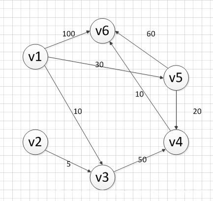
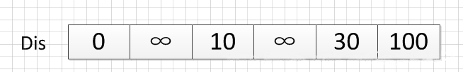
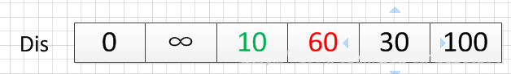
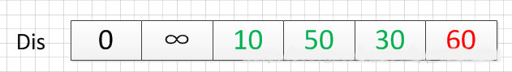
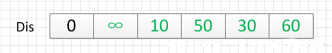

遇到最短路径类的一般一般都是涉及到图相关的操作。

# 一、矩阵类的最小路径和
以leetcode题为例【[LCR 099. 最小路径和](https://leetcode.cn/problems/0i0mDW/description/)】，中等难度。

## 题目描述
给定一个包含非负整数的 m x n 网格 grid ，请找出一条从左上角到右下角的路径，使得路径上的数字总和为最小。

说明：一个机器人每次只能向下或者向右移动一步。

## 示例
```text
示例 1：
输入：grid = [[1,3,1],[1,5,1],[4,2,1]]
输出：7
解释：因为路径 1→3→1→1→1 的总和最小。

示例 2：
输入：grid = [[1,2,3],[4,5,6]]
输出：12
```

提示：
```text
m == grid.length
n == grid[i].length
1 <= m, n <= 200
0 <= grid[i][j] <= 100
```

注意：本题与主站 64 题相同： https://leetcode-cn.com/problems/minimum-path-sum/

## 解题
### 解法1-暴力DFS
看完题目之后没多想误认为是走迷宫的题，于是写了一版暴力 DFS ，结果超时了。
代码逻辑是从左上角到右下角进行深度遍历，并且累计路径和代入下一步计算。

**超时的原因在于**：通常走迷宫的题不会重复经过某个节点，因此时间复杂度是 O(mn)O(mn)O(mn)，以 m，n<=200 来算不会超时； 
但这个题目的暴力 DFS 可以看做是遍历一棵高度为 n+m−1 的二叉树，时间复杂度接近指数级的 2^{n+m-1}，超时也不足为奇。

从网格左上角到右下角的最短路径长度为 n+m−1，因此把它当成树的话高度为 n+m−1。

代码
```java
class Solution {
    public int minPathSum(int[][] grid) {
        if (grid == null || grid[0].length < 1) {
            return 0;
        }
        return dfs(0, 0, grid);
    }

    public int dfs(int rowIndex, int colIndex, int[][] grid) {
        int rowTotal = grid.length;
        int colTotal = grid[0].length;
        if (rowIndex >= rowTotal || colIndex >= colTotal) {
            return -1;
        }
        int min = grid[rowIndex][colIndex];
        int minDown = dfs(rowIndex + 1, colIndex, grid);
        int minRight = dfs(rowIndex, colIndex + 1, grid);
        if (minDown == -1 && minRight == -1) {
            return min;
        } else if (minDown == -1) {
            min += minRight;
        } else if (minRight == -1) {
            min += minDown;
        } else {
            min += Math.min(minDown, minRight);
        }
        return min;
    }
}
```

### 解法2-记忆化DFS
这个解法思路接近于动态规划， dfs 函数的意图是求局部最优解最终得到全局最优解，
其中 dfs(i, j) 代表从终点 (m, n) 到点 (i, j) 的最小路径和，
然后通过哈希表记录点 (i, j) 的最小路径和，后续再次遍历到该节点直接返回最小路径和，无需多余遍历与计算。

代码：
```java
import java.util.*;

class Solution {
    public int minPathSum(int[][] grid) {
        if (grid == null || grid[0].length < 1) {
            return 0;
        }
        Map<String, Integer> cache = new HashMap<>();
        return dfs(0, 0, grid, cache);
    }

    public int dfs(int rowIndex, int colIndex, int[][] grid, Map<String, Integer> cache) {
        int rowTotal = grid.length;
        int colTotal = grid[0].length;

        if (rowIndex >= rowTotal || colIndex >= colTotal) {
            return -1;
        }
        String cellKey = rowIndex + "-" + colIndex;
        if (cache.containsKey(cellKey)) {
            return cache.get(cellKey);
        }
        int min = grid[rowIndex][colIndex];
        int minDown = dfs(rowIndex + 1, colIndex, grid, cache);
        int minRight = dfs(rowIndex, colIndex + 1, grid, cache);
        if (minDown == -1 && minRight == -1) {
            return min;
        } else if (minDown == -1) {
            min += minRight;
        } else if (minRight == -1) {
            min += minDown;
        } else {
            min += Math.min(minDown, minRight);
        }
        cache.put(cellKey, min);
        return min;
    }
}
```

执行结果
```text
执行用时: 16 ms
内存消耗: 47.89 MB
```

### 解法3-动态规划
由于路径的方向只能是向下或向右，因此网格的第一行的每个元素只能从左上角元素开始向右移动到达，
网格的第一列的每个元素只能从左上角元素开始向下移动到达，此时的路径是唯一的，因此每个元素对应的最小路径和即为对应的路径上的数字总和。

对于不在第一行和第一列的元素，可以从其上方相邻元素向下移动一步到达，或者从其左方相邻元素向右移动一步到达，
元素对应的最小路径和等于其上方相邻元素与其左方相邻元素两者对应的最小路径和中的最小值加上当前元素的值。
由于每个元素对应的最小路径和与其相邻元素对应的最小路径和有关，因此可以使用动态规划求解。

创建二维数组 dp，与原始网格的大小相同，dp[i][j] 表示从左上角出发到 (i,j) 位置的最小路径和。
显然，dp[0][0]=grid[0][0]。对于 dp 中的其余元素，通过以下状态转移方程计算元素值。

- 当 i>0 且 j=0 时，dp[i][0] = dp[i−1][0] + grid[i][0]。
- 当 i=0 且 j>0 时，dp[0][j] = dp[0][j−1] + grid[0][j]。
- 当 i>0 且 j>0 时，dp[i][j] = min(dp[i−1][j], dp[i][j−1]) + grid[i][j]。

最后得到 dp[m−1][n−1] 的值即为从网格左上角到网格右下角的最小路径和。

代码：
```java
class Solution {
    public int minPathSum(int[][] grid) {
        if (grid == null || grid.length == 0 || grid[0].length == 0) {
            return 0;
        }
        
        int rows = grid.length, columns = grid[0].length;
        int[][] dp = new int[rows][columns];
        
        dp[0][0] = grid[0][0];
        
        for (int i = 1; i < rows; i++) {
            dp[i][0] = dp[i - 1][0] + grid[i][0];
        }
        
        for (int j = 1; j < columns; j++) {
            dp[0][j] = dp[0][j - 1] + grid[0][j];
        }
        
        for (int i = 1; i < rows; i++) {
            for (int j = 1; j < columns; j++) {
                dp[i][j] = Math.min(dp[i - 1][j], dp[i][j - 1]) + grid[i][j];
            }
        }
        
        return dp[rows - 1][columns - 1];
    }
}
```

执行结果
```text
执行用时: 2 ms
内存消耗: 44.32 MB
```

### 最后
题解区有更优秀的动态规划解法，有降维 DP（一维）、有把原始数组 grid 作为 DP 数组等，主要降低了空间复杂度，很值得学习。

# 二、图的最短路径
## 最短路径的概念
最短路径的问题是比较典型的应用问题。
在图中，确定了起始点和终点之后，一般情况下都可以有很多条路径来连接两者。
而**边**或**弧**的权值最小的那一条路径就称为**两点之间的最短路径**，路径上的第一个顶点为源点，最后一个顶点为终点。

图的最短路径的算法有很多，本文主要介绍迪杰斯特拉（Dijkstra）提出的一种按照长度递增的次序产生的最短路径的算法。

## Dijkstra算法介绍
### Dijkstra算法的特点
Dijkstra算法使用了【广度优先搜索】解决赋权**有向图**或者**无向图**的单源最短路径问题，算法最终得到一个最短路径树。
该算法常用于路由算法或者作为其他图算法的一个子模块。

该算法的时间复杂度是n的平方，可以使用堆优化。

但是，要注意一点，**Dijkstra算法只能适用于权值为正的情况**下；如果权值存在负数，则不能使用。

### Dijkstra算法的思想
1. 设置**两个顶点集S和T**，集合S中存放已经找到最短路径的顶点，集合T中存放着当前还未找到最短路径的顶点；
2. 初始状态下，集合S中只包含源点V1，T中为除了源点之外的其余顶点，
   此时源点到各顶点的最短路径为两个顶点所连的边上的权值，如果源点V1到该顶点没有边，则最小路径为无穷大；
3. 从集合T中选取到源点V1的路径长度最短的顶点Vi加入到集合S中；
4. 修改源点V1到集合T中剩余顶点Vj的最短路径长度。新的最短路径长度值为Vj原来的最短路径长度值与顶点Vi的最短路径长度加上Vi到Vj的路径长度值中的较小者；
5. 不断重复步骤3、4，直至集合T的顶点全部加入到集合S中。

### Dijkstra算法的实例演示
下面求下图，从源点v1到其他各个顶点的最短路径：



首先第一步，我们先声明一个dis数组（这是一个距离数组，用于记录各点距离源点的距离），该数组初始化的值为： 



我们的顶点集T的初始化为：T={v1}。

既然是求 v1顶点到其余各个顶点的最短路程，那就先找一个离 1 号顶点最近的顶点。
通过数组 dis 可知当前离v1顶点最近是 v3顶点。
当选择了 2 号顶点后，dis[2]（下标从0开始）的值就已经从“估计值”变为了“确定值”，即 v1顶点到 v3顶点的最短路程就是当前 dis[2]值。
将V3加入到T中。

为什么呢？因为目前离 v1顶点最近的是 v3顶点，并且这个图所有的边都是正数，那么肯定不可能通过第三个顶点中转，使得 v1顶点到 v3顶点的路程进一步缩短了。
因为 v1顶点到其它顶点的路程肯定没有 v1到 v3顶点短。

OK，既然确定了一个顶点的最短路径，
下面我们就要根据这个新入的顶点V3会有出度，发现以v3 为弧尾的有： < v3,v4 >,那么我们看看路径：v1–v3–v4的长度是否比v1–v4短，其实这个已经是很明显的了，
因为dis[3]代表的就是v1–v4的长度为无穷大，而v1–v3–v4的长度为：10+50=60，所以更新dis[3]的值,得到如下结果：



因此 dis[3]要更新为 60。这个过程有个专业术语叫做“松弛”。
即 v1顶点到 v4顶点的路程即 dis[3]，通过 < v3,v4> 这条边松弛成功。
这便是 Dijkstra 算法的主要思想：通过“边”来松弛v1顶点到其余各个顶点的路程。

然后，我们又从除dis[2]和dis[0]外的其他值中寻找最小值，发现dis[4]的值最小，通过之前是解释的原理，可以知道v1到v5的最短距离就是dis[4]的值，
然后，我们把v5加入到集合T中，然后，考虑v5的出度是否会影响我们的数组dis的值，v5有两条出度：< v5,v4>和 < v5,v6>,
然后我们发现：v1–v5–v4的长度为：50，而dis[3]的值为60，所以我们要更新dis[3]的值.另外，v1-v5-v6的长度为：90，而dis[5]为100，所以我们需要更新dis[5]的值。
更新后的dis数组如下图：


然后，继续从dis中选择未确定的顶点的值中选择一个最小的值，发现dis[3]的值是最小的，所以把v4加入到集合T中，此时集合T={v1,v3,v5,v4},
然后，考虑v4的出度是否会影响我们的数组dis的值，v4有一条出度：< v4,v6>,然后我们发现：v1–v5–v4–v6的长度为：60，而dis[5]的值为90，所以我们要更新dis[5]的值，
更新后的dis数组如下图：



然后，我们使用同样原理，分别确定了v6和v2的最短路径，最后dis的数组的值如下： 



因此，从图中，我们可以发现v1-v2的值为：∞，代表没有路径从v1到达v2。所以我们得到的最后的结果为：
```text
起点  终点    最短路径    长度
v1    v2     无          ∞    
      v3     {v1,v3}    10
      v4     {v1,v5,v4}  50
      v5     {v1,v5}    30
      v6     {v1，v5,v4,v6} 60
```

由此分析下来，我们可以得到以下几点：
- 1、需要设立两个数组，一个数组为distance，用于存放个顶点距离源点的距离；另一个数组为st，用于判断顶点是在哪一个集合内（true为在S集合，false为在T集合内）。

- 2、Dijkstra算法的精髓：
  - 每次循环都将T集合内距离源点最近的那个点加入到S集合中，且加入的那个点距离源点的距离由“最短距离估计值”转变成“最短距离准确值”；
  - 每次循环添加一个点到S集合中后，会导致与加入的那个点相邻的顶点可能会发生距离的更新，也就是“最短距离估计值”的更新。
    更新方法是取原本的“最短距离估计值”与新加入的那个点的“最短距离确定值”+新加入的那个点与其邻点的距离的较小者。
  - “最短距离估计值”的真正内涵：其实可以把S集合看成一个黑箱子，“最短距离估计值”就是该顶点经过黑箱子里的各个点到源点的最短距离，
    但不能保证该顶点是否可以通过黑箱子外（T集合）的顶点绕路达到更短。只有每次循环中“最短距离估计值”中的最小值，才能确定为“最短距离确定值”加入到集合S。

图接口：
```java
public interface IGraph<E> {
	 int getNumOfVertex(); // 获取顶点的个数
	 boolean insertVex(E v); // 插入顶点
	 boolean deleteVex(E v); // 删除顶点
	 int indexOfVex(E v); // 定位顶点的位置
	 E valueOfVex(int v); // 定位指定位置的顶点
	 boolean insertEdge(int v1, int v2,int weight); // 插入边
	 boolean deleteEdge(int v1, int v2); // 删除边
	 int getEdge(int v1,int v2); // 查找边
	 String depthFirstSearch(int v ); // 深度优先搜索遍历
	 String breadthFirstSearch(int v ); // 广度优先搜索遍历
	 int[] dijkstra(int v); // 查找源点到其它顶点的路径
}
```

基于邻接矩阵的代码实现：
```text
public class GraphAdjMatrix<E> implements IGraph<E> {
	private E[] vexs; // 存储图的顶点的一维数组
	private int[][] edges; // 存储图的边的二维数组
	private int numOfVexs; // 顶点的实际数量
	private int maxNumOfVexs; // 顶点的最大数量
	private boolean[] visited; // 判断顶点是否被访问过
  
	public GraphAdjMatrix(int maxNumOfVexs, Class<E> type) {
		this.maxNumOfVexs = maxNumOfVexs;
		edges = new int[maxNumOfVexs][maxNumOfVexs];
		vexs = (E[]) Array.newInstance(type, maxNumOfVexs);
	}
 
	// 得到顶点的数目
	public int getNumOfVertex() {
		return numOfVexs;
	}
    
	// 插入顶点
	public boolean insertVex(E v) {
		if (numOfVexs >= maxNumOfVexs)
			return false;
		vexs[numOfVexs++] = v;
		return true;
	}
    
	// 删除顶点
	public boolean deleteVex(E v) {
		for (int i = 0; i < numOfVexs; i++) {
			if (vexs[i].equals(v)) {
				for (int j = i; j < numOfVexs - 1; j++) {
					vexs[j] = vexs[j + 1];
				}
				vexs[numOfVexs - 1] = null;
				for (int col = i; col < numOfVexs - 1; col++) {
					for (int row = 0; row < numOfVexs; row++) {
						edges[col][row] = edges[col + 1][row];
					}
				}
				for (int row = i; row < numOfVexs - 1; row++) {
					for (int col = 0; col < numOfVexs; col++) {
						edges[col][row] = edges[col][row + 1];
					}
				}
				numOfVexs--;
				return true;
			}
		}
		return false;
	}
    
	// 定位顶点的位置
	public int indexOfVex(E v) {
		for (int i = 0; i < numOfVexs; i++) {
			if (vexs[i].equals(v)) {
				return i;
			}
		}
		return -1;
	}
    
	// 定位指定位置的顶点
    public E valueOfVex(int v) {
        if (v < 0 ||v >= numOfVexs )
            return null;
        return vexs[v];
    }
    
	// 插入边
	public boolean insertEdge(int v1, int v2, int weight) {
		if (v1 < 0 || v2 < 0 || v1 >= numOfVexs || v2 >= numOfVexs)
			throw new ArrayIndexOutOfBoundsException();
		edges[v1][v2] = weight;
		edges[v2][v1] = weight;
		return true;
	}
    
	// 删除边
	public boolean deleteEdge(int v1, int v2) {
		if (v1 < 0 || v2 < 0 || v1 >= numOfVexs || v2 >= numOfVexs)
			throw new ArrayIndexOutOfBoundsException();
		edges[v1][v2] = 0;
		edges[v2][v1] = 0;
		return true;
	}
    
	// 查找边
	public int getEdge(int v1,int v2){
		if (v1 < 0 || v2 < 0 || v1 >= numOfVexs || v2 >= numOfVexs)
			throw new ArrayIndexOutOfBoundsException();
		return edges[v1][v2];
	}
    
	// 深度优先搜索遍历
	public String depthFirstSearch(int v) {
		if (v < 0 || v >= numOfVexs)
			throw new ArrayIndexOutOfBoundsException();
		visited = new boolean[numOfVexs];
		StringBuilder sb = new StringBuilder();
		Stack<Integer> stack = new Stack<Integer>();
		stack.push(v);
		visited[v] = true;
		while (!stack.isEmpty()) {
			v = stack.pop();
			sb.append(vexs[v] + ",");
			for (int i = numOfVexs - 1; i >= 0; i--) {
				if ((edges[v][i] != 0 && edges[v][i] != Integer.MAX_VALUE)
						&& !visited[i]) {
					stack.push(i);
					visited[i] = true;
				}
			}
		}
		return sb.length() > 0 ? sb.substring(0, sb.length() - 1) : null;
	}
    
	// 广度优先搜索遍历
	public String breadthFirstSearch(int v) {
		if (v < 0 || v >= numOfVexs)
			throw new ArrayIndexOutOfBoundsException();
		visited = new boolean[numOfVexs];
		StringBuilder sb = new StringBuilder();
		Queue<Integer> queue = new LinkedList<Integer>();
		queue.offer(v);
		visited[v] = true;
		while (!queue.isEmpty()) {
			v = queue.poll();
			sb.append(vexs[v] + ",");
			for (int i = 0; i < numOfVexs; i++) {
				if ((edges[v][i] != 0 && edges[v][i] != Integer.MAX_VALUE)
						&& !visited[i]) {
					queue.offer(i);
					visited[i] = true;
				}
			}
		}
		return sb.length() > 0 ? sb.substring(0, sb.length() - 1) : null;
	}
    
	// 实现Dijkstra算法
	public int[] dijkstra(int v) {
		if (v < 0 || v >= numOfVexs) {
            return null;
        }
        
		boolean[] st = new boolean[numOfVexs]; // 默认初始为false
		int[] distance = new int[numOfVexs]; // 存放源点到其他点的矩离
		
		for (int i = 0; i < numOfVexs; i++) {
            for (int j = i + 1; j < numOfVexs; j++) {
				if (edges[i][j] == 0) {
					edges[i][j] = Integer.MAX_VALUE;
					edges[j][i] = Integer.MAX_VALUE;
				}
			}
        }
			
		for (int i = 0; i < numOfVexs; i++) {
			distance[i] = edges[v][i];
		}
		st[v] = true;
		// 处理从源点到其余顶点的最短路径
		for (int i = 0; i < numOfVexs; ++i) {
			int min = Integer.MAX_VALUE;
			int index = -1;
			// 比较从源点到其余顶点的路径长度
			for (int j = 0; j < numOfVexs; ++j) {
				// 从源点到j顶点的最短路径还没有找到
				if (!st[j]) {
					// 从源点到j顶点的路径长度最小
					if (distance[j] < min) {
						index = j;
						min = distance[j];
					}
				}
			}
			// 找到源点到索引为index顶点的最短路径长度
			if(index != -1) {
              st[index] = true;
            }
			// 更新当前最短路径及距离
			for (int w = 0; w < numOfVexs; w++) {
                if (!st[w] && edges[index][w] != Integer.MAX_VALUE && (min + edges[index][w] < distance[w])) {
                  distance[w] = min + edges[index][w];
                }
            }
        }
		return distance;
	}
}
```

基于邻接表的代码实现：
```text
public class GraphAdjList<E> implements IGraph<E> {
	// 邻接表中表对应的链表的顶点
	private static class ENode {
		int adjvex; // 邻接顶点序号
		int weight;// 存储边或弧相关的信息，如权值
		ENode nextadj; // 下一个邻接表结点
 
		public ENode(int adjvex, int weight) {
			this.adjvex = adjvex;
			this.weight = weight;
		}
	}
 
	// 邻接表中表的顶点
	private static class VNode<E> {
		E data; // 顶点信息
		ENode firstadj; // //邻接表的第1个结点
	};
 
	private VNode<E>[] vexs; // 顶点数组
	private int numOfVexs;// 顶点的实际数量
	private int maxNumOfVexs;// 顶点的最大数量
	private boolean[] visited;// 判断顶点是否被访问过
 
	@SuppressWarnings("unchecked")
	public GraphAdjList(int maxNumOfVexs) {
		this.maxNumOfVexs = maxNumOfVexs;
		vexs = (VNode<E>[]) Array.newInstance(VNode.class, maxNumOfVexs);
	}
 
	// 得到顶点的数目
	public int getNumOfVertex() {
		return numOfVexs;
	}
 
	// 插入顶点
	public boolean insertVex(E v) {
		if (numOfVexs >= maxNumOfVexs)
			return false;
		VNode<E> vex = new VNode<E>();
		vex.data = v;
		vexs[numOfVexs++] = vex;
		return true;
	}
 
	// 删除顶点
	public boolean deleteVex(E v) {
		for (int i = 0; i < numOfVexs; i++) {
			if (vexs[i].data.equals(v)) {
				for (int j = i; j < numOfVexs - 1; j++) {
					vexs[j] = vexs[j + 1];
				}
				vexs[numOfVexs - 1] = null;
				numOfVexs--;
				ENode current;
				ENode previous;
				for (int j = 0; j < numOfVexs; j++) {
					if (vexs[j].firstadj == null)
						continue;
					if (vexs[j].firstadj.adjvex == i) {
						vexs[j].firstadj = null;
						continue;
					}
					current = vexs[j].firstadj;
					while (current != null) {
						previous = current;
						current = current.nextadj;
						if (current != null && current.adjvex == i) {
							previous.nextadj = current.nextadj;
							break;
						}
					}
				}
				for (int j = 0; j < numOfVexs; j++) {
					current = vexs[j].firstadj;
					while (current != null) {
						if (current.adjvex > i)
							current.adjvex--;
						current = current.nextadj;
					}
				}
				return true;
			}
		}
		return false;
	}
 
	// 定位顶点的位置
	public int indexOfVex(E v) {
		for (int i = 0; i < numOfVexs; i++) {
			if (vexs[i].data.equals(v)) {
				return i;
			}
		}
		return -1;
	}
 
	// 定位指定位置的顶点
	public E valueOfVex(int v) {
		if (v < 0 || v >= numOfVexs)
			return null;
		return vexs[v].data;
	}
 
	// 插入边
	public boolean insertEdge(int v1, int v2, int weight) {
		if (v1 < 0 || v2 < 0 || v1 >= numOfVexs || v2 >= numOfVexs)
			throw new ArrayIndexOutOfBoundsException();
		ENode vex1 = new ENode(v2, weight);
 
		// 索引为index1的顶点没有邻接顶点
		if (vexs[v1].firstadj == null) {
			vexs[v1].firstadj = vex1;
		}
		// 索引为index1的顶点有邻接顶点
		else {
			vex1.nextadj = vexs[v1].firstadj;
			vexs[v1].firstadj = vex1;
		}
		ENode vex2 = new ENode(v1, weight);
		// 索引为index2的顶点没有邻接顶点
		if (vexs[v2].firstadj == null) {
			vexs[v2].firstadj = vex2;
		}
		// 索引为index1的顶点有邻接顶点
		else {
			vex2.nextadj = vexs[v2].firstadj;
			vexs[v2].firstadj = vex2;
		}
		return true;
	}
 
	// 删除边
	public boolean deleteEdge(int v1, int v2) {
		if (v1 < 0 || v2 < 0 || v1 >= numOfVexs || v2 >= numOfVexs)
			throw new ArrayIndexOutOfBoundsException();
		// 删除索引为index1的顶点与索引为index2的顶点之间的边
		ENode current = vexs[v1].firstadj;
		ENode previous = null;
		while (current != null && current.adjvex != v2) {
			previous = current;
			current = current.nextadj;
		}
		if (current != null)
			previous.nextadj = current.nextadj;
		// 删除索引为index2的顶点与索引为index1的顶点之间的边
		current = vexs[v2].firstadj;
		while (current != null && current.adjvex != v1) {
			previous = current;
			current = current.nextadj;
		}
		if (current != null)
			previous.nextadj = current.nextadj;
		return true;
	}
 
	// 得到边
	public int getEdge(int v1, int v2) {
		if (v1 < 0 || v2 < 0 || v1 >= numOfVexs || v2 >= numOfVexs)
			throw new ArrayIndexOutOfBoundsException();
		ENode current = vexs[v1].firstadj;
		while (current != null) {
			if (current.adjvex == v2) {
				return current.weight;
			}
			current = current.nextadj;
		}
		return 0;
	}
 
	// 深度优先搜索遍历
	public String depthFirstSearch(int v) {
		if (v < 0 || v >= numOfVexs)
			throw new ArrayIndexOutOfBoundsException();
		visited = new boolean[numOfVexs];
		StringBuilder sb = new StringBuilder();
		Stack<Integer> stack = new Stack<Integer>();
		stack.push(v);
		visited[v] = true;
		ENode current;
		while (!stack.isEmpty()) {
			v = stack.pop();
			sb.append(vexs[v].data + ",");
			current = vexs[v].firstadj;
			while (current != null) {
				if (!visited[current.adjvex]) {
					stack.push(current.adjvex);
					visited[current.adjvex] = true;
				}
				current = current.nextadj;
			}
		}
		return sb.length() > 0 ? sb.substring(0, sb.length() - 1) : null;
	}
 
	// 广度优先搜索遍历
	public String breadthFirstSearch(int v) {
		if (v < 0 || v >= numOfVexs)
			throw new ArrayIndexOutOfBoundsException();
		visited = new boolean[numOfVexs];
		StringBuilder sb = new StringBuilder();
		Queue<Integer> queue = new LinkedList<Integer>();
		queue.offer(v);
		visited[v] = true;
		ENode current;
		while (!queue.isEmpty()) {
			v = queue.poll();
			sb.append(vexs[v].data + ",");
			current = vexs[v].firstadj;
			while (current != null) {
				if (!visited[current.adjvex]) {
					queue.offer(current.adjvex);
					visited[current.adjvex] = true;
				}
				current = current.nextadj;
			}
		}
		return sb.length() > 0 ? sb.substring(0, sb.length() - 1) : null;
	}
 
	// 实现Dijkstra算法
	public int[] dijkstra(int v) {
		if (v < 0 || v >= numOfVexs)
			throw new ArrayIndexOutOfBoundsException();
		boolean[] st = new boolean[numOfVexs];// 默认初始为false
		int[] distance = new int[numOfVexs];// 存放源点到其他点的距离
		for (int i = 0; i < numOfVexs; i++) {
			distance[i] = Integer.MAX_VALUE;
		}
		ENode current;
		current = vexs[v].firstadj;
		while (current != null) {
			distance[current.adjvex] = current.weight;
			current = current.nextadj;
		}
		distance[v] = 0;
		st[v] = true;
		// 处理从源点到其余顶点的最短路径
		for (int i = 0; i < numOfVexs; i++) {
			int min = Integer.MAX_VALUE;
			int index = -1;
			// 比较从源点到其余顶点的路径长度
			for (int j = 0; j < numOfVexs; j++) {
				// 从源点到j顶点的最短路径还没有找到
				if (st[j] == false) {
					// 从源点到j顶点的路径长度最小
					if (distance[j] < min) {
						index = j;
						min = distance[j];
					}
				}
			}
			// 找到源点到索引为index顶点的最短路径长度
			if (index != -1)
				st[index] = true;
			// 更新当前最短路径及距离
			for (int w = 0; w < numOfVexs; w++)
				if (st[w] == false) {
					current = vexs[w].firstadj;
					while (current != null) {
						if (current.adjvex == index)
							if ((min + current.weight) < distance[w]) {
								distance[w] = min + current.weight;
								break;
							}
						current = current.nextadj;
					}
				}
		}
		return distance;
	}
}
```