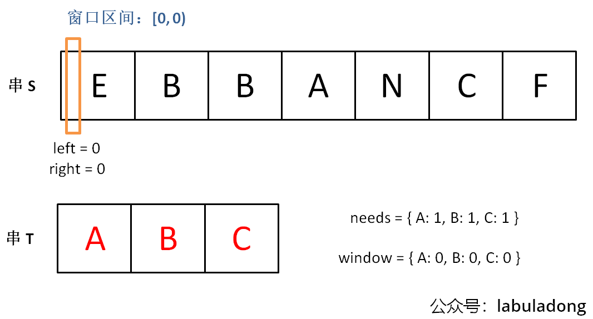
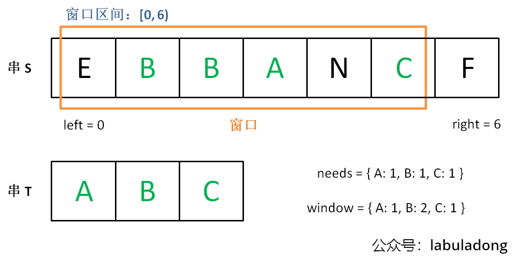
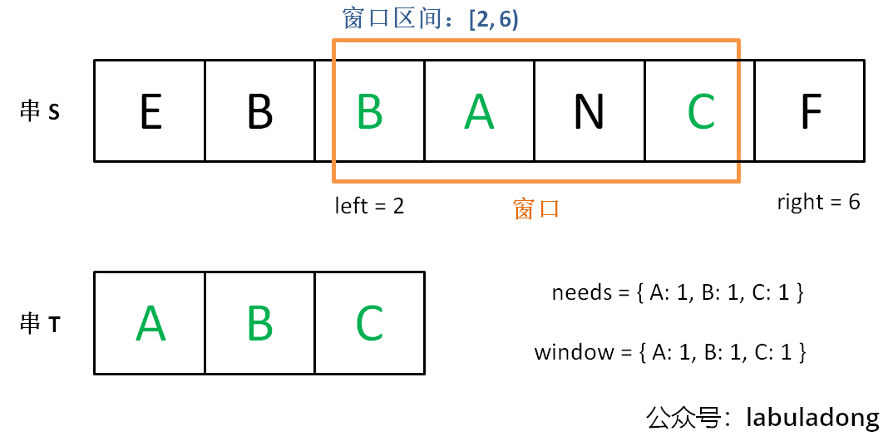
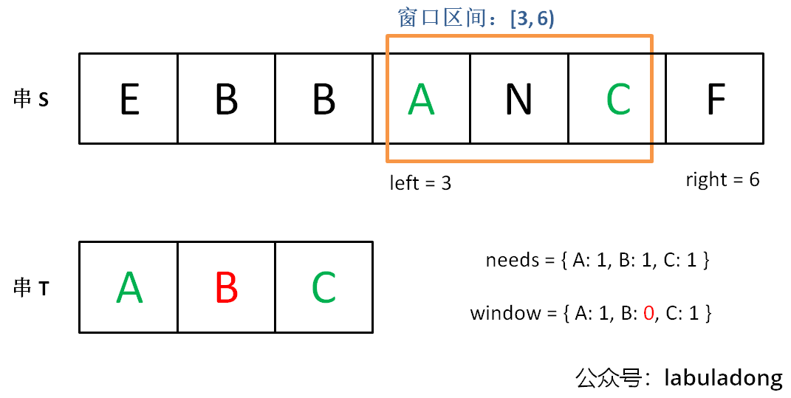

本文就解决一类最难掌握的双指针技巧：滑动窗口技巧。并总结出一套框架，可以保你闭着眼睛都能写出正确的解法。

# 滑动窗口框架概览
**滑动窗口**算法技巧主要用来解决**子数组问题**，比如让你寻找符合某个条件的最长/最短子数组。

如果用暴力解的话，你需要嵌套 for 循环这样穷举所有子数组，时间复杂度是 O(N^2)：
```text
for (int i = 0; i < nums.size(); i++) {
    for (int j = i; j < nums.size(); j++) {
        // nums[i, j] 是一个子数组
    }
}
```
滑动窗口算法技巧的思路也不难，就是维护一个窗口，不断滑动，然后更新答案，该算法的大致逻辑如下：
```text
int left = 0, right = 0;

while (right < nums.size()) {
    // 增大窗口
    window.add(nums[right]);
    right++;
    
    while (window needs shrink) {
        // 缩小窗口
        window.remove(nums[left]);
        left++;
    }
}
```
基于滑动窗口算法框架写出的代码，时间复杂度是 O(N)，比嵌套 for 循环的暴力解法效率高。

为啥是 `O(N)`？
```text
肯定有读者要问了，你这个滑动窗口框架不也用了一个嵌套 while 循环？为啥复杂度是 O(N) 呢？

简单说，指针 left, right 不会回退（它们的值只增不减），
所以字符串/数组中的每个元素都只会进入窗口一次，然后被移出窗口一次，不会说有某些元素多次进入和离开窗口，
所以算法的时间复杂度就和字符串/数组的长度成正比。

反观嵌套 for 循环的暴力解法，那个 j 会回退，所以某些元素会进入和离开窗口多次，所以时间复杂度就是 O(N^2) 了。
```
其实困扰大家的，不是算法的思路，而是各种细节问题。
比如说如何向窗口中添加新元素，如何缩小窗口，在窗口滑动的哪个阶段更新结果。
即便你明白了这些细节，代码也容易出 bug，找 bug 还不知道怎么找，真的挺让人心烦的。

所以，今天我就写一套**滑动窗口算法的代码框架**，我连再哪里做输出 debug 都给你写好了，以后遇到相关的问题，
你就默写出来如下框架然后改三个地方就行，保证不会出 bug。

因为本文的例题大多是子串相关的题目，字符串实际上就是数组，所以我就把输入设置成字符串了。
你做题的时候根据具体题目自行变通即可：
```text
import java.util.HashMap;
import java.util.Map;

public class Main {
    /* 滑动窗口算法框架 */
    public static void slidingWindow(String s) {
        // 用合适的数据结构记录窗口中的数据，根据具体场景变通
        // 比如说，我想记录窗口中元素出现的次数，就用 map
        // 我想记录窗口中的元素和，就用 int
        Map<Character, Integer> window = new HashMap<>();
        
        int left = 0, right = 0;
        while (right < s.length()) {
            // c 是将移入窗口的字符
            char c = s.charAt(right);
            window.put(c, window.getOrDefault(c, 0) + 1);
            // 增大窗口
            right++;
            // 进行窗口内数据的一系列更新
            // ...

            /*** debug 输出的位置 ***/
            // 注意在最终的解法代码中不要 print
            // 因为 IO 操作很耗时，可能导致超时
            System.out.printf("window: [%d, %d)\n", left, right);
            /********************/
            
            // 判断左侧窗口是否要收缩
            while (left < right && window needs shrink) {
                // d 是将移出窗口的字符
                char d = s.charAt(left);
                window.put(d, window.get(d) - 1);
                // 缩小窗口
                left++;
                // 进行窗口内数据的一系列更新
                // ...
            }
        }
    }

    public static void main(String[] args) {
        slidingWindow("your string here");
    }
}
```
**框架中两处 ... 表示的更新窗口数据的地方，在具体的题目中，你需要做的就是往这里面填代码逻辑。**
而且，这两个 ... 处的操作分别是扩大和缩小窗口的更新操作，等会你会发现它们操作是完全对称的。

说句题外话，有些读者评论我这个框架，说散列表速度慢，不如用数组代替散列表；
还有些人喜欢把代码写得特别短小，说我这样代码太多余，速度不够快。
我的意见是，算法主要看时间复杂度，你能确保自己的时间复杂度最优就行了。
至于 LeetCode 的运行速度，那个有点玄学，只要不是慢的离谱就没啥问题，根本不值得你从编译层面优化，不要舍本逐末……

再说，我的算法教程重点在于算法思想，你先做到能把框架思维运用自如，然后随便你魔改代码好吧，保你怎么写都能写对。

言归正传，下面就直接上四道力扣原题来套这个框架，其中第一道题会详细说明其原理，后面四道就直接闭眼睛秒杀了。

因为滑动窗口很多时候都是在处理字符串相关的问题，而 Java 处理字符串不方便，所以本文代码为 C++ 实现。
不会用到什么特定的编程语言技巧，但是还是简单介绍一下一些用到的数据结构，以免有的读者因为语言的细节问题阻碍对算法思想的理解：

unordered_map 就是哈希表（字典），相当于 Java 的 HashMap，
它的一个方法 count(key) 相当于 Java 的 containsKey(key) 可以判断键 key 是否存在。

可以使用方括号访问键对应的值 map[key]。
需要注意的是，如果该 key 不存在，C++ 会自动创建这个 key，并把 map[key] 赋值为 0。
所以代码中多次出现的 map[key]++ 相当于 Java 的 map.put(key, map.getOrDefault(key, 0) + 1)。

另外，Java 中的 Integer 和 String 这种包装类不能直接用 == 进行相等判断，
而应该使用类的 equals 方法，这个语言特性坑了不少读者，在代码部分我会给出具体提示。

# 一、最小覆盖子串
先来看看力扣第 76 题「[最小覆盖子串](https://leetcode.cn/problems/minimum-window-substring/)」难度 Hard：
```text
76. 最小覆盖子串
给你一个字符串 s 、一个字符串 t 。
返回 s 中涵盖 t 所有字符的最小子串。
如果 s 中不存在涵盖 t 所有字符的子串，则返回空字符串 "" 。

注意：
对于 t 中重复字符，我们寻找的子字符串中该字符数量必须不少于 t 中该字符数量。
如果 s 中存在这样的子串，我们保证它是唯一的答案。

示例 1：
输入：s = "ADOBECODEBANC", t = "ABC"
输出："BANC"
解释：最小覆盖子串 "BANC" 包含来自字符串 t 的 'A'、'B' 和 'C'。

示例 2：
输入：s = "a", t = "a"
输出："a"
解释：整个字符串 s 是最小覆盖子串。

示例 3:
输入: s = "a", t = "aa"
输出: ""
解释: t 中两个字符 'a' 均应包含在 s 的子串中，
因此没有符合条件的子字符串，返回空字符串。

提示：
m == s.length
n == t.length
1 <= m, n <= 10^5
s 和 t 由英文字母组成

进阶：你能设计一个在 o(m+n) 时间内解决此问题的算法吗？
```
就是说要在 S(source) 中找到包含 T(target) 中全部字母的一个子串，且这个子串一定是所有可能子串中最短的。

如果我们使用暴力解法，代码大概是这样的：
```text
for (int i = 0; i < s.size(); i++)
    for (int j = i + 1; j < s.size(); j++)
        if s[i:j] 包含 t 的所有字母:
            更新答案
```
思路很直接，但是显然，这个算法的复杂度肯定大于 O(N^2) 了，不好。

**滑动窗口算法的思路是这样：**

1、我们在字符串 S 中使用双指针中的左右指针技巧，
初始化 left = right = 0，把索引左闭右开区间 [left, right) 称为一个「窗口」。

2、我们先不断地增加 right 指针扩大窗口 [left, right)，直到窗口中的字符串符合要求（包含了 T 中的所有字符）。

3、此时，我们停止增加 right，转而不断增加 left 指针缩小窗口 [left, right)，
直到窗口中的字符串不再符合要求（不包含 T 中的所有字符了）。
同时，每次增加 left，我们都要更新一轮结果。

4、重复第 2 和第 3 步，直到 right 到达字符串 S 的尽头。

这个思路其实也不难，第 2 步相当于在寻找一个「可行解」，然后第 3 步在优化这个「可行解」，最终找到最优解，也就是最短的覆盖子串。
左右指针轮流前进，窗口大小增增减减，就好像一条毛毛虫，一伸一缩，不断向右滑动，这就是「滑动窗口」这个名字的来历。

下面画图理解一下，needs 和 window 相当于计数器，分别记录 T 中字符出现次数和「窗口」中的相应字符的出现次数。

初始状态：



增加 right，直到窗口 [left, right) 包含了 T 中所有字符：



现在开始增加 left，缩小窗口 [left, right)：



直到窗口中的字符串不再符合要求，left 不再继续移动：



之后重复上述过程，先移动 right，再移动 left…… 直到 right 指针到达字符串 S 的末端，算法结束。

如果你能够理解上述过程，恭喜，你已经完全掌握了滑动窗口算法思想。现在我们来看看这个滑动窗口代码框架怎么用：

首先，初始化 window 和 need 两个哈希表，记录窗口中的字符和需要凑齐的字符：
```text
unordered_map<char, int> need, window;
for (char c : t) need[c]++;
```
然后，使用 left 和 right 变量初始化窗口的两端，
不要忘了，区间 [left, right) 是左闭右开的，所以初始情况下窗口没有包含任何元素：
```text
int left = 0, right = 0;
int valid = 0; 
while (right < s.size()) {
    // 开始滑动
}
```
其中 **valid 变量表示窗口中满足 need 条件的字符个数**，
如果 valid 和 need.size 的大小相同，则说明窗口已满足条件，已经完全覆盖了串 T。

现在开始套模板，只需要思考以下几个问题：

1、什么时候应该移动 right 扩大窗口？窗口加入字符时，应该更新哪些数据？

2、什么时候窗口应该暂停扩大，开始移动 left 缩小窗口？从窗口移出字符时，应该更新哪些数据？

3、我们要的结果应该在扩大窗口时还是缩小窗口时进行更新？

如果一个字符进入窗口，应该增加 window 计数器；如果一个字符将移出窗口的时候，应该减少 window 计数器；
当 valid 满足 need 时应该收缩窗口；应该在收缩窗口的时候更新最终结果。

下面是完整代码：
```java
class Solution {
    /**
     * 求字符串 s 中包含字符串 t 所有字符的最小子串
     * @param s 源字符串
     * @param t 给定字符串
     * @return 满足条件的最小子串
     */
    public String minWindow(String s, String t) {
        // 用于记录需要的字符和窗口中的字符及其出现的次数
        Map<Character, Integer> need = new HashMap<>();
        Map<Character, Integer> window = new HashMap<>();
        // 统计 t 中各字符出现次数
        for (char c : t.toCharArray()) {
            need.put(c, need.getOrDefault(c, 0) + 1);
        }
        
        int left = 0, right = 0;
        // 窗口中满足需要的字符个数
        int valid = 0; 
        // 记录最小覆盖子串的起始索引及长度
        int start = 0, len = Integer.MAX_VALUE;
        while (right < s.length()) {
            // c 是将移入窗口的字符
            char c = s.charAt(right);
            // 扩大窗口
            right++;
            // 进行窗口内数据的一系列更新
            if (need.containsKey(c)) {
                window.put(c, window.getOrDefault(c, 0) + 1);
                // 只有当 window[c] 和 need[c] 对应的出现次数一致时，才能满足条件，valid 才能 +1
                if (window.get(c).equals(need.get(c))) {
                    valid++;
                }  
            }

            // 判断左侧窗口是否要收缩
            while (valid == need.size()) {
                // 更新最小覆盖子串
                if (right - left < len) {
                    start = left;
                    len = right - left;
                }
                // d 是将移出窗口的字符
                char d = s.charAt(left);
                // 缩小窗口
                left++;
                // 进行窗口内数据的一系列更新
                if (need.containsKey(d)) {
                    // 只有当 window[d] 内的出现次数和 need[d] 相等时，才能 -1
                    if (window.get(d).equals(need.get(d))) {
                        valid--;
                    }
                    window.put(d, window.get(d) - 1);
                }
            }
        }

        // 返回最小覆盖子串
        return len == Integer.MAX_VALUE ?
                "" : s.substring(start, start + len);
    }
}
```
需要注意的是，当我们发现某个字符在 window 的数量满足了 need 的需要，就要更新 valid，表示有一个字符已经满足要求。
而且，你能发现，两次对窗口内数据的更新操作是完全对称的。

当 valid == need.size() 时，说明 T 中所有字符已经被覆盖，已经得到一个可行的覆盖子串，
现在应该开始收缩窗口了，以便得到「最小覆盖子串」。

移动 left 收缩窗口时，窗口内的字符都是可行解，
所以应该在收缩窗口的阶段进行最小覆盖子串的更新，以便从可行解中找到长度最短的最终结果。

至此，应该可以完全理解这套框架了，滑动窗口算法又不难，就是细节问题让人烦得很。
以后遇到滑动窗口算法，你就按照这框架写代码，保准没有 bug，还省事儿。

下面就直接利用这套框架秒杀几道题吧，你基本上一眼就能看出思路了。

# 二、字符串排列
这是力扣第 567 题「[字符串的排列](https://leetcode.cn/problems/permutation-in-string/)」，难度中等：
```text
567. 字符串的排列 

给你两个字符串 s1 和 s2 ，写一个函数来判断 s2 是否包含 s1 的排列。
如果是，返回 true ；否则，返回 false 。

换句话说，s1 的排列之一是 s2 的 子串 。

示例 1：
输入：s1 = "ab" s2 = "eidbaooo"
输出：true
解释：s2 包含 s1 的排列之一 ("ba").

示例 2：
输入：s1= "ab" s2 = "eidboaoo"
输出：false

提示：
1 <= s1.length, s2.length <= 10^4
s1 和 s2 仅包含小写字母
```
注意，输入的 s1 是可以包含重复字符的，所以这个题难度不小。

这种题目，是明显的滑动窗口算法，相当给你一个 S 和一个 T，请问你 S 中是否存在一个子串，包含 T 中所有字符且不包含其他字符？

首先，先复制粘贴之前的算法框架代码，然后明确刚才提出的几个问题，即可写出这道题的答案：
```java
class Solution {
    public boolean checkInclusion(String t, String s) {
        HashMap<Character, Integer> need = new HashMap<>();
        HashMap<Character, Integer> window = new HashMap<>();
        for (int i = 0; i < t.length(); i++) {
            char c = t.charAt(i);
            need.put(c, need.getOrDefault(c, 0) + 1);
        }

        int left = 0, right = 0;
        int valid = 0;
        while (right < s.length()) {
            char c = s.charAt(right);
            right++;
            if (need.containsKey(c)) {
                window.put(c, window.getOrDefault(c, 0) + 1);
                if (window.get(c).equals(need.get(c))) {
                    valid++;
                }
            }

            // 判断左侧窗口是否要收缩
            while (right - left >= t.length()) {
                // 在这里判断是否找到了合法的子串
                if (valid == need.size()){
                    return true;
                }
                char d = s.charAt(left);
                left++;
                if (need.containsKey(d)) {
                    if (window.get(d).equals(need.get(d))) {
                        valid--;
                    }
                    window.put(d, window.getOrDefault(d, 0) - 1);
                }
            }
        }
        // 未找到符合条件的子串
        return false;
    }
}
```
对于这道题的解法代码，基本上和最小覆盖子串一模一样，只需要改变几个地方：

1、本题移动 left 缩小窗口的时机是窗口大小大于 t.size() 时，因为排列嘛，显然长度应该是一样的。

2、当发现 valid == need.size() 时，就说明窗口中就是一个合法的排列，所以立即返回 true。

至于如何处理窗口的扩大和缩小，和最小覆盖子串完全相同。

# 三、找所有字母异位词
这是力扣第 438 题「[找到字符串中所有字母异位词](https://leetcode.cn/problems/find-all-anagrams-in-a-string/)」，难度中等：
```text
438. 找到字符串中所有字母异位词

给定两个字符串 s 和 p，找到 s 中所有 p 的 异位词 的子串，返回这些子串的起始索引。不考虑答案输出的顺序。

异位词 指由相同字母重排列形成的字符串（包括相同的字符串）。

示例 1:
输入: s = "cbaebabacd", p = "abc"
输出: [0,6]
解释:
起始索引等于 0 的子串是 "cba", 它是 "abc" 的异位词。
起始索引等于 6 的子串是 "bac", 它是 "abc" 的异位词。

示例 2:
输入: s = "abab", p = "ab"
输出: [0,1,2]
解释:
起始索引等于 0 的子串是 "ab", 它是 "ab" 的异位词。
起始索引等于 1 的子串是 "ba", 它是 "ab" 的异位词。
起始索引等于 2 的子串是 "ab", 它是 "ab" 的异位词。

提示:
1 <= s.length, p.length <= 3 * 10^4
s 和 p 仅包含小写字母
```
这个所谓的字母异位词，不就是排列吗，搞个高端的说法就能糊弄人了吗？
相当于，输入一个串 S，一个串 T，找到 S 中所有 T 的排列，返回它们的起始索引。
```java
class Solution {
    public List<Integer> findAnagrams(String s, String t) {
        Map<Character, Integer> need = new HashMap<>();
        Map<Character, Integer> window = new HashMap<>();
        for (int i = 0; i < t.length(); i++) {
            char c = t.charAt(i);
            need.put(c, need.getOrDefault(c, 0) + 1);
        }

        int left = 0, right = 0;
        int valid = 0;
        List<Integer> res = new ArrayList<>(); // 记录结果
        while (right < s.length()) {
            char c = s.charAt(right);
            right++;
            // 进行窗口内数据的一系列更新
            if (need.containsKey(c)) {
                window.put(c, window.getOrDefault(c, 0) + 1);
                if (window.get(c).equals(need.get(c))) {
                    valid++;
                }
            }
            // 判断左侧窗口是否要收缩
            while (right - left >= t.length()) {
                // 当窗口符合条件时，把起始索引加入 res
                if (valid == need.size()) {
                    res.add(left);
                }
                char d = s.charAt(left);
                left++;
                // 进行窗口内数据的一系列更新
                if (need.containsKey(d)) {
                    if (window.get(d).equals(need.get(d))) {
                        valid--;
                    }
                    window.put(d, window.get(d) - 1);
                }
            }
        }
        return res;
    }
}
```
跟寻找字符串的排列一样，只是找到一个合法异位词（排列）之后将起始索引加入 res 即可。

# 四、最长无重复子串
这是力扣第 3 题「无重复字符的最长子串」，难度中等：
```text
3. 无重复字符的最长子串

给定一个字符串 s ，请你找出其中不含有重复字符的 最长子串 的长度。

示例 1:
输入: s = "abcabcbb"
输出: 3 
解释: 因为无重复字符的最长子串是 "abc"，所以其长度为 3。

示例 2:
输入: s = "bbbbb"
输出: 1
解释: 因为无重复字符的最长子串是 "b"，所以其长度为 1。

示例 3:
输入: s = "pwwkew"
输出: 3
解释: 因为无重复字符的最长子串是 "wke"，所以其长度为 3。
     请注意，你的答案必须是 子串 的长度，"pwke" 是一个子序列，不是子串。
     
提示：
0 <= s.length <= 5 * 10^4
s 由英文字母、数字、符号和空格组成
```
这个题终于有了点新意，不是一套框架就出答案，不过反而更简单了，稍微改一改框架就行了：
```java
class Solution {
    int lengthOfLongestSubstring(String s) {
        Map<Character, Integer> window = new HashMap<>();
        int left = 0, right = 0;
        int res = 0; // 记录结果
        while (right < s.length()) {
            char c = s.charAt(right);
            right++;
            // 进行窗口内数据的一系列更新
            window.put(c, window.getOrDefault(c, 0) + 1);
            // 判断左侧窗口是否要收缩
            while (window.get(c) > 1) {
                char d = s.charAt(left);
                left++;
                // 进行窗口内数据的一系列更新
                window.put(d, window.get(d) - 1);
            }
            // 在这里更新答案
            res = Math.max(res, right - left);
        }
        return res;
    }
}
```
这就是变简单了，连 need 和 valid 都不需要，而且更新窗口内数据也只需要简单的更新计数器 window 即可。

当 window[c] 值大于 1 时，说明窗口中存在重复字符，不符合条件，就该移动 left 缩小窗口了嘛。

唯一需要注意的是，在哪里更新结果 res 呢？我们要的是最长无重复子串，哪一个阶段可以保证窗口中的字符串是没有重复的呢？

这里和之前不一样，要在收缩窗口完成后更新 res，因为窗口收缩的 while 条件是存在重复元素，
换句话说收缩完成后一定保证窗口中没有重复嘛。

好了，滑动窗口算法模板就讲到这里，希望大家能理解其中的思想，记住算法模板并融会贯通。
回顾一下，遇到子数组/子串相关的问题，你只要能回答出来以下几个问题，就能运用滑动窗口算法：
- 1、什么时候应该扩大窗口？
- 2、什么时候应该缩小窗口？
- 3、什么时候应该更新答案？

我在 滑动窗口经典习题 中使用这套思维模式列举了更多经典的习题，旨在强化你对算法的理解和记忆，以后就再也不怕子串、子数组问题了。

```text
滑动窗口防滑记

链表子串数组题，用双指针别犹豫。双指针家三兄弟，各个都是万人迷。
快慢指针最神奇，链表操作无压力。归并排序找中点，链表成环搞判定。
左右指针最常见，左右两端相向行。反转数组要靠它，二分搜索是弟弟。
滑动窗口老猛男，子串问题全靠它。左右指针滑窗口，一前一后齐头进。
```
