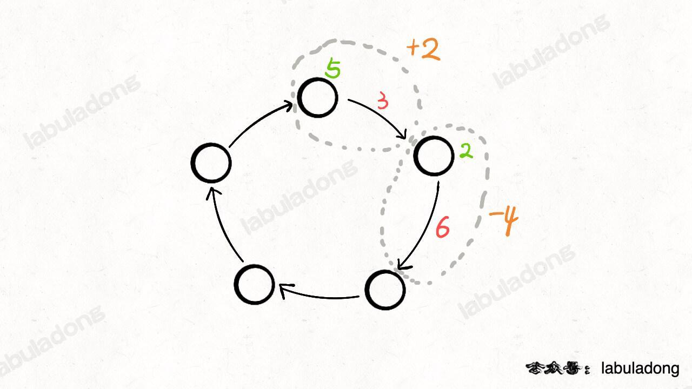
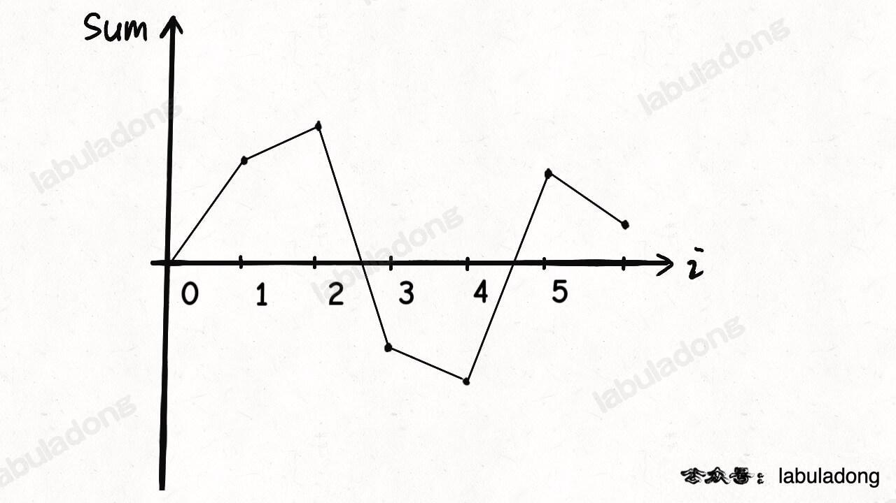
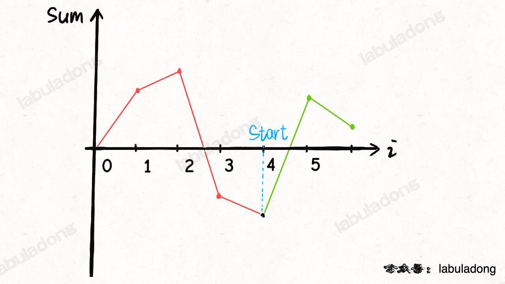
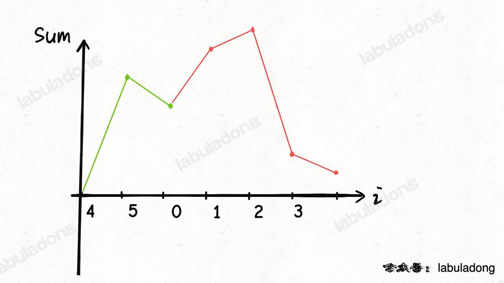

今天讲一个贪心的老司机的故事，就是力扣第 134 题「[加油站](https://leetcode.cn/problems/gas-station/)」：
```text
中等：134. 加油站

在一条环路上有 n 个加油站，其中第 i 个加油站有汽油 gas[i] 升。

你有一辆油箱容量无限的的汽车，从第 i 个加油站开往第 i+1 个加油站需要消耗汽油 cost[i] 升。
你从其中的一个加油站出发，开始时油箱为空。

给定两个整数数组 gas 和 cost ，如果你可以按顺序绕环路行驶一周，则返回出发时加油站的编号，否则返回 -1 。
如果存在解，则 保证 它是 唯一 的。

示例 1:
输入: gas = [1,2,3,4,5], cost = [3,4,5,1,2]
输出: 3
解释:
    从 3 号加油站(索引为 3 处)出发，可获得 4 升汽油。此时油箱有 = 0 + 4 = 4 升汽油
    开往 4 号加油站，此时油箱有 4 - 1 + 5 = 8 升汽油
    开往 0 号加油站，此时油箱有 8 - 2 + 1 = 7 升汽油
    开往 1 号加油站，此时油箱有 7 - 3 + 2 = 6 升汽油
    开往 2 号加油站，此时油箱有 6 - 4 + 3 = 5 升汽油
    开往 3 号加油站，你需要消耗 5 升汽油，正好足够你返回到 3 号加油站。
    因此，3 可为起始索引。

示例 2:
输入: gas = [2,3,4], cost = [3,4,3]
输出: -1
解释:
    你不能从 0 号或 1 号加油站出发，因为没有足够的汽油可以让你行驶到下一个加油站。
    我们从 2 号加油站出发，可以获得 4 升汽油。 此时油箱有 = 0 + 4 = 4 升汽油
    开往 0 号加油站，此时油箱有 4 - 3 + 2 = 3 升汽油
    开往 1 号加油站，此时油箱有 3 - 3 + 3 = 3 升汽油
    你无法返回 2 号加油站，因为返程需要消耗 4 升汽油，但是你的油箱只有 3 升汽油。
    因此，无论怎样，你都不可能绕环路行驶一周。

提示:
    gas.length == n
    cost.length == n
    1 <= n <= 10^5
    0 <= gas[i], cost[i] <= 10^4
```
题目应该不难理解，就是每到达一个站点 i，可以加 gas[i] 升油，但离开站点 i 需要消耗 cost[i] 升油，
问你从哪个站点出发，可以兜一圈回来。

要说暴力解法，肯定很容易想到，
用一个 for 循环遍历所有站点，假设为起点，然后再套一层 for 循环，判断一下是否能够转一圈回到起点：
```text
int n = gas.length;
for (int start = 0; start < n; start++) {
    for (int step = 0; step < n; step++) {
        int i = (start + step) % n;
        tank += gas[i];
        tank -= cost[i];
        // 判断油箱中的油是否耗尽
    }
}
```
很明显时间复杂度是 O(N^2)，这么简单粗暴的解法一定不是最优的，我们试图分析一下是否有优化的余地。

暴力解法是否有重复计算的部分？是否可以抽象出「状态」，是否对同一个「状态」重复计算了多次？

我们前文 动态规划详解 说过，变化的量就是「状态」。
那么观察这个暴力穷举的过程，变化的量有两个，分别是「起点」和「当前油箱的油量」，
但这两个状态的组合肯定有不下 O(N^2) 种，显然没有任何优化的空间。

所以说这道题肯定不是通过简单的剪枝来优化暴力解法的效率，而是需要我们发现一些隐藏较深的规律，从而减少一些冗余的计算。

下面我们介绍两种方法巧解这道题，分别是数学图像解法和贪心解法。

# 图像解法
汽车进入站点 i 可以加 gas[i] 的油（图中绿色数字），离开站点会损耗 cost[i] 的油（图中红色数字），
那么可以把站点和与其相连的路看做一个整体，将 gas[i] - cost[i] 作为经过站点 i 的油量变化值（图中橙色数字）：



这样，题目描述的场景就被抽象成了一个环形数组，数组中的第 i 个元素就是 gas[i] - cost[i]。

有了这个环形数组，我们需要判断这个环形数组中是否能够找到一个起点 start，使得从这个起点开始的累加和一直大于等于 0。

如何判断是否存在这样一个起点 start？又如何计算这个起点 start 的值呢？

我们不妨就把 0 作为起点，计算累加和的代码非常简单：
```text
int n = gas.length, sum = 0;
for (int i = 0; i < n; i++) {
    // 计算累加和
    sum += gas[i] - cost[i];
}
```
上述代码的 sum 就相当于是油箱中油量的变化，比如给你输入这组测试用例：
```text
gas  = [4,3,1,2,7,4]
cost = [1,2,7,3,2,5]
```
sum 的变化过程就是这样的：



那么你是否能根据这幅图，判断把哪一个加油站作为起点呢？

显然，将 0 作为起点肯定是不行的，因为 sum 在变化的过程中小于 0 了，不符合我们「累加和一直大于等于 0」的要求。

那如果 0 不能作为起点，谁可以作为起点呢？

看图说话，图像的最低点最有可能可以作为起点：



如果把这个「最低点」作为起点，就是说将这个点作为坐标轴原点，就相当于把图像「最大限度」向上平移了。

再加上这个数组是环形数组，最低点左侧的图像可以接到图像的最右侧：



这样，整个图像都保持在 x 轴以上，所以这个最低点 4，就是题目要求我们找的起点。

不过，经过平移后图像一定全部在 x 轴以上吗？不一定，因为还有无解的情况：

如果 sum(gas[...]) < sum(cost[...])，总油量小于总的消耗，那肯定是没办法环游所有站点的。

综上，我们就可以写出代码：
```java
class Solution {
    int canCompleteCircuit(int[] gas, int[] cost) {
        int n = gas.length;
        // 相当于图像中的坐标点和最低点
        int sum = 0, minSum = 0;
        int start = 0;
        for (int i = 0; i < n; i++) {
            sum += gas[i] - cost[i];
            if (sum < minSum) {
                // 经过第 i 个站点后，使 sum 到达新低
                // 所以站点 i + 1 就是最低点（起点）
                start = i + 1;
                minSum = sum;
            }
        }
        if (sum < 0) {
            // 总油量小于总的消耗，无解
            return -1;
        }
        // 环形数组特性
        return start == n ? 0 : start;
    }
}
```
以上是观察函数图像得出的解法，时间复杂度为 O(N)，比暴力解法的效率高很多。

下面我们介绍一种使用贪心思路写出的解法，和上面这个解法比较相似，不过分析过程不尽相同。

# 贪心解法
用贪心思路解决这道题的关键在于以下这个结论：

**如果选择站点 i 作为起点「恰好」无法走到站点 j，那么 i 和 j 中间的任意站点 k 都不可能作为起点**。

比如说，如果从站点 1 出发，走到站点 5 时油箱中的油量「恰好」减到了负数，那么说明站点 1「恰好」无法到达站点 5；
那么你从站点 2,3,4 任意一个站点出发都无法到达 5，因为到达站点 5 时油箱的油量也必然被减到负数。

**如何证明这个结论？**

假设 tank 记录当前油箱中的油量，如果从站点 i 出发（tank = 0），走到 j 时恰好出现 tank < 0 的情况，
那说明走到 i, j 之间的任意站点 k 时都满足 tank > 0，对吧。

如果把 k 作为起点的话，相当于在站点 k 时 tank = 0，那走到 j 时必然有 tank < 0，也就是说 k 肯定不能是起点。

拜托，从 i 出发走到 k 好歹 tank > 0，都无法达到 j，现在你还让 tank = 0 了，那更不可能走到 j 了对吧。

综上，这个结论就被证明了。

**回想一下我们开头说的暴力解法是怎么做的？**

如果我发现从 i 出发无法走到 j，那么显然 i 不可能是起点。

现在，我们发现了一个新规律，可以推导出什么？

如果我发现从 i 出发无法走到 j，那么 i 以及 i, j 之间的所有站点都不可能作为起点。

看到冗余计算了吗？看到优化的点了吗？

这就是**贪心思路的本质**，**如果找不到重复计算，那就通过问题中一些隐藏较深的规律，来减少冗余计算。**

根据这个结论，就可以写出如下代码：
```java
class Solution {
    int canCompleteCircuit(int[] gas, int[] cost) {
        int n = gas.length;
        int sum = 0;
        for (int i = 0; i < n; i++) {
            sum += gas[i] - cost[i];
        }
        if (sum < 0) {
            // 总油量小于总的消耗，无解
            return -1;
        }
        // 记录油箱中的油量
        int tank = 0;
        // 记录起点
        int start = 0;
        for (int i = 0; i < n; i++) {
            tank += gas[i] - cost[i];
            if (tank < 0) {
                // 无法从 start 到达 i + 1
                // 所以站点 i + 1 应该是起点
                tank = 0;
                start = i + 1;
            }
        }
        return start == n ? 0 : start;
    }
}
```
这个解法的时间复杂度也是 O(N)，和之前图像法的解题思路有所不同，但代码非常类似。

其实，你可以把这个解法的思路结合图像来思考，可以发现它们本质上是一样的，只是理解方式不同而已。

对于这种贪心算法，没有特别套路化的思维框架，主要还是靠多做题多思考，
将题目的场景进行抽象的联想，找出隐藏其中的规律，从而减少计算量，进行效率优化。

好了，这道题就讲到这里，希望对你拓宽思路有帮助。
