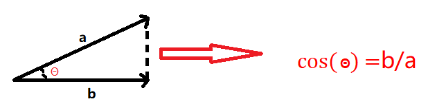
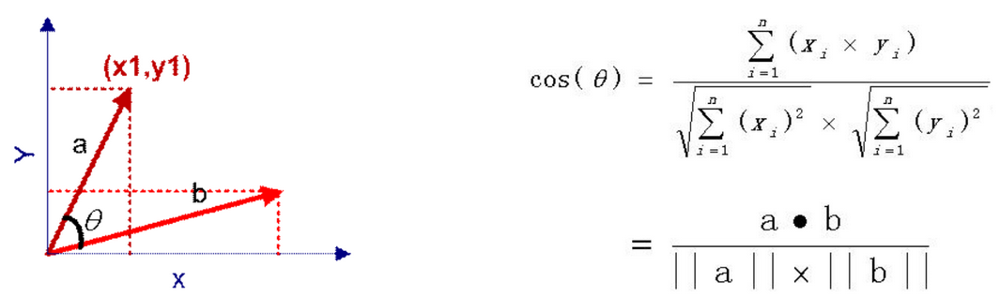
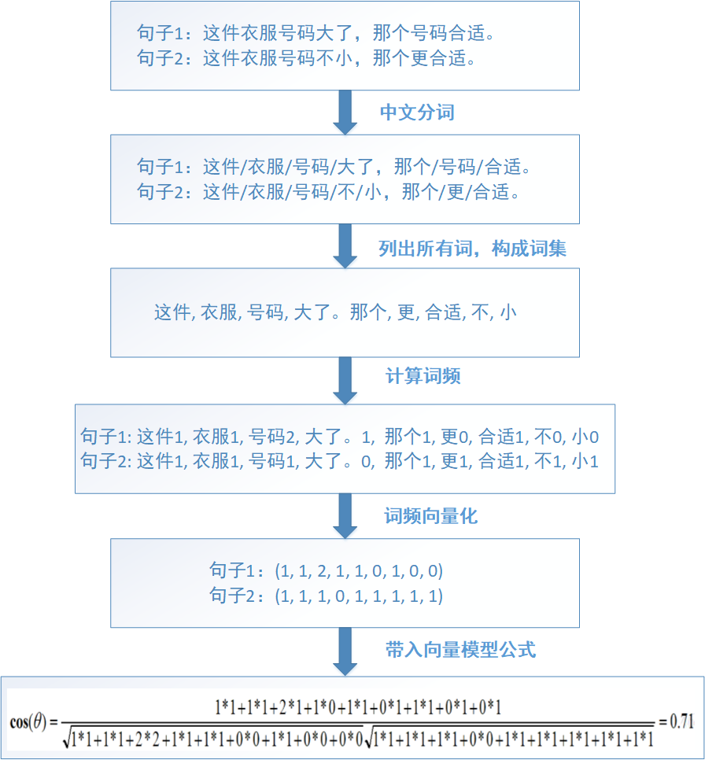
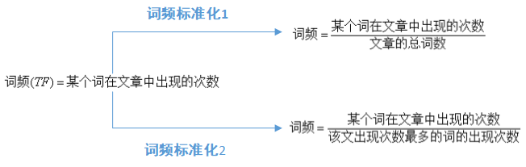
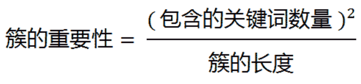

本篇博文是数据挖掘部分的首篇，思路主要是先聊聊相似度的理论部分，下一篇是代码实战。

我们在比较事物时，往往会用到“不同”，“一样”，“相似”等词语，这些词语背后都涉及到一个动作——双方的比较。
只有通过比较才能得出结论，究竟是相同还是不同。但是万物真的有这么极端的区分吗？
在我看来不是的，生活中通过“相似度”这词来描述可能会更加准确。
比如男人和女人，虽然生理器官和可能思想有些不同，但也有相同的地方，那就是都是人，就是说相似度不为0；
比如石头与小草，它们对于虚拟类都是一种实体类，相似度也不为0；
两个句子词和词的顺序都一致，相似度就是1。
一个概念可以应用到不同于相同的两个方面的定义。可真谓方便至极了。  
    
在生活中，信息检索、文档复制检测等领域都应用到“文本相似度”。
可能有人觉得文本是文字，其实不尽然，文本相似度的应用更广，除了文字的匹配，还可以是图片，音频等，
因为他们的实质都是在计算机中都是以二进制的方式存在的。
    
**相似度**，实质就是**计算个体间相程度**。什么是个体？对于语句，个体就是语句，对于图片，个体就是图片。
    
先介绍**最常用最简单的方法**：**余弦相似度**。

**余弦相似度**就是通过一个**向量空间**中**两个向量夹角的余弦值**作为衡量两个个体之间差异的大小。
把1设为相同，0设为不同，那么相似度的值就是在0~1之间，所有的事物的相似度范围都应该是0~1，
如果不是0~1的话，就不是我们应该研究的事了，那是神经学家和生物学家的事了。
余弦相似度的**特点**是**余弦值接近1，夹角趋于0，表明两个向量越相似**。看下图，
　　　　　　　　　　　
　　　　　　　

**三角形越扁平，证明两个个体间的距离越小，相似度越大；反之，相似度越小**。
但是，**文本的相似度计算**只是针对**字面量**来计算的，也就是说只是针对语句的字符是否相同，而不考虑它的语义，那是另外一个研究方向来着。
比如，句子1：你真好看:。句子2：你真难看。这两句话相似度75%，但是它们的语义相差十万八千里，可以说是完全相反。
又比如，句子1：真好吃。句子2：很美味。两个句子相似度为0，但是语义在某个场景下是一致的。

所以在实际中，没有很完美的解决方案。每个公司会针对业务要求来调节相似度算法，使其在某些场合能够精确计算。
 
计算两个图片的相似度，就是把图片a，图片b，映射为向量，然后通过这个公式来计算出相似度。
在这里，最最最重要的是“映射”这个过程，这个过程，如果在大数据的应用中，涉及到了对数据的分词，去重，转换，计算等步骤。
                             

（左边）向量a和向量b是二维                   （右边）拓展到n维的计算模型
 
通过计算模型公式可以明确的求出余弦相似度的值。
那么对于我们写程序实现这个算法，就是把两个**个体**转换为**向量**，然后通过这个公式求出最终解。

比如向量a(x1, x2, x3, x4, x5)，向量b(y1, y2, y3, y4, y5)。
分子为(x1*y1)+(x2*y2)+(x3*y3)+(x4*y4)+(x5*y5)，
分母为sqrt(x1*x1+x2*x2+x3*x3+x4*x4+x5*x5)。
    
下面通过实际例子来看如何由一个句子转换为向量。

由图可知，两个句子的相似度计算的步骤是：
```text
    1.通过【中文分词】，把完整的句子根据【分词算法】分为独立的【词集合】
    2.求出两个词集合的【并集(词包)】
    3.计算各自词集的【词频】并把【词频向量化】
    4.带入向量计算模型就可以求出文本相似度
```
注意，词包确定之后，词的顺序是不能修改的，不然会影响到向量的变化。

以上是对两个句子做相似度计算，如果是对两篇文章做相似度计算，步骤如下：
```text
    1.找出各自文章的【关键词】并合成一个【词集合】
    2.求出两个词集合的【并集(词包)】
    3.计算各自词集的【词频】并把【词频向量化】
    4.带入向量计算模型就可以求出文本相似度
```
句子的相似度计算只是文章相似度计算的一个子部分。文章的关键词提取可以通过其他的算法来实现，这里先跳过，下一篇才介绍。

到这里出现一个关键的名词——**词频TF(Term Frequency)**，词频是一个词语在文章或句子中出现的次数。
如果一个词很重要，很明显是应该在一个文章中出现很多次的，但是这也不是绝对的，
比如“地”，“的”，“啊”等词，它们出现的次数对一篇文章的中心思想没有一点帮助，
只是中文语法结构的一部分而已，这类词也被称为“**停用词(Stop Words)**”。
所以，在计算一篇文章的词频时，停用词是应该过滤掉的。

但是仅仅**过滤掉停用词**就能接近问题?
也不一定的，比如如果想分析近期的十九届中央纪委二次全会等新闻文章，很明显出现“中国”这个词语必定会出现在每篇文章，
但是对于每个新闻的主干思想有帮助吗？对比“反腐反败”，“人工智能”“大数据”等词语，“中国”这个词语在文章中应该是次要的。

因此进一步假设，如果某个词比较少见（在我们准备的文章库中的占比比较少），但是它在这篇文章中多次出现，
那么它很可能反映了这篇文章的特性，正是我们所需要的关键词。

在此，在**词频TF**的基础上又引出了**反文档频率IDF(Inverse Document Frequency)**的概念。
一般来说，在一篇文章或一个句子来说，对于每个词都有不同的重要性，这也就是**词的权重**。
在词频的基础上，赋予每一个词的权重，进一步体现该词的重要性。
比如一篇报道中国农业养殖的新闻报道。
最常见的词（“的”、“是”、“在”）给予最小的权重，
较常见的词（“国内”、“中国”、“报道”）给予较小的权重，
较少见的词（“养殖”、“维基”）。
所以刻画能力强的词语，权重应该是最高的。

将**TF**和**IDF**进行**相乘**，就得到了一个**词的TF-IDF值**，
某个词对文章重要性越高，该值越大，于是排在前面的几个词，就是这篇文章的关键词。
（在实际中，还要考虑词的词性等多维度的特性，动词，名词，形容词的刻画能力也是有所差别的；
因社会热点而词的刻画性爆发式提高(比如 打call)）。
    
下图是词频的计算方法：



**词频标准化**的目的是*把所有的词频在同一维度上分析*。
词频的标准化有两个标准，第一种情况，得出词汇较小，不便于分析。一般情况下，第二个标准更适用，因为能够使词频的值相对大点，便于分析。
比如一本书出现一个词语100次，但整本书10万字，词频但是在一句话中出现5次，

下面是反文档频率的计算方法：


          
针对这个公式，可能有人会有以下的疑问：
```text
    1.为什么+1？是为了处理分母为0的情况。假如所有的文章都不包含这个词，分子就为0，所以+1是为了防止分母为0的情况。
    2.为什么要用log函数？log函数是单调递增，求log是为了归一化，保证反文档频率不会过大。
    3.会出现负数？肯定不会，分子肯定比分母大。
```
    
TF-IDF = 计算的词频(TF)*计算的反文档频率(IDF)。

通过公式可以知道，TF-IDF与在该文档中**出现的次数**成**正比**，与包含该词的**文档数**成**反比**。
 
在知道TF-IDF后，先抛出两个小实践：

1.利用TF-IDF计算相似文章：
```text
1)使用TF-IDF算法，找出两篇文章的关键词
2)每篇文章各取出若干个关键词（比如20个），合并成一个集合，计算每篇文章对于这个集合中的词的词频
（为了避免文章长度的差异，可以使用相对词频）
3)生成两篇文章各自的词频向量
4)计算两个向量的余弦相似度，值越大就表示越相似
```
利用TF-IDF计算文章相似度，上面已经给出很详细的流程了。这里不再分析，下面来说说**自动摘要技术**。

文章的信息都包含在句子中，有些句子包含的信息多，有些句子包含的信息少。 
"自动摘要"就是要找出那些包含信息最多的句子。
句子的信息量用"关键词"来衡量。如果包含的关键词越多，就说明这个句子越重要。
只要关键词之间的距离小于“门槛值” ，它们就被认为处于同一个簇之中，
如果两个关键词之间有5个以上的其他词，就可以把这两个关键词分在两个簇。
下一步，对于每个簇，都计算它的重要性分值。



有时候，为了方便实际的操作可以化简为不考虑簇的用法，
```text
1)计算原始文本的词频，生成词频数组 [(2, '你好'), (10, '大数据'), (4, '智能'), (100, '的')...]
2)过滤停用词，得出新的词频数组  [(2, '你好'), (10, '大数据'), (4, '智能')...]
3)按照词频进行排序 [(2, '你好'), (4, '智能'), (10, '大数据')...]
4)将文章分为句子
5)选择关键词首先出现的句子 (一般文章首段和最后一段，每段的首句和末句是比较重要的)
6)将选中的句子按照出现顺序，组成摘要
```
这样做的优点是简单快速，结果比较符合实际情况。
缺点是单纯以“词频”做衡量标准，不够全面，词性和词的出现位置等因素没有考虑到，而且有时重要的词可能出现的次数并不多。
这种算法无法体现词的位置信息，出现位置靠前的词与出现位置靠后的词，都被视为重要性相同，这是不正确的。
（一种解决方法是，对全文的第一段和每一段的第一句话，给予较大的权重。） 