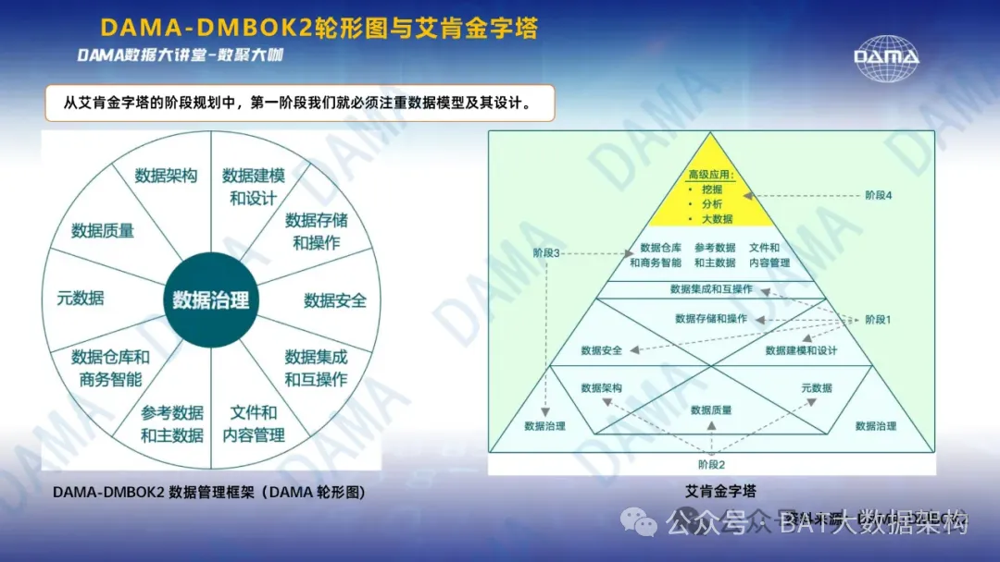

```text
导读：
    信息爆炸的数字化时代，数据是企业核心竞争力的关键要素。
    然而，海量数据的涌现也带来了前所未有的挑战——如何确保数据的准确、安全、合规与高效利用？
    这正是数据治理（Data Governance）的使命所在。
```

本文将深入探讨数据治理的内涵，揭示“治”与“理”的双重维度，为您的企业打造坚实的数据基石与价值飞轮。

# 一、数据治理框架



数据治理是一个综合性的管理框架，旨在通过一系列制度、流程和技术手段，实现对数据资源的全面管理和优化。

数据治理不仅仅是**技术层面**的操作，更是**企业文化**、**策略规划**与**业务实践**的深度融合，
对于**提升企业决策质量**、**增强合规性**、**优化运营效率**具有不可估量的价值。

# 二、“治”之所在：直面数据痛点
- 1）治理数据质量 

    数据是决策的依据，而高质量的数据是正确决策的基础。
    数据治理首先“治”的是数据的准确性、完整性、一致性和时效性，通过建立质量监控体系，识别并纠正数据错误，确保数据可信可靠。

- 2）治理数据安全 

    在数据泄露事件频发的今天，保障数据安全是数据治理的重要一环。
    通过加密技术、访问控制机制和安全审计，有效防范内外部威胁，确保数据不被非法访问、篡改或滥用。

- 3）治理合规性 

    随着GDPR、CCPA等数据保护法规的出台，合规成为企业不容忽视的议题。
    数据治理需确保数据处理活动遵循国内外法律法规，避免法律风险，维护企业声誉。

- 4）治理生命周期管理 

    从数据的产生到销毁，每一步都需要精心管理。
    数据治理需制定合理的存储、归档和销毁策略，既满足业务需求，又有效控制成本。

# 三、“理”之所向：构建高效数据生态
- 1）理顺数据流程 

    通过元数据管理和数据血缘分析，清晰展现数据的来源、流转和用途，简化数据查找和理解过程，加速数据到信息、知识的转化。

- 2）理清数据权限 

    合理分配数据访问权限，确保数据在需要时可被恰当的人获取，同时防止过度访问，保持数据的机密性和隐私性。

- 3）理解数据价值 

    推动数据文化的建设，提升全员数据意识，通过培训和教育，使员工理解数据的重要性，学会有效利用数据提升工作效率和创新能力。

- 4）理性决策支持 

    数据治理最终服务于决策支持，通过数据集成、清洗和分析，为企业提供及时、准确的信息，驱动基于数据的智慧决策。

# 四、总结与展望
数据治理是一项复杂而长期的任务，需要高层的支持、全员的参与以及持续的技术创新。它不仅关乎数据本身，更关乎企业的未来。

通过有效的数据治理，企业能够更好地挖掘数据潜力，构建数据信任，把握数字化转型的先机，赢得未来的竞争优势。

---

# 数据治理12大定律（96字口诀）

【标题】解锁数据治理的12大定律：构建高效数据管理生态体系！

```text
导读：
    数据为王的时代，有效管理数据成为企业竞争力的关键。
    数据治理，作为确保数据质量、安全、合规及价值最大化的基石，其重要性不言而喻。
```

本文我们将一起深入探索数据治理的12大核心定律，为您的组织打造一个体系化、结构化的数据管理蓝图。

## 1. 战略引领，目标导向
一切始于战略。将数据治理视为**企业战略**的一部分，确保**数据管理活动**与**企业总体目标**紧密相连，驱动业务增长和创新。

## 2. 业务融合，价值创造
数据治理不是技术部门的独角戏，而是与**业务深度融合**的过程。理解业务需求，确保数据治理活动直接服务于**业务优化**和**价值创造**。

## 3. 合规为基，法律为绳
在数据治理中，遵守国内外数据保护法规是底线。建立严格的**合规体系**，确保数据处理活动合法、合规，守护企业声誉。

## 4. 流程透明，权责到人
清晰界定数据的所有权、使用权和管理责任，通过透明的流程和记录，确保每个数据点都能追溯到责任人，增强信任度。

## 5. 数据质量，人人有责
高质量的数据是决策的基石，也是不可逾越的红线。实施持续的数据质量监控和改善计划，确保数据的准确性、完整性和一致性。

## 6. 安全护航，隐私至上
在数据流动的每一个环节实施严格的安全措施，保护个人隐私和敏感信息，构建安全可靠的数据环境。

## 7. 标准先行，规范运作
推广数据标准和命名规范，提高数据的互操作性和可用性，降低数据孤岛现象，促进数据共享和交流。

## 8. 灵活扩展，拥抱变化
构建灵活可扩展的数据治理体系，以适应技术发展和业务变化，确保数据治理策略的长期有效性和适应性。

## 9. 全员参与，协同共赢
数据治理是团队运动。通过跨部门合作，促进数据文化的形成，确保从高层到基层的全员参与和支持。

## 10. 绩效衡量，持续优化
建立数据治理绩效指标体系，定期评估数据治理的效果和效率，基于数据反馈不断调整优化策略。

## 11. 知识赋能，人才育留
投资于员工的数据素养和技能培训，建立一支懂业务、精技术、通管理的数据治理队伍，为组织持续注入数据智慧。

## 12. 数据驱动，文化转型
推动企业文化的深层次变革，让数据成为决策的核心，鼓励数据创新和利用，形成以数据为支撑的决策文化。

## 结语
数据治理的12大定律，如同打开数据宝藏的12把金钥匙，每把钥匙都至关重要，缺一不可。可以把这 96 字口诀打印出来，分发给每一位同事。

通过系统化、结构化地实施这些原则，企业不仅能够有效管理数据资产，还能激发数据的无限潜能，为企业的发展注入强劲动力。