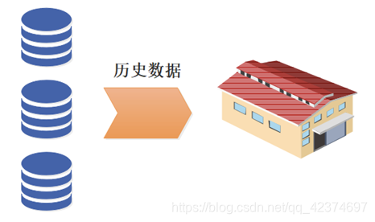

## 数据仓库诞生原因

### 历史数据积存
历史数据使用频率低，堆积在业务库中，导致性能下降。

随着业务的进行，会源源不断的产生数据，这些业务数据都会存储在业务数据库中，如 MySQL、Oracle 当中，支持业务系统的运行。

但当线上的业务系统运行超过一定时间，其积压的历史数据就会越来越多，对业务数据库就会产生一定的负载，导致业务系统运行速度降低。

而这些历史数据中，有相当一部分是冷数据，即业务系统一般对最近产生的数据（当天、一周内、一个月内）调用比较频繁，
对较早之前的数据调用频率很低。

所以为了避免随着时间的推移，历史数据积压对业务数据库产生的影响，从而影响业务的正常运行，
企业需要定期将积压的历史数据从业务数据库中转移出去，存储到一个专门存放历史数据的仓库中，即数据仓库。

### 企业数据分析需要

企业将历史数据存储到数据仓库中后，这些数据不仅可以改善业务数据库的性能；
还可以用来进行数据分析，从而辅助管理层进行决策。
以历史数据积存为导向，这种发展是顺其自然的。

但有的企业开始并没有历史数据积存，然而仅仅是对数据分析特别看重。
这些企业可能会存在多个部门需要进行数据分析的任务。
这些企业建立数据仓库的原由，是以数据分析为导向的。

## 小结

企业无论是以历史数据积存，还是数据分析为导向建立的数据仓库。
数据积存、数据分析，这两个都是数据仓库的基本功能与建设目的。

---

# 数据仓库建模：流程、关键步骤与注意事项

## 数据仓库建模流程

在数字化世界中，数据仓库是一个至关重要的组件。
它是一个集中的数据存储，旨在支持决策制定和业务智能。

数据仓库建模是构建这样一个复杂系统的关键步骤，它决定了如何收集、组织和存储数据，以及如何使这些数据可供分析和报告。
以下是一些关键步骤和短语，这些都是数据仓库建模流程的核心部分。

### 业务部门需求分析：
在开始数据仓库建模之前，需要与业务部门合作，了解他们的需求和目标。这包括确定需要收集和分析的数据类型、频率和格式，以及确定数据仓库的功能和性能要求。

### 数据源审查：
首先，需要对数据源进行详细的审查。
这包括识别和评估各种来源的数据，如数据库、文件、社交媒体、物联网设备等。
这个过程可以帮助团队了解可用的数据，以及这些数据的类型和质量。

### 数据建模：
在审查了数据源之后，需要对数据进行建模。
这涉及到创建一个或多个数据模型，这些模型可以根据业务需求进行分类、组织、关联和存储。数据模型通常包括实体关系图、数据流程图和数据字典等。

### 数据清洗和转换：
在将数据存储到数据仓库之前，需要进行数据清洗和转换。这包括去除重复数据、修复缺失值、处理异常值以及将数据进行标准化和整合。
这个过程对于保证数据质量和准确性至关重要。

### 数据分区：
数据仓库中的数据通常按时间或主题进行分区。
这可以帮助用户更方便地查找和分析特定时间或主题范围内的数据。
分区还可以帮助提高数据的查询性能。

### 数据存储：
在完成了数据建模、清洗和分区之后，需要确定数据的存储方式。
这可能涉及到选择合适的存储设备、数据库类型和存储架构。
此外，还需要考虑数据的备份和恢复策略。

### 数据安全：
在数据仓库建模流程的最后阶段，需要考虑数据的安全性。
这包括数据的加密、访问控制、备份和恢复策略等。
此外，还需要定期进行安全审计，以确保数据仓库及其数据的安全性。

### 数据映射和转换：
在构建数据仓库的过程中，还需要进行数据映射和转换。这涉及到将源系统的数据格式映射到目标系统的数据格式。
这通常需要使用ETL（提取、转换和加载）工具或类似的软件进行自动化处理。

### 数据验证和测试：
在将数据存储到数据仓库之后，需要进行数据的验证和测试。这包括检查数据的完整性和准确性，以及验证数据是否符合预定的业务规则和需求。
这个过程可以帮助确保数据的可靠性和可用性。

### 数据维护和更新：
最后，需要定期对数据仓库进行维护和更新。
这包括监控数据的增长和变化，以及处理数据的增、删、改、查等操作。此外，还需要定期进行备份和恢复测试，以确保数据仓库始终处于最佳运行状态。

## 总结

数据仓库建模是一个复杂的过程，需要综合考虑多个因素，如数据源、数据质量、数据模型、数据存储等。
通过理解并遵循上述步骤，企业可以建立一个可靠、高效的数据仓库系统，从而支持准确的决策制定和业务增长。
在实践过程中，还需要根据实际情况灵活调整策略，并不断优化和完善数据仓库建模流程。
