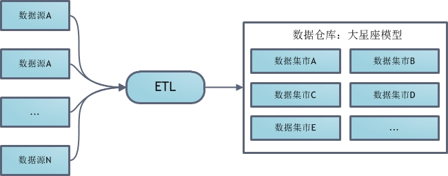
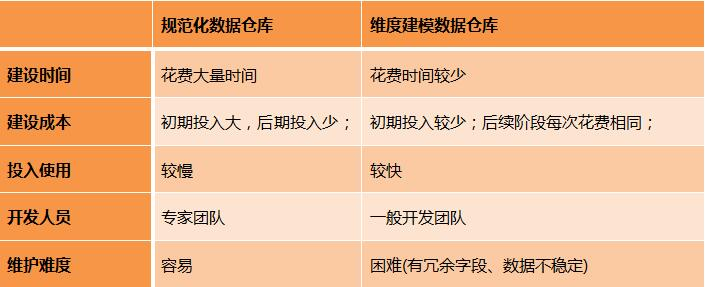

# 数据仓库与数据集市建模

## 前言

数据仓库建模包含了几种数据建模技术，除了ER建模和关系建模，还包括专门针对数据仓库的维度建模技术。

本文将详细介绍数据仓库维度建模技术，并重点讨论三种基于ER建模/关系建模/维度建模的数据仓库总体建模体系：
规范化数据仓库，维度建模数据仓库，以及独立数据集市。

## 维度建模的基本概念

维度建模(dimensional modeling)是专门用于分析型数据库、数据仓库、数据集市建模的方法。

它本身属于一种关系建模方法，但和之前在操作型数据库中介绍的关系建模方法相比增加了两个概念：

1. 维度表(dimension)

    表示对分析主题所属类型的描述。比如"昨天早上张三在京东花费200元购买了一个皮包"。
    那么以购买为主题进行分析，可从这段信息中提取三个维度：时间维度(昨天早上)，地点维度(京东), 商品维度(皮包)。
    通常来说维度表信息比较固定，且数据量小。

2. 事实表(fact table)

    表示对分析主题的度量。比如上面那个例子中，200元就是事实信息。事实表包含了与各维度表相关联的外码，并通过JOIN方式与维度表关联。
    事实表的度量通常是数值类型，且记录数会不断增加，表规模迅速增长。

> 注：在数据仓库中不需要严格遵守规范化设计原则(具体原因请看上篇)。本文示例中的主码，外码均只表示一种对应关系，此处特别说明。

## 维度建模的三种模式
1. 星形模式

    星形模式(Star Schema)是最常用的维度建模方式，下图展示了使用星形模式进行维度建模的关系结构：
    

    可以看出，星形模式的维度建模由一个事实表和一组维表成，且具有以下特点：

            a. 维表只和事实表关联，维表之间没有关联；

            b. 每个维表的主码为单列，且该主码放置在事实表中，作为两边连接的外码；

            c. 以事实表为核心，维表围绕核心呈星形分布；

2. 雪花模式

    雪花模式(Snowflake Schema)是对星形模式的扩展，每个维表可继续向外连接多个子维表。下图为使用雪花模式进行维度建模的关系结构：
    

    > 星形模式中的维表相对雪花模式来说要大，而且不满足规范化设计。雪花模型相当于将星形模式的大维表拆分成小维表，满足了规范化设计。
    然而这种模式在实际应用中很少见，因为这样做会导致开发难度增大，而数据冗余问题在数据仓库里并不严重。

3. 星座模式

    星座模式(Fact Constellations Schema)也是星型模式的扩展。基于这种思想就有了星座模式：
    

    > 前面介绍的两种维度建模方法都是多维表对应单事实表，但在很多时候维度空间内的事实表不止一个，而一个维表也可能被多个事实表用到。在业务发展后期，绝大部分维度建模都采用的是星座模式。

4. 三种模式对比

    归纳一下，星形模式/雪花模式/星座模式的关系如下图所示：
    

    雪花模式是将星型模式的维表进一步划分，使各维表均满足规范化设计。
    而星座模式则是允许星形模式中出现多个事实表。本文后面部分将具体讲到这几种模式的使用，请读者结合实例体会。

## 实例：零售公司销售主题的维度建模
在进行维度建模前，首先要了解用户需求。而笔者在数据库系列的第一篇就讲过，ER建模是当前收集和可视化需求的最佳技术。
因此假定和某零售公司进行多次需求PK后，得到以下ER图：
    

随后可利用建模工具将ER图直接映射到关系图： 

需求搜集完毕后，便可进行维度建模了。本例采用星形模型维度建模。但不论采取何种模式，维度建模的关键在于明确下面四个问题：

    1. 哪些维度对主题分析有用？

    本例中，根据产品(PRODUCT)、顾客(CUSTOMER)、商店(STORE)、日期(DATE)对销售额进行分析是非常有帮助的；

    2. 如何使用现有数据生成维表？

            a. 维度PRODUCT可由关系PRODUCT，关系VENDOR，关系CATEGORY连接得到；

            b. 维度CUSTOMER和关系CUSTOMER相同；

            c. 维度STORE可由关系STROE和关系REGION连接得到；

            d. 维度CALENDAR由关系SALESTRANSACTION中的TDate列分离得到；

    3. 用什么指标来"度量"主题？

    本例的主题是销售，而销量和销售额这两个指标最能直观反映销售情况；

    4. 如何使用现有数据生成事实表？

    销量和销售额信息可以由关系SALESTRANSACTION和关系SOLDVIA，关系PRODUCT连接得到；

明确这四个问题后，便能轻松完成维度建模：

细心的读者会发现三个问题：
        1. 维表不满足规范化设计(不满足3NF)；
        2. 事实表也不满足规范化设计(1NF都不满足)； 
        3. 维度建模中各维度的主码由***ID变成***Key；

对于前两个问题，由于当前建模环境是数据仓库，而没有更新操作，所以不需要严格做规范化设计来消除冗余避免更新异常。

因此虽然可以以雪花模型进行维度建模，如下所示： 

但这样会加大查询人员负担：每次查询都涉及到太多表了。因此在实际应用中，雪花模型仅是一种理论上的模型。
星座模型则出现在"维度建模数据仓库"中，本文后面将会讲到。

对于第三个问题，***Key这样的字段被称为代理码(surrogate key)，它是一个通过自动分配整数生成的主码，没有任何其他意义。
使用它主要是为了能够处理"缓慢变化的维度"，本文后面会仔细分析这个问题，这里不纠结。

## 更多可能的事实属性
除了对应到维度的外码和度量属性，事实表中还常常考虑另外两个属性：
事务标识码(transaction identifier)和事务时间(transaction time)。

事务标识码通常被命名为TID，其意义就是各种订单号，事务编号...... 为什么将这个属性放到事实表而不是维表中呢？
一个主要原因是它的数量级太大了，这样每次查询都会耗费很多资源来Join。
这种将某些逻辑意义上的维度放到事实表里的做法被称为退化维度(degenerate dimension)。

将事务时间维度放到事实表中的考虑也是出于相同考虑。然而这么设计又一次"逆规范化"了：
事务标识码非主码却决定事务标识时间，显然违背了3NF。但现在我们是为数据仓库建模，所以这样做是OK的。
另外在分布式的数据仓库中，这个字段十分重要。因为事实表的数量级非常大，Hive或者Spark SQL这类分布式数据仓库工具
都会对这些数据进行分区。任何成熟的分布式计算平台中都应禁止开发人员建立非分区事实表，并默认分区字段为(当天)日期。

## 经典星座模型
前文已经讲过，有多个事实表的维度模型被称为星座模型。
星座模型主要有以下两大作用：共享维度和设置细节/聚集事实表。下面分别对这两种情况进行分析：

1. 共享维度

    以前文提到的零售公司为例，假如该公司质量监管部门希望用分析销售主题同样的方法分析劣质产品，
    那么此时不需要重新维度建模，只需往模型里加入一个新的劣质产品事实表。之后新的数据仓库维度建模结果如下：
    

2. 细节/聚集事实表

    细节事实表(detailed fact tables)中每条记录表示单一事实，而聚集事实表(aggregated fact tables)中每条记录则聚合了多条事实。
    从表的字段上看，细节事实表通常有设置TID属性，而聚集事实表则无。

    两种事实表各有优缺点，细节事实表查询灵活但是响应速度相对慢，而聚集事实表虽然提高了查询速度，但使查询功能受到一定限制。
    一个常见的做法是使用星座模型同时设置两种事实表(可含多个聚集事实表)。这种设计方法中，聚集事实表使用和细节事实表细节事实表的维度。
    如下维度建模方法采用星座模型综合了细节事实表和两种聚集事实表：
    

## 缓慢变化维度问题
虽然，维表的数据比事实表更稳定。但不论如何维度在某些时候总会发生一些变化。
在之前曾抛出一个问题：为什么维度建模后的关系不是***ID，而是***Key了。
这样做的目的其实就是为了解决一种被称为缓慢维度变化(slowly changing dimension)的问题。
在维度变化后，一部分历史信息就被丢掉了。比如张三是某公司会员。

但仅仅这么做还是不够的，代理码需要配合时间戳，以及行标识符使用才能解决缓慢维度变化的问题。
如下CUSTOMER表使用该方法避免缓慢维度变化：

可以看到用户张三对应新维度的TaxBracket状态由Low变成了High。
如果需要统计张三的相关行为，那么可以让所有记录用CustomerID字段Join事实表；
如果要统计当前TaxBracket为Low的用户状态，则可将Row Indicator字段为Current的记录用CustomerKey字段Join事实表；
如果要统计历史TaxBracket状态为Low的用户情况，则只需要将TaxBracket属性为Low的用户记录的CustomerKey属性与事实表关联。

## 数据仓库建模体系之规范化数据仓库
所谓"数据仓库建模体系"，指的是数据仓库从无到有的一整套建模方法。
最常见的三种数据仓库建模体系分别为：规范化数据仓库，维度建模数据仓库，独立数据集市。
很多书将它们称为"数据仓库建模方法"，但笔者认为数据仓库建模体系更能准确表达意思，请允许我自作主张一次吧：）。
下面首先来介绍规范化数据仓库。

规范化数据仓库(normalized data warehouse)顾名思义，其中是规范化设计的分析型数据库，然后基于这个数据库为各部门建立数据集市。
总体架构如下图所示：

该建模体系首先对ETL得到的数据进行ER建模，关系建模，得到一个规范化的数据库模式。
然后用这个中心数据库为公司各部门建立基于维度建模的数据集市。
各部门开发人员大都从这些数据集市提数，通常来说不允许直接访问中心数据库。    

## 数据仓库建模体系之维度建模数据仓库
非维度建模数据仓库(dimensionally modeled data warehouse)是一种使用交错维度进行建模的数据仓库，其总体架构如下图所示：

该建模体系首先设计一组常用的度集合(conformed dimension)，然后创建一个大星座模型表示所有分析型数据。
如果这种一致维度不满足某些数据分析要求，自然也可在数据仓库之上继续构建新的数据集市。

## 数据仓库建模体系之独立数据集市
独立数据集市的建模体系是让公司的各个组织自己创建并完成ETL，自己维护自己的数据集市。其总体架构如下图所示：

从技术上来讲这是一种很不值得推崇的方式，因为将使信息分散，影响了企业全局范围内数据分析的效率。此外，各组织之间的ETL架构相互独立无法复用，也浪费了企业的开发资源。然而出于某些公司制度及预算方面的考虑，有时也会使用到这种建模体系。

## 三种数据仓库建模体系对比
规范化数据仓库和维度建模数据仓库分别是Bill Inmon和Ralph Kimball提出的方法。关于哪种方法更好，哪种方法更优秀的争论已经由来已久。
但随着这两种数据仓库应用越来越多，人们也逐渐了解到两种数据仓库的优劣之处，如下表所示：

产生这些区别的根本之处在于规范化数据仓库需要对企业全局进行规范化建模，这将导致较大的工作量。
但这一步必须完成好，才能继续往上建设数据集市。因此也就导致规范化数据仓库需要一定时间才能投入使用，敏捷性相对后者来说略差。
但是规范化数据仓库一旦建立好了，则以后数据就更易于管理。而且由于开发人员不能直接使用其中心数据库，更加确保了数据质量。
还有由于中心数据库是采用规范化设计的，冗余情况也会更少。

然而另一方面维度建模数据仓库除了敏捷性更强，而且适用于业务变化比较频繁的情况，对开发人员的要求也没有规范化数据仓库那么高。
总之各有利弊，具体实施时需要仔细的权衡。

## 小结
数据仓库建模是一个综合性技术，需要使用到ER建模、关系建模、维度建模等技术。
而且当企业业务复杂的时候，这部分工作更是需要专门团队与业务方共同合作来完成。
因此一个优秀的数据仓库建模团队既要有坚实的数据仓库建模技术，还要有对现实业务清晰、透彻的理解。