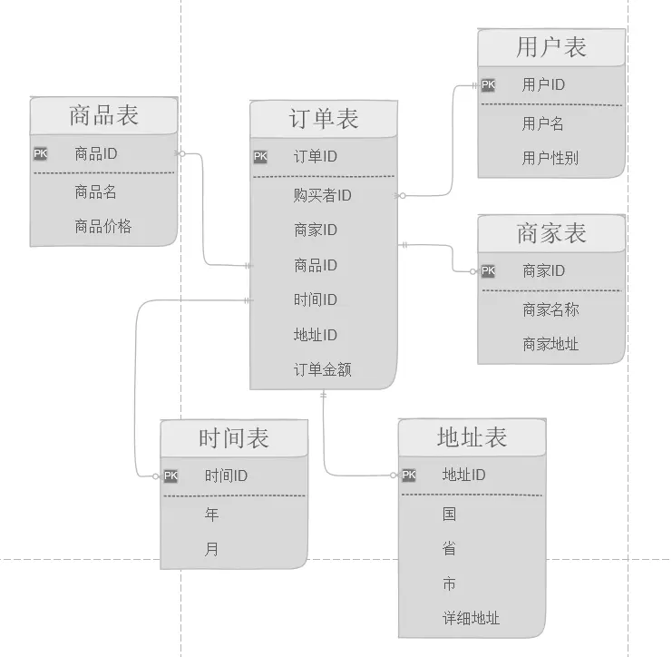

## 前言

下面的内容，是笔者在学习和工作中的一些总结，其中概念性的内容大多来自书中，实践性的内容大多来自自己的工作和个人理解。
由于资历尚浅，难免会有很多错误，望批评指正！

## 概述
数据仓库包含的内容很多，它可以包括架构、建模和方法论。对应到具体工作中的话，它可以包含下面的这些内容：

* 以Hadoop、Spark、Hive等组件为中心的数据架构体系。
* 各种数据建模方法，如维度建模。
* 调度系统、元数据系统、ETL系统、可视化系统这类辅助系统。

我们暂且不管数据仓库的范围到底有多大，在数据仓库体系中，数据模型的核心地位是不可替代的。

因此，下面的将详细地阐述数据建模中的典型代表：维度建模，对它的的相关理论以及实际使用做深入的分析。

## 文章结构
本文将按照下面的顺序进行阐述：
1. 先介绍比较经典和常用的数据仓库模型，并分析其优缺点。
2. 详细介绍维度建模的基本概念以及相关理论。
3. 为了能更真切地理解什么是维度建模，我将模拟一个大家都十分熟悉的电商场景，运用前面讲到的理论进行建模。
4. 理论和现实的工作场景毕竟会有所差距，这一块，我会分享一下企业在实际的应用中所做出的取舍。

### 经典数据仓库模型
下面将分别介绍四种数据仓库模型，其中前三种模型分别对应了三本书：
《数据仓库》、《数据仓库工具箱》和《数据架构 大数据 数据仓库以及Data Vault》，这三本书都有中文版，
非常巧的是，我只有三本数据仓库的书，正好对应了这三种理论。

Anchor模型我并不是特别熟悉，放在这里以供参考。

### 一、实体关系（ER）模型
数据仓库之父Immon的方法从全企业的高度设计一个3NF模型，用实体加关系描述的数据模型描述企业业务架构，在范式理论上符合3NF，
它与OLTP系统中的3NF的区别，在于数据仓库中的3NF上站在企业角度面向主题的抽象，而不是针对某个具体业务流程的实体对象关系抽象，
它更多的是面向数据的整合和一致性治理，正如Immon所希望达到的：“single version of the truth”。

但是要采用此方法进行构建，也有其挑战：
1. 需要全面了解企业业务和数据
2. 实施周期非常长
3. 对建模人员的能力要求也非常高

### 二、维度模型
维度模型是数据仓库领域另一位大师Ralph Kimball 所倡导，
他的《The DataWarehouse Toolkit-The Complete Guide to Dimensona Modeling，中文名《数据仓库工具箱》，
是数据仓库工程领域最流行的数仓建模经典。维度建模以分析决策的需求出发构建模型，构建的数据模型为分析需求服务，
因此它重点解决用户如何更快速完成分析需求，同时还有较好的大规模复杂查询的响应性能。

典型的代表是我们比较熟知的星形模型，以及在一些特殊场景下适用的雪花模型。

### 三、DataVault
DataVault是Dan Linstedt发起创建的一种模型方法论，它是在ER关系模型上的衍生，同时设计的出发点也是为了实现数据的整合，
并非为数据决策分析直接使用。它强调建立一个可审计的基础数据层，也就是强调数据的历史性可追溯性和原子性，
而不要求对数据进行过度的一致性处理和整合；同时也基于主题概念将企业数据进行结构化组织，
并引入了更进一步的范式处理来优化模型应对源系统变更的扩展性。

它主要由：Hub（关键核心业务实体）、Link（关系）、Satellite（实体属性） 三部分组成 。

### 四、Anchor模型
Anchor模型是由Lars. Rönnbäck设计的，初衷是设计一个高度可扩展的模型，核心思想：所有的扩展只是添加而不是修改，
因此它将模型规范到6NF，基本变成了K-V结构模型。

Anchor模型由：Anchors 、Attributes 、Ties 、Knots 组成，
相关细节可以参考《AnchorModeling-Agile Information Modeling in Evolving Data Environments》

## 维度建模

### 一、什么是维度建模
维度模型是数据仓库领域大师Ralph Kimball 所倡导，他的《数据仓库工具箱》，是数据仓库工程领域最流行的数仓建模经典。
维度建模以分析决策的需求出发构建模型，构建的数据模型为分析需求服务，因此它重点解决用户如何更快速完成分析需求，
同时还有较好的大规模复杂查询的响应性能。

我们换一种方式来解释什么是维度建模。学过数据库的童鞋应该都知道星型模型，星型模型就是我们一种典型的维度模型。
我们在进行维度建模的时候会建一张事实表，这个事实表就是星型模型的中心，然后会有一堆维度表，这些维度表就是向外发散的星星。
那么什么是事实表、什么又是维度表吗，下面会专门来解释。

### 二、维度建模的基本要素
维度建模中有一些比较重要的概念，理解了这些概念，基本也就理解了什么是维度建模。

#### 1. 事实表

发生在现实世界中的操作型事件，其所产生的可度量数值，存储在事实表中。从最低的粒度级别来看，事实表行对应一个度量事件，反之亦然。

额，看了这一句，其实是不太容易理解到底什么是事实表的。

比如一次购买行为我们就可以理解为是一个事实，下面我们上示例。


图中的订单表就是一个事实表，你可以理解他就是在现实中发生的一次操作型事件，我们每完成一个订单，就会在订单中增加一条记录。

我们可以回过头再看一下事实表的特征，在维度表里没有存放实际的内容，他是一堆主键的集合，这些ID分别能对应到维度表中的一条记录。

#### 2. 维度表

> 每个维度表都包含单一的主键列。维度表的主键可以作为与之关联的任何事实表的外键，当然，维度表行的描述环境应与事实表行完全对应。
维度表通常比较宽，是扁平型非规范表，包含大量的低粒度的文本属性。

我们的图中的用户表、商家表、时间表这些都属于维度表，这些表都有一个唯一的主键，然后在表中存放了详细的数据信息。

## 实践
下面我们将以电商为例，详细讲一下维度建模的建模方式，并举例如果使用这个模型（这点还是很重要的）。

### 一、业务场景
假设我们在一家电商网站工作，比如某宝、某东。我们需要对这里业务进行建模。下面我们分析几点业务场景：

1. 电商网站中最典型的场景就是用户的购买行为。
2. 一次购买行为的发起需要有这几个个体的参与：购买者、商家、商品、购买时间、订单金额。
3. 一个用户可以发起很多次购买的动作。

好，基于这几点，我们来设计我们的模型。

### 二、模型设计
下面就是我们设计出来的数据模型，和之前的基本一样，只不过是换成了英文，主要是为了后面写sql的时候来用。


我就不再解释每个表的作用了，现在只说一下为什么要这样设计。

首先，我们想一下，如果我们不这样设计的话，我们一般会怎么做？

如果是我，我会设计下面这张表。你信不信，我能列出来50个字段！其实我个人认为怎么设计这种表都有其合理性，
我们不论对错，单说一下两者的优缺点。


先说我们的维度模型：
1. 数据冗余小（因为很多具体的信息都存在相应的维度表中了，比如用户信息就只有一份）
2. 结构清晰（表结构一目了然）
3. 便于做OLAP分析（数据分析用起来会很开心）
4. 增加使用成本，比如查询时要关联多张表
5. 数据不一致，比如用户发起购买行为的时候的数据，和我们维度表里面存放的数据不一致

再说我们这张大宽表的优缺点：
1. 业务直观，在做业务的时候，这种表特别方便，直接能对到业务中。
2. 使用方便，写sql的时候很方便。
3. 数据冗余巨大，真的很大，在几亿的用户规模下，他的订单行为会很恐怖
4. 粒度僵硬，什么都写死了，这张表的可复用性太低。

### 三、使用示例
数据模型的建立必须要为更好的应用来服务，下面我先举一个例子，来切实地感受一下来怎么用我们的模型。

**需求：** 求出2016年在帝都的男性用户购买的LV品牌商品的总价格。

**实现：**
```text
SELECT
    SUM(order.money)
FROM
    order,
    product,
    date,
    address,
    user
WHERE
    date.year = '2016'
    AND user.sex = 'male'
    AND address.province = '帝都'
    AND product.name = 'LV'
```

## 总结
维度建模是一种十分优秀的建模方式，他有很多的优点，但是我们在实际工作中也很难完全按照它的方式来实现，都会有所取舍，
比如说为了业务我们还是会需要一些宽表，有时候还会有很多的数据冗余。