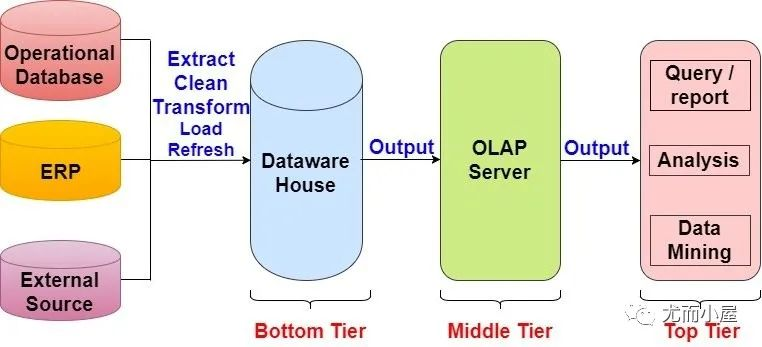
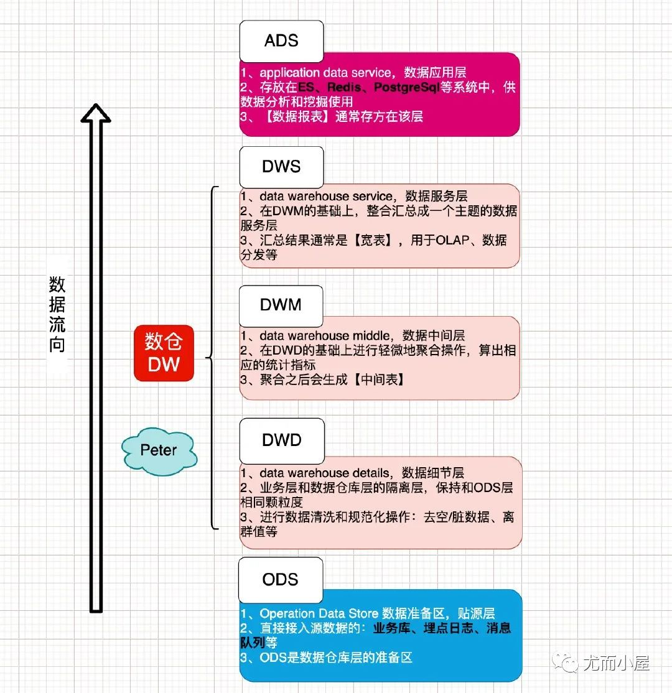
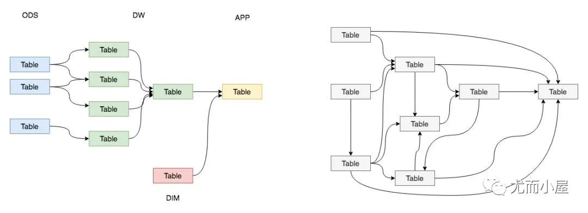
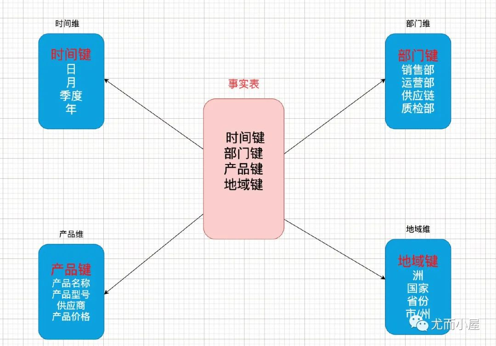

## 前言

数据分层是数据仓库设计中一个十分重要的环节，良好的分层设计能够让整个数据体系更容易被理解和使用。
本文介绍的是如何理解数据仓库中各个分层的作用。



## 图解数据分层
希望你收藏下面的图形，自己整理的，帮助你牢记每个数据层的作用。



## 何为数仓DW
Data warehouse（可简写为DW或者DWH）数据仓库，是在数据库已经大量存在的情况下，
它是一整套包括了ETL、调度、建模在内的完整的理论体系。

数据仓库的方案建设的目的，是为前端查询和分析作为基础，主要应用于OLAP（on-line Analytical Processing），
支持复杂的分析操作，侧重决策支持，并且提供直观易懂的查询结果。目前行业比较流行的有：AWS Redshift，Greenplum，Hive等。

Greenplum和Hive自己还是常听到，数据部门的同事有在使用。

数据仓库并不是数据的最终目的地，而是为数据最终的目的地做好准备，这些准备包含：清洗、转义、分类、重组、合并、拆分、统计等。

## 为何要分层
数据仓库中涉及到的问题：
1. 为什么要做数据仓库？
2. 为什么要做数据质量管理？
3. 为什么要做元数据管理？
4. 数仓分层中每个层的作用是什么？
5. …...

在实际的工作中，我们都希望自己的数据能够有顺序地流转，设计者和使用者能够清晰地知道数据的整个声明周期，比如下面左图。

但是，实际情况下，我们所面临的数据状况很有可能是复杂性高、且层级混乱的，我们可能会做出一套表依赖结构混乱，
且出现循环依赖的数据体系，比如下面的右图。



为了解决我们可能面临的问题，需要一套行之有效的数据组织、管理和处理方法，来让我们的数据体系更加有序，这就是数据分层。
数据分层的好处：

* 清晰数据结构：让每个数据层都有自己的作用和职责，在使用和维护的时候能够更方便和理解
* 复杂问题简化：将一个复杂的任务拆解成多个步骤来分步骤完成，每个层只解决特定的问题
* 统一数据口径：通过数据分层，提供统一的数据出口，统一输出口径
* 减少重复开发：规范数据分层，开发通用的中间层，可以极大地减少重复计算的工作

## 数据分层
每个公司的业务都可以根据自己的业务需求分层不同的层次；目前比较流行的数据分层：数据运营层、数据仓库层、数据服务层。

### 数据运营层ODS
数据运营层：Operation Data Store 数据准备区，也称为贴源层。数据源中的数据，经过抽取、洗净、传输，也就是ETL过程之后进入本层。
该层的主要功能：
* ODS是后面数据仓库层的准备区
* 为DWD层提供原始数据
* 减少对业务系统的影响

为了考虑后续可能需要追溯数据问题，因此对于这一层就不建议做过多的数据清洗工作，原封不动地接入原始数据即可

这层的数据是后续数据仓库加工数据的来源。数据来源的方式：
1. 业务库：sqoop定时抽取数据；实时方面考虑使用canal监听mysql的binlog日志，实时接入即可
2. 埋点日志：日志一般是以文件的形式保存，可以选择使用flume来定时同步；可以使用spark streaming或者Flink、Kafka来实时接入
3. 消息队列：来自ActiveMQ、Kafka的数据等

### 数据仓库层
数据仓库层从上到下，又可以分为3个层：数据细节层DWD、数据中间层DWM、数据服务层DWS。

#### 数据明细层DWD
数据明细层：data warehouse details，DWD

该层是业务层和数据仓库的隔离层，保持和ODS层一样的数据颗粒度；主要是对ODS数据层做一些数据的清洗和规范化的操作，
比如去除空数据、脏数据、离群值等。

#### 数据中间层DWM或数据基础层DWB
数据中间层：Data Warehouse Middle，DWM；数据基础层：Data Warehouse Base，DWB；

为了提高数据明细层的易用性，该层通常会才采用一些维度退化（业务降维）方法，将维度退化至事实表中，减少事实表和维表的关联。

具体操作就是，对DWD层中的数据（表）（事实表 + 维度表），基于业务（事实表）进行降维（即，将DWD层中业务上关系密切的表提前join），形成宽表（业务宽表），
这样在后续的数据分析中，就可以直接使用这些宽表，而不需要再次进行大量join操作。

具体步骤，如下：
```text
1：寻找业务关联表；

2：梳理清楚表之间的关系（表之间关联的字段）；

3：筛选业务关键字段，建立目标表；
    原则：先排除业务分析中一定不使用的字段，剩下的字段就宁滥勿缺。

4：编写SQL实现，select语句；
    执行SQL语句，查看结果是否符合预期；
    
5：将SQL查询结果保存到目标表中；
```

#### 数据服务层DWS
数据服务层：Data Warehouse Service，DWS；

该层是在DWD层和DWM/DWB层的数据基础上，对数据做一些轻微的聚合操作，生成一些列的中间结果表，提升公共指标的复用性，减少重复加工的工作。

该层是基于DWM上的基础数据，整合汇总成分析某一个主题域的数据服务层，一般是宽表，用于提供后续的业务查询，OLAP分析，数据分发等。
该层进行最细粒度的统计，方便后续的数据分析和数据挖掘，比如在数据集市(DM层)中进行向上卷积，生成更高层次的数据。

一般来说，该层的数据表会相对较少；一张表会涵盖比较多的业务内容，由于其字段较多，因此一般也会称该层的表为宽表（基础指标宽表，最细粒度指标宽表）。

该层就是，选择“适合的维度 + 合适的基础度量值”来进行组合，生成最细粒度的指标宽表。
```text
其中，合适的维度，是需要经过维度组合，进行选择出来的。
合适的基础度量值，就是单条记录的度量值，比如销售额、订单量等。
```

具体步骤，如下：
```text
1：找出有哪些维度，并进行维度组合，选择合适的维度组合；

2：分析，当前需要统计的组合维度和指标，需要涉及的哪些表，以及涉及到哪些字段；
    维度字段：根据各个维度表来确定；
    指标字段：业务单个量相关的可度量值字段；
    经验字段：用于标记每条数据是按照哪一个维度计算出来的；
3：创建基础业务指标宽表；
    3.1：编写SQL实现，select语句；
    3.2：执行SQL语句，查看结果是否符合预期；
    3.3：将SQL查询结果保存到目标表中；
```

### 数据集市层DM
数据集市可以理解为是一种"小型数据仓库"，它【只包含】【单个主题】，且【关注范围】而非全局。

数据集市可以分为两种:
- 一种是独立数据集市(independent data mart)，这类数据集市有自己的源数据库和ETL架构；
- 另一种是非独立数据集市(dependent data mart)，这种数据集市没有自己的源系统，它的数据来自数据仓库。
  当用户或者应用程序不需要/不必要/不允许用到整个数据仓库的数据时，非独立数据集市就可以简单为用户提供一个数据仓库的子集。

数据集市中会存放所有的有价值的维度和指标的组合，等待需求者来从数据集市中挑选。

具体方法，如下：
```text
主要是基于数据仓库中DWS层的细粒度的指标进行上卷。

注：
数据上卷：针对各种维度对细粒度指标进行各种聚合运算，得出粗粒度的指标；
数据下钻：如果指标粒度比较粗，还可以细分为更小维度的指标时，将粗粒度指标细分为细粒度指标；
```

### 数据应用层ADS
数据应用层：Application Data Service，ADS；

该层主要是提供给数据产品和数据分析使用的数据，一般会存放在ES、Redis、PostgreSql等系统中供线上系统使用；
也可能存放在hive或者Druid中，供数据分析和数据挖掘使用，比如常用的数据报表就是存在这里的。

### 事实表 Fact Table
事实表是指存储有事实记录的表，比如系统日志、销售记录等。事实表的记录在不断地增长，
比如电商的商品订单表，就是类似的情况，所以事实表的体积通常是远大于其他表。

### 维表层Dimension
维度表（Dimension Table）或维表，有时也称查找表（Lookup Table），是与事实表相对应的一种表；
它保存了维度的属性值，可以跟事实表做关联，相当于将事实表上经常重复出现的属性抽取、规范出来用一张表进行管理。
维度表主要是包含两个部分：

* 高基数维度数据：一般是用户资料表、商品资料表类似的资料表，数据量可能是千万级或者上亿级别。
* 低基数维度数据：一般是配置表，比如枚举字段对应的中文含义，或者日期维表等；数据量可能就是个位数或者几千几万。

常见的维度表有：日期表（存储与日期对应的周、月、季度等的属性）、地点表（包含国家、省／州、城市等属性）等。


## 参考资料
本文的参考资料：

1、通用的数据仓库分层方法：https://www.cnblogs.com/itboys/p/10592871.html

2、Data Warehousing - Architecture：http://www.lastnightstudy.com/Show?id=48/Data-Warehouse-Architecture

3、What is a data warehouse?（IBM）：https://www.ibm.com/cloud/learn/data-warehouse