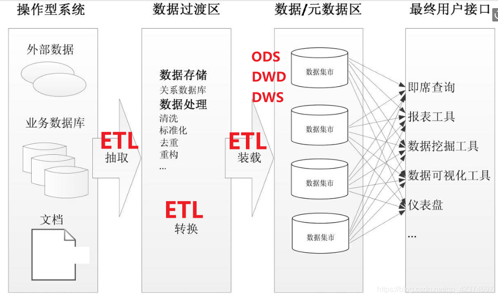
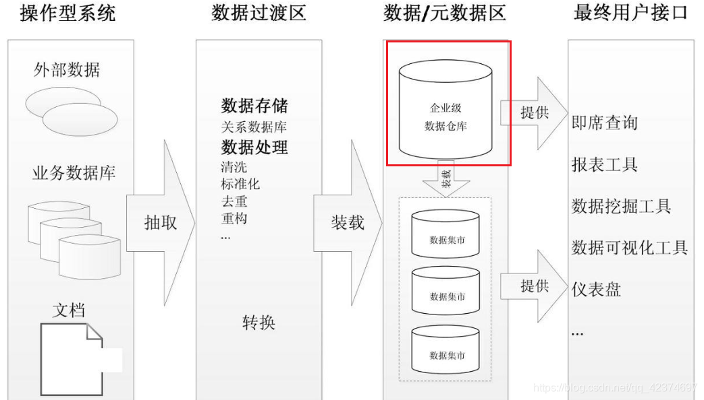
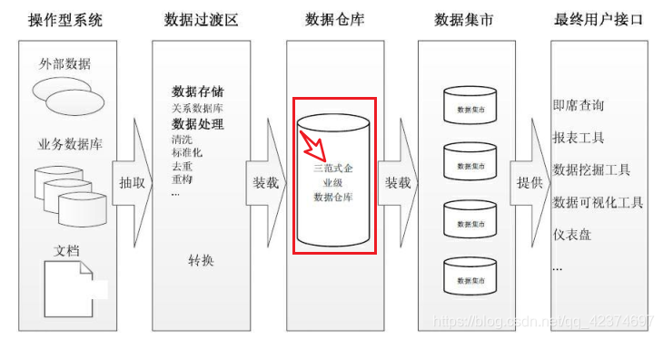
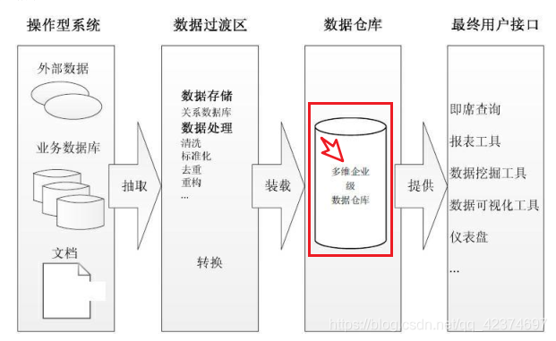
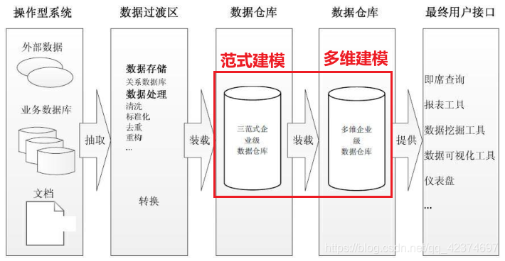

## 主要数据仓库架构

* 数据集市架构
* Immon 企业信息工厂架构
* Kimball 数据仓库架构
* 混合型数据仓库架构
----------
数仓建模方式：
* 范式建模（Inmon）
* 维度建模（kimball）
----------
## 一、数据集市架构
数据集市是按主题域组织的数据集合，用于支持部门级的决策。

有两种类型的数据集市：
* 独立数据集市
* 从属数据集市

独立数据集市集中于部门所关心的单一主题域，数据以部门为基础部署，无须考虑企业级别的信息共享与集成。

制造部门 == 》 制作部门数据集市
人力资源部门 ==》 人力资源部门数据集市

这种部门级别的数据集市DM是单一主题的、数据量小的、周期短、见效快的

但时，部门级别的数据集市（独立DM）有一定不足

当部门的分析需求扩展，或者需要分析跨部门或跨主题域的数据时，独立数据市场会显得力不从心。
而当数据存在歧义，比如同一个产品，在 A 部门和 B 部门的定义不同时，将无法在部门间进行信息比较。
> 这种方法容易造成很多数据烟囱以及数据孤岛（没有一致性维度和一致性事实的支持，是无法支持支持多主题区域，
并且使得各个数据集市成为信息孤岛，缺乏兼容性。）

从属数据集市的数据来源于数据仓库。数据仓库里的数据经过整合、重构、汇总后传递给从属数据集市。

* 性能：当数据仓库的查询性能出现问题，可以考虑建立几个从属数据集市，将查询从数据仓库移出到数据集市。
* 安全：每个部门可以完全控制他们自己的数据。
* 数据一致：因为每个数据集市的数据来源都是同一个数据仓库，有效消除了数据不一致的情况。

## 二、Immon企业信息工厂架构

企业级数据仓库是一个细节数据的集成资源库。其中的数据以最低粒度级别被捕获，存储在满足三范式设计的关系数据库中。

## 三、Kimball 维度数据仓库架构

Kimball 的数据仓库包含高粒度的企业数据，使用多维模型设计，这也意味着数据仓库由星型模式的维度表和事实表构成。

## 四、混合型数据仓库架构

联合使用 Immon 和 Kimball 两种架构

这种架构的好处是，既可以利用规范化设计消除数据冗余，保证数据的粒度足够细；又可以利用多维结构更灵活地在企业级实现报表和分析。