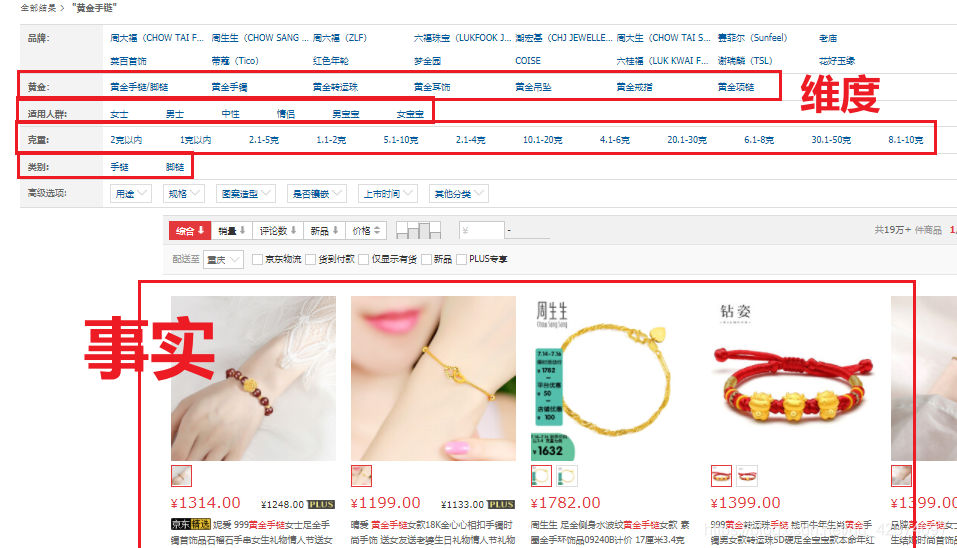
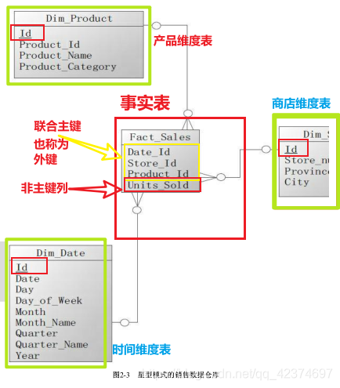
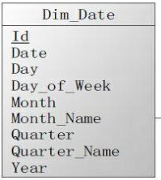

## 流行的数据仓库建模方式

关系（E-R）模型、多维模型和 Data Vault 模型

多维数据模型中涉及的几个概念介绍如下。

粒度（Granularity）

在传统的操作型数据库系统中，对数据处理和操作都是在最低级的粒度上进行的。
但是在数据仓库环境中应用的主要是分析型处理，一般需要将数据划分为详细数据、轻度总结、高度总结三级或更多级粒度。

维度（Dimension）

是多维数据集的结构性特性。它们是事实数据表中用来描述数据的分类的有组织层次结构（级别）。
这些分类和级别描述了一些相似的成员集合，用户将基于这些成员集合进行分析。

## 一、关系数据模型
关系模型被广泛应用于数据处理和数据存储，尤其是在数据库领域，现在主流的数据库管理系统几乎都是以关系数据模型为基础实现的。
（关系型数据库MySQL）

### 满足三范式

1. 关系
    由行和列构成的二维结构，对应关系数据库中的表

2. 属性
    由属性名称和类型名称构成的顺序对，对应关系数据库中表的列

3. 属性域
    域描述了属性（列）所有可能的值。

    在关系数据模型中，我们把关系描述为表，表中的行对应不同的记录，表中的列对应不同的属性。
    属性可以以任何顺序出现，而关系保持不变，也就是说，在关系理论中，表中的列是没有顺序的。

4. 元组
    关系中的一条记录，对应关系数据库中的一个表行。

5. 关系数据库
    一系列规范化的表的集合。
    “关系、属性、元组” 和 “ 表、列、行 ”
    实体（表）、记录（行）、字段（列）

6. 关系表的属性

7. 关系数据模型中的键

    （ 1 ）超键
    （ 2 ）候选键
    （ 3 ）主键
    （ 4 ）外键

### 关系完整性
关系数据模型有两个重要的完整性规则：实体完整性和参照完整性

关系数据库语言

关系数据库的主要语言是 SQL 语言

SQL 语言又可分为 DDL 、 DML 、 DCL 、 TCL 四类

### 规范化
规范化是通过应用范式规则实现的。最常用的范式有第一范式（ 1NF ）、第二范式（ 2NF ）、第三范式（ 3NF ）

第一范式（ 1NF ）:
表中的列只能含有原子性（不可再分）的值。

第二范式（ 2NF ）:
确保表中的每列都和主键相关

第三范式（ 3NF ）:
确保每列都和主键列直接相关,而不是间接相关

【规范化带来的好处】是通过【减少数据冗余】【提高更新数据的效率】，同时【保证数据完整性】。

规范化会增加表的数量，使结构更复杂。
不可避免的多表连接，使查询更复杂。

也要【防止过度规范化的问题】。
规范化程度越高，划分的表就越多，在查询数据时越有可能使用表连接操作。而如果连接的表过多，会影响查询的性能。

关系数据模型的缺点也很明显，它需要额外建立数据集市的存储区，并增加相应的数据装载过程。另外，对数据仓库的使用强烈依赖于对 SQL 语言的掌握程度。

数据结构、完整性约束和 SQL 语言是关系模型的三个要素。

## 二、维度模型
在关系模型中，实体对应关系数据库中的表，属性对应关系数据库中的列。

在维度模型中，实体由事实表和维度表组成，关系体现为在事实表中引用维度表的主键。
因此先要确认哪些信息属于中心事实表，哪些信息属于相关的维度表。维度模型中表的规范化级别通常低于关系模型中的表。

维度模型是一套技术和概念的集合，用于数据仓库设计。

不一定要引入关系数据库

维度模型是一种趋向于支持**面向最终用户**对**数据仓库**进行查询的设计技术，是围绕性能和易理解性构建的。

尽管关系模型对于事务处理系统表现非常出色，但它并不是面向最终用户的。

### 核心概念：维度与事实、粒度

这句话真的醍醐灌：
事实是业务数据的**度量**、维度是观察数据的**角度**

**维度表**存储了某一维度的所有相关数据，例如，日期维度应该包括年、季度、月、周、日等数据。

事实通常是数字类型的，可以进行聚合和计算，而维度通常是一组层次关系或描述信息，用来定义事实。
例如，销售金额是一个事实，而销售时间、销售的产品、购买的顾客、商店等都是销售事实的维度。

度量是决策者所关心的具有实际意义的数值，例如，销售量、库存量、银行贷款金额等。
度量所在的表称为事实数据表，事实数据表中存放的事实数据通常包含大量的数据行。
事实数据表的主要特点是包含数值数据（事实），而这些数值数据可以统计汇总以提供有关单位运作历史的信息。

度量是所分析的多维数据集的核心，它是最终用户浏览多维数据集时重点查看的数值数据。


**维度模型**按照**业务流程领域**即主题域建立，例如进货、销售、库存、配送等。
不同的主题域可能共享某些维度，为了提高数据操作的性能和数据一致性，需要使用一致性维度，例如几个主题域间共享维度的复制。
术语 “一致性维度” 源自 Kimball ，指的是具有相同属性和内容的维度。


### 维度模型建模过程
维度模型通常以一种被称为星型模式 或 雪花模式 的方式构建。

构建维度模型的过程如下：
* 选择业务流程
* 声明粒度
* 确认维度
* 确认事实

**选择业务流程是描述需要建模的业务流程。**
例如，需要了解和分析一个零售店的销售情况，那么与该零售店销售相关的所有业务流程都是需要关注的。
为了描述业务流程，可以简单地使用纯文本将相关内容记录下来，或者使用“业务流程建模标注”（BPMN）方法，
也可以使用统一建模语言（ UML ）或其他类似的方法。

**声明粒度是用于确定事实中表示的是什么**，例如，一个零售店的顾客在购物小票上的一个购买条目。
在选择维度和事实前必须声明粒度，因为每个候选维度或事实必须与定义的粒度保持一致。
从给定的业务流程获取数据时，原始粒度是最低级别的粒度。建议从原始粒度数据开始设计，因为原始记录能够满足无法预期的用户查询。
汇总后的数据粒度对优化查询性能很重要，但这样的粒度往往不能满足对细节数据的查询需求。
不同的事实可以有不同的粒度，但同一事实中不要混用多种不同的粒度。
维度模型建立完成之后，还有可能因为获取了新的信息，而回到这步修改粒度级别。

**确认维度是维度的粒度必须和第二步所声明的粒度一致**。维度表是事实表的基础，也说明了事实表的数据是从哪里采集来的。
典型的维度都是名词，如日期、商店、库存等。

**确认事实是识别数字化的度量，构成事实表的记录**。
它是和系统的业务用户密切相关的，因为用户正是通过对事实表的访问获取数据仓库存储的数据。
大部分事实表的度量都是数字类型的，可累加，可计算，如成本、数量、金额等。

### 维度模型的特点
在关系模型中，数据被分布到多个离散的实体中，对于一个简单的业务流程，可能需要很多表联合在一起才能表示。

在维度模型中，数据时按业务主体分布，更容易理解。

另外，**关系模型**倾向于**规范化**，而**维度模型**更倾向于**非规范化**，
便于查询（注：规范化的实质是减少数据冗余，以优化事务处理或数据更新的性能。）

维度模型是可扩展的。由于维度模型允许数据冗余，因此当向一个维度表或事实表中添加字段时，不会像关系模型那样产生巨大的影响，
带来的结果就是更容易容纳不可预料的新增数据。这种新增可以是单纯地向表中增加新的数据行而不改变表结构，也可以是在现有表上增加新的属性。

### 星型模型
星型模式的核心是一个大的中心表（事实表），一组小的附属表（维表）

维度模型通常以一种被称为星型模式的方式构建。

事实包含业务的度量，是**定量的数据**，如销售价格、销售数量、距离、速度、重量等是事实。

维度是对事实数据**属性的描述**，如日期、产品、客户、地理位置等是维度。
一个含有很多维度表的星型模式有时被称为蜈蚣模式，显然这个名字也是因其形状而得来的。
蜈蚣模式的维度表往往只有很少的几个属性，这样可以简化对维度表的维护，
但查询数据时会有更多的表连接，严重时会使模型难于使用，因此在设计中应该尽量避免蜈蚣模式。


#### 1、事实表

事实表中不全是**维度主键**，并不是说事实表中每一个字段，必须都得在外面建立一个维度表进行关联，还有一些字段不需要建立维度关联。

事实表：一般由数字值和指向维度表的外键组成。


通常会把事实表的粒度级别设计得比较低，使得事实表可以记录很原始的操作型事件，但这样做的负面影响是累加大量记录可能会更耗时。

事实表有以下三种类型：
* 事务事实表：记录特定事件的事实，如销售。
* 快照事实表：记录给定时间点的事实，如月底账户余额。
* 累积事实表：记录给定时间点的聚合事实，如当月的总的销售金额。

#### 2、维度表

维度表的记录数通常比事实表少，但每条记录包含有大量用于描述事实数据的属性字段。

从存储空间的角度看，典型的情况是维度表比事实表小很多。

举例来说，假设在220个区县的200个商场，共有100万条销售记录。
星型模式的设计会产生1,000,200条记录，
其中事实表1,000,000条记录，商场维度表有200条记录，每个区县信息作为商场的一个属性，显式地出现在商场维度表中。
在规范化的雪花模式中，会建立一个区县维度表，该表有220条记录，商场表引用区县表的主键，有200条记录，
事实表没有变化，还是1,000,000条记录，总的记录数是1,000,420（1,000,000+200+220）。



常用的维度表
* 时间维度表：描述时间信息的数据，如年、月、日、星期、季度等。
* 地理维度表：描述位置信息的数据，如国家、省份、城市、区县、邮编等。
* 产品维度表：描述产品信息的数据，如尺寸、规格等。
* 人员维度表：描述人员相关的信息，如销售人员、市场人员、开发人员等。
* 范围维度表：描述分段数据的信息，如高级、中级、低级等。

通常给维度表设计一个单列、整型数字类型的代理键，映射业务数据中的主键。
业务系统中的主键本身可能是自然键，也可能是代理键。自然键指的是由现实世界中已经存在的属性组成的键，如身份证号就是典型的自然键。

**星型模型的优点**：
* 简化查询
* 简化业务报表逻辑
* 获得查询性能
* 快速聚合

**星型模型的缺点**：
* 不能保证数据的完整性
* 对于分析需求不够灵活

#### 案例：☆☆☆

销售数据仓库：
```text
维度：日期、商店、产品
事实：销售量
```

Dim_Date 、 Dim_Store 和 Dim_Product 是三个维度表。
每个维度表的Id字段是它们的主键，维度表的非主键列表示维度的附加属性。

事实表的Date_Id、Store_Id、Product_Id三个字段构成了事实表的联合主键，同时这个三个字段也是外键，分别引用对应的三个维度表的主键。 
Units_Sold是事实表的唯一一个非主键列，代表销售量，是用于计算和分析的度量值。



下面的查询可以回答 2015年各个城市的手机销量是多少。
```text
select 
    s.city as city, sum(f.units_sold)
from
fact_sales f
inner join
    dim_date d on (f.date_id = d.id)
inner join
    dim_store s on (f.store_id = s.id)
inner join
    dim_product p on (f.product_id = p.id)
where d.year = 2015 and p.product_category = 'mobile'
group by s.city;
```

### 雪花模型（对维度表再规范）

通常，星形连接只包含一张事实表。但是在数据库设计中要创建一种雪花结构的复合结构，需要多张事实表结合。

在雪花结构中，不同的事实表通过共享一个或多个公共维表连接起来。
雪花结构隐含的另外一个想法是将事实表和维表结合起来，形成一个类似于雪花结构的形式。

与星型模式相同，雪花模式也是由事实表和维度表所组成。

雪花模式是和星型模式类似的逻辑模型。实际上，星型模式是雪花模式的一个特例（维度没有多个层级）。

某些条件下，雪花模式更具优势：
* 一些 OLAP 多维数据库建模工具专为雪花模型进行了优化。
* 规范化的维度属性节省存储空间。


雪花模式是星型模式的扩展，其中某些维表被规范化，进一步分解到附加表（维表）中。
从图中我们可以看到地址表被进一步细分出了城市（city）维，supplier type被进一步细分出来supplier堆。

将维度表进行规范化的具体做法是，把低基数的属性从维度表中移除并形成单独的表。


在雪花模式中，一个维度被规范化成多个关联的表，而在星型模式中，每个维度由一个单一的维度表所表示。
一个规范化的维度对应一组具有层次关系的维度表，而事实表作为雪花模式里的子表，存在具有层次关系的多个父表。

规范化的过程就是将维度表中重复的组分离成一个新表，以减少数据冗余的过程。
正因为如此，规范化不可避免地增加了表的数量。在执行查询的时候，不得不连接更多的表。
但是规范化减少了存储数据的空间需求，而且提高了数据更新的效率。

数据库开发者采取一种折中的方式。

底层使用雪花模型，上层用表连接建立视图模拟星型模式。这种方法既通过对维度的规范化节省了存储空间，同时又对用户屏蔽了查询的复杂性。
但是当外部的查询条件不需要连接整个维度表时，这种方法会带来性能损失。

#### 案例：☆☆☆

销售数据仓库：
```text
维度：日期、商店、产品
事实：销售量
```
Dim_Date 、 Dim_Store 和 Dim_Product 是三个维度表。

其中，Dim_Date 包括



可进一步规范，日期维度分解成季度、月、周、日期四个表。

Dim_Product 包括：


可进一步规范，产品维度分解成产品分类、产品两个表

同理

商场维度分解出一个地区表。


下面的查询可以回答 2015年各个城市的手机销量是多少。
```text
select 
    g.city,sum(f.units_sold)
from fact_sales f
inner join dim_date d on f.date_id = d.id
inner join dim_store s on f.store_id = s.id
inner join dim_geography g on s.geography_id = g.id
inner join dim_product p on f.product_id = p.id
inner join dim_product_category c on p.product_category_id = c.id
where d.year= 2015 and c.product_category = 'mobile'
group by g.city;
```

## 三、Data Vault 模型
Data Vault 模型：
* 用来存储来自多个操作型系统的完整的历史数据
* 用于企业级的数据仓库建模

Data Vault方法需要跟踪所有数据的来源，因此其中每个数据行都要包含数据来源和装载时间属性，用以审计和跟踪数据值所对应的源系统。

Data Vault不区分数据在业务层面的正确与错误，它保留操作型系统的所有时间的所有数据，装载数据时不做数据验证、清洗等工作，
这点明显有别于其他数据仓库建模方法。 

Data Vault建模方法显式地将结构信息和属性信息分离，能够还原业务环境的变化。

Data Vault允许并行数据装载，不需要重新设计就可以实现扩展。

### Data Vault 模型的组成部分
Data Vault 模型有：
* 中心表（Hub）
* 链接表（Link）
* 附属表（Satellite）

三个主要组成部分。

中心表记录**业务主键**，链接表记录**业务关系**，附属表记录**业务描述**。

#### 中心表


#### 链接表

链接表是中心表之间的链接。一个链接表意味着两个或多个中心表之间有关联。一个链接表通常是一个外键，它代表着一种业务关系。


#### 附属表

附属表用来保存中心表和链接表的属性，包括所有的历史变化数据。

一个附属表总有一个且唯一一个外键引用到中心表或链接表。

附属表的主键应该是附属表里参照到中心表或链接表的外键字段和装载时间字段的组合。


### Data Vault 模型的特点
* 所有数据都基于时间来存储，即使数据是低质量的，也不能在ETL过程中处理掉
* 依赖越少越好
* 和源系统越独立越好
* 设计上适合变化。源系统中数据的变化。在不改变模型的情况下可扩展
* ETL作业可以重复执行
* 数据完全可追踪

### Data Vault 模型的构建
步骤：
```text
1 ．设计中心表

2 ．设计链接表
    链接表体现了中心表之间的业务关联。
    
    设计链接表，首先要熟悉各个中心表代表的业务实体之间的业务关系，可能是两个或者多个中心表之间的关系。
    根据业务需求，这种关系可以是 1 对 1 、 1 对多，或者多对多的。
    
    然后，从相互之间有业务关系的中心表中，提取出代表各自业务实体的中心表主键，这些主键将被加入到链接表中，组合构成该链接表的主键。
    同样出于技术的原因，需要增加代理键。在生成链接表的同时，要注意如果中心表之间有业务交易数据的话，就需要在链接表中保存交易数据，
    有两种方法，一是采用加权链接表，二是给链接表加上附属表来处理交易数据。

3 ．设计附属表
    附属表包含了各个业务实体与业务关联的详细的上下文描述信息。

4 ．设计必要的PIT表
```

### Data Vault模型实例
用一个销售订单的例子说明如何将关系模型转换为Data Vault模型，以及如何向转换后的Data Vault模型装载数据。

关系模型中，共有省、市、客户、产品类型、产品、订单、订单明细7个表

