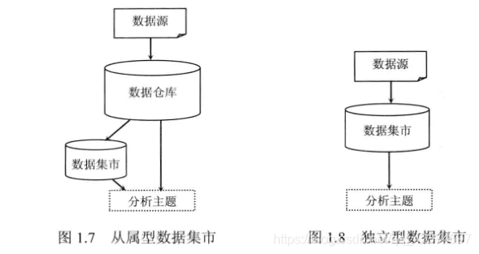
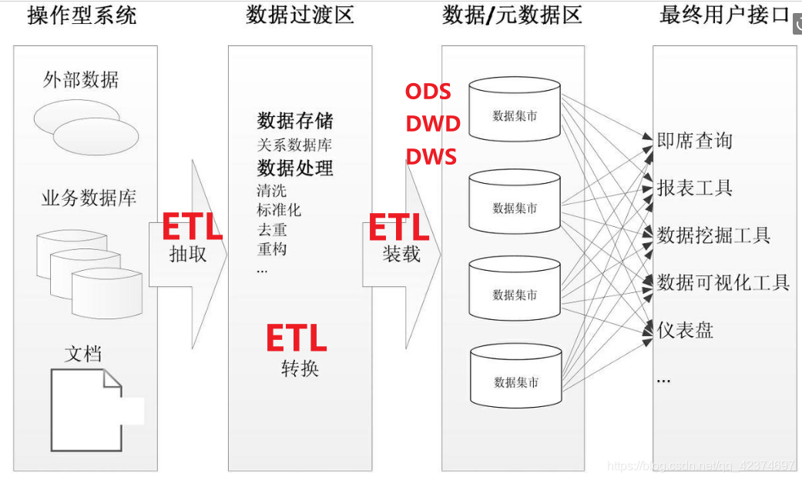
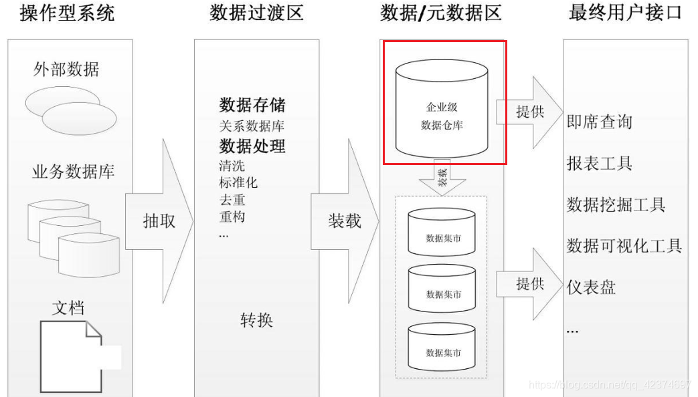
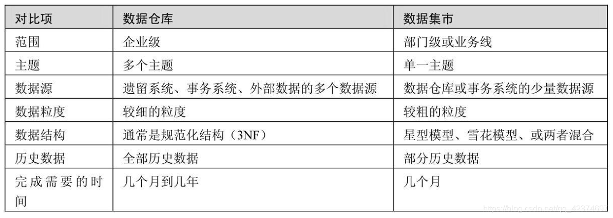

## 数据集市概念

数据集市是按主题域组织的数据集合，用于支持部门级的决策。

即，**数据集市**是**部门级**的、面向**单一主题域**的**数据仓库**。

数据集市的复杂度和需要处理的数据都小于数据仓库，因此更容易建立与维护，是数据仓库的一种简单形式。

有两种类型的数据集市：
* 独立数据集市
* 从属数据集市



### 独立数据集市

**独立数据集市** 集中于部门所关心的单一主题域，数据以部门为基础部署，无须考虑企业级别的信息共享与集成。
```text
制造部门 == 》 制作部门数据集市
人力资源部门 ==》 人力资源部门数据集市
```
这种部门级别的数据集市DM是**单一主题的、数据量小的、周期短、见效快**的。

但时，部门级别的数据集市（独立DM）有一定不足：
> 当部门的分析需求扩展，或者需要分析跨部门或跨主题域的数据时，独立数据集市会显得力不从心。
> 而当数据存在歧义，比如同一个产品，在 A 部门和 B 部门的定义不同时，将无法在部门间进行信息比较。
> 这种方法容易造成很多**数据烟囱**以及**数据孤岛**。
> （没有一致性维度和一致性事实的支持，是无法支持支持多主题区域，并且使得各个数据集市成为信息孤岛，缺乏兼容性）

数据集市中存的表是针对具体某个主题，里面存储的是前面各层针对于某些主题最终计算后的结果表，为后续的各个阶段提供数据支持。

总之，数据集市可以是数据仓库的一种继承，只不过在数据的组织方式上，数据集市处于相对低的层次。

独立数据集市架构：



### 从属数据集市

**从属数据集市**的数据来源于数据仓库。数据仓库里的数据经过整合、重构、汇总后传递给从属数据集市。

从属数据集市架构：



* 性能：当数据仓库的查询性能出现问题，可以考虑建立几个从属数据集市，将查询从数据仓库移出到数据集市。
* 安全：每个部门可以完全控制他们自己的数据。
* 数据一致：因为每个数据集市的数据来源都是同一个数据仓库，有效消除了数据不一致的情况。

## 数据集市与数据仓库的区别


## 数据集市设计
数据集市主要用于**部门级别的分析型应用**，数据大都是经过了汇总和聚合操作，粒度级别较高。

数据集市一般采用**维度模型**设计方法，数据结构使用星型模式或雪花模式。
