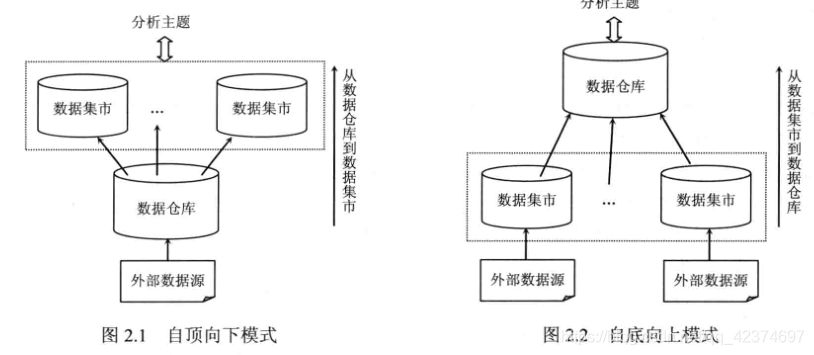

## 前言

实施一个数据仓库项目的主要步骤是：定义范围、确认需求、逻辑设计、物理设计、装载数据、访问数据、管理维护。

## 1、定义范围（概念设计）
**首要任务**是定义项目的范围。

项目范围定义了一个数据仓库项目的边界。典型的范围定义是组织、地区、应用、业务功能的联合表示。
定义范围时通常需要权衡考虑资源（人员、系统、预算等）、进度（项目的时间和里程碑要求）、功能（数据仓库承诺达到的能力）三方面的因素。
定义好清晰明确的范围，并得到所有项目干系人的一致认可，对项目的成功是非常重要的。
项目范围是设定正确的期望值、评估成本、估计风险、制定开发优先级的依据。

## 2、确定需求（概念设计）
需求分为：业务需求和技术需求。

### 定义业务需求☆☆☆

建立数据仓库的主要目的是为组织赋予从全局访问数据的能力。

数据的细节程度必须能够满足用户执行分析的需求，并且数据应该被表示为用户能够理解的业务术语。
对数据仓库中的数据的分析将辅助业务决策，因此，作为数据仓库的设计者，应该清楚业务用户是如何做决策的，
在决策过程中提出了哪些问题，以及哪些数据是回答这些问题所需要的。
与业务人员进行面对面的沟通，是理解业务流程的好方式。沟通的结果是使数据仓库的业务需求更加明确。
在为数据仓库收集需求的过程中，还要考虑设计要能适应需求的变化。

另一方面，数据仓库的特点是面向主题，按主题组织数据。
所谓主题就是分析决策的目标和要求，因此主题是建立数据仓库的前提。
数据仓库应用系统的需求分析，必须紧紧围绕着主题来进行，主要包括主题分析、数据分析和环境要求分析。

### 定义技术需求☆☆☆

数据仓库的数据来源是操作型系统，这些系统日复一日地处理着各种事务活动。
操作型系统大都是联机事务处理系统（MySQL）。数据仓库会从多个操作型源系统抽取数据。
但是，一般不能将操作型系统里的数据直接迁移到数据仓库，而是需要一个中间处理过程，这就是所谓的ETL过程。
需要知道如何清理操作型数据，如何移除垃圾数据，如何将来自多个源系统的相同数据整合在一起。
另外，还要确认数据的更新频率。例如，如果需要进行长期的或大范围的数据分析，可能就不需要每天装载数据，
而是每周或每月装载一次。注意，更新频率并不决定数据的细节程度，每周汇总的数据有可能每月装载
（当然这种把数据转换和数据装载分开调度的做法并不常见）。
在数据仓库设计的初始阶段，需要确定数据源有哪些、数据需要做哪些转换以及数据的更新频率是多少。

## 3、逻辑设计
逻辑设计过程中，需要定义特定数据的具体内容，数据之间的关系，支持数据仓库的系统环境等，本质是发现逻辑对象之间的关系。

### 建立需要的数据列表

即，确定需要哪些数据，数据之间的关系。

细化业务用户的需求以形成数据元素列表。很多情况下，为了得到所需的全部数据，需要适当扩展用户需求或者预测未来的需要，
一般从主题域涉及的业务因素入手。例如，销售主题域的业务因素可能是客户、地区、产品、促销等。
然后简历每个业务因素的元素列表，依据也是用户提出的需求。最后通过元素列表，标识出业务因素之间的联系。
这些工作完成后，应该已经获得了如下的新鲜：原始的或计算后的数据元素列表；数据的属性，比如是字符型的还是数字型的；
合理的数据分组，比如国家、省市、区县等分成一组，因为他们都是地区元素；数据之间的关系，比如国家、省市、区县的包含关系等。

### 识别数据源

了需要的数据列表，下面的问题是确定从哪里可以得到这些数据，以及要得到这些数据需要多大的成本。

需要把上一步建立的数据列表映射到操作型系统上。

应该从做大最复杂的源系统开始，在必要时再查找其他源系统。数据的映射关系可能是直接的或间接的，
比如销售源系统中，商品的单间和折扣价可以直接获得，而折扣价百分比就需要计算得到。
通常维度模型中的维度表可以直接映射到操作型源系统，而事实表的度量则映射到源数据在特定力度级别上聚合计算后的结果。
某些数据的获得需要较高的成本，例如，用户想要得到促销相关的销售数据就不那么容易，因为促销期的定义从时间角度看不是连续的。

### 制作实体关系图（E-R图）

实体对应关系数据库中的表，属性对应关系数据库中的列

在维度模型的 ERD 中，实体由事实表和维度表组成，关系体现为在事实表中引用维度表的主键。
因此先要确认哪些信息属于中心事实表，哪些信息属于相关的维度表。维度模型中表的规范化级别通常低于关系模型中的表。

## 4、物理设计
物理设计指的是将逻辑设计的对象集合，转化为一个物理数据库，包括所有的表、索引、约束、视图等

比较通用的数据仓库优化方法有位图索引和表分区。

## 5、装载数据
涉及整个ETL过程，需要执行的任务包括：
* 源和目标结构之间建立映射关系；
* 从源系统抽取数据；
* 对数据进行清洗和转换；
* 将数据装载进数据仓库；
* 创建并存储元数据；

## 6、访问数据
访问步骤是要使数据仓库的数据可以被使用，使用的方式包括：数据查询、数据分析、建立报表图表、数据发布等。
根据采用的数据仓库架构，可能会引入数据集市的创建。

通常，最终用户会使用图形化的前端工具向数据库提交查询，并显示查询结果。访问步骤需要执行以下任务：
1. 为前端工具建立一个中间层。在这个中间层里，把数据库结构和对象名转化成业务术语，
   这样最终用户就可以使用与特定功能相关的业务语言同数据仓库交互。

2. 管理和维护这个业务接口。

3. 建立和管理数据仓库里的中间表和汇总表。建立这些表完全是出于性能原因。
   中间表一般是在原始表上添加过滤条件获得数据集合，汇总表则是对原始表进行聚合操作后的数据集合。
   这些表中的记录数会远远小于原始表，因此前端工具在这些表上的查询会执行得更快。（宽表）

## 7、管理维护
这个步骤涵盖在数据仓库整个生命周期里的管理和维护工作。
这步需要执行的任务包括：确保对数据的安全访问、管理数据增长、优化系统以获得更好的性能、保证系统的可用性和可恢复性等。