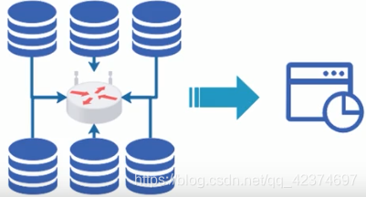
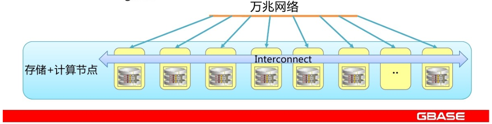
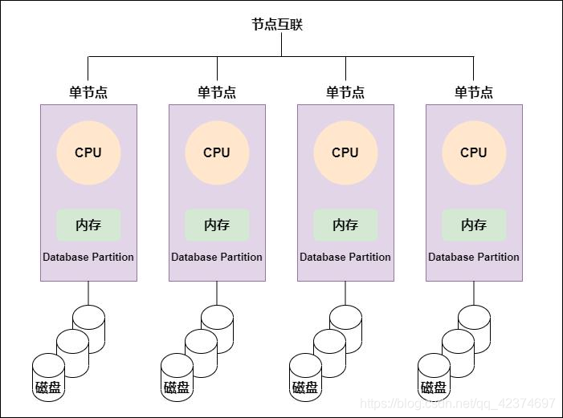
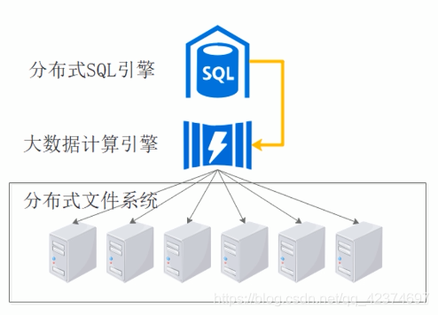

数据仓库建设方案有两种，一种是【传统架构】的数据仓库，一种是【大数据架构】的数据仓库。


## 传统数据仓库

传统数据仓库是由单机数据库发展而来的。
业务数据库一般是关系型数据库（RDBMS），那数据仓库在建设初期，也会选用关系型数据库，
因为数据迁移起来方便，而且业务系统的改造成本也较小。

但历史数据较为庞大，单个RDBMS节点即使增加了大容量硬盘，也无法满足存储需求怎么办？
那就多个RDBMS节点组成MPP（大规模并行处理）集群进行存储。
每个节点负责一部分数据的存储、计算任务，数据通过提前调度，分配到各个节点中进行存储；
各个节点产生的部分结果，也会汇总成最终结果进行返回。


### 传统数仓的优点

传统数仓的优点在于**SQL支持率高**；且**在一定数据规模下，性能很出色**。

因为是单机关系型数据库改造而来，所以完全兼容原有的SQL语法，这样的话，业务迁移起来比较方便。
在之后的使用上，也不需要增加很多额外的学习成本。

传统数据仓库在数据量没有达到某个量级时，是很优秀的解决方案，且继承了单机数据库优异的性能。
但数据量一旦超过某个数量级时，它的问题就暴露出来了。

### 存在的问题

传统数据仓库存在的问题如下:

#### 1. 扩展性有限

因为传统数据仓库的架构是由单机发展来的，在单机数据库上进行功能的扩展，或者增加中间件，从而形成MPP（大规模并行处理）集群。

但这种MPP数据仓库，每个节点本质上还是一个数据库，需要考虑精细的内存管理；
且独立进行计算，如果需要交换数据，则通过高速网络连接其它所有节点进行。
这种连接所有节点的高速网络拓扑，直接限制了它节点的上限。

其次，它在数据存储时，采用的是分库分表策略（架构所限），将一个数据库中的表拆分到各个节点中进行存储，
每张表存储的数据如果足够多的话，再将表进行拆分。

但分库分表也存在上限，因为分库分表的粒度越细，数据仓库在处理数据时，性能越差。
所以为了保证性能，分库分表也不能无限进行。

#### 2. 热点问题

传统数据仓库因为在存储时，会进行分库分表，所以一张表的会被拆分成多份，交由不同数据库节点进行保存。
假设一张表有100W行数据，它在存储时被拆分成10份，一份有10W行。
但恰巧，前10W行的数据是热点数据，在数据处理时被访问的频率是其它数据的两倍，且这一份数据被存储到了某个节点中。

那可想而知，这个节点承受的压力也是其它节点的两倍。那这个节点就容易出现宕机，或者超时的情况。
而单节点瓶颈会导致整个系统短板。节点越多，节点出错频率就越高，整个集群的可用性就越低；这也限制了它的扩展性。

当然热点问题，可以通过数据加盐的方式进行解决，将表中的数据通过增加前缀打散，从而随机分布到各个节点中。
但数据加盐本身会增加一些额外操作，并带来一些额外的问题。这个需要留意。

### MPP架构

前面提到，MPP架构（大规模并行处理系统）是传统数据仓库一种常见的架构，



* 传统数仓中常见的技术架构，将单机数据库节点组成集群，提升整体处理性能
* 节点间为非共享架构（Share Nothing），每个节点都有独立的磁盘存储系统和内存系统
* 每台数据节点通过专用网络或者商业通用网络互相连接，彼此协同计算，作为整体提供服务
* 设计上优先考虑C（一致性），其次考虑A（可用性），尽量做好P（分区容错性）

MPP每个节点都是独立运行、独立计算的，不需要去关心整个集群的一个状态，也不用关心其他存储节点存储的一些数据信息，
但是每个节点必须依托于集群，脱离集群后将不能运算。

#### 什么是MPP？

MPP(Massively Parallel Processing): 大规模并行处理系统，系统由许多松耦合处理单元组成。
每个单元内的CPU都有自己私有的资源，如总线、内存、硬盘等。
在每个单元内都有操作系统和管理数据库的实例副本。
这种结果最大的特点在于不共享资源。

MPP架构应具有的特征：
* 任务并行执行
* 数据分布式存储（本地化）
* 分布式计算
* 私有资源
* 横向扩展
* Shared Nothing架构

MPP架构产品：
* MPP数据库
* NoSQL



#### MPP架构图：



#### 架构优点

* 运算方式精细，延迟低、吞吐低
* 适合中等规模的结构化数据处理

#### 架构缺点

* 存储位置不透明，通过Hash确定数据所在的物理节点，查询任务在所有节点均会执行
* 并行计算时，单节点瓶颈会成为整个系统短板，容错性差
* 分布式事务的实现会导致扩展性降低


## 大数据数据仓库

大数据数据仓库是**依托于大数据技术**的一种新型数据仓库技术。

它是基于大数据天然的分布式存储、计算，并添加了SQL的支持而形成的一种架构。与传统数据仓库的架构是截然不同的。


```text
利用大数据天然的扩展性，完成海量数据的存放。
将SQL转换为大数据计算引擎任务，完成数据分。

适用HQL语句分析的是HDFS上沟量的数据，HQL语句运行在Hadoopt群，Sparkt群中的。适用场景：数据量庞大，对性能要求高的场合。

Hive On MR（Hive底层的计算模型默认是MapReduce）
Hive On Spark（Hive底层的计算模型默认是Spark）
```

大数据技术是为海量数据的存储、计算服务的，所以它有天生的分布式架构来解决数据存储问题，且有极强的扩展性。
在数据处理方面，为了避免海量数据的移动造成的IO、网络开销，使用了【移动计算】而非移动数据的架构，将计算任务分发到数据节点进行计算；
因为一份数据是被拆分，并存放在多个节点的，所以每个节点的收到计算任务后，是并发执行的，计算得到的结果一定是部分结果。
最后再将部分结果进行汇总，得到最终结果。

但大数据初期存在一个问题，易用性差。因为大数据处理，是有自己的特定语法的。
而企业中大部分数据都是存储在数据库中的结构化数据，使用SQL进行处理。
所以要使用大数据平台，就必须要做大量的业务迁移工作，即将SQL转化成大数据处理语法。

之后，基于大数据的数据仓库产品应运而生，这些产品完成了SQL对大数据处理语法的转化，
且借助大数据分布式架构带来的天然的海量数据存储、处理能力，解决了传统数据仓库的痛点，成为将来数据仓库的一个发展趋势。

### 优势

#### 1. 解决了扩展性问题

大数据平台的分布式架构的**扩展性极强**，**海量数据的存储、运算**，不再成为问题。

大数据平台负责存储的分布式文件系统，将数据库中的结构化数据统一视为文件进行存储，将文件自动进行拆分，分发到各节点进行存储。
不用再顾虑分库分表的问题。在进行数据处理时，才在上层引擎中使用元数据对文件还原成表结构。

#### 2. 解决了热点问题

底层分布式文件系统进行数据存储时，为了保证数据的安全性，会将数据进行备份，默认为 3 份。
在进行计算时，会将任务分发到数据节点，因为3个副本的数据时一致的，所以可以选择一个最空闲的数据节点，将任务分发过去。
在任务执行时，是可选择节点的，所以极大的降低了出现热点的可能性。

### 存在的问题

#### 1. SQL支持率低

因为大数据数据仓库架构是将SQL转换为大数据分布式处理语法，不是原生的SQL处理逻辑，所以SQL支持率没有传统数仓那么高。
但随着技术的发展，现有大数据产品的SQL支持率也越来越高。

#### 2. 缺少事务支持

当前大数据数据仓库因为是分布式架构，所以相对于单机数据库来说，事务的实现较难，大多数产品事务支持不全。
但因为数据仓库主要是面向数据分析，对事务的要求并没有那么严格，所以也不存在什么问题。

#### 3. 数据量较少时，计算速度慢

因为大数据架构是完全分布式的，为海量数据运算而设计的；在运行时，会对任务进行拆分、调度，最后对结果进行合并；
所以在数据没有达到一定规模的时候，调度过程会花费大量的时间。
但一旦数据量超过某个量级，调度时间远远小于计算时间，大数据架构的优势就体现出来了。


## 常见数据仓库产品

### 传统数据仓库

* Oracle RAC
* DB2
* Teradata
* Greenplum

### 大数据数据仓库

* Hive
* Spark SQL
* HBase
* Impala
* HAWQ
* TIDB


## 小结

总的来说，在数据量没有达到一定量级时，使用传统数据仓库方案是最优的，它性能好、SQL 支持率高、易用性好。
但一旦企业数据达到某个量级，传统数据仓库运行效率就会变差，只能寻求大数据数据仓库的解决方案。

虽然大数据数据仓库的 SQL 支持库低、缺少事务支持，但综合它的使用场景，且随着技术的发展，这些问题都会被解决。
长远来看，大数据数据仓库，一定会是将来的趋势所在。