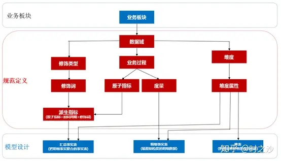
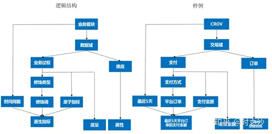
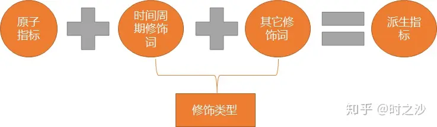
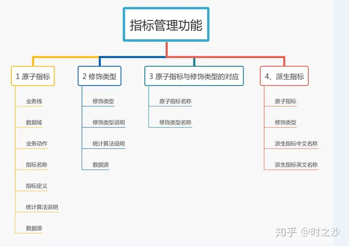
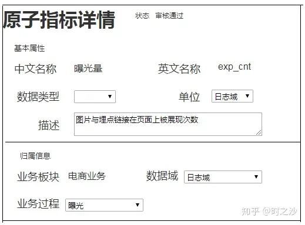
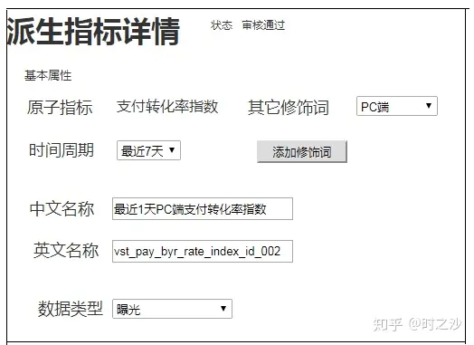
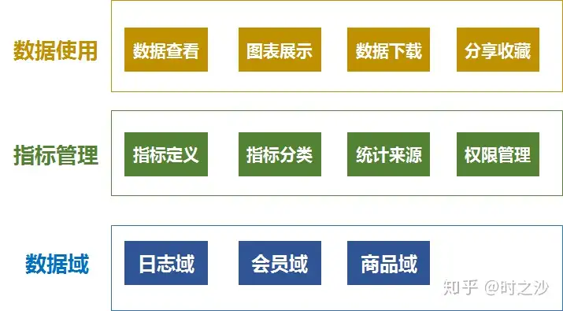

# 引言
**指标**作为业务和数据的结合，是数据统计的基础，也是量化业务效果的依据。

如何避免指标统计使用过程中出现的指标名称混乱，指标不唯一？
同时做好数据有序地和有结构地分类组织和存储，避免底层数据的重复建设，数据统计来源的不唯一。

本文重点介绍了如何根据**业务过程**来定义**原子指标**，根据原子指标和**修饰词**的结合来定义相关**派生指标**，同时做好指标的规范命名。
---

# 1、背景介绍
**指标**是指将业务单元细分后量化的度量值，它使得业务目标可描述、可度量、可拆解。

而**指标体系**的搭建是最为重要的，将直接影响「产生→处理→存储→计算→应用」的全流程。

而在实际的使用过程中出现了以下问题：
- ① 对于同一业务场景，各部门会用不同的指标来衡量；
- ② 对于同一指标的计算，不同的时间点去统计，统计来源和方式会有差异。

具体来说，要做到以下几点：
- 1）规范维度和量度命名，确保唯一性，命名规则要尽量做到明确、通用、易懂；
- 2）对确认维度或量度，统一计算口径，避免歧义；
- 3）涵盖尽可能多的核心维度和量度，以此为基础推动数据建设，确保指标字典里覆盖的维度都可区分，指标都可统计；
- 4）基于指标字典，将核心维度和量度注入元数据中心，接入指标提取工具，后续实现不需要写sql即可完成自助查询及分析需求，搭建数据自助分析的基础。

因此要提供标准化的、共享的、数据服务能力，降低数据互通成本，释放计算、存储、人力等资源，以消除业务和技术之痛。

数据体系架构如下：

- 业务板块：如果业务产品比较多，且彼此之间的指标或者重叠性比较少的，可单独分开。

- 规范定义：设计出一套数据规范的命名体系。

- 模型设计：以维度建模理论为基础，基于维度建模总线架构，构建一致性的维度和事实。

---

# 2 指标的规范定义
指标的规范定义，以**维度建模**作为理论基础，构建总线矩阵，划分和定义数据域、业务过程、维度、度量/原子指标、修饰类型、修饰词、时间周期、派生指标等。

## ① 数据域

指面向业务分析，将业务过程或者维度进行抽象的集合。

其中，**业务过程**可以概括为一个个**不拆分的行为事件**，在业务过程之下，可以定义指标；
**维度**，是**度量的环境**，如买家下单事件，买家是维度。

为了保障整个体系的生命力，**数据域**是需要抽象提炼，并且长期维护更新的，但不轻易变动。

## ② 业务过程

指企业的**业务活动事件**，如，下单、支付、退款都是业务过程。其中，**业务过程不可拆分**。

## ③ 时间周期

用来明确统计的**时间范围**或者**时间点**，如最近30天、自然周、截止当日等。

## ④ 修饰类型

是**对修饰词的一种抽象划分**。修饰类型从属于某个**业务域**，如日志域的访问终端类型涵盖无线端、PC端等修饰词。

## ⑤ 修饰词

指的是统计维度以外指标的业务场景限定抽象，**修饰词**属于一种**修饰类型**，如在日志域的访问终端类型下，有修饰词无线端、PC端等。

## ⑥ 度量/原子指标

**原子指标**和**度量**含义相同，基于某一业务事件行为下的度量，是业务定义中**不可再拆分的指标**，**具有明确业务含义的名称**，如支付金额。

## ⑦ 维度

维度是**度量的环境**，用来**反映业务的一类属性**，这类属性的集合构成一个维度，也可以称为实体对象。

维度属于一个数据域，如地理维度（其中包括国家、地区、省市等）、时间维度（其中包括年、季、月、周、日等级别内容）。

## ⑧ 维度属性

维度属性隶属于一个维度，如地理维度里面的国家名称、国家ID、省份名称等都属于维度属性。

## ⑨ 派生指标

派生指标 = 1个原子指标 + 多个修饰词（可选）+ 时间周期。可以理解为原子指标业务统计范围的圈定。
如原子指标：支付金额，最近1天海外买家支付金额则为派生指标。

派生指标又分以下三种类型：

### 事务型指标：
是指**对业务活动进行衡量**的指标。

例如，新增注册会员数、订单支付金额，这类指标需要维护原子指标以及修饰词，在此基础上创建派生指标。

### 存量型指标：
是指**对实体对象（如商品、会员）某些状态的统计**，

例如商品总数、注册会员总数，这类指标需要维护原子指标以及修饰词，在此基础上创建派生指标，对应的时间周期一般为“历史截止当前某个时间”。

### 复合型指标：
是在**事务型**指标和**存量型**指标的基础上**复合成**的。例如，浏览UV-下单买家数转化率。

复合型指标的规则：

- 比率型：
    创建原子指标，如CTR、浏览UV-下单买家数转化率、满意率等。
    例如，“最近1天店铺首页CTR”，原子指标为“CTR”，时间周期为“最近1天”，修饰类型为“页面类型”，修饰词为“店铺首页”。

- 比例型：
    创建原子指标，如百分比、占比。
    例如，“最近1天无线支付金额占比”，原子指标为“支付金额占比”，修饰类型为“终端类型”，修饰词为“无线”。

- 变化量型：
    不创建原子指标，增加修饰词，在此基础上创建派生指标。
    例如，“最近1天订单支付金额上1天变化量”，原子指标为“订单支付金额”， 时间周期为“最近1天”，修饰类型为“统计方法”，修饰词为“上1天变化量”。

- 变化率型：
    创建原子指标，例如，“最近7天海外买家支付金额上7天变化率”，原子指标为“支付金额变化率”，修饰类型为“买家地域”，修饰词为“海外买家”。

- 统计型（均值、分位数等）：
    不创建原子指标，增加修饰词，在此基础上创建派生指标；在修饰类型“统计方法”下增加修饰词，如人均、日均、行业平均等。
    例如，“自然月日均UV”，原子指标为 “UV”，修饰类型为“统计方法”，修饰词为“日均”。

---

# 3 指标管理的功能实现
为了实现指标管理，需考虑的底层信息：

部分前台界面展示：

# 4 数据的使用框架

在对指标进行规范定义与管理的基础上，可以此推动底层事实表以及维表的建设，保证数据统计的数据源唯一以及计算口径统一。

同时，通过指标和修饰词的结合，便于业务人员进行自助分析与使用数据，降低数据获取的效率，从而产生有价值的结论，辅助决策，充分发挥数据的价值。

# 总结

本文总结了如何基于业务来划分业务过程，从而涉及对应的原子指标，在与维度结合的基础上创建派生指标，建设成规范统一的数据指标体系。
以此推动数据统计来源的唯一性，并接入指标提取工具，后续业务完成自助查询及分析需求，搭建数据自助分析的基础。

本书部分内容参考阿里巴巴数据技术以及产品部的《大数据之路 阿里巴巴大数据实践》，欢迎大家一起交流。