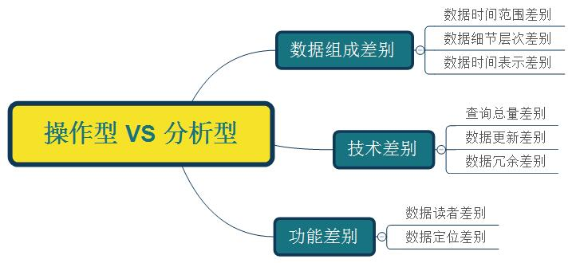
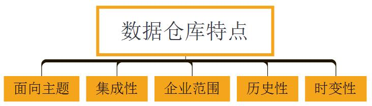
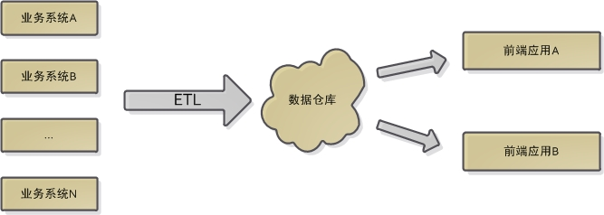
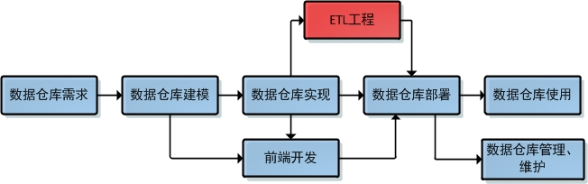

# 第一节 数据仓库--概述

## 前言
阅读本文前，请先回答下面两个问题：

        1. 数据库和数据仓库有什么区别？

        2. 某大公司Hadoop Hive里的关系表不完全满足完整/参照性约束，也不完全满足范式要求，甚至第一范式都不满足。这种情况正常吗？

        如果您不能五秒内给出答案，那么本文应该是对您有帮助的。

## 数据库的"分家"
随着关系数据库理论的提出，诞生了一系列经典的RDBMS，如Oracle，MySQL，SQL Server等。这些RDBMS被成功推向市场，并为社会信息化的发展做出的重大贡献。然而随着数据库使用范围的不断扩大，它被逐步划分为两大基本类型：

        1. 操作型数据库

            主要用于业务支撑。一个公司往往会使用并维护若干个数据库，这些数据库保存着公司的日常操作数据，比如商品购买、酒店预订、学生成绩录入等；

        2. 分析型数据库

        主要用于历史数据分析。这类数据库作为公司的单独数据存储，负责利用历史数据对公司各主题域进行统计分析；

        那么为什么要"分家"？在一起不合适吗？能不能构建一个同样适用于操作和分析的统一数据库？

        答案是NO。一个显然的原因是它们会"打架"......如果操作型任务和分析型任务抢资源怎么办呢？再者，它们有太多不同，以致于早已"貌合神离"。接下来看看它们到底有哪些不同吧。

## 操作型数据库 VS 分析型数据库

    因为主导功能的不同(面向操作/面向分析)，两类数据库就产生了很多细节上的差异。
    这就好像同样是人，但一个和尚和一个穆斯林肯定有很多行为/观念上的不同。

    接下来本文将详细分析两类数据库的不同点：

    1. 数据组成差别 - 数据时间范围差别

        一般来讲，操作型数据库只会存放90天以内的数据，而分析型数据库存放的则是数年内的数据。
        这点也是将操作型数据和分析型数据进行物理分离的主要原因。

    2. 数据组成差别 - 数据细节层次差别

        操作型数据库存放的主要是细节数据，而分析型数据库中虽然既有细节数据，又有汇总数据，
        但对于用户来说，重点关注的是汇总数据部分。

        操作型数据库中自然也有汇总需求，但汇总数据本身不存储而只存储其生成公式。
        这是因为操作型数据是动态变化的，因此汇总数据会在每次查询时动态生成。

        而对于分析型数据库来说，因为汇总数据比较稳定不会发生改变，而且其计算量也比较大(因为时间跨度大)，
        因此它的汇总数据可考虑事先计算好，以避免重复计算。

    3. 数据组成差别 - 数据时间表示差别

        操作型数据通常反映的是现实世界的当前状态；而分析型数据库既有当前状态，还有过去各时刻的快照，
        分析型数据库的使用者可以综合所有快照对各个历史阶段进行统计分析。

    4. 技术差别 - 查询数据总量和查询频度差别

        操作型查询的数据量少而频率多，分析型查询则反过来，数据量大而频率少。
        要想同时实现这两种情况的配置优化是不可能的，这也是将两类数据库物理分隔的原因之一。

    5. 技术差别 - 数据更新差别

        操作型数据库允许用户进行增，删，改，查；分析型数据库用户则只能进行查询。

    6. 技术差别 - 数据冗余差别

        数据的意义是什么？就是减少数据冗余，避免更新异常。而如5所述，分析型数据库中没有更新操作。
        因此，减少数据冗余也就没那么重要了。

        现在回到开篇是提到的第二个问题"某大公司Hadoop Hive里的关系表不完全满足完整/参照性约束，也不完全满足范式要求，
        甚至第一范式都不满足。这种情况正常吗？"，答曰是正常的。
        因为Hive是一种数据仓库，而数据仓库和分析型数据库的关系非常紧密(后文会讲到)。它只提供查询接口，不提供更新接口，
        这就使得消除冗余的诸多措施不需要被特别严格地执行了。

    7. 功能差别 - 数据读者差别

        操作型数据库的使用者是业务环境内的各个角色，如用户，商家，进货商等；分析型数据库则只被少量用户用来做综合性决策。

    8. 功能差别 - 数据定位差别

        这里说的定位，主要是指以何种目的组织起来。操作型数据库是为了支撑具体业务的，因此也被称为"面向应用型数据库"；
        分析型数据库则是针对各特定业务主题域的分析任务创建的，因此也被称为"面向主题型数据库"。

## 数据仓库(data warehouse)定义
聪明的读者应该已经意识到这个问题：既然分析型数据库中的操作都是查询，因此也就不需要严格满足完整性/参照性约束以及范式设计要求，而这些却正是关系数据库精华所在。这样的情况下再将它归为数据库会很容易引起大家混淆，毕竟在绝大多数人心里数据库是可以关系型数据库画上等号的。

那么为什么不干脆叫"面向分析的存储系统"呢？

Bingo！~这就是关于数据仓库最贴切的定义了。事实上数据仓库不应让传统关系数据库来实现，因为关系数据库最少也要求满足第1范式，而数据仓库里的关系表可以不满足第1范式。也就是说，同样的记录在一个关系表里可以出现N次。但由于大多数数据仓库内的表的统计分析还是用SQL，因此很多人把它和关系数据库搞混了。

知道了什么是数据仓库后，再来看看它有哪些特点吧。某种程度上来说，这也是分析型数据库的特点：

    1. 面向主题

    面向主题特性是数据仓库和操作型数据库的根本区别。操作型数据库是为了支撑各种业务而建立，而分析型数据库则是为了对从各种繁杂业务中抽象出来的分析主题(如用户、成本、商品等)进行分析而建立；

    2. 集成性

    集成性是指数据仓库会将不同源数据库中的数据汇总到一起；

    3. 企业范围

    数据仓库内的数据是面向公司全局的。比如某个主题域为成本，则全公司和成本有关的信息都会被汇集进来；

    4. 历史性

    较之操作型数据库，数据仓库的时间跨度通常比较长。前者通常保存几个月，后者可能几年甚至几十年；

    5. 时变性

    时变性是指数据仓库包含来自其时间范围不同时间段的数据快照。
    有了这些数据快照以后，用户便可将其汇总，生成各历史阶段的数据分析报告；

## 数据仓库组件
数据仓库的核心组件有四个：各源数据库，ETL，数据仓库，前端应用。如下图所示：

    1. 业务系统

    业务系统包含各种源数据库，这些源数据库既为业务系统提供数据支撑，同时也作为数据仓库的数据源(注：除了业务系统，数据仓库也可从其他外部数据源获取数据)；

    2. ETL

    ETL分别代表：提取extraction、转换transformation、加载load。其中提取过程表示操作型数据库搜集指定数据，转换过程表示将数据转化为指定格式并进行数据清洗保证数据质量，加载过程表示将转换过后满足指定格式的数据加载进数据仓库。数据仓库会周期不断地从源数据库提取清洗好了的数据，因此也被称为"目标系统"；

    3. 前端应用

    和操作型数据库一样，数据仓库通常提供具有直接访问数据仓库功能的前端应用，这些应用也被称为BI(商务智能)应用；

## 数据集市(data mart)
数据集市可以理解为是一种"小型数据仓库"，它只包含单个主题，且关注范围也非全局。

    数据集市可以分为两种:

    1) 一种是独立数据集市(independent data mart)，这类数据集市有自己的源数据库和ETL架构；

    2) 另一种是非独立数据集市(dependent data mart)，这种数据集市没有自己的源系统，它的数据来自数据仓库。
    当用户或者应用程序不需要/不必要/不允许用到整个数据仓库的数据时，非独立数据集市就可以简单为用户提供一个数据仓库的"子集"。

## 数据仓库开发流程
数据仓库的开发流程和数据库的比较相似，因此本文仅就其中区别进行分析。

下图为数据仓库的开发流程：

    较之数据库系统开发，数据仓库开发只多出ETL工程部分。然而这一部分极有可能是整个数据仓库开发流程中最为耗时耗资源的一个环节。
    因为该环节要整理各大业务系统中杂乱无章的数据并协调元数据上的差别，所以工作量很大。
    在很多公司都专门设有ETL工程师这样的岗位，大的公司甚至专门聘请ETL专家。

## 小结
在大数据时代，数据仓库的重要性更胜以往。Hadoop平台下的Hive，Spark平台下的Spark SQL都是各自生态圈内应用最热门的配套工具，而它们的本质就是开源分布式数据仓库。

    在国内最优秀的互联网公司里(如阿里、腾讯)，很多数据引擎是架构在数据仓库之上的(如数据分析引擎、数据挖掘引擎、推荐引擎、可视化引擎等等)。
    不少员工认为，开发成本应更多集中在数据仓库层，不断加大数据建设的投入。
    因为一旦规范、标准、高性能的数据仓库建立好了，在之上进行数据分析、数据挖掘、跑推荐算法等都是轻松惬意的事情。
    反之如果业务数据没梳理好，各种脏乱数据会搞得人焦头烂额，苦不堪言。