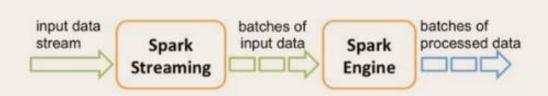
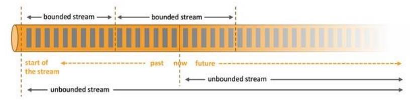
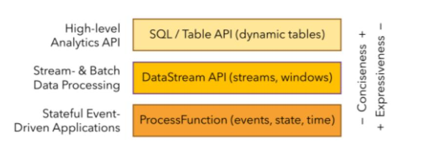

## 初识 Flink
Flink 起源于 Stratosphere 项目，
Stratosphere 是在 2010~2014 年由 3 所地处柏林的大学和欧洲的一些其他的大学共同进行的研究项目，
2014 年 4 月 Stratosphere 的代码被复制并捐赠 给了 Apache软件基金会， 
参加 这个孵化项目的初始成员 是Stratosphere 系统的核心开发人员，
2014 年 12 月，Flink 一跃成为 Apache 软件基金会的顶级项目。

在德语中，Flink 一词表示快速和灵巧，项目采用一只松鼠的彩色图案作为 logo，这不仅是因为松鼠具有快速和灵巧的特点，
还因为柏林的松鼠有一种迷人的红棕色，而 Flink 的松鼠 logo 拥有可爱的尾巴，尾巴的颜色与 Apache 软件基金会的 logo 颜色相呼应，
也就是说，这是一只 Apache 风格的松鼠。

Flink 项目的理念是：“APACHE FLINK 是为分布式、高性能、随时可用以及准确的【流处理应用程序】打造的开源【流处理框架】”。

Apache Flink 是一个框架和分布式处理引擎，用于对【无界】和【有界】数据流进行【有状态计算】。
Flink 被设计在所有常见的集群环境中运行，以内存执行速度和任意规模来执行计算。

## Flink 的重要特点
### 事件驱动型(Event-driven)
【事件驱动型应用】是一类具有状态的应用，它从一个或多个【事件流】提取数据，并根据到来的【事件】触发计算、状态更新或其他外部动作。
比较典型的就是以 kafka 为代表的消息队列几乎都是事件驱动型应用。

与之不同的就是 SparkStreaming 【微批次】，如图：

事件驱动型：

### 流与批的世界观
【批处理】的特点是【有界】、【持久】、【大量】，非常适合需要访问全套记录才能完成的计算工作，一般用于【离线统计】。

【流处理】的特点是【无界】、【实时】, 无需针对整个数据集执行操作，而是对通过系统传输的每个数据项执行操作，一般用于【实时统计】。

在 spark 的世界观中，一切都是由【批次】组成的，离线数据是一个大批次，而实时数据是由一个一个无限的小批次组成的。

而在 flink 的世界观中，一切都是由【流】组成的，【离线数据是有界限的流】，【实时数据是一个没有界限的流】，这就是所谓的有界流和无界流。

**无界数据流**：
无界数据流有一个开始但是没有结束，它们不会在生成时终止并提供数据，必须连续处理无界流，也就是说必须在获取后立即处理 event。
对于无界数据流我们无法等待所有数据都到达，因为输入是无界的，并且在任何时间点都不会完成。
处理无界数据通常要求以特定顺序（例如事件发生的顺序）获取 event，以便能够推断结果完整性。

**有界数据流**：
有界数据流有明确定义的开始和结束，
可以在执行任何计算之前通过获取所有数据来处理有界流，处理有界流不需要有序获取，因为可以始终对有界数据集进行排序，有界流的处理也称为批处理。

### 分层 api

【最底层级的抽象】仅仅提供了【有状态流】，它将通过【过程函数（Process Function）】被嵌入到 DataStream API 中。
底层过程函数（Process Function） 与 DataStream API 相集成，使其可以对某些特定的操作进行底层的抽象，
它允许用户可以自由地处理来自一个或多个数据流的事件，并使用一致的容错的状态。
除此之外，用户可以注册事件时间并处理时间回调，从而使程序可以处理复杂的计算。

实际上，大多数应用并不需要上述的底层抽象，而是针对【核心 API（Core APIs）】进行编程，
比如 DataStream API（有界或无界流数据）以及 DataSet API（有界数据集）。
这些 API 为数据处理提供了通用的构建模块，
比如由用户定义的多种形式的转换（transformations），连接（joins），聚合（aggregations），窗口操作（windows）等等。
DataSet API 为【有界数据集】提供了额外的支持，例如循环与迭代。这些 API 处理的数据类型以【类（classes）】的形式由各自的编程语言所表示。

【Table API】是以【表】为中心的声明式编程，其中表可能会动态变化（在表达流数据时）。
Table API 遵循【（扩展的）关系模型】：
表有二维数据结构（schema）（类似于关系数据库中的表），同时 API 提供可比较的操作，
例如 select、project、join、group-by、aggregate 等。Table API 程序声明式地定义了什么逻辑操作应该执行，
而不是准确地确定这些操作代码的看上去如何。

尽管 Table API 可以通过多种类型的用户自定义函数（UDF）进行扩展，
其仍不如核心 API 更具表达能力，但是使用起来却更加简洁（代码量更少）。
除此之外，Table API 程序在执行之前会经过内置优化器进行优化。

你可以在表与 DataStream/DataSet 之间无缝切换，以允许程序将 Table API 与 DataStream 以及 DataSet 混合使用。

Flink 提供的【最高层级的抽象】是 SQL 。这一层抽象在语法与表达能力上与Table API 类似，但是是以 SQL 查询表达式的形式表现程序。
SQL 抽象与 Table API 交互密切，同时 SQL 查询可以直接在 Table API 定义的表上执行。

目前 Flink 作为批处理还不是主流，不如 Spark 成熟，所以 DataSet 使用的并不是很多。
Flink Table API 和 Flink SQL 也并不完善，大多都由各大厂商自己定制。
所以我们主要学习 DataStream API 的使用。
实际上 Flink 作为最接近 Google 【DataFlow 模型】的实现，是【流批】统一的观点，所以基本上使用 DataStream 就可以了。

### Flink 几大模块

* Flink Table & SQL(还没开发完)
* Flink Gelly(图计算)
* Flink CEP(复杂事件处理)