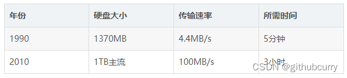
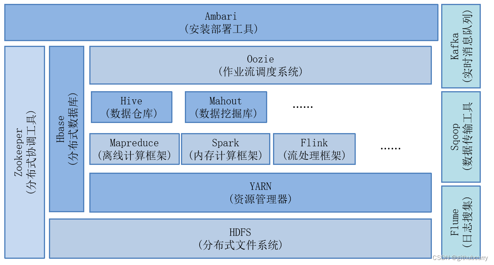
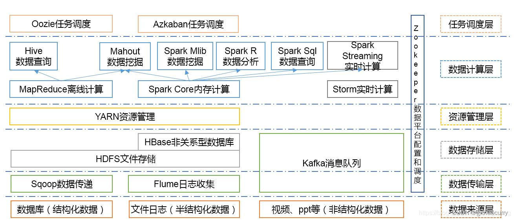
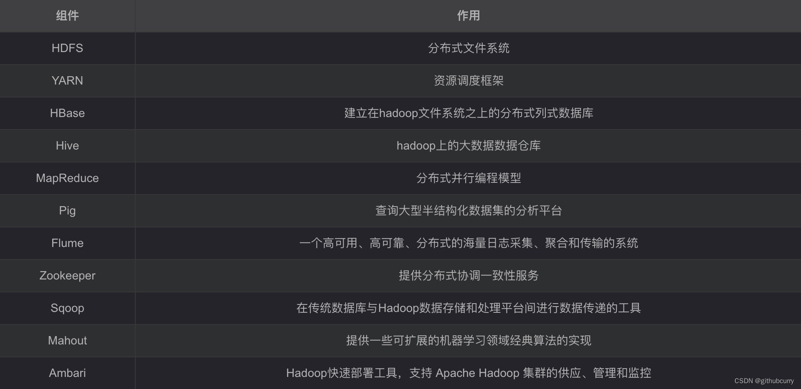

## 为什么要用hadoop

现在的我们，生活在数据大爆炸的年代。
2020年，全球的数据总量达到44ZB，经过单位换算后，至少在440亿TB以上，也就是说，全球每人一块1TB的硬盘都存储不下。

```text
扩展: 数据大小单位，从小到大分别是: byte、kb、mb、Gb、Tb、PB、EB、ZB、DB、NB...
单位之间的转换都是满足1024
```

一些数据集的大小更远远超过了1TB，也就是说，数据的存储是一个要解决的问题。
同时，硬盘技术也面临一个技术瓶颈，就是硬盘的传输速度(读数据的速度)的提升远远低于硬盘容量的提升。我们看下面这个表格:



可以看到，容量提升了将近1000倍，而传输速度才提升了20倍，读完一个硬盘的所需要的时间相对来说，更长更久了(已经违反了数据价值的即时性)。
读数据都花了这么长时间，更不用说写数据了。

对于如何提高读取数据的效率，我们已经想到解决的方法了，那就是将一个数据集存储到多个硬盘里，然后并行读取。
比如1T的数据，我们平均100份存储到100个1TB硬盘上，同时读取，那么读取完整个数据集的时间用不上两分钟。
至于硬盘剩下的99%的容量，我们可以用来存储其他的数据集，这样就不会产生浪费。
解决读取效率问题的同时，我们也解决了大数据的存储问题。

但是，我们同时对多个硬盘进行读/写操作时，又有了新的问题需要解决：

* 1、硬件故障问题。
    > 一旦使用多个硬件，相对来说，个别硬件产生故障的几率就高，为了避免数据丢失，最常见的做法就是复制(replication):
    文件系统保存数据的多个复本，一旦发生故障，就可以使用另外的复本。

* 2、读取数据的正确性问题。
    > 大数据时代的一个分析任务，就需要结合大部分数据来共同完成分析，因此从一个硬盘上读取的数据要与从其他99个硬盘上读取的数据结合
    起来使用。那么，在读取过程中，如何保证数据的正确性，就是一个很大的挑战。

针对于上述几个问题，Hadoop为我们提供了一个可靠的且可扩展的存储和分析平台，此外，由于Hadoop运行在商用硬件上且是开源的，因此Hadoop的使用成本是比较低了，在用户的承受范围内。

## Hadoop的简要介绍

Hadoop是Apache基金会旗下一个开源的分布式存储和分析计算平台，使用java语言开发，具有很好的跨平台性，可以运行在商用(廉价)硬件上，
用户无需了解分布式底层细节，就可以开发分布式程序，充分使用集群的高速计算和存储。

```text
Apache lucene是一个应用广泛的文本搜索系统库。该项目的创始人道格·卡丁在2002年带领团队开发该项目中的子项目Apache Nutch，
想要从头打造一个网络搜索引擎系统，在开发的过程中，发现了两个问题，一个是硬件的高额资金投入，另一个是存储问题。

2003年和2004年Google先后发表的《GFS》和《MapReduce》论文，给这个团队提供了灵感，并进行了实现，
于是NDFS(Nutch分布式文件系统)和MapReduce相继问世。

2006年2月份，开发人员将NDFS和MapReduce移出Nutch形成一个独立的子项目，
命名为Hadoop(该名字据Doug Cutting所说，是借用了他的孩子给毛绒玩具取得名字)。
```

## 谷歌的三篇论文

### 2003年发表的《GFS》
  基于硬盘不够大、数据存储单份的安全隐患问题，提出的分布式文件系统用于存储的理论思想。
  解决了如何存储大数据集的问题。

### 2004年发表的《MapReduce》
  基于分布式文件系统的计算分析的编程框架模型。移动计算而非移动数据，分而治之。
  解决了如何快速分析大数据集的问题。

### 2006年发表的《BigTable》
  针对于传统型关系数据库不适合存储非结构化数据的缺点，提出了另一种适合存储大数据集的解决方案。

## Hadoop的发展历史
hadoop起源于Apache Nutch项目（一个网页爬虫工具和搜索引擎系统，后来遇到大数据量的网页存储问题）。
```text
2003年，谷歌发表的一篇论文（描述的是“谷歌分布式文件系统”，简称GFS）给了Apache Nutch项目的开发者灵感。
2004年，Nutch的开发者开始着手NDFS（Nutch的分布式文件系统）。
2004年，谷歌又发表了一篇介绍MapReduce系统的论文。
2005年，Nutch项目实现了一个MapReduce系统。
2006年，开发人员将NDFS和MapReduce移出Nutch项目形成一个子项目，命名为hadoop。
2008年，hadoop成为Apache的顶级项目。
2008年4月，Hadoop打破世界纪录，成为最快排序1TB数据的系统，排序时间为209秒。
2009年，hadoop把1TB数据的排序时间缩短到62秒。
```
从此hadoop名声大噪，现在很多公司都在使用，如雅虎、last.fm、FaceBook、《纽约时报》等等。


## Hadoop的组成部分

hadoop2.0以后的四个模块：
- Hadoop Common:Hadoop模块的通用组件
- Hadoop Distributed File System：分布式文件系统
- Hadoop YARN：作业调度和资源管理框架
- Hadoop MapReduce：基于YARN的大型数据集并行计算处理框架

hadoop3.0新扩展的两个模块：
- Hadoop Ozone:Hadoop的对象存储机制
- Hadoop Submarine:Hadoop的机器学习引擎


## Hadoop的生态系统








## Hadoop集群安装

略