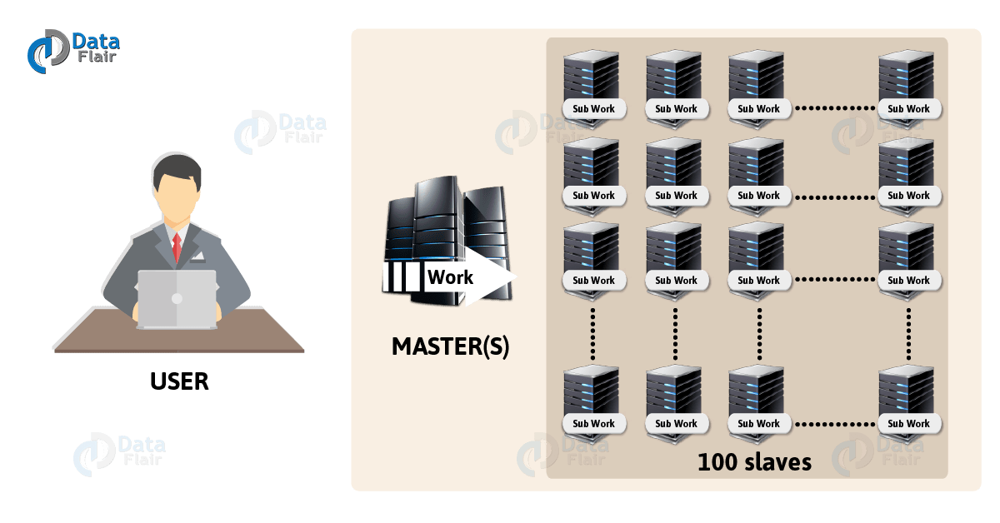
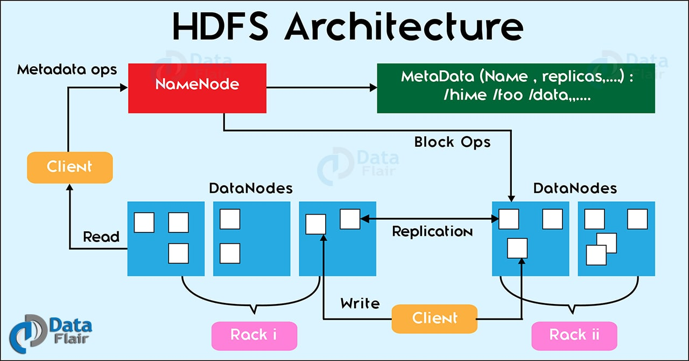
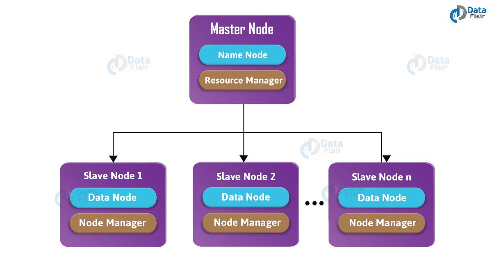
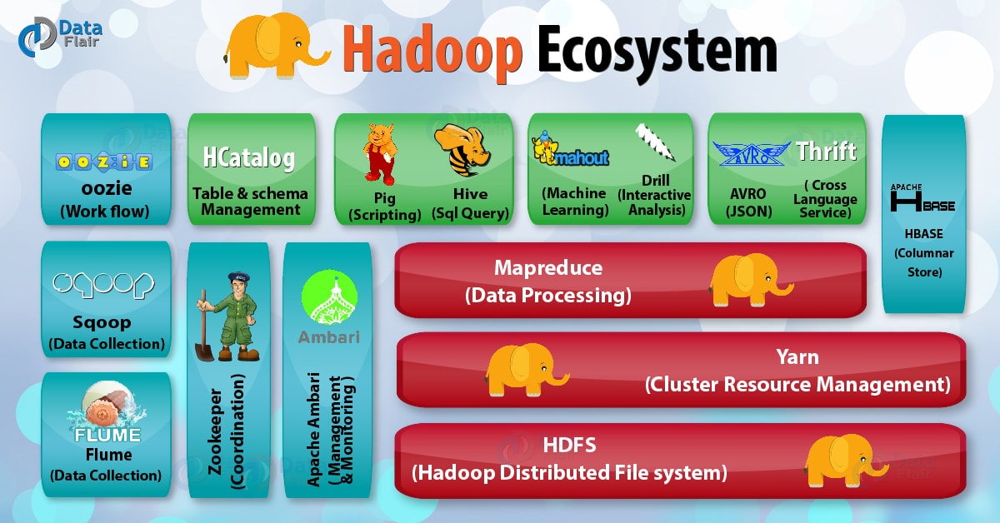

## 什么是Hadoop

Hadoop 是使用 Java 编写，允许分布在集群，使用简单的编程模型的计算机大型数据集处理的Apache 的开源框架。 
Hadoop 框架应用工程提供跨计算机集群的分布式存储和计算的环境。 
Hadoop 是专为从单一服务器到上千台机器扩展，每个机器都可以提供本地计算和存储。

Hadoop 可以用单节点模式安装，但是只有多节点集群才能发挥 Hadoop 的优势，我们可以把集群扩展到上千个节点，
而且扩展过程中不需要先停掉集群。

Hadoop 由三个关键部分组成：
* HDFS：Hadoop 分布式文件系统，它是 Hadoop 数据存储层。
* MapReduce：数据计算框架。
* YARN：负责资源管理和任务调度。

## Hadoop 架构

在了解了什么是 Hadoop 之后，再来详细了解一下 Hadoop 的架构。

Hadoop架构图



Hadoop 以主从的方式工作。
一个Master节点和多个Slave节点，slave节点可以扩招到1000个。Master节点管理，维护和监控slave节点，slave节点是真正在干活的机器。
Master节点应该部署在配置较高的机器上面，因为它是hadoop集群的核心。
Master存储元数据（即数据的数据），slave是真正存储数据的机器。客户端通过master节点来分发任务。

## Hadoop组件
在本教程，我们将会学习到 HDFS，MapReduce 和Yarn 这3大重要组件。

### HDFS是什么
HDFS 即 Hadoop 分布式文件系统（Hadoop Distribute File System），以分布式存储的方式存储数据。

在Hadoop架构里面，
master节点上会运行一个叫做nameNode的守护进程，
每个slave节点上都会有dataNode守护进程，
两个进程都是属于HDFS的。
因此，slave节点也叫做datanode节点。
NameNode主要用于存储元数据和管理datanode节点。
而dataNode则是真正存储数据和执行任务的地方。

HDFS架构图



HDFS是一个具有故障容错，分布式的，高可靠的且可扩展的用于数据存储的文件系统。
HDFS是为了存储海量数据而开发的，数据量可达到TB级别。
数据文件会被分割成块（默认一个块大小为128MB）并存储在多个节点。分割的数据块按照复制因子进行跨dataNode复制。
避免dataNode节点发生故障后造成数据丢失。

假如有一个文件大小为640MB，那么它将会被分割成5个块，每个块128MB（按照默认的数据块大小）。

### MapReduce是什么
Hadoop MapReduce是一种编程模型，它是Hadoop最重要的组件之一。
它用于计算海量数据，并把【计算任务】分割成许多在集群并行计算的独立运行的【task】。
**MapReduce是Hadoop的核心**，它会把计算任务移动到离数据最近的地方进行执行，因为移动大量数据是非常耗费资源的。

因此，**MapReduce是一个分布式处理海量数据的计算框架**。
由于数据存储以分布式方式存储在HDFS，它为MapReduce执行并行任务提供了基础。

### Yarn是什么
Yarn是一种资源管理系统，在集群模式下，管理、分配和释放资源（CPU，内存，磁盘）变得非常复杂。
而Yarn可以非常高效的管理这些资源。它根据来自任何应用程序的请求分配相同的值。

在Master节点会运行一个叫ResourceManager守护进程，且每个slave节点都会有一个叫NodeManager的守护进程。

## Hadoop 守护进程
守护进程是一种运行在后台的进程。Hadoop 主要有4个守护进程。



* NameNode ：它是HDFS运行在Master节点守护进程。
* DataNode：它是HDFS运行在Slave节点守护进程。
* ResourceManager：它是Yarn运行在Master节点守护进程。
* NodeManager：它是Yarn运行在Slave节点的守护进程。

除了这些，可能还会有 secondary NameNode，standby NameNode，Job HistoryServer 等进程。

## Hadoop是怎么工作的
Apache Hadoop 工作原理：
```text
1、输入数据被划分成若干个128MB（默认值）的块，然后把它们移动到不同的节点。
2、在多个dataNode存储完所有数据块之后，用户才能处理这些数据。
3、接着，master把用户提交的程序调度到独立的节点上。
4、等所有节点处理完数据之后，输出计算结果并写回HDFS。
```

## Hadoop生态下的组件介绍
在本节我们会涉及到 Hadoop 生态下的各种组件。先看看 Hadoop 生态下有哪些组件：



Hadoop HDFS：Hadoop 分布式存储系统。

Yarn：Hadoop 2.x版本开始才有的资源管理系统。

MapReduce：并行处理框架。

HBase：基于 HDFS 的列式存储数据库，它是一种 NoSQL 数据库，非常适用于存储海量的稀疏的数据集。

Hive：Apache Hive 是一个数据仓库基础工具，它适用于处理结构化数据。
它提供了简单的 sql 查询功能，可以将 sql 语句转换为 MapReduce 任务进行运行。

Pig：它是一种高级脚本语言。利用它不需要开发 Java 代码就可以写出复杂的数据处理程序。

Flume：它可以从不同数据源高效实时的收集海量日志数据。

Sqoop：适用于在 Hadoop 和关系数据库之间抽取数据。

Oozie：这是一种 Java Web 系统，用于 Hadoop 任务的调度，例如设置任务的执行时间和执行频率等。

Zookeeper：用于管理配置信息，命名空间。提供分布式同步和组服务。

Mahout：可扩展的机器学习算法库。