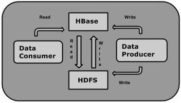
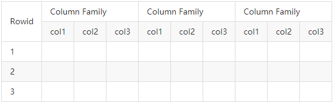
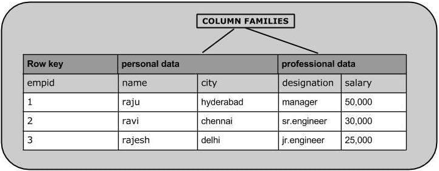

# HBase简介
HBase是一种类似于Google BigTable的数据模型，旨在提供对【大量】【结构化数据】的【快速随机访问】。

本教程介绍了HBase，在Hadoop File Systems上设置HBase的过程以及与HBase Shell交互的方式。
它还描述了如何使用Java连接到HBase，以及如何使用Java在HBase上执行基本操作。

自1970年以来，RDBMS是解决数据存储和维护相关问题的解决方案。
大数据出现后，公司意识到处理大数据的好处，并开始选择Hadoop之类的解决方案。

Hadoop使用**分布式文件系统**存储大数据，并使用MapReduce处理它。
Hadoop擅长存储和处理各种格式的海量数据，例如任意，半结构或什至是非结构化。

[HBASE官方网站](https://hbase.apache.org/)
[HBASE官方文档](https://hbase.apache.org/book.html)

## Hadoop的局限性
Hadoop只能执行**批处理**，并且只能按顺序访问数据。
这意味着即使是最简单的工作，也必须搜索整个数据集。
处理后的庞大数据集会产生另一个庞大的数据集，这些数据集也应按顺序进行处理。
此时，需要一种新的解决方案来在单个时间单位内访问任何数据点（随机访问）。

## Hadoop随机访问数据库
HBase，Cassandra，couchDB，Dynamo和MongoDB等应用程序是一些存储大量数据并以随机方式访问数据的数据库。

## 什么是HBase
HBase是建立在Hadoop文件系统之上的**面向列**的**分布式数据库**。这是一个开源项目，可横向扩展。

HBase是一种类似于Google BigTable的数据模型，旨在提供对大量结构化数据的快速随机访问。
它利用了Hadoop文件系统（HDFS）提供的容错能力。

它是Hadoop生态系统的一部分，可提供对Hadoop File System中数据的**随机实时读写访问**。

可以直接或通过HBase将数据存储在HDFS中。
数据使用者使用HBase随机读取/访问HDFS中的数据。
HBase位于Hadoop File System的顶部，并提供读写访问权限。

## HBase和HDFS
| HDFS	                   | HBase                                            |
|-------------------------|--------------------------------------------------|
| HDFS是适用于存储大文件的分布式文件系统。	 | HBase是建立在HDFS之上的数据库。                             |
| HDFS不支持快速的单个记录查找。	      | HBase为大型表提供快速查找。                                 |
| 它提供高延迟的批处理；没有批处理的概念。	   | 它提供了**数十亿条记录**对**单行的低延迟访问**（随机访问）。               |
| 它仅提供数据的顺序访问。	           | HBase在内部使用哈希表并提供随机访问，并且将数据存储在索引的HDFS文件中，以加快查找速度。 |

## HBase中的存储机制
HBase是一个面向列的数据库，其中的表按行排序。
表模式仅定义列族，它们是键值对。
一个表具有多个列族，每个列族可以具有任意数量的列。
随后的列值连续存储在磁盘上。
该表的每个单元格值都有一个时间戳。

简而言之，在HBase中：
* 表是行的集合。
* 行是列族的集合。
* 列族是列的集合。
* 列是键值对的集合。

下面给出的是HBase中表的示例架构。

## 列导向和行导向
面向列的数据库是将数据表存储为数据列的一部分而不是数据行的数据库。很快，他们将拥有列族。

| 面向行的数据库	           | 列式数据库             |
|--------------------|-------------------|
| 它适用于在线事务处理（OLTP）。	 | 它适用于在线分析处理（OLAP）。 |
| 此类数据库设计用于少量的行和列。	  | 面向列的数据库是为大型表设计的。  |

下图显示了面向列的数据库中的列族：

## HBase和RDBMS
| HBase的	                        | 关系数据库管理系统(RDBMS)         |
|--------------------------------|--------------------------|
| HBase是无架构的，它没有固定列架构的概念；仅定义列族。	 | RDBMS由其架构控制，该架构描述表的整个结构。 |
| 它是为宽表而设计的。HBase是水平可伸缩的。	       | 它很薄，专为小表而建。难以扩展。         |
| HBase中没有事务。	                   | RDBMS是事务性的。              |
| 它具有非规范化的数据。	                   | 它将具有标准化的数据。              |
| 对于半结构化数据和结构化数据都非常有用。	          | 这对结构化数据很有用。              |

## HBase的功能
* HBase是线性可伸缩的。
* 它具有自动故障支持。
* 它提供一致的读取和写入。
* 它与Hadoop集成，既作为源也作为目标。
* 它具有简单的客户端Java API。
* 它提供跨集群的数据复制。

## 在哪里使用HBase
* Apache HBase用于对**大数据进行随机、实时的读写访问**。
* 它在商用硬件集群的顶部托管着很大的表。
* Apache HBase是根据Google的Bigtable建模的非关系数据库。
  Bigtable在Google File System上起作用，Apache HBase同样在Hadoop和HDFS之上工作。

## HBase的应用
它在需要编写繁重的应用程序时使用。
每当我们需要提供**对可用数据的快速随机访问**时，都会使用HBase。
Facebook，Twitter，Yahoo和Adobe等公司在内部使用HBase。

## HBase的历史
| 年份	       | 事件                            |
|-----------|-------------------------------|
| 2006年11月	 | Google在BigTable上发布了该论文。       |
| 2007年2月	  | 最初的HBase原型是作为Hadoop贡献而创建的。    |
| 2007年10月	 | 发布了第一个可用的HBase和Hadoop 0.15.0。 |
| 2008年1月	  | HBase成为Hadoop的子项目。            |
| 2008年10月	 | HBase 0.18.1发布。               |
| 2009年1月	  | HBase 0.19.0发布。               |
| 2009年9月	  | HBase 0.20.0发布。               |
| 2010年5月	  | HBase成为Apache顶级项目。            |