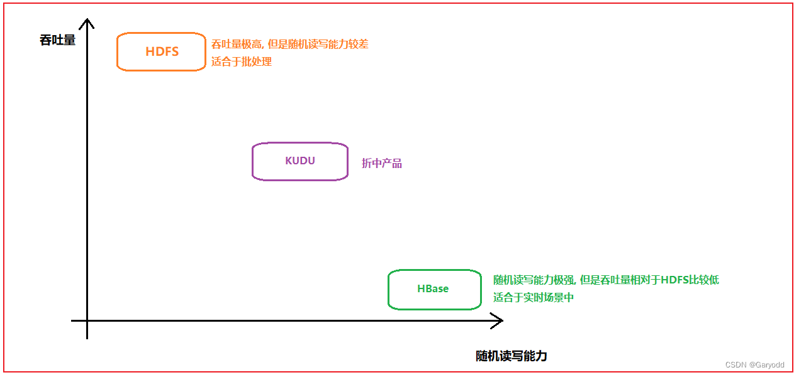
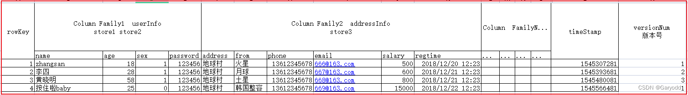

# HBase简介
HBase是一种类似于Google BigTable的数据模型，旨在提供对【大量】【结构化数据】的【快速随机访问】。

本教程介绍了HBase，在Hadoop File Systems上设置HBase的过程以及与HBase Shell交互的方式。
它还描述了如何使用Java连接到HBase，以及如何使用Java在HBase上执行基本操作。

自1970年以来，RDBMS是解决数据存储和维护相关问题的解决方案。
大数据出现后，公司意识到处理大数据的好处，并开始选择Hadoop之类的解决方案。

Hadoop使用**分布式文件系统**存储大数据，并使用MapReduce处理它。
Hadoop擅长存储和处理各种格式的海量数据，例如任意，半结构或什至是非结构化。

[HBASE官方网站](https://hbase.apache.org/)
[HBASE官方文档](https://hbase.apache.org/book.html)

## Hadoop的局限性
Hadoop只能执行**批处理**，并且只能按顺序访问数据。
这意味着即使是最简单的工作，也必须搜索整个数据集。
处理后的庞大数据集会产生另一个庞大的数据集，这些数据集也应按顺序进行处理。
此时，需要一种新的解决方案来在单个时间单位内访问任何数据点（随机访问）。

## Hadoop随机访问数据库
HBase，Cassandra，couchDB，Dynamo和MongoDB等应用程序是一些存储大量数据并以随机方式访问数据的数据库。

## 什么是HBase
HBase是建立在Hadoop文件系统之上的**面向列**的**分布式数据库**。这是一个开源项目，可横向扩展。

HBase是一种类似于Google BigTable的数据模型，旨在**提供对大量结构化数据的快速随机访问**。
它利用了Hadoop文件系统（HDFS）提供的容错能力。

它是Hadoop生态系统的一部分，可提供对Hadoop File System中数据的**随机实时读写访问**。

可以直接或通过HBase将数据存储在HDFS中。
数据使用者使用HBase随机读取/访问HDFS中的数据。
HBase位于Hadoop File System的顶部，并提供读写访问权限。


## HBase和HDFS
| HDFS	                   | HBase                                            |
|-------------------------|--------------------------------------------------|
| HDFS是适用于存储大文件的分布式文件系统。	 | HBase是建立在HDFS之上的数据库。                             |
| HDFS不支持快速的单个记录查找。	      | HBase为大型表提供快速查找。                                 |
| 它提供高延迟的批处理；没有批处理的概念。	   | 它提供了**数十亿条记录**对**单行的低延迟访问**（随机访问）。               |
| 它仅提供数据的顺序访问。	           | HBase在内部使用哈希表并提供随机访问，并且将数据存储在索引的HDFS文件中，以加快查找速度。 |

## HBase中的存储机制
HBase是一个面向列的数据库，其中的表按行排序。
表模式仅定义列族，它们是键值对。
一个表具有多个列族，每个列族可以具有任意数量的列。
随后的列值连续存储在磁盘上。
该表的每个单元格值都有一个时间戳。

简而言之，在HBase中：
* 表是行的集合。
* 行是列族的集合。
* 列族是列的集合。
* 列是键值对的集合。

下面给出的是HBase中表的示例架构。


## 列导向和行导向
面向列的数据库是将数据表存储为数据列的一部分而不是数据行的数据库。很快，他们将拥有列族。

| 面向行的数据库	           | 列式数据库             |
|--------------------|-------------------|
| 它适用于在线事务处理（OLTP）。	 | 它适用于在线分析处理（OLAP）。 |
| 此类数据库设计用于少量的行和列。	  | 面向列的数据库是为大型表设计的。  |

下图显示了面向列的数据库中的列族：


## HBase和RDBMS
| HBase的	                        | 关系数据库管理系统(RDBMS)         |
|--------------------------------|--------------------------|
| HBase是无架构的，它没有固定列架构的概念；仅定义列族。	 | RDBMS由其架构控制，该架构描述表的整个结构。 |
| 它是为**宽表**而设计的。HBase是水平可伸缩的。	   | 它很薄，专为**小表**而建。难以扩展。     |
| HBase中**没有事务**。	               | RDBMS是事务性的。              |
| 它具有非规范化的数据。	                   | 它将具有标准化的数据。              |
| 对于半结构化数据和结构化数据都非常有用。	          | 这对结构化数据很有用。              |

## HBase的功能
* HBase是线性可伸缩的。
* 它具有自动故障支持。
* 它提供一致的读取和写入。
* 它与Hadoop集成，既作为源也作为目标。
* 它具有简单的客户端Java API。
* 它提供跨集群的数据复制。

## 在哪里使用HBase
* Apache HBase用于对**大数据进行随机、实时的读写访问**。
* 它在商用硬件集群的顶部托管着很大的表。
* Apache HBase是根据Google的Bigtable建模的非关系数据库。
  Bigtable在Google File System上起作用，Apache HBase同样在Hadoop和HDFS之上工作。

## HBase的应用
它在需要编写繁重的应用程序时使用。
每当我们需要提供**对可用数据的快速随机访问**时，都会使用HBase。
Facebook，Twitter，Yahoo和Adobe等公司在内部使用HBase。

## HBase的历史
| 年份	       | 事件                            |
|-----------|-------------------------------|
| 2006年11月	 | Google在BigTable上发布了该论文。       |
| 2007年2月	  | 最初的HBase原型是作为Hadoop贡献而创建的。    |
| 2007年10月	 | 发布了第一个可用的HBase和Hadoop 0.15.0。 |
| 2008年1月	  | HBase成为Hadoop的子项目。            |
| 2008年10月	 | HBase 0.18.1发布。               |
| 2009年1月	  | HBase 0.19.0发布。               |
| 2009年9月	  | HBase 0.20.0发布。               |
| 2010年5月	  | HBase成为Apache顶级项目。            |


---

# HBase产生背景
```text
HDFS: 分布式文件存储系统
    特点: 【吞吐量极高】, 适合于进行【批量数据处理】工作,【随机的读写能力比较差(压根就不支持)】。
    
但是, 在实际生产环境中, 有时候数据体量比较大, 但是希望能够对数据进行随机的读写操作, 而且不能太慢了, 如何解决呢? 
    对于市场来说, 其实非常迫切的需要一款能够支持大规模数据存储以及能够对数据进行高效的随机读写操作, 
    而HBase其实就是在这样的背景下产生, 灵感来源于 google发布的一篇论文(BigTable)。
```



```text
1- HBase是一款NoSQL型数据库,不支持SQL,没有表关系, 无法进行Join操作,不支持事务(仅仅支持行级事务)。
2- HBase是基于google发布BigTable这篇论文而产生的, 基于HDFS, 
    也就说, 数据最终是存储到HDFS上, 如果后续想要启动HBase, 必须先启动HDFS, 基于Java语言。
3- 查询HBase的数据一般有以下几种方式:
    第一种: 通过主键来检索
    第二种: 通过主键的范围检索
    第三种: 查询全部数据
4- 存储的以结构化数据和半结构化的数据为主
5- HBase的存储都是以字节类型存储的
6- HBase的表的特点:
    【大】: 可以存储上【十亿行】的数据, 也可以拥有上【百万个列】
    面向【列】的存储方式: 列 指的 列族(列簇)
    【稀疏性】: 对于Null值, 在HBase中是不占用任何的存储空间的, 所以表可以搞的非常的稀疏 
```

# HBase的应用场景

```text
1- 数据是否需要进行随机读写的操作
2- 数据体量是否比较大(建议TB级别以上)
3- 数据是否是比较稀疏的

如果在实际生产环境中, 发现数据已经具备了以上二种的时候, 其实就可以尝试使用HBase, 
如果三种都满足了, 一般都是采用HBase解决
```

#  HBase的表模型



```text
1- rowkey: 行键, 类似于MySQL中每个表都会有主键, 同样类似于 kv类型中key
    在hbase中, 数据会默认进行排序操作, 排序的规则为基于rowkey进行字典升序排序
    
    例如: 1 3 15 2 13 25 请问, 如果按照字典升序排序, 结果是什么呢? 
        结果为:
            1 13 15 2 25 3
        规则: 先比较第一位, 如果第一位相同, 比较第二位, 没有第二位比有第二位的小, 依次类推
        
    查询方式:  
        第一种: 根据rowkey查询
        第二种: 根据rowkey的范围查询
        第三组: 查询全表数据

2- column family: 列族(列簇)
    在创建表的时候, 需要指定列族信息的, 一个表 是可以有多个列族
    在hbase中是基于列族管理的, 一个表中建议【列族不要太多了, 能少则少, 能用一个解决的, 坚决不用多个】
    在一个列族下可以有多个列(列限定符号), 最大支持上百万个列

3- 列限定符号(列名): 
    一个列族下可以有多个列名, 但是一个列名只能被一个列族所管理, 列的数量可以达到上百万, 
    在建表的时候, 不需要指定的, 在插入数据的时候, 动态执行即可

4- timestamp(时间戳):  
    在hbase的表中, 每一个单元格的数据都是有时间戳的概念的, 默认为插入数据的时间, 当然也可以人为指定

5- version(版本号): 
    在hbase中每一个单元格都是有版本号的概念的, 可以基于版本管理, 存储每一个单元格的历史变化信息
    默认版本号为1, 表示只保留最新的版本数据

6- cell(单元格):  
    rowkey + 列族 + 列名 + 列值

注意: 在建表的时候, 必须指定两项内容:  表名  + 列族
```