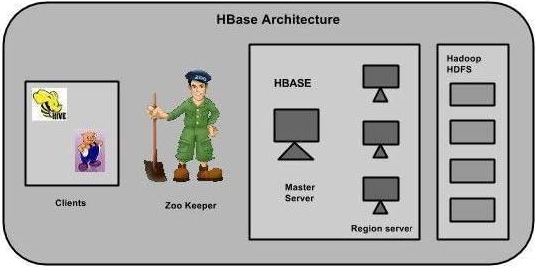
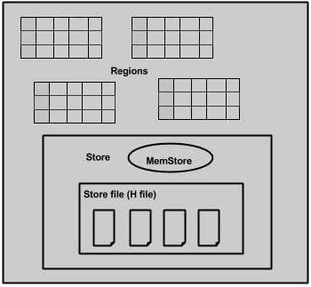

# HBase 体系结构
在HBase中，**表**被分成**区域**，并由**区域服务器**提供服务。
区域按**列族**垂直划分为“Stores”。
Stores以文件形式保存在HDFS中。下面显示的是HBase的体系结构。

```text
注意：术语Stores用于区域以解释存储结构。
```



HBase具有三个主要组件：**客户端库**，**主服务器**和**区域服务器**。可以根据需要添加或删除区域服务器。

## 主服务器(master)
* 将**区域**分配给**区域服务器**，并利用Apache ZooKeeper的帮助完成此任务。
* 处理跨区域服务器的区域**负载平衡**。它卸载繁忙的服务器，并将区域转移到占用较少的服务器。
* 通过调度负载均衡来**维护集群的状态**。
* 负责架构更改和其他元数据操作，例如创建表和列系列。

## 区域服务器(regions)
**区域**不过是分散在**区域服务器**中并分散在各个区域服务器中的表。它有以下几个作用：

* 与客户端通信并处理与数据相关的操作。
* 处理其下所有区域的读写请求。
* 通过遵循区域大小阈值来确定区域的大小。

当我们深入研究区域服务器时，它包含区域和存储，如下所示：



Store包含MemStore和HFiles。
MemStore就像一个缓存。最初输入到HBase的所有内容都存储在此处。
以后，数据将作为块传输并保存在HFiles中，并且刷新了存储器。

## Zookeeper
Zookeeper 是一个开源项目，提供诸如维护配置信息，命名，提供分布式同步等服务。

Zookeeper具有代表不同区域服务器的临时节点。主服务器使用这些节点发现可用的服务器。

除了可用性，这些节点还用于跟踪服务器故障或网络分区。

客户端通过zookeeper与区域服务器通信。

在模拟和独立模式，HBase由zookeeper来管理。