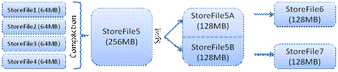
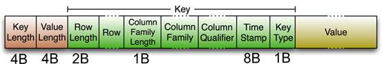

# HBase 体系结构
在HBase中，**表**被分成**区域**，并由**区域服务器**提供服务。
区域按**列族**垂直划分为“Stores”。
Stores以文件形式保存在HDFS中。下面显示的是HBase的体系结构。

```text
注意：术语Stores用于区域以解释存储结构。
```


HBase具有三个主要组件：**客户端库**，**主服务器**和**区域服务器**。可以根据需要添加或删除区域服务器。

## 主服务器(master)
* 将**区域**分配给**区域服务器**，并利用Apache ZooKeeper的帮助完成此任务。
* 处理跨区域服务器的区域**负载平衡**。它卸载繁忙的服务器，并将区域转移到占用较少的服务器。
* 通过调度负载均衡来**维护集群的状态**。
* 负责架构更改和其他元数据操作，例如创建表和列系列。

## 区域服务器(regions)
**区域**不过是分散在**区域服务器**中并分散在各个区域服务器中的表。它有以下几个作用：

* 与客户端通信并处理与数据相关的操作。
* 处理其下所有区域的读写请求。
* 通过遵循区域大小阈值来确定区域的大小。

当我们深入研究区域服务器时，它包含区域和存储，如下所示：


Store包含MemStore和HFiles。
MemStore就像一个缓存。最初输入到HBase的所有内容都存储在此处。
以后，数据将作为块传输并保存在HFiles中，并且刷新了存储器。

## Zookeeper
Zookeeper 是一个开源项目，提供诸如维护配置信息，命名，提供分布式同步等服务。

Zookeeper具有代表不同区域服务器的临时节点。主服务器使用这些节点发现可用的服务器。

除了可用性，这些节点还用于跟踪服务器故障或网络分区。

客户端通过zookeeper与区域服务器通信。

在模拟和独立模式，HBase由zookeeper来管理。

---

# HBase 系统架构

HBase是Apache Hadoop的数据库，能够对大型数据提供随机、实时的读写访问。
HBase的目标是存储并处理大型的数据。
HBase是一个开源的，分布式的，多版本的，面向列的存储模型。它存储的是松散型数据（稀疏型宽表）。

## HBase特性：

1. 高可靠性
2. 高效性
3. 面向列
4. 可伸缩
5. 可在廉价PC Server搭建大规模结构化存储集群

HBase是Google BigTable的开源实现，其相互对应如下：
```text
                        Google                                         HBase
文件存储系统               GFS                                            HDFS
海量数据处理               MapReduce Hadoop                               MapReduce
协同服务管理               Chubby                                         Zookeeper
```

## HBase关系图：


HBase位于结构化存储层，围绕HBase，各部件对HBase的支持情况：
```text
    Hadoop部件                                            作用
HDFS                                                高可靠的底层存储支持
MapReduce                                           高性能的计算能力
Zookeeper                                           稳定服务和failover机制
Pig&Hive                                            高层语言支持，便于数据统计
Sqoop                                               提供RDBMS数据导入，便于传统数据库向HBase迁移
```

## 访问HBase的接口

```text
方式                                       特点                                  场合
Native Java API                        最常规和高效                         Hadoop MapReduce Job并行处理HBase表数据
HBase Shell                            最简单接口                           HBase管理使用
Thrift Gateway                         利用Thrift序列化支持多种语言           异构系统在线访问HBase表数据
Rest Gateway                           解除语言限制                         Rest风格Http API访问
Pig                                    Pig Latin六十编程语言处理数据          数据统计
Hive                                   简单，SqlLike
```

## HBase 数据模型


组成部件说明：
```text
Row Key：             Table主键 行键 Table中记录按照Row Key排序
Timestamp：           每次对数据操作对应的时间戳，也即数据的version number
Column Family：       列簇，一个table在水平方向有一个或者多个列簇，列簇可由任意多个Column组成，
                      列簇支持动态扩展，无须预定义数量及类型，二进制存储，用户需自行进行类型转换
```

### Table&Region


- 1）Table随着记录增多不断变大，会自动分裂成多份Splits，成为Regions
- 2）一个region由[startkey，endkey)表示
- 3）不同region会被Master分配给相应的RegionServer进行管理

### 两张特殊表：-ROOT- & .META.


- -ROOT-       记录.META.表的Region信息，但是-ROOT-只有一个region
- .META.       记录用户表的Region信息，同时.META.也可以有多个region

Zookeeper中记录了-ROOT-表的location

**客户端访问数据的流程**：
    Client -> Zookeeper -> -ROOT- -> .META. -> 用户数据表 （多次网络操作，不过client端有cache缓存）

## HBase 系统架构图


### 组成部件说明

#### Client：
```text
使用HBase RPC机制与HMaster和HRegionServer进行通信
Client与HMaster进行通信进行管理类操作
Client与HRegionServer进行数据读写类操作
```

#### Zookeeper：
```text
Zookeeper Quorum存储-ROOT-表地址、HMaster地址
HRegionServer把自己以Ephedral方式注册到Zookeeper中，HMaster随时感知各个HRegionServer的健康状况
Zookeeper避免HMaster单点问题
```

#### HMaster：
```text
HMaster没有单点问题，HBase中可以启动多个HMaster，
通过Zookeeper的Master Election机制保证总有一个Master在运行。

主要负责Table和Region的管理工作：
    1) 管理用户对表的增删改查操作
    2) 管理HRegionServer的负载均衡，调整Region分布
    3) Region Split后，负责新Region的分布
    4) 在HRegionServer停机后，负责失效HRegionServer上Region迁移
```

#### HRegionServer：
HBase中最核心的模块，主要负责响应用户I/O请求，向HDFS文件系统中读写数据。


HRegionServer管理一些列HRegion对象；
每个HRegion对应Table中一个Region，HRegion由多个HStore组成；
每个HStore对应Table中一个Column Family的存储；

Column Family就是一个集中的存储单元，故将具有相同IO特性的Column放在一个Column Family会更高效。

#### HStore：
HBase存储的核心。由MemStore和StoreFile组成。
MemStore是Sorted Memory Buffer。

**用户写入数据的流程**：



```text
Client写入 
-> 存入MemStore，一直到MemStore满 
-> Flush成一个StoreFile，直至增长到一定阈值 
-> 出发Compact合并操作 
-> 多个StoreFile合并成一个StoreFile，同时进行版本合并和数据删除 
-> 当StoreFiles Compact后，逐步形成越来越大的StoreFile 
-> 单个StoreFile大小超过一定阈值后，触发Split操作，把当前Region Split成2个Region，Region会下线，
   新Split出的2个孩子Region会被HMaster分配到相应的HRegionServer 上，
   使得原先1个Region的压力得以分流到2个Region上
```

由此过程可知，HBase只是增加数据，所有的更新和删除操作，都是在Compact阶段做的，
所以，用户写操作只需要进入到内存即可立即返回，从而保证I/O高性能。

#### HLog
引入HLog原因：
```text
在分布式系统环境中，无法避免系统出错或者宕机，
一旦HRegionServer意外退出，MemStore中的内存数据就会丢失，引入HLog就是防止这种情况。
```

工作机制：
```text
每个HRegionServer中都会有一个HLog对象，HLog是一个实现Write Ahead Log的类，
每次用户操作写入MemStore的同时，也会写一份数据到HLog文件，
HLog文件定期会滚动出新，并删除旧的文件(已持久化到 StoreFile中的数据)。

当HRegionServer意外终止后，HMaster会通过Zookeeper感知，HMaster首先处理遗留的HLog文件，
将不同region的log数据拆分，分别放到相应region目录下，然后再将失效的region重新分配，
领取到这些region的 HRegionServer在Load Region的过程中，会发现有历史HLog需要处理，
因此会Replay HLog中的数据到MemStore中，然后flush到StoreFiles，完成数据恢复。
```

#### HBase存储格式
```text
HBase中的所有数据文件都存储在Hadoop HDFS文件系统上，格式主要有两种：
1）HFile
    HBase中KeyValue数据的存储格式，HFile是Hadoop的二进制格式文件，
    实际上StoreFile就是对HFile做了轻量级包装，即StoreFile底层就是HFile。
2）HLog File
    HBase中WAL（Write Ahead Log）的存储格式，物理上是Hadoop的Sequence File。
```

##### HFile




图片解释：
```text
HFile文件不定长，长度固定的块只有两个：Trailer和FileInfo。

1）Trailer中指针指向其他数据块的起始点。
2）File Info中记录了文件的一些Meta信息，
例如：AVG_KEY_LEN, AVG_VALUE_LEN, LAST_KEY, COMPARATOR, MAX_SEQ_ID_KEY等。

Data Index和Meta Index块记录了每个Data块和Meta块的起始点。

Data Block是HBase I/O的基本单元，为了提高效率，HRegionServer中有基于LRU的Block Cache机制。

每个Data块的大小可以在创建一个Table的时候通过参数指定，大号的Block有利于顺序Scan，小号Block利于随机查询。

每个Data块除了开头的Magic以外就是一个个KeyValue对拼接而成, Magic内容就是一些随机数字，目的是防止数据损坏。

HFile里面的每个KeyValue对就是一个简单的byte数组。这个byte数组里面包含了很多项，并且有固定的结构。
    1）KeyLength和ValueLength：两个固定的长度，分别代表Key和Value的长度
    2）Key部分：
        Row Length是固定长度的数值，表示RowKey的长度，Row 就是RowKey
        Column Family Length是固定长度的数值，表示Family的长度
        Column Family，
        Qualifier，
        两个固定长度的数值，表示Time Stamp和Key Type（Put/Delete）
    3）Value部分没有这么复杂的结构，就是纯粹的二进制数据
```

##### HLog File


HLog文件就是一个普通的Hadoop Sequence File，
Sequence File的Key是HLogKey对象，HLogKey中记录了写入数据的归属信息，
除了table和region名字外，同时还包括sequence number和timestamp，timestamp是“写入时间”，
sequence number的起始值为0，或者是最近一次存入文件系统中sequence number。

HLog Sequence File的Value是HBase的KeyValue对象，即对应HFile中的KeyValue。
