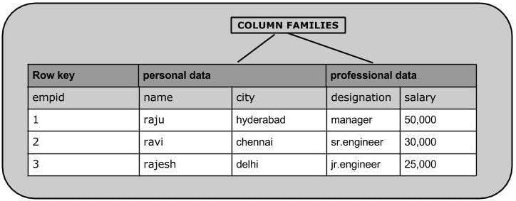

# HBase 创建（插入）数据
## 创建数据
要在HBase表中创建数据，请使用以下命令和方法：

* put 命令
* Put类的add()方法，以及
* HTable类的put()方法。

例如，我们将在HBase中创建下表。



使用put命令，可以将行插入表中。其语法如下：
```text
put '<table name>','row1','<colfamily:colname>','<value>'
```

让我们将第一行值插入emp表，如下所示。
```text
hbase:002:0> put 'emp','1','personal data:name','raju'
Took 1.3256 seconds
hbase:003:0> put 'emp','1','personal data:city','hyderahad'
Took 0.0283 seconds
hbase:004:0> put 'emp','1','personal data:designation','manager'
Took 0.0079 seconds
hbase:005:0> put 'emp','1','personal data:salary','50000'
Took 0.0110 seconds
```

以相同方式使用put命令插入其余行。如果插入整个表，将得到以下输出。
```text
hbase:019:0> scan 'emp'
ROW                COLUMN+CELL
1                  column=personal data:city, timestamp=2021-01-04T09:35:39.345, value=hyderahad
1                  column=personal data:designation, timestamp=2021-01-04T09:36:18.466, value=manager                                                
1                  column=personal data:name, timestamp=2021-01-04T09:38:44.128, value=raju
1                  column=personal data:salary, timestamp=2021-01-04T09:36:42.145, value=50000
2                  column=personal data:city, timestamp=2021-01-04T09:39:25.298, value=chennai
2                  column=personal data:designation, timestamp=2021-01-04T09:39:56.897, value=sr.engineer
2                  column=personal data:name, timestamp=2021-01-04T09:39:07.682, value=ravi
2                  column=personal data:salary, timestamp=2021-01-04T09:40:13.935, value=30000
3                  column=personal data:city, timestamp=2021-01-04T09:40:57.831, value=delhi
3                  column=personal data:designation, timestamp=2021-01-04T09:41:27.262, value=jr.engineer
3                  column=personal data:name, timestamp=2021-01-04T09:40:33.117, value=rajesh
3                  column=personal data:salary, timestamp=2021-01-04T09:41:46.733, value=25000
```

## 使用Java API插入数据
您可以使用Put类的add()方法将数据插入Hbase。您可以使用HTable类的put()方法保存它。
这些类属于org.apache.hadoop.hbase.client软件包。下面给出了在HBase表中创建数据的步骤。

### 步骤1：连接
该配置类增加了HBase的配置文件，它的对象。您可以使用HbaseConfiguration类的create()方法创建配置对象，如下所示。
```text
// Instantiating Configuration class
Configuration config = HBaseConfiguration.create();
Connection connection = ConnectionFactory.createConnection(config);
```

### 步骤2：实例化Table类
您有一个名为HTable的类，它是HBase中Table的实现。此类用于与单个HBase表进行通信。
在实例化此类时，它接受配置对象和表名称作为参数。Table类，如下所示。
```text
TableName tb = TableName.valueOf("emp");
// Instantiating HTable class
Table table = connection.getTable(tb);
```

### 步骤3：实例化Put 类
要将数据插入到HBase表中，请使用add()方法及其变体。此方法属于Put，因此实例化put类。
此类要求您要以字符串格式将数据插入到的行名。您可以如下所示实例化Put类。
```text
TableName tb = TableName.valueOf("emp");
// Instantiating HTable class
Table table = connection.getTable(tb);
```

### 步骤4：插入数据
Put类的addColumn()方法用于插入数据。它需要3个字节的数组，分别代表列族，列限定符（列名）和要插入的值。
如下所示，使用addColumn()方法将数据插入HBase表。
```text
p.addColumn(Bytes.toBytes("personal data"), Bytes.toBytes("name"), Bytes.toBytes("raju"));
```

### 步骤5：将数据保存在表中
插入所需的行后，通过将put实例添加到HTable类的put()方法中来保存更改，如下所示。
```text
Table.put(p);
```

### 步骤6：关闭HTable实例
在HBase表中创建数据后，使用close()方法关闭HTable实例，如下所示。
```text
Table.close();
```

下面给出了在HBase Table中创建数据的完整程序。
```java
import java.io.IOException;
import org.apache.hadoop.conf.Configuration;
import org.apache.hadoop.hbase.HBaseConfiguration; 
import org.apache.hadoop.hbase.TableName;
import org.apache.hadoop.hbase.client.Connection;
import org.apache.hadoop.hbase.client.ConnectionFactory; 
import org.apache.hadoop.hbase.client.Put;
import org.apache.hadoop.hbase.client.Table;
import org.apache.hadoop.hbase.util.Bytes;

public class InsertData {
   public static void main(String[] args) {
      // Instantiating Configuration class
      Configuration config = HBaseConfiguration.create();
      config.set("hbase.zookeeper.quorum", "node1:2181,node2:2181,node3:2181");
      Connection connection = ConnectionFactory.createConnection(config);
      TableName tb = TableName.valueOf("emp");
      // Instantiating HTable class
      Table table = connection.getTable(tb);
      // Instantiating Put class
      // accepts a row name.
      Put p = new Put(Bytes.toBytes("row1"));
      // adding values using add() method
      // accepts column family name, qualifier/row name ,value
      p.addColumn(Bytes.toBytes("personal data"), Bytes.toBytes("name"), Bytes.toBytes("raju"));
      p.addColumn(Bytes.toBytes("personal data"), Bytes.toBytes("city"), Bytes.toBytes("hyderabad"));
      p.addColumn(Bytes.toBytes("personal data"), Bytes.toBytes("designation"), Bytes.toBytes("manager"));
      p.addColumn(Bytes.toBytes("personal data"), Bytes.toBytes("salary"), Bytes.toBytes("50000"));
      // Saving the put Instance to the HTable.
      table.put(p);
      System.out.println("data inserted");
      // closing HTable
      table.close();
      connection.close();
   }
   
}
```

编译并执行上述程序，如下所示。
```text
$javac InsertData.java
$java InsertData
```

以下应该是输出：
```text
data inserted
```
