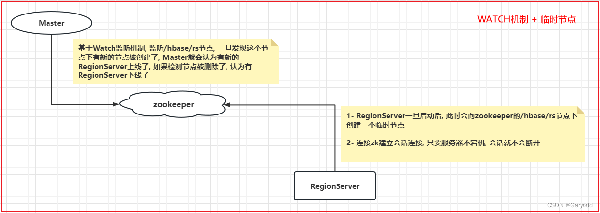
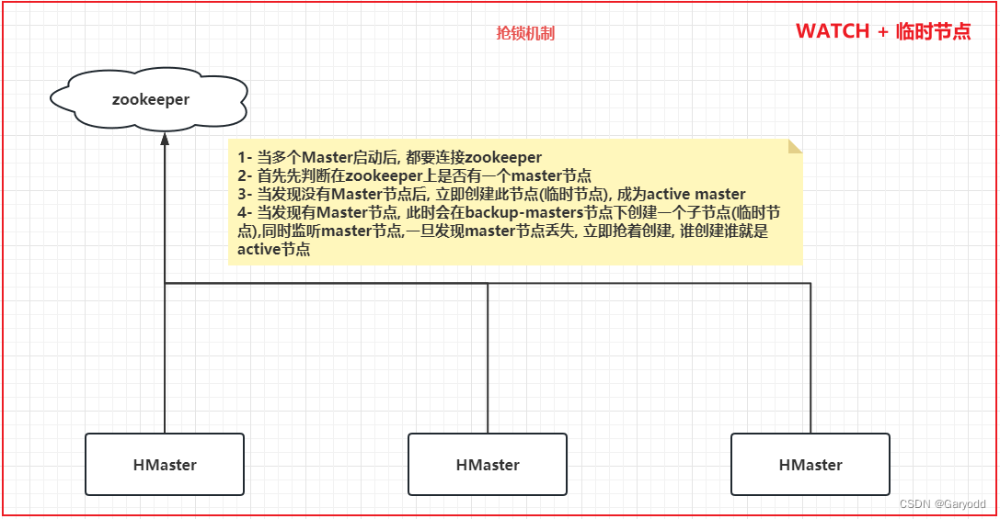

HBase的高可用, 主要指的是让集群中主节点高可用, 目前构建HBase的集群中, 主节点Master只有一台, 如果主节点宕机, 整个集群就会丢失主节点, 希望当主节点宕机后, 可以有备份节点顶上来成为主节点

# 如何对主节点配置高可用  
1- 在HBase的conf目录下, 创建一个backup-masters 文件
```text
cd /export/server/hbase/conf/
vim backup-masters
```

2- 在文件中, 添加需要将哪些节点设置为备份的Master
```text
node2.itcast.cn
node3.itcast.cn
```
注意:  添加后, 切记不要在文件后面有空行

3- 重启HBase, 查看是否可以启动多个Master
```text
停止hbase集群: stop-hbase.sh

启动hbase集群: start-hbase.sh


如何单独启动和停止服务器:
启动:
hbase-daemon.sh start master
hbase-daemon.sh start regionserver

停止:
hbase-daemon.sh stop master
hbase-daemon.sh stop regionserver
```

# HBase的核心原理
## 1 HBase的读取数据的流程
```text
读取数据的流程:
1) 客户端发起读取数据的请求，首先要先连接zookeeper集群。

2) 从zookeeper中获取一张 hbase:meta 表，目前被哪个RegionServer所管理。
    说明: hbase:meta 是HBase专门用于存储元数据的表，此表只会有一个Region，
    也就说这个表只会被一个Region所管理，一个Region也只能被一个RegionServer所管理。

3) 连接Meta表对应的RegionServer， 
从这个表中获取要读取的表有哪些Region以及这些Region对应被哪个RegionServer所管理， 
从而确定要操作哪个RegionServer。
    注意:  
        如果执行scan, 返回这个表所有Region对应的RegionServer的地址
        如果执行get, 返回查询rowkey所对应Region所在RegionServer的地址

4) 连接对应的RegionServer，从RegionServer中对应Region中读取数据。
    读取顺序: 先内存 --> blockCache(块缓存) ---> storeFile ---> 大HFile
    
    注意: 读取块缓存只有在get操作才有效, 如果scan扫描. 意义不大
```

## 2 HBase的写入数据的流程
```text
写入数据流程:
1) 由客户端发起写入数据的请求，首先连接zookeeper集群。

2) 从zookeeper集群中获取hbase:meta表被那个RegionServer所管理。

3) 连接对应RegionServer，从meta表获取要写入数据的表有哪些Region，
然后根据Region的startRow和endRow判断需要将数据写入到那个Region上，
并确定这个Region被哪个RegionServer所管理，将RegionServer的地址返回。

    大白话: 查询写入到哪个Region，这个Region被哪个RegionServer所管理。
    
4) 连接对应RegionServer，开始进行数据写入操作，
写入时需要将数据写入到对应的Store模块下的MemStore中(可能写入多个MemStore)，
同时也会将本次写入操作记录在对应RegionServer的HLog中，当这个两个位置都写入完成后，客户端才认为数据写入完成了。

-----------------------------以上为客户端写入流程------------------------------------------

异步操作: 当上述客户端可能执行了N多次后，后续才会干活。

5) 随着客户端不断的写入操作，MemStore中数据会越来越多，
当MemStore的数据达到一定的阈值(128M/1H)后，就会启动Flush刷新线程，将内存中数据"最终"刷新到HDFS上，
形成一个StoreFile文件。

6) 随着不断地Flush的刷新，在HDFS上StoreFile文件会越来越多，
当StoreFile文件达到一定的阈值(3个及以上)后，就会启动compact合并压缩机制，
将多个StoreFile"最终"合并为一个大的HFile。

7) 随着不断的合并，HFile文件会越来越大，当这个大的HFile文件达到一定的阈值("最终"10GB)后，
就会触发Split的分裂机制，将大的HFile进行一分为二操作，形成两个新的大HFile文件，
此时Region也会进行一分为二操作，形成两个新的Region，一个Region管理一个新的大HFile，
旧的大HFile和对应Region就会下线删除。
```

## 3 HBase的Flush刷新机制
```text
Flush刷新机制:
    流程: 
        客户端不断的将数据写入到MemStore内存中，
        当内存数据达到一定的阈值后，需要将数据刷新到HDFS中，形成一个StoreFile文件。

    阈值: 128M(Region级别) / 1H(RegionServer级别)  不管满足了哪一个阈值, 都会触发Flush刷新机制。
    
    内部详细流程: HBase 2.x以上的版本
        1) 客户端不断向MemStore中写入数据，当MemStore中数据达到阈值后，就会启动Flush刷新操作。
        
        2) 首先HBase会先关闭当前这个已经达到阈值的内存空间，然后开启一个新的MemStore的空间，继续写入。
        
        3) 将这个达到阈值的内存空间数据放入到内存队列中，此队列的特性是只读的，
        在HBase的2.x版本中，可以设置此队列尽可能晚的刷新到HDFS中，
        当这个队列中数据达到某个阈值后(内存不足)，这个时候触发Flush刷新操作。
        (希望队列中尽可能多的memStore的数据, 让更多的数据存储在内存中)
        
        4) Flush线程会将队列中所有的数据全部都读取出来，然后对数据进行排序合并操作，将合并后数据存储到HDFS中，
        形成一个StoreFile的文件。
        
注意: 
在HBase2.0以下版本中，不存在推迟刷新功能，
理解为达到一个MemStore阈值后，就会进行刷新到HDFS上，形成一个StoreFile文件，也不存在合并操作。 

在2.0版本以上，支持了推迟刷新，合并刷新策略，但是默认是不使用的，与2.0以下版本是一样的，但是2.0以上版本支持开启的。
```

## 4 如何配置内存合并功能
```text
HBase2.0以上，只是提供了基于内存合并的功能，但是默认情况下不开启的，
所以在默认情况下整个Flush刷新机制与2.0版本以下的是一致的，但是一旦开启，就是刚刚所描述的整个Flush流程。

合并方案: 三种
    basic(基础型): 
        直接将多个MemStore数据合并为一个StoreFile，写入到HDFS上，
        如果数据中存在过期的数据或者已经标记为删除的数据，基础型不做任何处理。
    eager(饥渴型): 
        在将多个memStore合并的过程中，积极判断数据是否存在过期或者是否已经被标记删除了，
        如果有，直接过滤掉这些标记删除或者已经过期的数据。
    adaptive(适应性): 
        检测数据是否有过期的内容，如果过期数据比较多的时候，就会自动选择饥渴型，否则就是基础型。
```

## 5 HBase的StoreFile合并机制
```text
compact合并压缩机制:
    MemStore的数据会不断的进行Flush刷新操作，就会产生多个StoreFile的文件，
    当StoreFile文件达到一定的阈值后，就会触发compact的合并压缩的机制，将多个StoreFile合并为一个大的HFile文件。
阈值: 达到3个及以上。

整个Compact合并压缩机制共计分为二大阶段:
    minor:
        作用: 将多个小的StoreFile合并为一个较大的HFile的操作。
        阈值: 达到3个及以上。
    
        注意: 此合并过程中，仅仅是将多个StoreFile合并为一个较大的HFile文件，对数据进行排序操作，
        如果此时有过期或者有标记删除的数据，此时不做任何处理的(类似于: 内存合并中基础型合并方案)
        所以说，此合并操作，效率比较高。
    major:
        作用: 将较大的HFile和之前的大HFile进行合并，形成一个更大的HFile文件 (全局合并)。
        阈值: 默认7天 / 集群启动的时候(验证是否要做)。
    
        在此处合并过程中，会将那些过期的数据或者已经标记删除的数据，在这次合并中，全部都清除掉。
        
        注意: 由于是一个全局合并操作，对性能影响比较大，在实际生产中，建议关闭掉7天自动合并，采用手动触发的方式。
        
        具体方案: 将默认的周期调整到公司定时重启范围外即可，
        比如说公司每隔一周会全部服务进行重启，那么我们这个时候大于这个周期即可，
        然后一旦重启，HBase会主动监测是否需要进行major的合并操作。
```

## 6 HBase的Split分裂机制
```text
Split分裂机制: 
    当StoreFile不断的进行合并操作，这个大的HFile就会变得越来越大，当这个HFile达到一定阈值后，就会触发Split分裂机制

阈值: 最终 10GB

为什么是最终10GB呢?
    Min(R^2 * "hbase.hregion.memstore.flush.size", "hbase.hregion.max.filesize")
    注：R为同一个table中在同一个region server中的region的个数。

上述公式，其实就是HBase用于计算在何时进行分裂。

相关的变量说明:
    R: 表对应的Region的数量
    hbase.hregion.memstore.flush.size : 默认为128M
    hbase.hregion.max.filesize: 默认 10GB

第一次分裂:  默认表在创建的时候, 只有一个Region
    min(1 * 128M , 10GB) = 128M 在128M的时候，就会被触发Split分裂机制，表的Region数量变为2个(各为64M)。
    
第二次分裂: 此时表已经有2个Region
    min(2^2 * 128 , 10GB) = 512M 在512M的时候，就会触发，
    触发后，表的Region数量会变为3个，其中二个为256M，还有一个可能是500M。
    
第三次分裂: 此时表已经有3个Region
    min(3^3 * 128 , 10GB) = 1152M  在 1152M的时候，就会触发，触发后，表的Region数量会变为4个。
    
..... 以此类推
    
直到当Region的数量为9的时候，计算后为10.125GB，此时大于10GB，此时从第九个region开始，达到10GB才会触发分裂。

为啥要分裂呢? 分裂有什么用呢 ？
    由于表一开始默认只有一个Region，也就意味着只有一个RegionServer管理，
    如果此时这个表有大量的数据写入和数据读取操作，就意味着这些庞大的请求全部打向到同一个RegionServer上，
    导致这个RegionServer可能无法承载庞大的并发访问，直接宕机，
    而且一旦宕机后，对应的Region就会被分配给其他的RegionServer，然后其他的RegionServer也会跟着一起宕机，
    最终导致整个HBase集群从节点全部都宕机了(雪崩问题)。
    
    此时可以通过快速早的进行分裂，可以有多个Region，有了多个Region后，就可以将Region分布给不同的RegionServer上，
    这样当大量的请求过来后，就可以由多个RegionServer一起来承担，提供并发能力，提供稳定性。

如果从一开始，就有大量的并发，如何解决呢?
    解决方案: 可以让HBase的表在一开始创建的时候，直接拥有多个Region，
    在建表的时候，直接创建多个Region(Region 预分区)。
```

## 7 HBase的RegionServer上下线流程
思考: Master是如何感知到RegionServer上线和下线呢?



思考: 请问 多个Master启动后, 如何选定谁成为Active Master呢?



