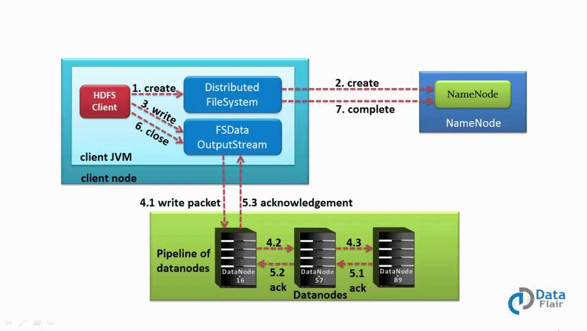
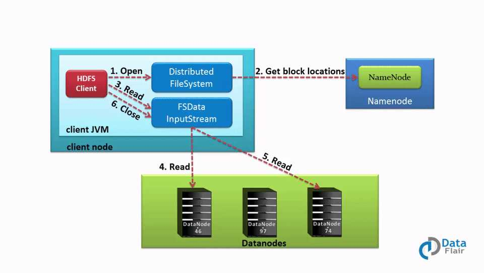

HDFS 是 Hadoop 生态里面的数据存储层，它是一个具有容错性的非常可靠的分布式文件系统。
HDFS 以主从（ Master / Slave ）架构的方式工作，NameNode是Master节点上的守护进程，而DataNode是Slave节点上的守护进程。

本教程将详细介绍 HDFS 数据读写操作工作原理。

## Hadoop HDFS 数据写操作
要把文件写入到HDFS，客户端需要先和NameNode（master）节点交互，NameNode给客户端提供DataNode（slave）节点的具体地址之后，
客户端才能把数据写入到DataNode。
那客户端怎么把数据写入到 Datanode 呢？其实，客户端是直接跟DataNode通信并写入数据的，DataNode会创建数据写入管道（pipeline），
第一个DataNode把数据块复制到另一个DataNode（第二个DataNode），之后第二个DataNode再把数据块复制到第三个DataNode。
数据块副本创建完成之后，DataNode会给前一个发送确认消息。

### HDFS 数据写入工作流程
前面介绍的数据写入流程是分布式写入的，客户端把数据并发写到很多DataNode节点。



下面一步一步详细介绍数据的写入流程：

1、客户端调用DistributedFileSystem的create()方法，开始创建新文件。
DistributedFileSystem创建DFSOutputStream，产生一个RPC调用，让NameNode在文件系统的命名空间中创建这一新文件。

2、NameNode接收到用户的写文件的RPC请求后，首先要执行各种检查，如客户是否有相关的创建权限和该文件是否已存在等，
检查通过后才会创建一个新文件，并将操作记录到编辑日志，
然后DistributedFileSystem会将DFSOutputStream对象包装在FSDataOutStream实例中，返回客户端；
否则文件创建失败并且给客户端抛IOException。

3、客户端开始写文件，DFSOutputStream会将文件分割成packets数据包，HDFS中每个block默认情况下是128M，
由于每个块比较大，所以在写数据的过程中是把数据块拆分成一个个的数据包（packet）以管道的形式发送的。
然后将这些packets写到其内部的一个叫做data queue(数据队列)。
data queue会向NameNode节点请求适合存储数据副本的DataNode节点的列表，然后这些DataNode之前生成一个Pipeline数据流管道，
我们假设副本因子参数为3，那么这个数据流管道中就有三个DataNode节点。

4、首先DFSOutputStream会将packets向Pipeline数据流管道中的第一个DataNode节点写数据，
第一个DataNode接收packets，然后把packets写向Pipeline中的第二个节点，
同理，第二个节点保存接收到的数据然后将数据写向Pipeline中的第三个DataNode节点。

5、DFSOutputStream内部同样维护另外一个内部的写数据确认队列——ack queue。
当Pipeline中的第三个DataNode节点将packets成功保存后，该节点回向第二个DataNode返回一个确认数据写成功的信息，
第二个DataNode接收到该确认信息后在当前节点数据写成功后，也会向Pipeline中第一个DataNode节点发送一个确认数据写成功的信息，
然后第一个节点在收到该信息后如果该节点的数据也写成功后，会将packet从ack queue中将数据删除。

在写数据的过程中，如果Pipeline数据流管道中的一个DataNode节点写失败了会发生什问题、需要做哪些内部处理呢？
如果这种情况发生，那么就会执行一些操作：

首先，Pipeline数据流管道会被关闭，ack queue中的packets会被添加到data queue的前面以确保不会发生packets数据包的丢失。

接着，在正常的DataNode节点上的已保存好的block的ID版本会升级
——这样发生故障的DataNode节点上的block数据会在节点恢复正常后被删除，失效节点也会被从Pipeline中删除。

最后，剩下的数据会被写入到 Pipeline 数据流管道中的其他两个节点中。

如果Pipeline中的多个节点在写数据是发生失败，那么只要写成功的block的数量达到 dfs.replication.min(默认为1) ，
那么就任务是写成功的，然后NameNode后通过一步的方式将block复制到其他节点，直到数据副本达到dfs.replication参数配置的个数。

6、完成写操作后，客户端调用close()关闭写操作IO流，刷新数据。

7、在数据刷新完后NameNode关闭写操作流。到此，整个写操作完成。

### 文件写入HDFS —— Java 代码示例
下面 HDFS 文件写入的 Java 示例代码
```text
Configuration conf = new Configuration();
FileSystem fileSystem = FileSystem.get(conf);
// Check if the file already exists
Path path = new Path("/path/to/file.ext");
if (fileSystem.exists(path)) {
    System.out.println("File " + dest + " already exists");
    return;
}
// Create a new file and write data to it.
FSDataOutputStream out = fileSystem.create(path);
InputStream in = new BufferedInputStream(new FileInputStream(new File(source)));
byte[] b = new byte[1024];
int numBytes = 0;
while ((numBytes = in.read(b)) > 0) {
    out.write(b, 0, numBytes);
}
// Close all the file descripters
in.close();
out.close();
fileSystem.close();
```

## Hadoop HDFS 数据读操作
为了从HDFS读取数据，客户端首先得和NameNode（master节点）交互，因为NameNode是 Hadoop集群的中心，它保存着集群的所有元数据。
然后NameNode会检查客户端是否有相应权限，如果客户端有权限读取数据，那么NameNode才会给它返回存储文件的DataNode（Slave）节点列表。
之后客户端将直接从DataNode读取相应的数据block。

### HDFS 文件读取流程
下面详细介绍 HDFS 读文件的流程：



1、客户端调用FileSystem对象的open（）函数，打开想要读取的文件。其中FileSystem 是 DistributeFileSystem 的一个实例。

2、DistributedFileSystem使用RPC调用NameNode来确定文件中前几个块的位置。
对于每个块，NameNode会返回存储该数据块副本的DataNode节点的地址，并根据DataNode与客户端的距离排序。

3、DistributedFileSystem会给客户端返回一个输入流对象FSDataInputStream，客户端将从该对象读取数据，
该对象分装了一个用于管理DataNode和NameNode IO的对象 —— DSFInputStream。 
客户端调用FSDataInputStream的read()函数。由于DFSInputStream已经存储了DataNode地址，
那么接下来就是连接到距离客户端最近的DataNode进行读取数据文件的第一个块。

4、客户端可以重复的在数量流调用read()函数，当块读取结束后，DFSInputStream将关闭和DataNode的连接，
然后再找下一个离客户端最近的存储数据块的DataNode。

5、如果DFSInputStream在和DataNode通信的时候发生故障，它将会从存储该数据块的距离客户端最近的DataNode读取数据。
而且它会把发生故障的DataNode记录下来，在读取下一个数据块的时候，就不会再从这个DataNode读取了。
DFSInputStream会对数据做校验和（checksum）验证。
如果发现损坏的块，在DFSInputStream从其他DataNode读取损坏的块的副本之前，把损坏的块告知给NameNode。

6、客户端读取数据完成后，调用close()函数关闭数据流。

### HDFS 读文件 Java 代码示例
```text
Configuration conf = new Configuration();
FileSystem fileSystem = FileSystem.get(conf);
Path path = new Path("/path/to/file.ext");
if (!fileSystem.exists(path)) {
    System.out.println("File does not exists");
    return;
}
FSDataInputStream in = fileSystem.open(path);
int numBytes = 0;
while ((numBytes = in.read(b))> 0) {
    System.out.prinln((char)numBytes));// code to manipulate the data which is read
}
in.close();
out.close();
fileSystem.close();
```