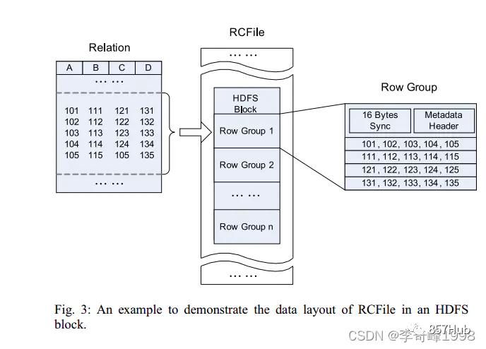
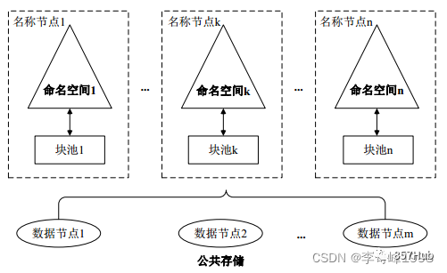

## 1、HDFS的各进程名称与功能
- NameNode：
  维护着文件的元数据，包括文件名、副本数、文件的BlockId，以及block所在的服务器，会接受来自Client端的读写请求，
  和DataNode的Block信息上报。
- Secondary NameNode：
  用来监控HDFS状态的辅助后台程序。Secondary NameNode不同于NameNode，它不接受或者记录任何实时的数据变化，
  但是，它会与NameNode进行通信，以便定期地保存HDFS元数据快照。由于NameNode是单点的，
  通过Secondary NameNode的快照功能，可以将NameNode的宕机时间和数据损失降低到最小。
  同时，如果NameNode中的FsImage到达了指定容量，则会和Secondary NameNode进行通信，进行checkPoint操作。
- DataNode：
  HDFS的工作节点，他们根据客户端或者是NameNode的调度存储和检索数据，
  并且定期向NameNode发送他们所存储的块(block)的列表。
- JournalNode：
  负责两个NameNode高可用时的数据同步保证数据一致，存放NameNode的editLog文件（元数据），部署在任意节点，奇数个。

## 2、HDFS读流程

- 1）跟NN通信查询元数据(block所在的DN的节点)，找到文件块所在的DN的服务器。
- 2）挑选一台DN（就近原则，然后随机）服务器，请求建立socket流。
- 3）DN开始发送数据（从磁盘里读取数据放入流，一packet为单位做校验） 
- 4）客户端以packet为单位接收，先在本地缓存，然后写入目标文件中，
  后面的block块就相当于append到前面的block块，最后合成最终需要的文件。


## 3、HDFS写流程

- 1）客户端发送消息给NameNode请求上传，NameNode检查目标文件是否已存在，父目录是否存在并返回是否可以上传。
- 2）NameNode根据机架感知策略返回3个DataNode节点，分别为dn1、dn2、dn3。
- 3）dn1、dn2、dn3逐级应答客户端。通信管道建立完成。
- 4）客户端上传之前对文件进行切片，
  切片规则：按datanode的block块大小进行切片，hadoop 2.x默认block大小为128m（hadoop 1.x默认block大小64m）。
- 5）客户端开始往dn1上传第一个Block（先从磁盘读取数据放到一个本地内存缓存），以Packet为单位，packet默认大小为64k。
- 6）dn1收到一个Packet就会传给dn2，dn2传给dn3；dn1每传一个packet会放入一个应答队列等待应答。
- 7）当一个Block传输完成之后，客户端再次请求NameNode上传第二个Block依次类推直到文件传输完成。


## 4、HDFS写文件时节点挂机处理
在文件写入过程中不会重新分配datanode。
如果写入时一个dataNode挂掉，会将已经写入的数据放置到数据队列的顶部，并将挂掉的dataNode移出通信管道，将数据写入到剩余的dataNode。
在写入结束后，nameNode会收集dataNode的信息，发现此文件的副本没有达到配置的要求（default=3），然后寻找一个datanode保存副本。

## 5、HDFS文件副本放置策略
假设有一份数据，三副本

- 第一个副本：在DataNode数据节点提交时，第一个块是本地节点，目的是节省了本地资源，占用了更少的带宽，
  如果是在集群外提交，则随机挑选一台磁盘不太慢，CPU不太忙的节点上；
- 第二个副本：放置在与第一个副本不同的机架的节点上；
- 第三个副本：与第二个副本相同机架的不同节点上；

若有更多副本，随机放在节点中。

## 6、常用的hdfs命令
-help：显示帮助信息
```shell
hdfs fs -help rm
```

-ls：显示目录信息
```shell
hdfs fs -ls /
```

-mkdir：在HDFS上创建目录
```shell
hdfs fs -mkdir -p /user/ysir
```

-get：从HDFS中拷贝到本地，等同于copyToLocal
```shell
hdfs fs -get /aaa/a.txt
```

-put：将本地文件上传到HDFS，等同于copyFromLocal
```shell
hdfs fs -put ~/a.txt /
```

-cat：显示文件内容
```shell
hdfs fs -cat /user/ysir/a.txt
```

-chmod、-chown：修改文件权限、所有者
```shell
hdfs fs -chmod 777 /a.txt
hdfs fs -chown hdfs:hdfs /a.txt
```

-cp：在HDFS中拷贝文件
```shell
hdfs fs -cp /aaa/a.txt /bbb/
```

-mv：在HDFS目录中移动文件
```shell
hdfs fs -mv /aaa/a.txt /bbb/
```

-rm：删除文件夹或者文件
```shell
hdfs fs -rm /user/ysir/a.txt
```

```shell
# 1、查看指定路径的当前目录结构
hadoop fs -ls /
hdfs dfs  -ls /

# 2、递归查看指定路径的目录结构
hadoop fs -lsr /   #已淘汰
hadoop fs -ls -R /  #用这个

# 3、查看目录下文件的大小
hadoop fs -du -h /

# 4、文件移动（HDFS之间）
hadoop fs -mv /a.txt /dir1

# 5、文件复制（HDFS之间）
hadoop fs -cp /dir1/a.txt /dir1/b.txt

# 6、删除操作   !!!!!!!!!!!!!!!!!!
hadoop fs -rm /dir1/b.txt  #删文件
hadoop fs -rm -r /dir1     #删目录   

# 7、文件上传（本地文件系统到HDFS文件系统)  --- 复制操作   !!!!!!!!!!!!
hadoop fs -put a.txt /dir1 

# 8、文件上传（本地文件系统到HDFS文件系统)  --- 剪切操作
hadoop fs -moveFromLocal test1.txt /

# 8、文件下载（HDFS文件系统到本地文件系统)   !!!!!!!!!!!
hadoop fs -get /aaa.txt  /root 

# 9、文件下载(HDFS文件系统到本地文件系统)
hadoop fs -getmerge /dir/*.txt /root/123.txt 

# 10、将小文件进行合并，然后上传到HDFS
hadoop fs -appendToFile *.txt  /hello.txt    
hadoop fs -appendToFile 1.txt 2.txt 3.txt  /hello.txt    
hadoop fs -appendToFile /root/*  /hello.txt  

# 11、查看HDFS文件内容
hadoop fs -cat /dir1/1.txt

# 12、在HDFS创建文件夹     !!!!!!!!!!!!
hadoop fs -mkdir /my_dir

# 13、修改HDFS文件的权限
hadoop fs -chmod -R 777 /dir1

# 14、修改HDFS的所属用户和用户组

useradd hadoop
passwd hadoop

hadoop fs -chown -R hadoop:hadoop /dir
```

## 7、HDFS文件存储格式
hdfs文件存储格式 分为两大类：【行存储】和【列存储】。

**行存储：**
```text
行存储的写入是一次完成，在写入上有很大优势。
将一整行存储在一起，是一种连续的存储方式，可以保证写入过程的成功或者失败，保证数据完整性。
查询时如果只需要某列信息，也必须把整行都读入内存当中，在内存中对冗余数据进行过滤。
没有索引的查询使用大量I/O，通过建立索引加快查询效率。
因为在一行记录中可能存在多种类型的数据，数据解析需要在多种类型之间频繁转换，这个操作消耗CPU，增加了解析的时间。
```

**列存储：**
```text
列存储由于需要把一行记录拆分成单列保存，写入次数明显比行存储多，实际时间消耗会更大。
列存储会把文件切割成若干列，读取时只需要返回对应列的数据。
由于每一列中的数据类型相同，所以可以根据数据类型选择适合的编码和压缩格式。
```

对照表格

| 操作类型   | 行存储                            | 列存储                      |
|--------|--------------------------------|--------------------------|
| hdfs格式 | TextFile，Sequence，MapFile，Avro | Parquet ， RCFile，ORCFile |
| 存储     | 连续存储                           | 按列存储                     |
| 写入操作   | 一次写入整行，效率高                     | 一行数据分列多次写入，效率较低          |
| 查询操作   | 整行读取，内存过滤冗余行                   | 按列读取                     |
| 压缩     | 每行数据类型不同，压缩性能较差                | 每列数据类型相同，压缩性能好           |
| 使用场景   | OLTP                           | OLAP                     |

- TextFile
  TextFile为默认格式，加载速度最快，可以采用Gzip进行压缩，压缩后的文件无法split。在检索时磁盘开销大，数据解析开销大。

- SequenceFile
  SequenceFile是Hadoop提供的一种二进制文件，以[Key，Value]的形式序列化到文件中。
  可以把SequenceFile当做是一个容器，把所有的文件打包到SequenceFile类中可以高效的对小文件进行存储和处理。

  

  SequenceFile主要由一个Header后跟多条Record组成。
  Header主要包含了KeyName和valueName，还包含了一些同步标识，用于快速定位到记录的边界。
  每条Record以键值对的方式进行存储，内容包括：记录长度、Key长度、Key值和value值，Value的结构取决于该记录是否被压缩。

  SequenceFile支持三种记录存储方式：
  - 无压缩，io效率较差。相比压缩，不压缩的情况下没有什么优势。
  - 记录级压缩，对每条记录都压缩。这种压缩效率比较一般。
  - 块级压缩，这里的块不同于hdfs中的块的概念。这种方式会将达到指定块大小的二进制数据压缩为一个块。
    相对记录级压缩，块级压缩拥有更 高的压缩效率。【一般来说使用SequenceFile都会使用块级压缩】。

  但是SequenceFile只支持Java，SequenceFile一般用来作为小文件的容器使用，
  防止小文件占用过多的NameNode内存空间来存储其在DataNode位置的元数据。

- RCFile
  在一般的列存储中，会将不同的列分开存储，有时候存在一个表的某些列不在同一个HDFS块上，
  所以在查询的时候，Hive重组列的过程会浪费很多IO开销。

  RCFile是Hive推出的一种专门面向列的数据格式。
  存储方式为数据按行分块，每块按照列存储的行列混合模式，具有压缩高，列存取快的特点。
  需要说明的是，RCFile在map阶段从远端拷贝仍然是拷贝整个数据块，并且拷贝到本地目录后RCFile并不是真正直接跳过不需要的列，
  而是通过扫描每一个行组的头部信息实现，但是在整个block级别的头部并没有定义每个列从哪个行组起始到哪个行组结束，
  所以，读取全量数据的操作其性能比SequenceFile低。

  RCFile先将数据按行划分成行组，大小默认是4MB，行组内包括16字节的HDFS同步块信息，主要是为了区分同一个HDFS块上的相邻行组；
  元数据的头部信息主要包括该行组内的存储的行数、列的字段信息等等；
  在Row Group内部，再将数据按列划分存储。其结构如下：

  

- ORCFile
  是RCFile的升级版，支持文件切分，将数据划分为默认大小为250MB的stripe(条带)，每个stripe包含索引，数据和footer。
  可以支持复杂的数据结构（比如Map等）。

  

- Parquet
  parquet基于Google的dremel，擅长处理深度嵌套的数据(有点类似于嵌套多层的json格式)，parquet会将嵌套结构整合为平面列存储。

- Avro
  Avro是Hadoop中的一个子项目，也是Apache中一个独立的项目，Avro是一个基于二进制数据传输高性能的中间件。
  在Hadoop的其他项目中，例如HBase和Hive的Client端与服务端的数据传输也采用了这个工具。
  Avro是一个语言无关的数据序列化的系统，它的出现主要是为了解决Writables缺少跨语言移植的缺陷。
  Avro将模式存储在文件头中，所以每个文件都是自描述的，而且Avro还支持模式演进(schema evolution)，
  也就是说，读取文件的模式不需要与写入文件的模式严格匹配，当有新需求时，可以在模式中加入新的字段。
  Avro支持分片，即使是进行Gzip压缩之后。


## 8、HDFS文件压缩算法
在进行文件压缩算法的选择，首先要先考虑一下几个问题：
- 文件和压缩算法的组合是否支持可分片，MapReduce在读取数据的时候需要并行，这就要求压缩后的文件可以分片读取。
- CPU资源一般来说压缩效率越高的算法对IO和存储利用率的提升越有促进作用，但也会更高的消耗CPU资源。所以需要寻求一个平衡点。
- 共通性，文件格式是否支持多种语言，服务的读取。
  比如Hadoop主要的序列化格式为Writables，但是Writables只支持Java，所以后面衍生出了Avro，Thrift等格式。
  还如OrcFile是对Hive设计的一种列式存储格式，但是他不支持Impala，数据的共用性受到了制约。
- 错误处理能力，有的文件的某一部分坏掉之后会影响整个表，有的只会影响其后的数据，有的只会影响坏掉数据块本身(Avro)。
- 读取和载入效率 RCFile的载入速度慢，但是查询相应速度快，相对更适合数据仓库一次插入多次读取的特性。

### Gzip压缩

优点：压缩率比较高，压缩/解压速度也比较快，hadoop本身支持。

缺点：不支持分片。

应用场景：当每个文件压缩之后在1个block块大小内，可以考虑用gzip压缩格式。

### lzo压缩

优点：压缩/解压速度也比较快，合理的压缩率，支持分片，是Hadoop中最流行的压缩格式，支持Hadoop native库。

缺点：压缩率比gzip要低一些，Hadoop本身不支持，需要安装，如果支持分片需要建立索引，还需要指定InputFormat改为lzo格式。

应用场景：一个很大的文本文件，压缩之后还大于200M以上的可以考虑，而且单个文件越大，lzo优点越明显。

### snappy压缩

优点：支持Hadoop native库，高速压缩速度和合理的压缩率。

缺点：不支持分片，压缩率比gzip要低，Hadoop本身不支持，需要安装。

应用场景：当MapReduce作业的map输出的数据比较大的时候，作为map到reduce的中间数据的压缩格式。

### bzip2压缩

优点：支持分片，具有很高的压缩率，比gzip压缩率都高，Hadoop本身支持，但不支持native。

缺点：压缩/解压速度慢，不支持Hadoop native库。

应用场景：适合对速度要求不高，但需要较高的压缩率的时候，可以作为mapreduce作业的输出格式，
输出之后的数据比较大，处理之后的数据需要压缩存档减少磁盘空间并且以后数据用得比较少的情况。

### 各种压缩算法对比


## 9、HDFS租约机制
在HDFS中，当每次客户端用户往某个文件中写入数据的时候，为了保持数据的一致性，此时其它客户端程序是不允许向此文件同时写入数据的。
那么HDFS是如何做到这一点的呢？答案是租约（Lease）。

租约是HDFS给予客户端的一个写文件操作的临时许可证，无此证件者将不被允许操作此文件。
客户端在每次读写HDFS文件的时候获取租约对文件进行读写，文件读取完毕了，然后再释放此租约。

- 每个客户端用户持有一个租约。
- 每个租约内部包含有一个租约持有者信息，还有此租约对应的文件Id列表，表示当前租约持有者正在写这些文件Id对应的文件。
- 每个租约内包含有一个最新近更新时间，最近更新时间将会决定此租约是否已过期。
  过期的租约会导致租约持有者无法继续执行写数据到文件中，除非进行租约的更新。

### 租约管理

HDFS租约管理的操作集中在一个类上：LeaseManager。
运行在NameNode的服务中。
租约类的定义就是在LeaseManager中的。
在LeaseManager租约管理器中，它所做的事情主要归纳为两类。

- 第一个，维护HDFS内部当前所有的租约，并以多种映射关系进行保存。
  保存的映射关系分为如下3种：
  - 1）租约持有者对租约的映射关系。
  - 2）文件Id对租约的映射关系。
  - 3）按照时间排序进行租约集合的保存，此关系并不是一种映射关系。
  
- 第二个是定期释放过期的租约对象。这个操作可以避免文件租约长期不释放导致其他客户端文件无法写文件的问题。
  因为在某些异常情况下，客户端程序可能在写完文件后，没有正常关闭文件，导致文件始终处于正在写的状态中，
  此文件在对应的租约中没有被真正的移除掉。

讲述完租约的概念以及管理之后，我们来分析租约的添加到释放的过程。以我们对于租约的一个传统概念应该是这样一个过程：首先在进行文件写操作时，进行租约的添加，然后操作结束之后，进行租约的释放。

## 10、HDFS安全模式
在NameNode主节点启动时，HDFS会首先进入安全模式，检查包括文件副本的数量、可用的dataNode数量、集群可用block比例等参数。
以上参数达到阈值（可配置）后，H即可视为系统达到安全标准，HDFS自动离开安全模式。

在安全模式下，文件系统只接受读数据请求，而不接受删除、修改等变更请求。
且文件block不能进行任何的副本复制操作，因此达到最小的副本数量要求是基于dataNode启动时的状态来判定的，
启动时不会再做任何复制（从而达到最小副本数量要求）。

### 安全模式相关配置

系统什么时候才离开安全模式，需要满足哪些条件？
可以根据以下配置内容进行确定，如果有必要，也可以通过命令强制离开安全模式。

与安全模式相关的主要配置在hdfs-site.xml文件中，主要有下面几个属性：

- dfs.namenode.replication.min: 
  最小的block副本数量，默认为1。

- dfs.namenode.safemode.threshold-pct: 
  副本数达到最小要求的block占系统总block数的百分比，当实际比例超过该配置后，才能离开安全模式（但是还需要其他条件也满足）。
  默认为0.999f，也就是说符合最小副本数要求的block占比超过99.9%时，并且其他条件也满足才能离开安全模式。
  如果小于等于0，则不会等待任何block副本达到要求即可离开。如果大于1，则永远处于安全模式。

- dfs.namenode.safemode.min.datanodes: 
  离开安全模式的最小可用datanode数量要求，默认为0。即所有datanode都不可用，仍然可以离开安全模式。

- dfs.namenode.safemode.extension: 
  集群可用block比例、可用datanode都达到要求之后，如果在extension配置的时间段之后依然能满足要求，此时集群才离开安全模式。
  单位为毫秒，默认为1。也就是当满足条件并且能够维持1毫秒之后，离开安全模式。这个配置主要是对集群的稳定程度做进一步的确认。
  避免达到要求后马上又不符合安全标准。

总结一下，要离开安全模式，需要满足以下条件：
- 1）达到副本数量要求的block比例满足要求；
- 2）可用的datanode节点数满足配置的数量要求；
- 3） 1、2 两个条件满足后维持的时间达到配置的要求。

## 11、HDFS负载均衡（Rebalance）
Hadoop的HDFS集群非常容易出现机器与机器之间磁盘利用率不平衡的情况，
例如：当集群内新增、删除节点，或者某个节点机器内硬盘存储达到饱和值。
当数据不平衡时，Map任务可能会分配到没有存储数据的机器，这将导致网络带宽的消耗，也无法很好的进行本地计算。

当HDFS负载不均衡时，需要对HDFS进行数据的负载均衡调整，即对各节点机器上数据的存储分布进行调整。
让数据均匀的分布在各个DataNode上，均衡IO性能，防止热点发生。

进行数据的负载均衡调整，必须要满足如下原则：
- 数据平衡不能导致数据块减少，数据块备份丢失
- 管理员可以中止数据平衡进程
- 每次移动的数据量以及占用的网络资源，必须是可控的且不能影响nameNode的正常工作

### rebalance
rebalance作用是为了使数据在集群中各节点的分布尽量均衡，
rebalance是一个非自动的管理功能，在任意一台能够连接到HDFS的机器上命令行下输入 hadoop balancer [-threshold] 既会启动。
如果集群处于不平衡状态，这个过程就会在不平衡的节点之间迁移数据，
如果rebalance过程没有被打断的话，完成此次rebalance目标后过程会自动停止。

### 影响rebalance的参数

- threshold：
  默认设置：10，参数取值范围：0-100，参数含义：判断集群是否平衡的阈值。
  如果没有达到则进行平衡任务，平衡过程中标准达到此阈值后退出。理论上，该参数设置的越小，整个集群就越平衡。

- dfs.balance.bandwidthPerSec：
  默认设置：1048576（1M/S），参数含义：Balancer运行时允许占用的带宽，默认为1M/S，
  如果宽带占用过低则影响均衡效率，宽带占用过高则影响HDFS正常任务的读写IO。

### 负载均衡过程
数据均衡过程的核心是一个数据均衡算法，该数据均衡算法将不断迭代数据均衡逻辑，直至集群内数据均衡为止。
该数据均衡算法每次迭代的逻辑如下：


- Rebalance Server从NameNode中获取每一个DataNode磁盘使用情况。
- Rebalance Server计算哪些机器需要移动数据，哪些机器需要接受数据。
- Rebalance Server汇总需要移动的数据分布情况，计算具体数据块迁移路线图，确保网络内最短路径。
- 移动源DN的block到目标DN中，同时删除自己的block数据。
- 源DataNode向Rebalancing Server确认本次数据块迁移完成，并继续移动其他数据，
  一直到没有数据可以移动或者HDFS集群达到了平衡的标准为止，然后向nameNode提交更新后的所有datanode信息。

## 12、HDFS存储策略与异构存储
Hadoop从2.6.0版本开始支持异构存储，异构存储的意义在于HDFS中频繁访问的数据，
可以将其保存在更高访问性能的存储介质（内存或SSD）上，提升其读写性能；
对于几乎不会访问的数据，保存在机械硬盘或其他廉价存储上，降低成本。
HDFS异构存储的配置需要用户对目录指定存储策略，即用户需要预先知道每个目录下的文件的访问热度：
事先划分好冷热数据存储目录，设置好对应的存储策略，然后后续相应的程序在对应分类目录下写数据，自动继承父目录的存储策略。

### 存储介质
hdfs的存储策略依赖于底层的存储介质。hdfs支持的存储介质：
- ARCHIVE：高存储密度但耗电较少的存储介质，例如磁带，通常用来存储冷数据
- DISK：磁盘介质，这是HDFS最早支持的存储介质，目前是默认存储
- SSD：固态硬盘，是一种新型存储介质，目前被不少互联网公司使用
- RAM_DISK ：数据被写入内存中，同时会往该存储介质中再（异步）写一份

### 存储介质配置
将对应的存储类型添加到dfs.datanode.data.dir的配置项中即可，配置的时候需要申明存储类型和对应目录，
存储类型需要用中括号括起来，存储类型有[SSD]/[DISK]/[ARCHIVE]/[RAM_DISK]，如果不指定存储类型，则默认就是DISK。


上面例子，前面12个盘，我没有设置存储类型，因为都是DISK，最后一个盘使用了SSD类型。

### 存储策略

存储策略可配置，可以设置全局的，也可以设置到某个文件夹。

- Lazypersist：一个副本保存在内存RAMDISK中，其余副本保存在磁盘中
- ALL_SSD：所有副本都保存在SSD中
- One_SSD：一个副本保存在SSD中，其余副本保存在磁盘中
- Hot：所有副本保存在磁盘中，这也是默认的存储策略
- Warm：一个副本保存在磁盘上，其余副本保存在归档存储上
- Cold：全部数据以ARCHIVE的方式保存

### 存储策略配置：

HDFS提供了专门的命令来设置对应的策略，命令使用方法如下：查看策略帮助信息：
```shell
hdfs storagepolicies -help
```

列出当前版本支持的存储策略：
```shell
hdfs storagepolicies -listPolicies
```

设置对应路径的策略：
```shell
hdfs storagepolicies -setStoragePolicy -path -policy
```

### 具体流程
- 1、在hdfs的配置文件hdfs-site。xml中配置对应的异构存储
- 2、DataNode启动的时候从配置文件中读取对应的存储类型，以及容量情况，并通过心跳的形式不断的上报给ＮameNode。
- 3、NameNode收到DataNode发送的关于存储类型、容量等内容的心跳包后，会进行处理，更新存储的相关内容。
- 4、写请求发到NameNode后，NameNode根据写请求具体的目录对应的存储策略选择对应的存储类型的DataNode进行写入操作。

## 13、HDFS纠删码
为了数据的可靠性，HDFS通过多副本机制来保证。
三副本冗余下，1TB的原始数据需要占用3TB的磁盘空间，存储利用率只有1/3。
而且系统中大部分是使用频率非常低的冷数据，给存储空间和网络带宽带来了很大的压力。
因此，在保证可靠性的前提下如何提高存储利用率已成为当前HDFS面对的主要问题之一。

Hadoop 3.0引入了纠删码技术（Erasure Coding），它可以提高50%以上的存储利用率，并且保证数据的可靠性。

纠删码技术简称EC，是一种编码容错技术。
它通过对数据进行分块，然后计算出校验数据，使得各个部分的数据产生关联性。
当一部分数据块丢失时，可以通过剩余的数据块和校验块计算出丢失的数据块。


**优缺点：**

- 优点：
  - 相比副本存储方式大大降低了存储资源和IO资源的使用；
  - 通过XOR和RS算法保证数据安全，有效解决允许范围内数据块破碎和丢失导致的异常；

- 缺点：
  - 恢复数据时需要去读其它数据块和奇偶校验码块数据，需要消耗IO和网络资源；
  - EC算法编码和解密计算需要消耗CPU资源；
  - 存储大数据，并且数据块较集中的节点运行作业负载会较高；
  - EC文件不支持hflush，hsync，concat，setReplication，truncate，append等操作。

**总结：**

综合副本存储和EC存储优缺点，EC存储更适合用于存储备份数据和使用频率较少的非热点数据，
副本存储更适用于存储需要追加写入和经常分析的热点数据。

## 14、SecondaryNameNode
NameNode主要是用来保存HDFS的元数据信息，包括内存元数据和元数据文件；它们的存在的位置分别为：内存和磁盘上。
其中内存元数据主要是hdfs文件目录的管理；元数据文件则用于持久化存储。

元数据主要包括：
- 1、文件、目录自身的属性信息，例如文件名，目录名，修改信息等。
- 2、文件记录的信息的存储相关的信息，例如存储块信息，分块情况，副本个数等。
- 3、记录HDFS的Datanode的信息，包括节点位置，存活状态，空间大小，用于对DataNode的管理。


- fsImage文件是hdfs元数据的永久性的检查点，其中包含hdfs中的所有目录和文件id node的序列化信息。
- editsLog存放的是hdfs的所有更新操作，客户端执行的所有操作首先会被记录到edits文件中。

在NameNode重启时，edit logs才会合并到fsImage文件中，从而得到一个文件系统的最新快照。
但是NameNode是很少重启的，导致edits变得很大，在nameNode重启时会占用大量时间合并。
如果NameNode挂掉了，可能会丢失内存中的改动。

SecondaryNameNode就是来帮助解决上述问题的，它的职责是合并NameNode的edit logs到fsImage文件中。


Checkpoint核心是把fsImage与edits log合并以生成新的fsImage的过程。
此过程有两个好处：fsImage版本不断更新不会太旧、edits log文件不会太大。

- 首先，它定时到NameNode去获取edit logs，并更新到fsImage上。【笔者注：Secondary NameNode自己的fsImage】
  ```text
    注：这里有另外一种说法：
      Secondary NameNode从NameNode获取fsImage文件和edits log文件，然后将edits log文件合并到fsImage文件中。
  ```
- 一旦它有了新的fsImage文件，它将其拷贝回NameNode中。
- NameNode在下次重启时会使用这个新的fsImage文件，从而减少重启的时间。

Secondary NameNode的整个目的是在HDFS中提供一个检查点。它只是NameNode的一个助手节点，而不是备份节点。
Secondary NameNode所做的不过是在文件系统中设置一个检查点来帮助NameNode更好的工作。
它不是要取代掉NameNode也不是NameNode的备份。所以更贴切的中文释义应该为辅助节点或检查点节点。


Checkpoint触发条件受两个参数控制，可以通过core-site.xml进行配置：
```text
// 两次连续的checkpoint之间的时间间隔。默认1小时。
dfs.namenode.checkpoint.period=3600
// 最大没有执行checkpoint事务的数量，满足将强制执行紧急checkpoint，即使尚未达到检查点周期。默认100万事务数量。
dfs.namenode.checkpoint.txns=1000000 
```
从上面的描述我们可以看出，SecondaryNameNode根本就不是NameNode的一个热备，只是将fsImage和editsLog合并。

## 15、JournalNode
主要用于HDFS HA中的两个nameNode之间数据同步，当active状态nameNode的命名空间有任何修改时，会告知大部分的JournalNodes进程。
standby状态的NameNode有能力读取JNS中的变更信息，并且一直监控edit log的变化，把变化应用于自己的命名空间。
standby可以确保在集群出错时，命名空间状态已经完全同步了，保证数据的状态一致。

在一个典型的HA集群中，每个NameNode是一台独立的服务器。
在任一时刻，只有一个NameNode处于active状态，另一个处于standby状态。
其中，active状态的NameNode负责所有的客户端操作，standby状态的NameNode处于从属地位，维护着数据状态，随时准备切换。

## 16、HDFS HA与联邦机制
### HDFS HA

nameNode是HDFS的核心节点，存储了各类元数据信息，并管理文件系统的命名空间和客户端对文件的访问。
但在HDFS1.0中，只存在一个NN，一旦发生“单点故障”，就会导致整个系统失效。
虽然有个SecondaryNameNode，但是它并不是NN的热备份，
SNN主要功能在于周期性的从NN中获取FsImage和EditLog，进行合并后再发送给NN，
替换掉原来的FsImage，以防止EditLog文件过大，导致NN失败恢复时消耗太多时间。

由于SNN无法提供“热备份”功能，在NN发生故障时，无法立即切换到SNN对外提供服务，仍需要停机恢复。
HDFS2.0采用了HA（High Availability）架构。
在HA集群中，一般设置两个NN，其中一个处于“活跃（Active）”状态，另一个处于“待命（Standby）”状态。
处于Active状态的NN负责对外处理所有客户端的请求，处于Standby状态的NN作为热备份节点，保存了足够多的元数据，
在Active节点发生故障时，立即切换到活跃状态对外提供服务。

由于Standby NN是Active NN的“热备份”，因此Active NN的状态信息必须实时同步到StandbyNN。
Active NN将更新数据写入到JournalNode，Standby NN会一直监听，
一旦发现有新的写入，就立即从JournalNode中读取这些数据并加载到自己内存中，从而保证与Active NN状态一致。

NN保存了数据块与DN的映射信息。
当一个DN加入到集群中时，它会把自身数据块列表发送给NN，定期通过心跳方式以确保NN中的块映射是最新的。
因此，为了实现故障时的快速切换，必须保证StandbyNN中也包含最新的块映射信息，
为此需要给DN配置Active和Standby两个NN的地址，把块的位置和心跳信息同时发送到两个NN上。
为了防止出现“脑裂”现象，还要保证在任何时刻都只有一个NN处于Active状态，需要Zookeeper实现。

### 单组NameNode局限性

HDFS HA只允许整个集群有一个活动的NameNode，管理所有的命名空间。
随着集群规模的增长，单NameNode的局限性越发的明显，主要表现在以下几个方面：

- 扩展性：元数据存储在NN内存中，随着集群规模和业务的发展，即使经过小文件合并与数据压缩，
  仍然无法阻止元数据量逐渐接近红线，受内存上限的制约，
- 可用性：随着内存占用越来越多，CMS GC也相应频繁，降低集群的可用性。
- 性能：随着集群规模增长，NameNode响应的RPC QPS也在逐渐提高。
  越来越高并发的读写，与NameNode的粗粒度元数据锁，使NameNode RPC响应延迟和平均RPC队列长度都在慢慢提高。
- 隔离性：由于NameNode没有隔离性设计，单一对NameNode负载过高的应用，会影响到整个集群的服务能力。

既然单NameNode存在上述局限性，那么为什么要通过联邦机制横向拓展NameNode，而不是纵向扩展，主要有以下原因：

- 启动时间长：
  NameNode启动需要将元数据加载到内存中，具有128 GB Java Heap的NameNode启动一次大概需要40分钟到1个小时，那512GB呢？
- 调试困难：对大JVM Heap进行调试比较困难，优化NameNode的内存使用性价比较低。
- 集群易宕机：NameNode在Full GC时，如果发生错误将会导致整个集群宕机。

### HDFS联邦

在HDFS联邦中，设计了多个相互独立的NN，使得HDFS的命名服务能够水平扩展，这些NN分别负责自己所属的目录，不需要彼此协调。
如NameNode1负责/database目录，那么在/database目录下的文件元数据都由NameNode1负责。
各NameNode间元数据不共享，每个NameNode都有对应的standby。
每个DN要向集群中所有的NN注册，并周期性的发送心跳信息和块信息，报告自己的状态。

HDFS联邦拥有多个独立的命名空间，其中，每一个命名空间管理属于自己的一组块，这些属于同一个命名空间的块组成一个“块池”。
每个DN会为多个块池提供块的存储，块池中的各个块实际上是存储在不同DN中的。

```text
块池（block pool）:属于某一命名空间(NS)的一组文件块。
联邦环境下，每个nameNode维护一个命名空间卷（namespace volume），包括命名空间的元数据和在该空间下的文件的所有数据块的块池。
```



应用场景：超大规模文件存储。如互联网公司存储用户行为数据、电信历史数据、语音数据等超大规模数据存储。
此时NameNode的内存不足以支撑如此庞大的集群。常用的估算公式为1G对应1百万个块，
按缺省块大小计算的话，大概是128T
(这个估算比例是有比较大的富裕的，其实，即使是每个文件只有一个块，所有元数据信息也不会有1KB/block)。

## 17、HDFS中小文件过多导致的问题与如何优化
### 小文件过多导致的问题

小文件是指文件size小于HDFS上block大小的文件。这样的文件会给hadoop的扩展性和性能带来严重问题。

- 首先，在HDFS中，任何block，文件或者目录在内存中均以对象的形式存储，每个对象约占150byte，
  如果有1000 0000个小文件，每个文件占用一个block，则nameNode大约需要2G空间。
  如果存储1亿个文件，则nameNode需要20G空间。
  这样nameNode内存容量严重制约了集群的扩展。
- 其次，访问大量小文件速度远远小于访问几个大文件。
  HDFS最初是为流式访问大文件开发的，如果访问大量小文件，需要不断的从一个dataNode跳到另一个dataNode，严重影响性能。
- 最后，处理大量小文件速度远远小于处理同等大小的大文件的速度。
  每一个小文件要占用一个slot，而task启动将耗费大量时间甚至大部分时间都耗费在启动task和释放task上。

### 优化方案

- **使用HAR(Hadoop Archives)：**
  为了缓解大量小文件带给nameNode内存的压力，Hadoop 0.18.0引入了Hadoop Archives(HAR files)，
  其本质就是在HDFS之上构建一个分层文件系统。通过执行hadoop archive命令就可以创建一个HAR文件。
  在命令行下，用户可使用一个以har://开头的URL就可以访问HAR文件中的小文件。
  使用HAR files可以减少HDFS中的文件数量。
  下图为HAR文件的文件结构，可以看出来访问一个指定的小文件需要访问两层索引文件才能获取小文件在HAR文件中的存储位置，
  因此，访问一个HAR文件的效率可能会比直接访问HDFS文件要低。
  对于一个mapreduce任务来说，如果使用HAR文件作为其输入，仍旧是其中每个小文件对应一个map task，效率低下。
  所以，HAR files最好是用于文件归档。

  

- **使用SequenceFile：**
  SequenceFile核心是以文件名为key，文件内容为value组织小文件。
  10000个100KB的小文件，可以编写程序将这些文件放到一个SequenceFile文件，
  然后就以数据流的方式处理这些文件，也可以使用MapReduce进行处理。
  一个SequenceFile是可分割的，所以MapReduce可将文件切分成块，每一块独立操作。
  不像HAR，SequenceFile支持压缩。在大多数情况下，以block为单位进行压缩是最好的选择，
  因为一个block包含多条记录，压缩作用在block之上，比reduce压缩方式（一条一条记录进行压缩）的压缩比高。
  把已有的数据转存为SequenceFile比较慢。比起先写小文件，再将小文件写入SequenceFile，
  一个更好的选择是直接将数据写入一个SequenceFile文件，省去小文件作为中间媒介。

- **MapReduce过程中使用CombineFileInputFormat：**
  CombineFileInputFormat是一种新的InputFormat，用于将多个文件合并成一个单独的split，另外，它会考虑数据的存储位置。


## 18、HDFS调优技巧
### 操作系统级别
- 优化文件系统：
  推荐使用EXT4和XFS文件系统，相比较而言，更推荐后者，因为XFS已经帮我们做了大量的优化。为服务器存储目录挂载时添加noatime属性。
- 调大预读缓冲：
  预读技术可以有效的减少磁盘寻道次数和应用的I/O等待时间，增加Linux文件系统预读缓冲区的大小(默认为256 sectors，128KB)，
  可以明显提高顺序文件的读性能，建议调整到1024或2048 sectors。预读缓冲区的设置可以通过blockdev命令来完成。
- 避免使用swap分区：
  将Hadoop守护进程的数据交换到磁盘的行为可能会导致操作超时。

### 集群优化
- 启用HDFS的机架感应功能：启用机架感应功能可以使HDFS优化数据块备份的分布，增强HDFS的性能和可靠性。
- 归档：Hdfs归档相当于把所有文件归档在一个文件夹里面了，该文件夹以.har命名的。当有很多的小文件时，可以通过归档来解决。
- 开启压缩：可以降低HDFS的存储空间，提升文件IO。
- 开启Short-CircuitLocal Read：Short Circuit策略允许客户端绕过DataNode直接读取本地数据。

### 配置优化
HDFS提供了十分丰富的配置选项，几乎每个HDFS配置项都具有默认值，一些涉及性能的配置项的默认值一般都偏于保守。
根据业务需求和服务器配置合理设置这些选项可以有效提高HDFS的性能。

- dfs.namenode.handler.count：
    NameNode中用于处理RPC调用的线程数，默认为10。
    对于较大的集群和配置较好的服务器，可适当增加这个数值来提升NameNode RPC服务的并发度。
- dfs.datanode.handler.count：
    DataNode中用于处理RPC调用的线程数，默认为3。可适当增加这个数值来提升DataNode RPC服务的并发度。
- dfs.replication：
    副本数，默认值为3，对于一些重要数据，可适当增加备份数。如果数据不是很重要的话，你可以设置成1份。
- dfs.datanode.data.dir：
    推荐设置多个磁盘目录，以增加磁盘IO的性能，多个目录用逗号进行分隔。
- hadoop.tmp.dir：
    Hadoop临时目录，默认为系统目录/tmp。在每个磁盘上都建立一个临时目录，可提高HDFS和MapReduce的I/O效率。
- io.file.buffer.size：
    HDFS文件缓冲区大小，默认为4096(即4K)。推荐值：131072(128K)。
- dfs.datanode.max.xcievers：
    datanode 可同時处理的最大文件数量，推荐将这个值调大，默认是256，最大值可以配置为65535。
- dfs.namenode.avoid.read.stale.datanode、dfs.namenode.avoid.write.stale.datanode：
    避免脏读写操作。
- fs.trash.interval：
    HDFS清理回收站的时间周期，单位为分钟。默认为0，表示不使用回收站特性。推荐开启它，时间自定义。

---

# 四、集群之间的数据复制
## 4.1 本地复制到远程
- 指定用户名：命令执行后需要再输入密码；
  在本地服务器上将/root/lk目录下所有的文件传输到服务器192.168.88.162的/home/lk/cpfile目录下，命令为：
    ```shell
      scp -r /root/lk root@192.168.88.162:/home/lk/cpfile
    ```
- 没有指定用户名：命令执行后需要输入用户名和密码；
    ```shell
      scp -r /root/lk 192.168.88.162:/home/lk/cpfile
    ```
注意，如果实现了ssh免密登录之后，则不需要输入密码即可拷贝。

## 4.2 远程复制到本地
远程复制到本地 与 从本地复制到远程命令类似，不同的是 远程文件作为源文件在前，本地文件作为目标文件在后。
```shell
# 复制文件-将192.168.88.162的/root目录下的test.txt拷贝到当前主机的/root/目录下，文件名不变
scp root@192.168.88.162:/root/test.txt /root/test.txt
```

## 4.3 回收站功能使用
### 4.3.1 配置回收站
```text
<!-- 在每个节点的core-site.xml上配置为1天，1天之后，回收站的资源自动 --> 
<property>
  <name>fs.trash.interval</name>
  <value>1440</value>
  <description>minutes between trash checkpoints</description>
</property>
<!-- 需要重启Hadoop -->
```

### 4.3.2 删除文件到Trash
开启Trash功能后，正常执行删除操作，文件实际并不会被直接删除，而是被移动到了垃圾回收站。
```shell
hadoop fs -rm /big.txt
```
执行删除操作之后，big.txt文件在回收站可以查询的到
```shell
hadoop fs -ls /user/root/.Trash/Current/big.txt
```

### 4.3.3 删除文件跳过Trash
有的时候，我们希望直接把文件删除，不需要再经过Trash回收站了，可以在执行删除操作的时候添加一个参数：-skipTrash.
```shell
hadoop fs -rm -skipTrash /smallfile1/3.txt
```

### 4.3.4 从Trash中恢复文件
回收站里面的文件，在到期被自动删除之前，都可以通过命令恢复出来。使用mv、cp命令把数据文件从Trash目录下复制移动出来就可以了。
```shell
hadoop fs -mv /user/root/.Trash/Current/smallfile1/* /smallfile1/
```

### 4.3.5 清空Trash
除了fs.trash.interval参数控制到期自动删除之外，用户还可以通过命令手动清空回收站，释放HDFS磁盘存储空间。
首先想到的是删除整个回收站目录，将会清空回收站,这是一个选择。此外。HDFS提供了一个命令行工具来完成这个工作：
```shell
hadoop fs -expunge
```
该命令立即从文件系统中删除过期的检查点。

# 五、HDFS的归档机制（Archive）
## 5.1 Archive简介
如果HDFS上有很多的小文件，会占用大量的NameNode元数据的内存空间，需要将这些小文件进行归档（打包），
归档之后，相当于将多个文件合成一个文件，而且归档之后，还可以透明的访问其中的每一个文件。

## 5.2 创建与还原Archive
```shell
# 数据准备
hadoop fs -mkdir /config
hadoop fs -put /export/server/hadoop-3.3.0/etc/hadoop/*.xml  /config

# 创建归档文件
hadoop archive -archiveName test.har -p /config  /outputdir
hadoop  fs -rm -r /config

# 查看合并后的小文件全部内容 
hadoop fs -cat /outputdir/test.har/part-0

# 查看归档中每一个小文件的名字 
hadoop fs -ls har://hdfs-node1:8020/outputdir/test.har

# 查看归档中其中的一个小文件内容
hadoop fs -cat har:///outputdir/test.har/core-site.xml

# 还原归档文件
hadoop fs -mkdir /config
hadoop fs -cp har:///outputdir/test.har/*    /config
```
注意点
```text
1. Hadoop archives是特殊的档案格式。一个Hadoop archive对应一个文件系统目录。Hadoop archive的扩展名是*.har；
2. 创建archives本质是运行一个Map/Reduce任务，所以应该在Hadoop集群上运行创建档案的命令，要提前启动Yarn集群； 
3. 创建archive文件要消耗和原文件一样多的硬盘空间；
4. archive文件不支持压缩，尽管archive文件看起来像已经被压缩过；
5. archive文件一旦创建就无法改变，要修改的话，需要创建新的archive文件。事实上，一般不会再对存档后的文件进行修改，因为它们是定期存档的，比如每周或每日；
6. 当创建archive时，源文件不会被更改或删除；
```

# 六、HDFS的权限问题
操作
```shell
hadoop fs -chmod 750 /user/itcast/foo            //变更目录或文件的权限位
hadoop fs -chown  :portal /user/itcast/foo       // 变更目录或文件的所属用户
hadoop fs -chgrp itcast _group1 /user/itcast/foo //变更用户组
```

原理
 ```text
 1、HDFS的权限有一个总开关,在hdfs-site.xml中配置,只有该参数的值为true，则HDFS的权限才可以起作用
dfs.permissions.enabled    #在Hadoop3.3.0中该值默认是 true 
 ```
