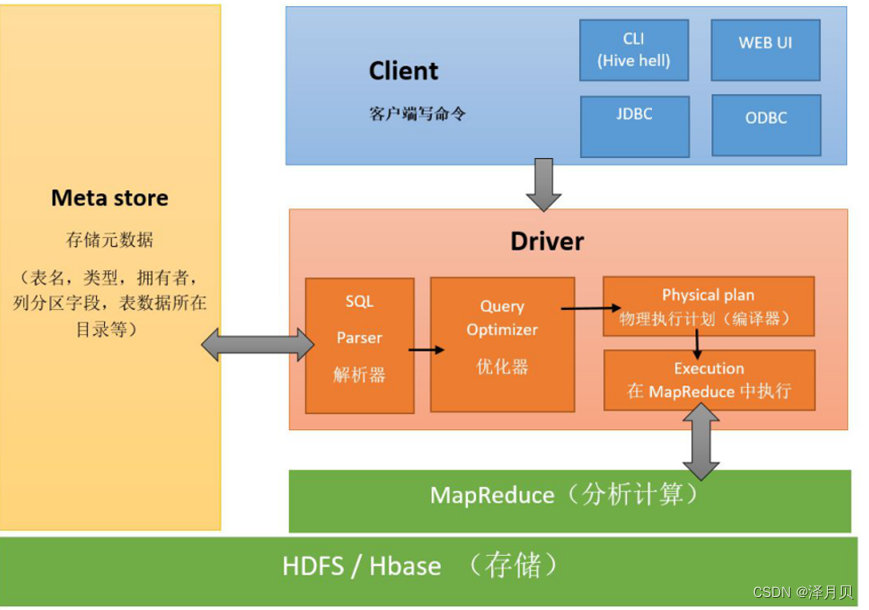

# 一、Hive是什么？
* 1、Hive是一个数仓管理工具
* 2、Hive可以替换掉MapReduce对数仓的数据进行分析
* 3、Hive有两个功能： 第一个是将数仓的结构化数据映射成一张张的表，第二个是提供类SQL语句对表数据进行分析
* 4、Hive提供的SQL称为HQL，和普通的SQL的功能类似，但是本质完全不同，底层默认就是MapReduce，但是底层也可以改成其他的计算引擎（Tez，Spark）
* 5、Hive的表数据是存储在HDFS上
* 6、Hive本身不存任何数据，Hive只是一个工具

---

# 二、架构
## 1.Hive引入
- 1、Hive将HDFS上的结构化数据文件映射成一张张的表，哪个文件对应哪张表，每张表的表结构信息这些数据被称为元数据MetaData，
  都需要保存起来，而Hive本身是不存任何数据的，这些数据在本课程中都由第三方数据库MySQL存储。

- 2、MetaData元数据由Hive的元数据管理器MateStore服务来负责，负责元数据的读取和写入到MySQL。

- 3、HiveSQL底层是MapReduce，而MapReduce的运行必须由Yarn提供资源调度。

- 4、结论：如果你要运行Hive，则必须先启动Hadoop。

## 2.结构图



---

# 三、Hive的数据库和表操作

## 3.1 操作库
1、在Hive中创建一个数据库没有指定HDFS的存放位置时，Hive自动在/user/hive/warehouse目录创建一个数据库目录。

```text
create database if not exists myhive;
show databases;
```
结果：
```text
default
myhive
```

2、手动指定数据库映射的文件夹。

```text
create database if not exists myhive2 location '/myhive2';
show databases;
```

3、查看数据库元数据信息。

```text
desc database myhive;
```

4、删除数据库（可以删除空数据库）

```text
drop database myhive2;
show databases;
```

5、删除数据库（数据库里有数据）

```text
drop database myhive cascade;
```

## 3.2 操作表
1、创建表(Hive创建表内部的结构和传统的数据库的SQL除了语法相似，内部原理完全不同)

```text
use myhive;
create table A(no int,name string);
show tables ;
```

### 3.2.1 Hive的表数据类型
```text
整形：int
浮点型：float / double / decimal(10,2)
字符串：string
日期类型：
    年月日：date
    时分秒：time
    年月日-时分秒：date_time
    注意：如果是日期或者时间，则使用字符串可以避免一些不必要的兼容问题
复杂类型：
    array：数组， 集合
    map：键值对集合
    struct：类
```

### 3.2.2 表分类
Hive表分为两类，一个是内部表，一个是外部表

- 内部表（管理表）
  - 语法
    ```text
    create table 表名(字段信息)
    ```
  - 特点
    - 内部表认为该表独占表数据文件，该文件不能共享
    - 内部表对表文件有绝对的控制权
    - 当删除内部表是，表文件会跟着一起删除（同时删除元数据和表数据）
    - 所有的非共享表都可以设置为内部表
  - 操作
    ```text
    -- 创建表
    create table t_covid(
    dt string comment '日期',
    country string comment '县',
    state  string comment '州',
    country_code string comment  '县编码',
    cases int comment '确诊人数',
    deaths int comment '死亡任务'
    )comment '美国新冠数据'
    row format delimited fields terminated by ',';--自定义字段之间的分隔符
    
    -- 给内部表添加数据-从Linux本地复制
    load data local inpath '/root/test/covid19.dat' into table t_covid;
    select * from t_covid;
    ```
    ```text
    -- 给内部表加载数据-从HDFS加载-剪切
    create table t_covid2(
    dt string comment '日期',
    country string comment '县',
    state  string comment '州',
    country_code string comment  '县编码',
    cases int comment '确诊人数',
    deaths int comment '死亡任务'
    )comment '美国新冠数据'
    row format delimited fields terminated by ',';--自定义字段之间的分隔符
    
    load data inpath '/mapreduce/input/covid19.dat' into table t_covid2;
    select * from t_covid;
    ```

- 外部表
  - 语法
     ```text
     create external table 表名(字段信息)
     ```
  - 特点
    - 外部表认为该表不能独占表数据文件，文件可以共享
    - 外部表对表文件没有绝对的控制权
    - 当删除外部表时，表文件不会跟着一起删除（只会删除元数据（映射信息），不会表数据）
    - 所有的非共享表都可以设置为内部表
    - 如果表数据需要被共享，则可以设置为外部表
  - 操作
    - 与内部表操作一致
