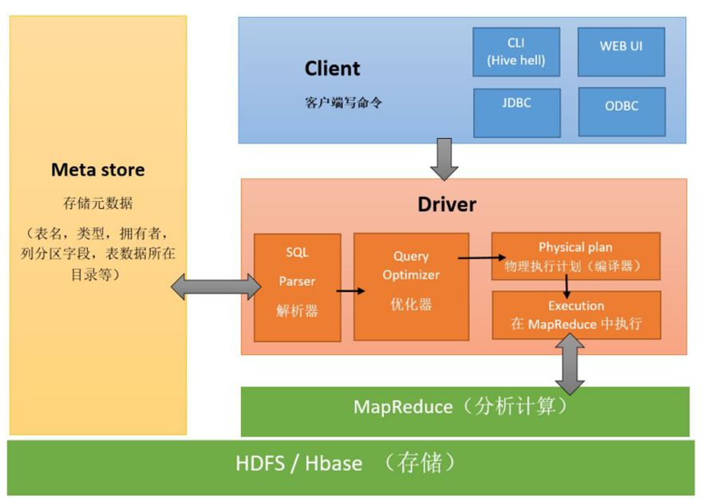

Hive是一个架构在Hadoop之上的【数据仓库】基础工具，它可以处理【结构化】和【半结构化】数据，
它使得查询和分析存储在Hadoop上的数据变得非常方便。

在没有Hive之前，处理数据必须开发复杂的MapReduce作业，但现在有了Hive，
你只要开发简单的SQL查询就可以达到MapReduce作业同样的查询功能。
Hive主要针对的是熟悉SQL的用户。
Hive 使用的查询语言称为 HiveQL（HQL），它跟 SQL 很像。HiveQL 自动把类 SQL 语句转换成 MapReduce 作业。
Hive 对 Hadoop 的复杂性简单化了，而且使用 Hive 并不需要你学习 Java 语言。

Hive一般在终端执行，并且把SQL语句转换成一系列能在Hadoop集群执行作业。
Apache Hive可以让存储在HDFS的数据以表的方式呈现。

## Apache Hive 历史简介
Hive 由 Facebook 的技术团队开发的，Apache Hive 是众多满足 Facebook 业务需求的技术之一。
它非常受 Facebook 内部所有用户的欢迎。它可以开发各种数据相关的应用，并且运行在具有数百个用户的集群之上。
Facebook 的 Apache Hadoop 集群存储超过 2PB 的原始数据，并且每天定期加载 15TB 的数据。
现在 Hive 被很多大公司使用并完善，比如亚马逊，IBM，雅虎，Netflix 等等大公司。

## 为什么使用 Apache Hive
在 Apache Hive 实现之前，Facebook 已经面临很多挑战，比如随着数据的爆炸式增长，要处理这些数据变得非常困难。
而传统的关系型数据库面对这样海量的数据可以说无能为力。
Facebook 为了克服这个难题，开始尝试使用 MapReduce。
但使用它需要具备 java 编程能力以及必须掌握 SQL，这使得该方案变得有些不切实际。
而 Apache Hive 可以很好的解决 Facebook 当前面临的问题。

Apache Hive 避免开发人员给临时需求开发复杂的 Hadoop MapReduce 作业。
因为 hive 提供了数据的摘要、分析和查询。
Hive 具有比较好的扩展性和稳定性。
由于 Hive 跟 SQL 语法上比较类似， 这对于 SQL 开发人员在学习和开发 Hive 时成本非常低，比较容易上手。
Apache Hive 最重要的特性就是不会 Java，依然可以用好 Hive。

## Hive 架构


由上图可知，Hadoop 和 MapReduce 是 Hive 架构的根基。

Hive 架构包括如下组件：
* CLI（command line interface）
* JDBC/ODBC
* Thrift Server
* WEB GUI
* Metastore
* Driver（Compiler、Optimizer 和 Executor）

这些组件可以分为两大类：

### 服务端组件
* **Driver组件**：该组件包括Compiler、Optimizer和Executor，它的作用是将HiveQL语句进行解析、编译优化，生成执行计划，
  然后调用底层的 MapReduce 计算框架。

* **Metastore组件**：元数据服务组件，这个组件存储Hive的元数据，hive的元数据存储在关系数据库里，
  hive支持的关系数据库有derby、mysql。元数据对于hive十分重要，因此hive支持把metastore服务独立出来，
  安装到远程的服务器集群里，从而解耦hive服务和metastore服务，保证hive运行的健壮性。

* **Thrift服务**：thrift是facebook开发的一个软件框架，它用来进行可扩展且跨语言的服务的开发，hive集成了该服务，
  能让不同的编程语言调用hive的接口。

### 客户端组件

* **CLI**：command line interface，命令行接口。

* **Thrift客户端**：上面的架构图里没有写上Thrift客户端，但是hive架构的许多客户端接口是建立在 thrift客户端之上，
  包括JDBC和ODBC接口。

* **WEB GUI**：hive客户端提供了一种通过网页的方式访问hive所提供的服务。
  这个接口对应hive的hwi组件（hive web interface），使用前要启动hwi服务。


## Hive Shell
shell 是我们和 Hive 交互的主要方式，我们可以在 Hive shell 执行 HiveQL 语句以及其他命令。
Hive Shell 非常像 MySQL shell，它是 Hive 的命令行接口。HiveQL 跟 SQL 一样也是不区分大小写的。

我们可以以两种方式执行 Hive Shell：非交互式模式和交互式模式：

**非交互式模式 Hive**：Hive Shell 可以以非交互式模式执行。只要使用 -f 选项并指定包含 HQL 语句的文件的路径。
如：hive -f my-script.sql

**交互式模式 Hive**：所谓交互式模式，就是在 Hive Shell 直接执行命令，Hive 会在 shell 返回执行结果。
只要在 Linux Shell 输入 hive 即可进去交互式模式 hive shell。


## Apache Hive 的特性
Hive 有很多特性，然我们来一个个看一下：
* Hive以简单的方式提供数据摘要，数据查询和数据分析能力。
* Hive支持外部表，这使得它可以处理未存储在HDFS的数据。
* Apache Hive非常适合Hadoop的底层接口需求。
* 支持数据分区。
* Hive有一个基于规则的优化器，负责优化逻辑计划。
* 可扩展性以及可伸缩性。
* 使用HiveQL不需要深入掌握编程语言，只有掌握基本的SQL知识就行，使用门槛较低。
* 处理结构化数据。
* 使用Hive执行即时查询做数据分析。

## Apache Hive 局限性

Hive 具有以下局限性：
* Hive不支持实时查询和行级更新。
* 高延迟。
* 不适用于在线事务处理。


## Hive 数据处理流程


1）UI调用Driver的execute接口。

2）Driver为查询创建会话句柄，并将查询发送给compiler以生成执行计划。

3）compiler需要元数据信息，所以它会给metastore发送getMetaData请求，然后接受从metastore接收sendMetaData请求。

4）compiler利用metastore返回的元数据信息对查询里面的表达式进行类型检查。
之后生成计划，该执行计划是阶段的【有向无环图（DAG）】，每个阶段可能是一个MapReduce作业，也可能是元数据操作，也有可能是HDFS操作。
计划中的MapReduce阶段包括【map操作树】和【reduce操作树】。

5）现在Execution Engine将各个阶段提交个适当的组件执行。
在每个任务（mapper/reducer）中，表或者中间输出相关的反序列化器从HDFS读取行，并通过相关的操作树进行传递。
一旦这些输出产生，将通过序列化器生成临时的HDFS文件（这个只发生在只有Map没有reduce的情况），
生成的HDFS临时文件用于执行计划后续的 Map/Reduce 阶段。
对于 DML 操作，临时文件最终移动到表的位置。该方案确保不出现脏数据读取（文件重命名是HDFS中的原子操作）。

6）对于查询，临时文件的内容由Execution Engine直接从HDFS读取，作为从Driver Fetch API的一部分。

---

# Hive概述

1、Hive是一个数仓管理工具

2、Hive可以替换掉MapReduce对数仓的数据进行分析

3、Hive有两个功能： 第一个是将数仓的结构化数据映射成一张张的表，第二个是提供类SQL语句对表数据进行分析

4、Hive提供的SQL称为HQL，和普通的SQL的功能类似，但是本质完全不同，底层默认就是MapReduce，但是底层也可以改成其他的计算引擎（Tez，Spark）

5、Hive的表数据是存储在HDFS上

6、Hive本身不存任何数据，Hive只是一个工具

了解：
```text
1) Hive是美国的FaceBook公司研发，Presto也是FaceBook研发。
```


# HIVE架构
1、Hive将HDFS上的结构化数据文件映射成一张张的表，哪个文件对应哪张表，
每张表的表结构信息这些数据被称为元数据MetaData，都需要保存起来，
而Hive本身是不存任何数据的，这些数据都由第三方数据库MySQL存储。

2、MetaData元数据由Hive的元数据管理器MetaStore服务来负责，负责元数据的读取和写入到MySQL。

2、HiveSQL底层是MapReduce，而MapReduce的运行必须由Yarn提供资源调度。

3、结论：如果你要运行Hive，则必须先启动Hadoop。




## HiveSQL的执行过程

(0) HiveSQL被提交给客户端。

(1) 解释器将HiveSQL语句转换为抽象语法树（AST）。

(2) 编译器将抽象语法树编译为逻辑执行计划。

(3) 优化器对逻辑执行计划进行优化。

(4) 执行器将逻辑计划切成对应引擎的可执行物理计划。

(5) 优化器对物理执行计划进行优化。

(6) 物理执行计划交给执行引擎执行。

(7) 执行引擎将结果返回给客户端。

# Hive的交互方式


方式1：在命令行输入hive命令
```text
hive

show databases;
```

方式2：不进入hive，执行HiveSQL（HQL）命令
```text
hive -e "show databases;"
```

```text
# 不进入hive，执行HiveSQL（HQL）脚本 !!!!!! 生产环境
hive -f /root/test/demo.sql
```

方式3：使用Hive第二代客户端来访问
```text
[root@node3 ~]# beeline
Beeline version 2.1.0 by Apache Hive
beeline> !connect jdbc:hive2://master:10000
Connecting to jdbc:hive2://master:10000
Enter username for jdbc:hive2://master:10000: root
Enter password for jdbc:hive2://master:10000: root
```

## Hive一键启动脚本

这里，我们写一个expect脚本，可以一键启动beenline，并登录到hive。
*expect*是建立在tcl基础上的一个自动化交。

互套件, 在一些需要交互输入指令的场景下, 可通过*脚本*设置自动进行交互通信。

1、安装expect
```text
yum   -y install expect 
``` 
2、 创建脚本
```text
cd /export/server/hive-3.1.2/bin
vim  beenline.exp
```

```text
#!/bin/expect

spawn beeline
set timeout 5
expect "beeline>"
send "!connect jdbc:hive2://node3:10000\r"
expect "Enter username for jdbc:hive2://node3:10000:"
send "root\r"
expect "Enter password for jdbc:hive2://node3:10000:"
send "123456\r"
interact
```

3、修改脚本权限
```text
chmod 777  beenline.exp
```

4、启动脚本
```text
expect beenline.exp
```

5、退出beeline
```text
0: jdbc:hive2://node3:10000> !quit
```

6、创建shell脚本
```text
vim /export/server/hive-3.1.2/bin/beeline2
```

```text
#!/bin/bash
expect /export/server/hive-3.1.2/bin/beeline.exp
chmod 777 /export/server/hive-3.1.2/bin/beeline2
```

7、最终调用
```text
beeline2
```
